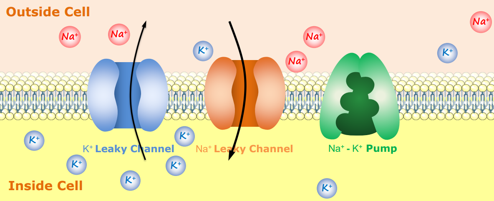
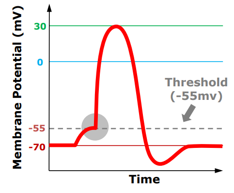
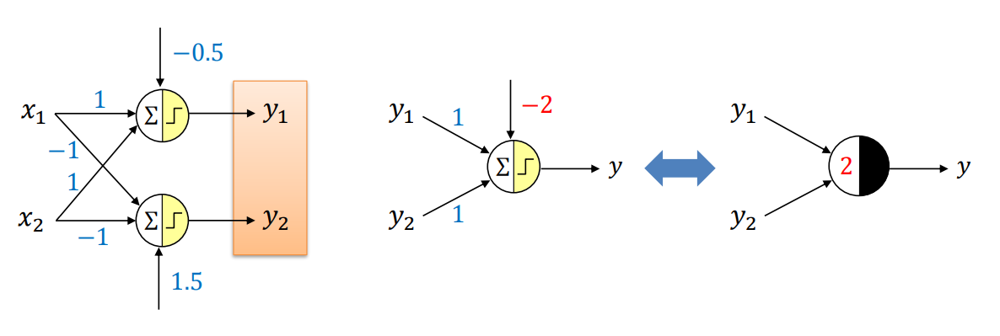
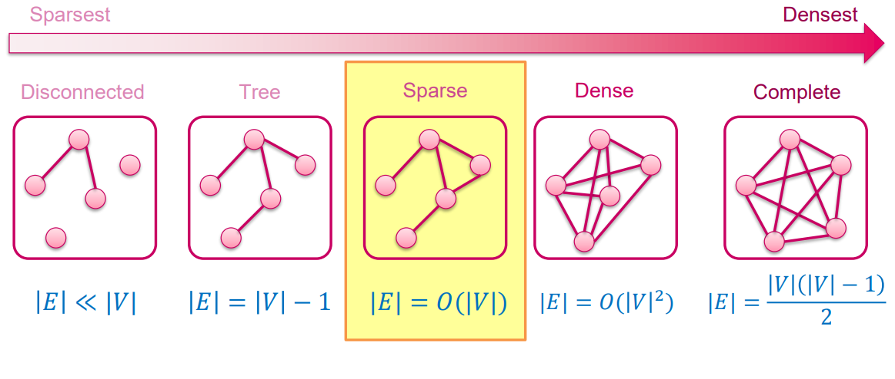

---
header-includes:
    - \newcommand{\argmin}{\mathop{\mathrm{argmin}}}
    - \newcommand{\argmax}{\mathop{\mathrm{argmax}}}
    - \usepackage{float}
    - \let\origfigure\figure
    - \let\endorigfigure\endfigure
    - \renewenvironment{figure}[1][2] {\expandafter\origfigure\expandafter[H]} {\endorigfigure}
geometry: margin=1.5cm
---

# CS331 Neural Computing
# AI and Neural Computing
* AI - any techniques that make computers smart
* ML - statistical methods that give computers the ability to learn
    * ML is a subset of AI
* Smart does not mean able to learn
    * Example of AI without ML - rule-based chatbots, which are smart but have no ability to learn as they rely on a set of human-defined rules to respond to questions within a limited domain
* AI without ML is known as GOFAI (Good Old-Fashioned AI)
* Neural Computing - brain-inspired ML methods that use neural networks to learn
    * A subset of ML
* NC applies a network of neurons to parse data, learns from it and uses the learnings to discover meaningful patterns for classification
    * Process of determining the network is called the learning rule 
* GOFAI example: SHRDLU, an early NLP chatbot that uses pre-programmed, human-defined rules to answer questions intelligently to a limited extent. Receives its intelligence only from large amount of knowledge via human input
* ML but not NC example: Support Vector Machine (SVM), a data classification ML algorithm that uses statistical methods (not brain-inspired neural networks) to maximise a margin between 2 classes in training data. Uses a Kernel function to map samples to high-dimensional feature space.

# Three Learning Paradigms
* Supervised Learning:
    * Given $(x, y)$, learn a function to map $x \rightarrow y$
    * Train the model on labelled data to get better predictive accuracy
* Unsupervised Learning:
    * Given $x$, learn the underlying structure of $x$
    * Train the model on unlabelled data without any guidance
    * No correct answers
    * Clustering or association
* Reinforcement Learning:
    * Given a set of state-action pairs, maximise future rewards over many time steps
    * Agent learns to behave via feedback and interaction with environment to maximise rewards
    * Pavlovian Conditioning:
        1. Unconditioned stimulus - unconditioned response
        2. Neutral stimulus - no conditioned response
        3. Neutral and unconditioned stimulus together - unconditioned response
        4. Neutral stimulus becomes conditioned stimulus - associates with unconditioned stimulus so leads to conditioned response

# Transfer Learning
* Deep learning approach in which a model that has been trained for one task is used as a starting point for a model that performs a similar task
* We take a pre-existing model, modify it slightly, and then retrain it on our data
* Usually much faster and easier than training a model from scratch
* Possible to achieve a higher model accuracy in a shorter time

### Benefits of Transfer Learning:
* Enables us to train models with less labelled data by reusing models that have been pretrained on large datasets
* Reduces training time and computing resources, as weights are not learned from scratch
* We can take advantage of good model architectures developed by the deep learning research community

### Workflow:
* Load pretrained network
    * Early layers learned low-level features and last layers learned task-specific features
* Replace final layers
    * New layers will learn features specific to new dataset
* Train network on new dataset 

# Biological Neurons
* Central Nervous System (CNS) controls most functions of the body
    * It consists of two parts: the brain and the spinal cord
* A neuron is the basic functional unit of the nervous system
    * The brain contains 100 billion neurons
    * A neuron is also known as a nerve cell or a neural processing unit
* Neurons generate signals called action potentials, which allow them to transmit information over distances

### Structure of a Neuron:
* Dendrite: receives signals from other neurons
* Soma: processes the information
* Axon: transmits the information to other neurons or muscles
* Synapse: point of connection to other neurons

### Dendrite:
* Tree-like structures that extend away from the cell body to receive messages from other neurons
* On the surface of dendrites, there are many small mushroom-shaped protrusions (called spines) that receive excitatory input from axons
* Once a signal is received by a dendrite, it travels to the soma

### Soma:
* Cell body where the nucleus lies and where the neuron's DNA is housed
* Takes in all the information from the dendrites and puts them together in an area called the axon hillock
* The axon hillock controls the firing of the neuron
    * If the total strength of the signal exceeds the threshold limit of the axon hillock, the structure will fire a signal (known as action potential) down the axon

### Axon:
* Tube-like nerve fibre that propagates the integrated signal from the cell body to specialised endings called axon terminals
* The larger the diameter of the axon, the faster it transmits information
* Some axons are covered with a fatty substance called myelin that acts as an insulator to protect the axons
    * Not all axons have a myelin covering
    * Myelin can be damaged by diseases
    * Myelinated axons transmit information faster

### How a neuron works:
* Our sense organs interact with the outside world
* They relay visual and audio information to the neuron
* Neurons generate electrical signals called action potentials, which allows them to transmit information over distances
* The neuron may get activated only when its criteria is met (e.g. fire if the visuals are funny)
* There is a massively parallel interconnected network of neurons
    * Ensures  that there is a division of work
    * Each neuron performs a certain role or responds to a certain stimulus
    * Some neurons may fire in response to the information, and in turn relay information to other neurons they are connected to

### Three Classes of Neuron:
* Sensory:
    * Located in receptors (e.g. eye, ear, tongue)
    * Tell the brain what is happening outside the body, producing our senses
    * Receptor ->  CNS
* Motor:
    * Located in the motor cortex and CNS
    * Allow the brain to control our muscle movements
    * CNS -> Effector
* Relay:
    * Located in the CNS
    * Allow sensory and motor neurons to communicate
    * CNS -> CNS

# Action Potential and Synaptic Transmission
### Cell Membrane Potential:
* The cell membrane is a double layer of lipids and proteins that separates the contents of the cell from the external environment
* There are different types of ions either side of the cell - mostly potassium ions on the inside and sodium ions on the outside

* A membrane potential is the difference in voltage when we place one electrode on the outside and the other on the inside of a cell membrane
    * Caused by the unequal distribution of ions on either side of the membrane
* When a neuron is not sending a signal, it is at rest
* A resting potential is the difference in voltage across the membrane when a neuron is at rest
    * In a typical resting potential, the inside of the neuron is more negative relative to the outside (typically -70mV)
* Leaky channels are always open, allowing the free passage of sodium and potassium ions across the membrane
* Voltage-gated channels are only open at certain voltages, and are often closed at resting potential
* Why the resting potential is negative:
    1. There is a higher concentration of potassium ions inside the cell, creating a potassium ion gradient and allowing potassium ions to pass through potassium leaky channels easily. NB: there are also sodium leaky channels, but fewer sodium ions get in
    2. There is a sodium-potassium pump that uses energy to move 3 sodium ions outside the neuron for every 2 potassium ions it allows in 

### Action Potential:
* An action potential is the rapid change in voltage across the membrane that occurs when a neuron sends information down an axon to reach the axon terminal
* Also known as a nerve impulse or spike
* Generated when a stimulus changes the membrane potential to the values of a threshold (-55mV)

* Obeys the 'all-or-none' principle: any subthreshold stimulus will cause nothing, while threshold and superthreshold stimuli will produce a full response of the excitable cell
* Polarised neurons:
    * A neuron is polarised if the outside of the membrane is positive and the inside of the membrane is negative (what it is by default at resting potential)
    * A neuron is hyperpolarised if the membrane potential becomes more negative than it is at resting potential
    * A neuron is depolarised if the membrane potential becomes more positive than it is at resting potential
* Phases of action potential:

    

    1. At resting potential, voltage-gated sodium and potassium channels are closed
    2. Stimuli cause some voltage-gated sodium channels to open
    3. With sodium channels open, depolarisation occurs. Sodium rapidly rushes into the cell and the voltage rockets to 30mV
    4. At this point, voltage-gated sodium channels are closed
    5. Voltage-gated potassium channels now open, and repolarisation occurs as potassium ions rapidly rush out of the cell
    6. The sodium and potassium pump restores the resting potential

### Synapse:
* A junction between two nerve cells
* Most synapses are chemical - the action potential is transmitted from the axon terminal to the target cell by chemical substances (known as neurotransmitters)
* If a neurotransmitter stimulates the target cell to an action, it is an excitatory neurotransmitter
* If a neurotransmitter inhibits the target cell, it is an inhibitory neurotransmitter
* When the presynaptic neuron is excited by an action potential, it causes the vesicles to release the neurotransmitters into the synaptic cleft (gap between two neurons)
    * Each vesicle contrains thousands of neurotransmitters
* Some neurotransmitters will bind to the postsynaptic cell's receptors and may cause an action to occur
* Four types of synaptic connection:
    * Axodendritic - axon terminal links to a dendrite
    * Axoaxonal - axon terminal links to the axon
    * Dendrodendritic - dendrite links to a dendrite
    * Axosomatic - axon terminal links to the soma

### Neural Signal Processing:
1. Signals from neurons are collected by the dendrites
2. The soma aggregates the incoming signals
3. When sufficient input is generated, the neuron generates an action potential (i.e. it fires)
4. The action potential is transmitted along the axon to other neurons, or to structures outside the nervous system (e.g. muscles)
5. If sufficient input is not received (i.e. the threshold is not exceeded), the inputs quickly decay and no action potential is generated
6. Timing is important - input signals must arrive together as strong inputs will generate more action potentials per unit time

# Evolution and Basics of ANNs
### Evolution of ANNs:
* 1943 - McCulloch-Pitts (MP) Neuron (Warren McCulloch and Walter Pitts):
    * Landmark paper in which the earliest neuron to mimic the brain was proposed
    * Inputs and outputs are 0/1
    * No ability to learn
* 1949 - Organisation of Behaviour paper (Donald Hebb):
    * Father of neuropsychology and neural networks
    * Describes how the function of neurons contributes to psychological processes (e.g. learning)
    * Hebb proposed that when two neurons fire together the connection between them is strengthened and that the activity is one of the fundamental operations for learning and memory
    * Artificial neurons needed to be improved to account for this
* 1958 - Perceptron (Frank Rosenblatt):
    * A learning method for a single-layer neural network that was inspired by biological principles
    * Outputs are still 0/1
* 1959 - ADALINE and MADALINE (Bernard Widrow and Marcian Hoff):
    * ADALINE (Adaptive Linear Neuron) is a perceptron with improved learning rules
    * Can find optimal hyperplane rather than just a feasible one
    * MADALINE is a multi-layer network of ADALINE units
* 1969 - Multilayer Perceptron (MLP) (Marvin Minsky and Seymour Papert):
    * Their book showed that the simple learning rule for the perceptron does not work for multiple layers
    * It could not learn a simple XOR function, leading to the first AI winter (decline of research in the 1970s)
* 1982 - Hopfield Network (John Hopfield):
    * A special form of Recurrent Neural Networks (RNNs)
    * Provide an associative memory model with binary threshold nodes for understanding human memory
* 1986 - Backpropagation (David Rumelhart, Geoffrey Hinton and Ronald Williams):
    * Created the backpropagation algorithm used to train an MLP, which addressed the XOR learning problems raised by Minsky
* 1989 - CNN (Yann LeCun):
    * LeNet was the first Convolutional Neural Network (CNN), which was later widely deployed as a commercial document recognition system by major US banks
* 1997 - LSTM (Sepp Hochreiter and Jurgen Schmidhuber):
    * Long-short term memory (LSTM) overcame the problem of RNNs forgetting information through layers (vanishing gradient problem)

### Basic Structure of ANNs:
* Input layer, hidden layers, output layer
* When we say $N$-layer neural network, we do not count the input layer
* A neural network must have one input and one output layer, but can have 0 or many hidden layers
* A feedforward neural network is an ANN in which information only moves in one direction - forward
    * There are no cycles or loops in the network
* A deep neural network (at least 3 hidden layers) identifies progressively more complex features through the network (hierarchy of features)

### Convolutional Neural Network (CNN):
* Consists of a set of convolutions (filters capturing different levels of features in the image)
* Used heavily in computer vision
* Subsampling reduces dimensionality of a feature, reducing computational cost while capturing dominant features

### Recurrent Neural Network (RNN):
* Feedback neural network - output from one stage goes into the input for the next
* Good at processing temporal sequence data (NLP, speech recognition, time series analysis)

# McCulloch-Pitts Neuron
* Accepts 0-1 inputs and produces a 0-1 output based on a certain threshold value which is user-specified
* Also known as a linear threshold gate model
* Sum: $z = x_1 + x_2 + ... + x_n$
    * No weights in an MP neuron
* Threshold: $y = \begin{cases} 1 & z \geq \theta \\ 0 & z < \theta \end{cases}$

* Circle is like a soma
* $\sum$ represents sum of $x$ inputs
* $\theta$ represents threshold

### ANN vs BNN:
* ANN:
    * Massively parallel
    * Fast (in nanoseconds)
    * $10^2$ - $10^4$ nodes (size depends on the application and network designer)
    * Has a limited fault tolerance capability
    * Stores information in continuous memory
* BNN:
    * Massively parallel
    * Slow (in milliseconds)
    * $10^{11}$ nodes and $10^{15}$ connections
    * Performance degrades even with partial damage
    * Stores information in synapses

### Excitatory and Inhibitory Inputs:
* Each input is one of the following two types:
    * Excitatory inputs might fire the neuron when combined together - they contribute to neuronal excitation
    * Inhibitory inputs have an absolute veto power over any excitatory inputs - they impede neuronal excitation

### Rojas Diagram:
* Node is divided into a white half and a black half
* The threshold $\theta$ is written on the white half
* For each inhibitory input, a small circle is drawn at the end of its edge

### Vector Representation:
* Let:
    * $\textbf{1} = \begin{bmatrix}1 & 1 & \dots & 1\end{bmatrix}$
    * $\textbf{x} = \begin{bmatrix} 
    x_1 \\
    x_2 \\ 
    \vdots \\
    x_n
    \end{bmatrix}$ 
* It follows that:
    * $\textbf{1} \cdot \textbf{x} = x_1 + x_2 + ... x_n = z$
* Heaviside Function:
    * $H_\theta(z) = \begin{cases} 1 & z \geq \theta \\ 0 & z < \theta \end{cases}$

    

    * $y = H_\theta(\textbf{1} \cdot \textbf{x})$

### Emulating Logic Gates with an MP Neuron:
* NOT gate:
    * Set threshold $\theta = 0$
    * Set $x$ as inhibitory
    * When $x=0$, threshold met so $y=1$
    * When $x=1$, inhibitory input means $y=0$
* AND gate:
    * For an $n$-input AND gate, set threshold $\theta = n$
    * When $x_1 = x_2 = ... = x_n = 1$, threshold is reached
* OR gate:
    * For an $n$-input OR gate, set threshold $\theta = 1$
    * When any input is 1, threshold is reached
    * Graphical representation:

    

# Single-Layer Perceptron
### Limitations of MP Neuron:
* Inputs and output are limited to binary values only
* All inputs are treated equally important
* A manual setting of $\theta$ is required

### Perceptron:
* $z = w_1x_1 + w_2x_2 + ... + w_nx_n$
    * Each $x_i$ and $w_i$ is real-valued
* $y = \begin{cases} 1 & z \geq \theta \\ 0 & z < \theta \end{cases}$
* Covers MP neuron as a special case when:
    * All $x_i \in \{0,1\}$
    * All $w_i = 1$
    * $\theta$ is set manually
* Can add bias $b = -\theta$
    * $z = w_1x_1 + w_2x_2 + ... + w_nx_n + b$

    

    * Heaviside function jumps at $0$ rather than $\theta$

### Vector Representation:
* Form 1:
    * Let $\textbf{x} = \begin{bmatrix}x_1 & \dots & x_n\end{bmatrix}^T$
    * Let $\textbf{w} = \begin{bmatrix}w_1 & \dots & w_n\end{bmatrix}$
    * $y = H(\textbf{w}\cdot\textbf{x}+b)$
* Form 2:
    * Let $\textbf{x} = \begin{bmatrix}x_1 & \dots & x_n & b\end{bmatrix}^T$
    * Let $\textbf{w} = \begin{bmatrix}w_1 & \dots & w_n & 1\end{bmatrix}$
    * $y = H(\textbf{w}\cdot\textbf{x})$

# Multi-Layer Perceptron
* XOR is linearly inseparable
* Suppose we try and make a single-layer perceptron for it:
    * $w_1 \cdot 0 + w_2 \cdot 0 + b < 0$
    * $w_1 \cdot 0 + w_2 \cdot 1 + b \geq 0$
    * $w_1 \cdot 1 + w_2 \cdot 0 + b \geq 0$
    * $w_1 \cdot 1 + w_2 \cdot 1 + b < 0$
    * We have that $b < 0$ and $w_2 + b \geq 0$, so to make the fourth inequality work it must be the case that $w_1 < 0$
    * However, this contradicts the fact that $w_1 + b \geq 0$
    * There is no solution for $(w_1, w_2, b)$
* Remedies for the XOR problem:
    * Replace the existing threshold function with a more powerful function
        * E.g. piecewise function that returns $1$ for $0.5 \leq x_1 + x_2 \leq 1.5$ and $0$ otherwise
        * Reduces number of nodes, but increases the computational cost for each node and the learning rule is unclear
    * Increase the number of layers in the perceptron

### XOR using MLP:
* Minsky and Papert (1969) provided a solution to the XOR problem by combining three perceptron units using a hidden layer
* Note that $x_1 \space \mathrm{XOR} \space x_2 = (x_1 \space \mathrm{OR} \space x_2) \cap (x_1 \space \mathrm{NAND} \space x_2)$

    

    * We know how to make a single-layer perceptron for OR and NAND

    

    * Can combine them using an AND perceptron (since we want the intersection of the two areas)

    
* The MLP solution for XOR is not unique 
* In general, an MLP can represent any polygon unit
    * An equation $\frac{x}{a} + \frac{y}{b} - 1 = 0$ has $x$-intercept $a$ and $y$-intercept $b$
        * Can use this to find perceptron to classify area above/below any line
        * Multiply equation by $-1$ for area below line
        * Combine areas using AND/OR for complex polygons
    * Lays the foundations for image recognition

# Activation Functions
* An activation function is a mathematical function attached to each neuron that decides if a neuron should 'fire' or not
* It also helps normalise the output of each neuron

### Linear:
* $L(x) = cx$
* $L'(x) = c$

* Better than a step function since it outputs any real number, not just 0/1
* However, it is impossible to use gradient descent to train the model since the derivative of the function has no relation to the input $x$
* It will also make all of the layers of the network collapse into one because a linear combination of linear functions is still a linear function
* When $c=1$, $L$ is known as an identity activation function

### Sigmoid:
* $\sigma(x) = \frac{1}{1+e^{-x}}$

* An s-shaped function with a smooth gradient, unlike a step function with a 'jump' in output values
* Shows the probability of each data point being in a particular class
* Output values are normalised between 0 and 1, as opposed to a linear function whose output values have no bounds
* A big disadvantage is the vanishing gradient problem, where for large or small inputs there is almost no change to the prediction
    * Can result in the network refusing (or being too slow) to learn further
* Outputs are not zero-centred
* Computationally expensive, due to the presence of an exponential function
* The gradient of a sigmoid function satisfies $\sigma'(x) = \sigma(x)(1-\sigma(x))$
    * Provides a fast way to get numerical gradients
* Note that $\sigma(x)(1-\sigma(x)) \leq \frac{(\sigma(x)+(1-\sigma(x)))^2}{4} = \frac{1}{4}$
    * Here, the gradient is equal to $\frac{1}{4}$ if $\sigma(x) = 1-\sigma(x)$, i.e. $\sigma(x) = \frac{1}{2}$
    * $\max \sigma'(x) = \frac{1}{4}$ implies the vanishing gradient problem because the size of the error is reduced by at least 75% per layer for backpropagation, limiting the ability to update weights

    

### Tanh:
* $\tanh(x) = \frac{e^x-e^{-x}}{e^x+e^{-x}}$

* Similar to sigmoid, but a zero-centred function that normalises the output to a range between -1 and 1
* Vanishing gradient still a problem, and also computationally expensive
* $\tanh(x) = 2\sigma(2x) - 1$
    * Sigmoid is a rescaled version of tanh
* $\tanh'(x) = 1-\tanh^2(x)$
    * The maximum value of $\tanh'(x)$ is $1$

    

### ReLu (Rectified Linear Unit):
* $\mathrm{ReLU}(x) = \max(0,x) = \begin{cases} x & x \geq 0 \\ 0 & x < 0 \end{cases}$

* A piecewise linear function, but globally a non-linea rfunction which has a derivative allowing for backpropagation
* Simple and easy to compute
* For positive inputs, no vanishing gradient as its derivative becomes 1
* Dying ReLU problem - ReLU neurons become inactive and only output 0 for any input
* Not zero-centred
* Not differentiable at $x=0$ as its slope is not 'smooth' at this point - the left-hand slope is $0$ whereas the right-hand slope is $1$
* Typically, $\mathrm{ReLU}'(0)$ is defined to be either $0$, $1$ or $\frac{1}{2}$

### Leaky ReLU:
* $\mathrm{LReLU}(x) = \max(\alpha x, x) = \begin{cases} x & x \geq 0 \\ \alpha x & x < 0 \end{cases}$ where $\alpha$ is a small constant

    

    * $\alpha \in (0,1)$ and is typically between $0.01$ and $0.3$
* No dying ReLU or vanishing gradient problems
* Simple and easy to compute
* Typically, $\mathrm{LReLU}'(0)$ is defined to be either $\alpha$, $1$ or $\frac{\alpha+1}{2}$

### Exponential Linear Unit (ELU):
* $\mathrm{ELU}(x) = \begin{cases} x & x \geq 0 \\ \alpha(e^x-1) & x < 0 \end{cases}$

    

* Smoother at $x=0$ than LReLU, and no dying ReLU or vanishing gradient problems for $x \geq 0$
* More computationally expensive than LReLU and ReLU
* $\mathrm{ELU'}(x) = \begin{cases} 1 & x \geq 0 \\ \alpha e^x & x < 0 \end{cases}$

### Softmax:
* $y_i = \frac{e^{z_i}}{\sum_{j=1}^N e^{z_j}}$
* Often used for multiclass classification
* Takes as an input a vector $\textbf{z}$ of $N$ real values and normalises it into a probability distribution $\textbf{y}$ of $N$ probabilities proportional to the exponentials of the input values
* Uses exponentials instead of the actual values since it ensures that all entries are positive
    * Need a function that can map $(-\infty, \infty) \rightarrow (0, \infty)$ and is monotonically increasing
* When $N=2$, softmax reduces to sigmoid

### Activation Functions Summary:

# Foward Propagation
* The input data are fed in the forward direction through the network
* Each hidden layer accepts input data, processes them as per the activation function, and passes to the successive layer
* Compute weighted sum $z$ of inputs
* Apply activation function $f$ to $z$ to yield output $a$

### Matrix Computation:
* Let $\textbf{x}$ be the input vector, $\textbf{W}$ be the network weights, $\textbf{b}$ be the bias vector and $\textbf{a}$ be the output vector
* $\textbf{z} = \textbf{Wx}+\textbf{b}$
* $\textbf{a} = f(\textbf{z})$
    * $f$ is an entrywise function
* Extension to deep neural networks:
    * $\textbf{a}^{[1]} = f^{[1]}(\textbf{W}^{[1]}\textbf{x}+\textbf{b}^{[1]})$
    * $\textbf{a}^{[2]} = f^{[2]}(\textbf{W}^{[2]}\textbf{a}^{[1]}+\textbf{b}^{[2]})$
    * $\textbf{a}^{[3]} = f^{[3]}(\textbf{W}^{[3]}\textbf{a}^{[2]}+\textbf{b}^{[3]})$
    * In general, $\textbf{a}^{[k]} = f^{[k]}(\textbf{W}^{[k]}\textbf{a}^{[k-1]}+\textbf{b}^{[k]})$ and $\textbf{a}^{[0]} = \textbf{x}$

### Vectorisation:
* Algorithm operates on a set of values (e.g. vectors and matrices) at a time rather than a single value
* Can vectorise computation of matrix multiplication by putting columns of input data one after the other, thus forward propagating multiple $\textbf{x}$ vectors at once

# Loss Functions and Regularisation
* A loss function measures how much the predicted output $\hat{y}$ differs from the target output $y$, evaluating how well a network models the dataset
* Used to guide the training process to find a set of parameters that reduce the error
* In general, loss function and cost function are synonymous and used interchangeably. There are slight differences:
    * A loss function is for a single training example, e.g. $L(\hat{y}, y) = |\hat{y}-y|$, $(\hat{y}, y \in \mathbb{R})$
    * A cost function is the average of the loss function over the entire training dataset, e.g. $C(\hat{y}, y) = \frac{1}{n}\sum_{i=1}^n L(\hat{y}_i, y_i)$, $(\hat{\textbf{y}}, \textbf{y} \in \mathbb{R}^n)$
        * Sometimes, a cost function may include an extra penalty (regularisation terms)

### Properties of a good loss function:
* Minimised ($L=0$) when $\hat{y}=y$
* Increases when the gap between $\hat{y}$ and $y$ increases
* Globally continuous and differentiable
* Convex

### Types of loss function:
* Regression:
    * L1 loss (or absolute error, AE)
    * L2 loss (or squared error, SE)
* Classification:
    * Log loss (or cross-entropy)
    * Hinge loss

### L1 Loss:
* Absolute difference between $\hat{y}$ and $y$
* L1 Loss $L=|\hat{y}-y|$
* Mean Absolute Error $\mathrm{MAE}=\frac{1}{n}\sum_{i=1}^n|\hat{y}_i-y_i|$

* Advantages:
    * Very intuitive 
    * Good prediction speed
* Disadvantages:
    * Not differentiable at $\hat{y}=y$
    * Gradient does not increase even if $\hat{y}$ is far away from $y$

### L2 Loss:
* Squared difference between $\hat{y}$ and $y$
* L2 Loss $L=(\hat{y}-y)^2$
* Mean Squared Error $\mathrm{MSE}=\frac{1}{n}\sum_{i=1}^n(\hat{y}_i-y_i)^2$

* Advantages:
    * Very common loss function
    * Penalise large errors more strongly
    * Gradient increases when $\hat{y}$ is far away from $y$
* Disadvantages:
    * Outliers in datasets will lead to extremely large errors

### Norms:
* L1 and L2 losses owe their names to the L1 and L2 norm of a vector
* L1-norm: $||\textbf{x}||_1 = \sum_{i=1}^n|x_i|$
* L2-norm: $||\textbf{x}||_2 = \sqrt{\sum_{i=1}^n|x_i|^2}$
* Lp-norm: $||\textbf{x}||_p = \sqrt[p]{\sum_{i=1}^n|x_i|^p}$
* L $\infty$-norm: $||\textbf{x}||_\infty = \underset{1 \leq i \leq n} \max |x_i|$
* Norm Equivalence:
    * Two norms $p$ and $q$ are equivalent if there exists two constants $c$ and $C$ such that:
        * $c \cdot ||\textbf{x}||_q \leq ||\textbf{x}||_p \leq C \cdot ||\textbf{x}||_q$
    * L1 and L2 norms are equivalent since there exist $(c, C) = (1, \sqrt{n})$ such that $||\textbf{x}||_2 \leq ||\textbf{x}||_1 \leq \sqrt{n} ||\textbf{x}||_2$
    * Also both are equivalent with the L $\infty$-norm since $||\textbf{x}||_\infty \leq ||\textbf{x}||_2 \leq \sqrt{n} ||\textbf{x}||_\infty$ and $||\textbf{x}||_\infty \leq ||\textbf{x}||_1 \leq \sqrt{n} ||\textbf{x}||_\infty$

### L0-norm:
* Defined to be the number of non-zero entries in $\textbf{x}$
* Useful when trying to find the sparsest solution to an undetermined set of equations
    * E.g. $\underset{w} \min \space L(\hat{\textbf{y}}, \textbf{y})$ s.t. $||\textbf{w}||_0=N$
* Limiting number of features to learn
    * Network learns too many details (even noise) from the training data
    * Will negatively impact its ability to generalise on new testing data

    

### Regularisation:
* Discourages learning more complex features by applying a penalty to the input parameters with the larger weights to avoid the risk of overfitting
* Constrains weight estimates towards zero
* NP-hard to set a L0-norm constraint
* L1 Regularisation (Lasso Regularisation): $\underset{w} \min \space L(\hat{\textbf{y}}, \textbf{y}) + \lambda ||\textbf{w}||_1$
* L2 Regularisation (Ridge Regularisation): $\underset{w} \min \space L(\hat{\textbf{y}}, \textbf{y}) + \lambda ||\textbf{w}||^2$
* L1 regularisation tends to generate sparser solutions:
    * L1 norm has corners - it is very likely that the meeting point is at one of the corners

    

    * L2 norm has no corners - it is very unlikely that the meeting point is on ny of the axes

    

### Log/Cross Entropy Loss:
* Measures the accuracy of a classification model
* Compares the predicted output $\hat{y}$ with the true class $y$ and penalises the probability logarithmically based on how far it diverges from the true class
* Binary classification:
    * $L = -y\log\hat{y} - (1-y)\log(1-\hat{y})$
* Intuition behind it:
    * When $y=1$, if $\hat{y}=1$ we want $L=0$ and if $\hat{y}=0$ we want $L=\infty$
        * Need to map $\hat{y} \in [0,1]$ to $L \in [\infty,0]$
        * $\log x$ maps $[0,1]$ to $[-\infty,0]$ so we can use $-\log x$

        

    * When $y=0$, if $\hat{y}=0$ we want $L=0$ and if $\hat{y}=1$ we want $L=\infty$
        * Need to map $\hat{y} \in [0,1]$ to $L \in [0,\infty]$
        * $-\log x$ maps $[0,1]$ to $[\infty,0]$ - not quite what we need
        * We can use $-\log(1-x)$ to map $[0,1]$ to $[0,\infty]$

        

    * When $y=1$, $L=-\log\hat{y}$ and when $y=0$, $L=-\log(1-\hat{y})$
    * The final loss function is just the two added together: $L=-y\log\hat{y}-(1-y)\log(1-\hat{y})$
* Multiclass log loss:
    * $L = \sum_{i=1}^N y_i\log\hat{y}_i$ with $\sum_{i=1}^N y_i=1$ and $\sum_{i=1}^N \hat{y}_i=1$

# Backpropagation
### Gradient Descent:
* An iterative algorithm that finds a minimal value $v$ of a function $f$ near a given initial point $x_0$
* The key idea is taking repeated steps in the opposite direction in the gradient of $f$ at the current point because this is the direction of steepest descent
    * $x_{t+1} = x_t - \alpha\nabla f(x_t)$
* Learning rate $\alpha \in (0,1)$ is a configurable hyperparameter that controls how much we adjust the weights with respect to the loss gradient
* Our goal when training an NN: find $\underset{w,b} \min \space L(w,b)$ using gradient descent
    * $w = w - \alpha L_w$
    * $b = b - \alpha L_b$

### Dependency Graph:
* Represents how variables in an expression are dependent on each other
* Useful for visualising chain rules for partial derivatives of multivariate functions
* Each node is a variable in the expression
* Each edge denotes '$x$ affects $y$', carrying a value labelled as $y_x$ (i.e. the partial derivative of $y$ w.r.t. $x$)
* Example:

* To compute a derivative $z_x$, multiply all the local partial derivatives together on each path between $x$ and $z$ and sum these products over all the paths between paths $x$ and $z$
* Example $z=\sin(2x+y)e^{x-y}$. Compute $z_x$
    * Let $a=2x+y$. Then $a_x=2$ and $a_y=1$
    * Let $b=x-y$. Then $b_x=1$ and $b_y=-1$
    * Let $c=\sin a$. Then $c_a=\cos a$
    * Let $d=e^b$. Then $d_b=e^b$
    * Now $z=cd$. $z_c=d$ and $z_d=c$

    

    * $z_x = 2\cdot\cos a\cdot d + 1\cdot e^b \cdot c = 2\cos(2x+y)e^{x-y}+e^{x-y}\sin(2x+y)$

### Backpropagation:
* An effective way of training an NN, with the aim of minimising the cost function by adjusting the weights and biases of the network
* Level of adjustment is determined by the gradient of the cost function with respect to the weights and biases
* Gradient descent is applied with the gradient of the cost function
* Take a simple network:

    

    

    * $z = wx + b$, $\hat{y}=\sigma_{sig}(z)$, $L=-(y\log\hat{y}+(1-y)\log(1-\hat{y}))$
    * $z_w=x$, $z_b=1$
    * $\hat{y}_z=\hat{y}(1-\hat{y})$
    * $L_{\hat{y}}=\frac{\hat{y}-y}{(1-\hat{y})\hat{y}}$
    * $L_w = \frac{\hat{y}-y}{(1-\hat{y})\hat{y}} \cdot \hat{y}(1-\hat{y}) \cdot x = (\hat{y}-y)x$
    * $L_b = \frac{\hat{y}-y}{(1-\hat{y})\hat{y}} \cdot \hat{y}(1-\hat{y}) \cdot 1 = \hat{y}-y$
    * $w = w - \alpha (\hat{y}-y)x$
    * $b = b - \alpha (\hat{y}-y)$
* Caching repeated paths:
    * Instead of just naively summing over the paths, it would be much more efficient to use caching by merging paths back together at every node
    * Consider the example below, where we want to compute $\nabla L  = \begin{bmatrix} 
    L_{w_1} \\
    L_{w_2} \\ 
    L_{w_3}
    \end{bmatrix}$ :

        
        
        * Naive method: 
            * $L_{w_1} = L_{y_1}\cdot y_{1_z}\cdot z_{w_1} + L_{y_2}\cdot y_{2_z}\cdot z_{w_1} + L_{y_3}\cdot y_{3_z}\cdot z_{w_1}$
            * $L_{w_2} = L_{y_1}\cdot y_{1_z}\cdot z_{w_2} + L_{y_2}\cdot y_{2_z}\cdot z_{w_2} + L_{y_3}\cdot y_{3_z}\cdot z_{w_2}$
            * $L_{w_3} = L_{y_1}\cdot y_{1_z}\cdot z_{w_3} + L_{y_2}\cdot y_{2_z}\cdot z_{w_3} + L_{y_3}\cdot y_{3_z}\cdot z_{w_3}$
        * Cache method:
            * $L_z = L_{y_1}\cdot y_{1_z} + L_{y_2}\cdot y_{2_z} + L_{y_3}\cdot y_{3_z}$
            * $L_{w_1} = L_z \cdot z_{w_1}$
            * $L_{w_2} = L_z \cdot z_{w_2}$
            * $L_{w_3} = L_z \cdot z_{w_3}$
            * Effectively caches the paths between $z$ and $L$ in the graph
      
# Hopfield Networks
* Given an initial guess $\textbf{x}_0$ as input, $\textbf{x}_0$ is pulled towards the nearest stable fixed-point $\textbf{x}^*$ through iterations
    * $\textbf{x}_0$ is a noisy, corrupted pattern (partial knowledge)
    * $\textbf{x}_{k+1} = F(\textbf{x}_k)$
    * $\textbf{x}_\infty = \textbf{x}^*$ is a state memorised pattern (full stored knowledge)      

### Associative Memory:
* Involves encoding relationships between items
    * E.g. Pavlovian conditioning between a stimulus and a response
    * A Hopfield Network (HN) uses associative memory to associate an input to a full memorised image
* Associative Memory (aka Content Addressable Memory, CAM) is the ability to access an item by just knowing part of its content
    * There can be multiple fixed points in the HN
    * CAM retrieves a similar memorised pattern to the corrupted input, so that the corrupted input can be recognised and pulled to the closest fixed point

### Bipolar and Binary Patterns:
* A pattern ($n \times n$) pixels can be represented as a $n^2 \times 1$ vector $\textbf{x}$, requiring the state information of $n^2$ neurons
* Each element $x_i$ denotes a state (activity) of neuron $i$
* For a discrete HN, each state $x_i$ takes:
    * Bipolar values (1 or -1)
    * Binary values (1 or 0)

### Architecture of HNs:
* A HN is a special form of RNN
* A single layer, fully connected auto associative network
* Neurons act as both input and output with a binary threshold
* An energy-based network (evolution decreases energy)
* Often used for pattern recognition
* The output of a neuron is the input (feedback) to other neurons but not the input to itself (no self-feedback)
* A HN is a complete graph $G=(V,E)$
    * A node $i \in V$ is a perceptron with a state $x_i \in \{-1,1\}$ or $\{1,0\}$
    * A pair $(i,j) \in E$ links a weight $W_{i,j}$ (connection stength)
    * An edge is traversed in both directions ($W_{i,j}=W_{j,i}$)
    * No self-loops ($W_{i,i}=0$)

### Hebbian Learning Rule:
* Neurons that fire together wire together and neurons that fire out of sync fail to link
    * Simultaneous activation of neurons leads to increases in synaptic strength between neurons
    * If the states of neurons $i$ and $j$ are the same, this has a positive effect on the weight $W_{i,j}$

### Weight Matrix:
* Given a single memorised pattern $\textbf{x}=[x_1,x_2,...,x_n]^T$ with each $x_i \in \{-1,1\}$ a bipolar value, the weight matric $\textbf{W}$ for pattern $\textbf{x}$ is determined as follows:
    * $W_{i,j}=x_i x_j$ ($i \neq j$) with $W_{i,i}=0$
    * In matrix form:
        * $\textbf{W}=\textbf{x}\cdot\textbf{x}^T-\textbf{I}$ (zeroes out diagonals)
* For $N$ bipolar memorised patterns $\{\textbf{x}^{(1)}, \textbf{x}^{(2)},..., \textbf{x}^{(N)}\}$ where each $\textbf{x}^{(p)}=[x_1^{(p)}, x_2^{(p)},..., x_n^{(p)}]$ with $x_i^{(p)} \in \{-1,1\}$ ($p=1,2,...,N$, $i=1,2,...,n$), the weight matrix $\textbf{W}$ over all of these patterns is defined as:
    * $W_{i,j}=\frac{1}{N}\sum_{p=1}^N x_i^{(p)}x_j^{(p)}$ ($i \neq j$) with $W_{i,i}=0$
    * In matrix form: 
        * $\textbf{W}=\frac{1}{N}\sum_{p=1}^N \textbf{x}^{(p)}(\textbf{x}^{(p)})^T-\textbf{I}$
* For binary patterns ($x_i^{(p)} \in \{0,1\}$):
    * $W_{i,j}=\frac{1}{N}\sum_{p=1}^N (2x_i^{(p)}-1)(2x_j^{(p)}-1)$ ($i \neq j$) with $W_{i,i}=0$
    * In matrix form: 
        * $\textbf{W}=\frac{1}{N}\sum_{p=1}^N (2\textbf{x}^{(p)}-1)(2\textbf{x}^{(p)}-1)^T-\textbf{I}$
   
### Updating Neuron State:
* When training a HN, we want all neurons to have stable states:
    * $\textbf{s}(t+1) = F(\textbf{W}\cdot\textbf{s}(t))$
* For a bipolar HN, the neuronal activation function $F$ is $F(x)=\mathrm{sgn}(x)=\begin{cases} 1 & x \geq 0 \\ -1 & x < 0\end{cases}$
* In component form, the neuron state updating formula is: $s_i(t+1)=\mathrm{sgn}(\sum_{j=1}^n W_{i,j}s_j(t))$

### Stable Patterns:
* To make a memorised pattern $\textbf{x}$ an attractor to the HN, the condition for $\textbf{x}$ to be a stable state is $\textbf{x} = \mathrm{sgn}(\textbf{W}\cdot\textbf{x})$
* A single memorised pattern is stable - verify $\textbf{x}$ is an attractor to a bipolar HN:
    * $s_i(t+1) = \mathrm{sgn}(\sum_{j=1}^n W_{i,j}\cdot s_j(t)) = \mathrm{sgn}(\sum_{j=1}^n W_{i,j}\cdot x_j)$
    * $=\mathrm{sgn}(\sum_{j \neq i} (x_i \cdot x_j) \cdot x_j)$
    * $=\mathrm{sgn}(\sum_{j \neq i} x_i \cdot (x_j \cdot x_j))$
    * $=\mathrm{sgn}(x_i \cdot \sum_{j \neq i} 1)$
    * $=\mathrm{sgn}(x_i \cdot (n-1))$
    * $=x_i$
* As for multiple memorised patterns - verify each $\textbf{x}^{(q)}$ is an attractor to a bipolar HN:
    * $s_i(t+1) = \mathrm{sgn}(\sum_{j=1}^n W_{i,j}\cdot s_j(t)) = \mathrm{sgn}(\sum_{j=1}^n W_{i,j}\cdot x_j^{(q)})$
    * $=\mathrm{sgn}(\sum_{j \neq i} \frac{1}{N} \sum_{p=1}^N x_i^{(p)} \cdot x_j^{(p)} \cdot x_j^{(q)})$
    * $=\mathrm{sgn}(\sum_{j \neq i} \frac{1}{N} (x_i^{(q)} \cdot x_j^{(q)} \cdot x_j^{(q)}) + \sum_{j \neq i}\frac{1}{N}\sum_{p \neq q} x_i^{(p)} \cdot x_j^{(p)} \cdot x_j^{(q)})$
    * $\sum_{j \neq i}\frac{1}{N}(x_i^{(q)} \cdot x_j^{(q)} \cdot x_j^{(q)}) = \sum_{j \neq i}\frac{1}{N}(x_i^{(q)}) = \frac{1}{N}(x_i^{(q)})\sum_{j \neq i} 1 = \frac{n-1}{N}x_i^{(q)}$
    * $\sum_{j \neq i}\frac{1}{N}\sum_{p \neq q} x_i^{(p)} \cdot x_j^{(p)} \cdot x_j^{(q)} = \frac{x_i^{(q)} \cdot x_i^{(q)}}{N} \sum_{j \neq i} \sum_{p \neq q} x_i^{(p)} \cdot x_j^{(p)} \cdot x_j^{(q)}$
    * Therefore $s_i(t+1) = \mathrm{sgn}(\frac{n-1}{N}x_i^{(q)} + \frac{x_i^{(q)} \cdot x_i^{(q)}}{N} \sum_{j \neq i} \sum_{p \neq q} x_i^{(p)} \cdot x_j^{(p)} \cdot x_j^{(q)})$
    * $=x_i^{(q)} \cdot \mathrm{sgn}(\frac{n-1}{N} + \frac{x_i^{(q)}}{N} \sum_{j \neq i} \sum_{p \neq q} x_i^{(p)} \cdot x_j^{(p)} \cdot x_j^{(q)})$
    * $=x_i^{(q)} \cdot \mathrm{sgn}(\epsilon_i)$ where $\epsilon_i = \frac{n-1}{N} + \frac{x_i^{(q)}}{N} \sum_{j \neq i} \sum_{p \neq q} x_i^{(p)} \cdot x_j^{(p)} \cdot x_j^{(q)}$
    * The fixed point exists only if $\epsilon_i > 0$ for all neurons $i$
    * The probability of moving away from the stable pattern state is equal to the probability of finding a value $\epsilon_i \leq 0$ for all $i$

### HN Energy:
* Energy is the capacity for the HN to evolve
* The network will evolve until it arrives at a local minimum in the energy contour 
* The global energy $E$ is the sum of many local contributions
    * Each local contribution is the product of one connection weight with the binary states of two neurons
    * $E = -\sum_{j>i}\sum_{i=1}^n s_i W_{i,j} s_j = \frac{1}{2}\textbf{s}^T\textbf{W}\textbf{s}$
        * When $\textbf{s}$ (the states of all neurons for output) agrees well with $\textbf{Ws}$ (the states inputted to all neurons), $E$ becomes the lowest
        * Hebbian updating rule essentially reduces this energy by aligning neuron output states $\textbf{s}$ with its incoming inputs $\textbf{Ws}$
* Theorem: the energy $E$ decreases each time a neuron state changes
    * Proof. When a neuron state $s_i$ changes, $E^{new}-E^{old} = -(s_i^{new}-s_i^{old})(\sum_{i=1}^n W_{i,j}s_j)$
    * Case 1. If $s_i^{new} > s_i^{old}$, $E^{new}-E^{old}$ is the negative of two positives multiplied together, so $E^{new} < E^{old}$
    * Case 2. If $s_i^{new} < s_i^{old}$, $E^{new}-E^{old}$ is the negative of two negatives multiplied together, so $E^{new} < E^{old}$

# Recurrent Neural Networks
* A recurrent neural network (RNN) is a type of NN that processes sequential or time series data
* RNNs can use their internal state (memory) to process variable length sequences of inputs

* Memory cell stores internal hidden state
* When input data is fed to hidden layers, it is memorised and fed back as an input in the next timestamp
* Each output $y_i$ depends on all of the $x_j$'s before it

### Elman Networks and Jordan Networks:
* Elman Network - feedback from internal state output to input

    

* Jordan Network - feedback from network output to input

    

* Elman Network example:

    

    * $a_t = \tanh(W_i \cdot x_t + W_h \cdot a_{t-1} + b_i)$
    * $y_t = \sigma(W_o \cdot a_t + b_o)$
* Jordan Network example:

    

    * $a_t = \tanh(W_i \cdot x_t + W_h \cdot y_{t-1} + b_i)$
    * $y_t = \sigma(W_o \cdot a_t + b_o)$

# Advanced RNNs
### LSTMs:
* Vanishing/exploding gradient problems often happen in an RNN
* Because of a multiplicative gradient that can be exponentially decreasing/increasing with respect to the number of layers, it is difficult for an RNN to capture long term dependencies
* Alleviating exploding gradient: $||\nabla L||_{clipped} = \min(C, ||\nabla L||)$
* An LSTM can be used to alleviate vanishing gradient
* We introduce three gates to a memeory cell to control temporal dependency:
    * Input gate ($i$) - controls if data can enter the memory
    * Output gate ($o$) - controls if data can be output from the memory
    * Forget gate ($f$) - conrols if all previous data in the memory can be erased
* A memory cell at time $t$ is associated with 3 gates $(i_t, o_t, f_t)$
    * For simplicity, we consider each $(i_t, o_t, f_t)$ to take the binary value 0 or 1
    * In practice, the values of $(i_t, o_t, f_t)$ are between 0 and 1, returned by the sigmoid function
* Input gate $i$:
    * $i=1$: allow new data to be added into memory
    * $i=0$: disallow new data to be added into memory
* Output gate $o$:
    * $o=1$: allow memory data to be sent to the hidden unit at the next time step
    * $o=0$: Disallow memory data to be sent to the hidden unit at the next time step
* Forget gate $f$:
    * $f=0$: empty memory
    * $f=1$: do not empty memory
* Let $c_t$ be the memory state at time $t$, $x_t$ be the input at time $t$ and $h_t$ be the hidden state output at time $t$. The LSTM equations are as follows:
    * $a_t = \tanh(W_1 x_t + W_2 h_{t-1})$ where $W_1$ is the weighting from the current input and $W_2$ is the weighting from the hidden state output
    * $c_t = f_t c_{t-1} + i_t a_t$
    * $h_t = o_t \tanh(c_t)$
        * $c_t$ can be out of range $(-1,1)$, so use $\tanh$ function to squeeze it into this range
    * Gates:
        * $f_t = \sigma(W_f * \begin{bmatrix} h_{t-1} \\ x_t \end{bmatrix})$
        * $i_t = \sigma(W_i * \begin{bmatrix} h_{t-1} \\ x_t \end{bmatrix})$
        * $o_t = \sigma(W_o * \begin{bmatrix} h_{t-1} \\ x_t \end{bmatrix})$
            * $*$ denotes Hadamard (element-wise) multiplication
        * Sigmoid layer takes $h_{t-1}$ and $x_t$ as inputs
        * The weight matrices $W_f$, $W_i$ and $W_o$ are initialised at random, and learned as the network trains

        
   
### Different Types of RNNs:
* The inputs and outputs of a RNN can vary in length
* Different types of RNN are used for different cases: one-to-one, one-to-many, many-to-one, many-to-many

* Many-to-one - e.g. NLP sentiment analysis
* One-to-many - e.g. music composition
* Many-to-many ($|X|=|Y|>1$) - e.g. named entity recognition (NER)
* Many-to-many ($|X| \neq |Y|$) - e.g. machine translation
    * Encoder RNN reads and encodes a variable-length source sentence into a fixed-length vector (context vector)
    * Decoder RNN then outputs a variable-length translation from the fixed-length encoded vector
* Attention:
    * The basic encoder-decoder encodes a whole input sentence, regardless of its length, into a fixed-length vector
        * Inefficient to deal with long sentences
    * The encoder-decoder with attention learns to align and translate jointly
        * It allows RNNs to encode the input sentence into a sequence of vectors and chooses a subset of these vectors adaptively while decoding the translation

# Basics of Graph Mining
### Sparse and Dense Graphs:
* A graph $G=(V,E)$ is:
    * Sparse if $|E| \approx O(|V|)$
    * Dense if $|E| \approx O(|V|^2)$

    

* Let $d=\frac{|E|}{|V|}$ be the average degree of $G$. $G$ is:
    * Sparse if $d \ll |V|$
    * Dense if $d \approx O(|V|)$

### Graph Representations:
* For dense graphs:
    * Adjacency Matrix
    * Laplacian Matrix
* For sparse graphs:
    * Adjacency List
    * Coordinate List (COO)
* Laplacian Matrix:
    * $\textbf{L}=(L_{i,j}) = \begin{cases} \mathrm{deg}(i) & \text{if } i=j \\ -1 & \text{if } i \neq j \text{ and there exists an edge } (i,j) \in E \\ 0 & \text{otherwise } \end{cases}$
    * $\textbf{L}=\textbf{D}-\textbf{A}$ where:
        * $\textbf{D}$ is a degree matrix (a diagonal matrix with $D_{i,i}=\mathrm{deg}(i)$)
        * $\textbf{A}$ is an adjacency matrix
    * $\textbf{L}$ is symmetric
    * Each row and column sums to 0
    * The sum of all diagonals is $2|E|$
    * 0 is the eigenvalue associated with the eigenvector of all 1s
        * $\textbf{L}$ is singular
    * Kirchoff's Theorem: for a connected graph $G$, the number of spanning trees of $G$ is the determinant of any cofactor of the Laplacian matrix $\textbf{L}$
* Coordinate List (COO):
    * COO format stores a list of tuples in the form of `(row_index, column_index, nonzero_value)`
    * The entries are ideally sorted first by row index and then by column index to improve random access times
    * Good for incremental matrix construction
    * Each tuple contains the row and column index of a nonzero value in the adjacency matrix

    

# Google PageRank
* Motivation: what webpages are the most important? 
* Webpages and hyperlinks represented as a graph

### Degree Centrality:
* Degree Centrality (DC) is a local measure of the importance of a node
* DC of node $i$ is defined by the sum of the incident edges on $i$:
    * $C(i)=\sum_{x \in V} A_{x,i}$
* A node is important if it has a large number of neighbours
* Limitation: degree centrality cannot capture cascading effects
    * A node is important if it is pointed to by many important neighbours

### PageRank:
* A ranking algorithm that rates the importance of a node recursively based on graph structures
* Basic intuition: a node is important if it is pointed to by many important nodes
    * Can be viewed as a 'vote' by all the other nodes about how important a node is
    * Also, the vote of a node that votes for everyone is less important with a small weight
* Simplified PageRank: $PR(v)=\sum_{x \in I(v)}\frac{PR(x)}{|O(x)|}$
    * Where $I(x)$ is the in-neighbour set of node $x$ and $O(x)$ is the out-neighbour set of node $x$
* Problems with simplified PageRank:
    * A node without in-neighbours would have 0 PageRank value - what about the root of a tree?
    * In a graph with cycles, the cycles would accumulate PageRank values but never distribute PageRank values to other nodes

### Refined PageRank Model:
* Simplified model: A random surfer keeps successively walking at random, never getting bored
* Refined model: A random surfer, with probability $c$, keeps successively walking at random, but with probability $1-c$ 'gets bored' and randomly jumps to one of the $|V|$ nodes
    * $c$ is a user-specified damping factor between 0 and 1
* Refined PageRank: $PR(v)=c\sum_{x \in I(v)}\frac{PR(x)}{|O(x)|}+(1-c)\frac{1}{|V|}$

### Matrix Form of PageRank:
* Finding PageRank value for each node doesn't work as well for large graphs
* $\textbf{p}=c\textbf{Wp}+\frac{1-c}{|V|}\textbf{1}$
    * $W_{i,j}=\begin{cases} \frac{1}{|O(j)|} & \text{if } \exists (j,i) \in E \\ 0 & \text{otherwise} \end{cases}$
        * $\textbf{W}=\mathrm{col\_norm}(\textbf{A}^T)=(\mathrm{row\_norm}(\textbf{A}))^T$

        

        * A matrix is column-stochastic if each column sums to 1 and each element is between 0 and 1
        * $\textbf{W}$ is a column-stochastic matrix that describes the transition of a Markov chain
        * In terms of matrix operations: $\textbf{W}=\textbf{A}^T(\mathrm{diag}(\textbf{d})^{-1})=\textbf{A}^T\textbf{D}^{-1}$ where $\textbf{d}$ is the out-degree vector of the graph

        

    * Goal: solve for $\textbf{p}$
* Method 1 - fixed-point iteration:
    * $\textbf{p}_0 = \frac{1}{\|V|}\textbf{1}$ - initial PageRank value for each node is equally important $\frac{1}{|V|}$
    * $\textbf{p}_k=c\textbf{Wp}_{k-1}+\frac{1-c}{|V|}\textbf{1}$
    * As $k \rightarrow \infty$, $\textbf{p}_k \rightarrow \textbf{p}$
    * When the random surfer keeps walking for a long time, the distribution of PageRank values in $\textbf{p}$ does not change anymore - this distribution is called a stationary distribution
    * How many iterations $k$ are required to achieve a desired accuracy?
        * Given a desired accuracy $\epsilon$, goal is to to find $k$ such that $||\textbf{p}_k-\textbf{p}||_1 \leq \epsilon$
        * $\textbf{p}_k=c\textbf{Wp}_{k-1}+\frac{1-c}{|V|}\textbf{1}$ (1)
        * $\textbf{p}=c\textbf{Wp}+\frac{1-c}{|V|}\textbf{1}$ (2)
        * (1) - (2): $\textbf{p}_k-\textbf{p}=c\textbf{W}(\textbf{p}_{k-1}-\textbf{p})$
            * $\textbf{p}_{k-1}-\textbf{p}=c\textbf{W}(\textbf{p}_{k-2}-\textbf{p})$
            * $\textbf{p}_{k-2}-\textbf{p}=c\textbf{W}(\textbf{p}_{k-3}-\textbf{p})$ ...
            * $\textbf{p}_2-\textbf{p}=c\textbf{W}(\textbf{p}_1-\textbf{p})$
            * $\textbf{p}_1-\textbf{p}=c\textbf{W}(\textbf{p}_0-\textbf{p})$
        * $\textbf{p}_k-\textbf{p}=c\textbf{W}(\textbf{p}_{k-1}-\textbf{p}) = c^2\textbf{W}^2(\textbf{p}_{k-2}-\textbf{p}) = c^3\textbf{W}^3(\textbf{p}_{k-3}-\textbf{p}) = ... = c^k\textbf{W}^k(\textbf{p}_0-\textbf{p})$
        * $||\textbf{p}_k-\textbf{p}||_1=c^k||\textbf{W}^k(\textbf{p}_0-\textbf{p})||_1 \leq c^k(||\textbf{W}||_1)^k||\textbf{p}_0-\textbf{p}||_1$
        * Since $||\textbf{W}||_1 \leq 1$ and $||\textbf{p}_0-\textbf{p}||_1 \leq ||\textbf{p}_0||_1+||\textbf{p}||_1 \leq 2$, $||\textbf{p}_k-\textbf{p}||_1 \leq 2c^k$ 
        * $k \geq \log_c(\frac{\epsilon}{2})$
        * To guarantee the desired accuracy $\epsilon$, the number of iterations $K$ required is $K=\lceil\log_2(\frac{\epsilon}{2})\rceil+1$
    * Complexity:
        * Matrix-vector multiplication $\textbf{y}=\textbf{Wp}_{k-1}$ takes time $O(|E|)$ and space $O(|E|+|V|)$
        * Vector addition and scaling $\textbf{p}_k=c\textbf{y}+\frac{1-c}{|V|}\textbf{1}$ takes time $O(|V|)$ and space $O(|V|)$
        * Overall, for $K$ iterations on a graph with $|V|$ nodes and $|E|$ edges, $O(K(|E|+|V|))$ time and $O(|E|+|V|)$ space is required
* Method 2 - matrix inversion:
    * $\textbf{p}-c\textbf{Wp}=\frac{1-c}{|V|}\textbf{1}$
    * $(\textbf{I}-c\textbf{W})\textbf{p}=\frac{1-c}{|V|}\textbf{1}$
    * $\textbf{p}=\frac{1-c}{|V|}(\textbf{I}-c\textbf{W})^{-1}\textbf{1}$
        * Computing this matrix inverse is costly, taking time $O(|V|^3)$ and space $O(|V|^2)$
        * Matrix-vector multiplication takes time $O(|V|^2)$ and space $O(|V|)$
        * Overall time and space required is $O(|V|^3)$ and $O(|V|^2)$ respectively
        * Method is slower than fixed-point iterations, but better when the exact result is needed
        * Real graphs are often sparse, with $|E| \ll |V|^2$

# Graph-based Similarity Search
### Jaccard Similarity:
* Basic intuition: two nodes are similar if they are pointed to by the same nodes
* $\mathrm{sim}_J(a,b)=\frac{|I(a) \cap I(b)|}{|I(a) \cup I(b)|}$
* Properties of Jaccard similarity:
    * Reflexivity: $\mathrm{sim}_J(a,a)=1$
    * Symmetry: $\mathrm{sim}_J(a,b)=\mathrm{sim}_J(b,a)$
    * Boundedness: $\mathrm{sim}_J(a,b) \in [0,1]$
* Limitation 1: $\mathrm{sim}_J(a,b)=1$ whenever $I(a)=I(b)$
    * As long as two nodes have the same neighbour structure, Jaccard similarity would evaluate them as exactly similar regardless of how many neighbours they have in common
* Limitation 2: $\mathrm{sim}_J(a,b)=0$ if $I(a) \cap I(b) = \empty$
    * If two nodes have no in-neighbours in common, Jaccard similarity would evaluate them as dissimilar
    * Even if they have a common grandparent

### SimRank:
* Two nodes are similar if they are pointed to by similar nodes (global measure, considers multi-hops neighbours)
* Every node is most similar to itself
* $s(a,b) = \begin{cases} 0 & \text{if } I(a)=0 \text{ or } I(b)=0 \\ \frac{C}{|I(a)||I(b)|}\sum_{x \in I(a)}\sum_{y \in I(b)}s(x,y) & \text{if } a \neq b \\ 1 & \text{if } a=b \end{cases}$
    * $C \in [0,1]$ is a decay factor
* Computing a single-pair SimRank on a graph $G=(V,E)$ requires $O(|E|^2)$ time and $O(|V|^2)$ space (may require all nodes)
* Measures how soon two surfers are expected to meet at the same node if they start at nodes $a$ and $b$ and walk the graph backwards
* Properties of SimRank: same as Jaccard
    * We prove that $s(a,b) \leq 1$ by constructing $s_k(*,*)$ and induction on $k$:
        * $s_0(a,b) = \begin{cases} 0 & \text{if } a \neq b \\ 1 & \text{if } a=b \end{cases}$
        * $s_{k+1}(a,b) = \begin{cases} 0 & \text{if } I(a)=0 \text{ or } I(b)=0 \\ \frac{C}{|I(a)||I(b)|}\sum_{x \in I(a)}\sum_{y \in I(b)}s_k(x,y) & \text{if } a \neq b \\ 1 & \text{if } a=b \end{cases}$
        * For $k=0$, by definition $s_0(a,b) \leq 1$
        * Suppose that $s_k(a,b) \leq 1$ holds
        * When $a \neq b$, $s_{k+1}(a,b) = \frac{C}{|I(a)||I(b)|}\sum_{x \in I(a)}\sum_{y \in I(b)}s_k(x,y) \leq \frac{C}{|I(a)||I(b)|}\sum_{x \in I(a)}\sum_{y \in I(b)}1 \leq \frac{C}{|I(a)||I(b)|} \cdot |I(a)||I(b)| \leq C \leq 1$
        * When $a=b$, trivially $s_{k+1}(a,b) \leq 1$
        * By induction, $s_k(a,b) \leq 1$ holds for each $k$
        * $s(a,b) = \underset{k \rightarrow \infty}\lim s_k(a,b) \leq 1$
* Distance induced by PageRank:
    * Let $d(x,y)=1-s(x,y)$
    * If $d(x,y)$ is a distance metric, it must satisfy:
        * $d(x,y)=0 \iff x=y$ (identity of indiscernible)
        * $d(x,y)=d(y,x)$ (symmetry)
        * $d(x,y)+d(y,z) \geq d(x,z)$ (triangle inequality)

### Two Types of SimRank Search:
* Single-pair:
    * Given a graph $G=(V,E)$ and one pair of nodes $(a,b)$, compute $s(a,b)$
* All-pairs:
    * Given a graph $G=(V,E)$, retrieve $|V|^2$ pairs of similarities $s(*,*)=\{s(x,y)\}_{x \in V, y \in V}$
    * Consider computing $s(a,b)$ and $s(a,d)$:
        * When done in a naive way, the the SimRank of two nodes from the set $I(b) \cap I(d)$ will be computed twice
    * Define a partial sum function:
        * $\mathrm{Partial}_{I(a)}^{s_k}(j) = \sum_{i \in I(a)} s_k(i,j)$
        * Aggregates SimRank similarities $s_k(*,j)$ over in-neighbour set $I(a)$
        * $s_{k+1}(a,b) = \frac{C}{|I(a)||I(b)|}\sum_{j \in I(b)}\mathrm{Partial}_{I(a)}^{s_k}(j)$
        * $s_{k+1}(a,d) = \frac{C}{|I(a)||I(d)|}\sum_{j \in I(d)}\mathrm{Partial}_{I(a)}^{s_k}(j)$
        * Once computed, the partial sum is memorised for later reuse to avoid duplicate computations

### Matrix Form of SimRank:
* $\textbf{S}_{a,b} = C \cdot \textbf{Q}^T_{a,*} \cdot \textbf{S} \cdot \textbf{Q}_{*,b}$ where
    * $S_{i,j}$ is the SimRank score between nodes $i$ and $j$
    * $Q_{i,j} = \begin{cases} \frac{1}{|I(j)|} & \text{if } \exists (i,j) \in E \\ 0 & \text{otherwise} \end{cases} = \mathrm{col\_norm}(\textbf{A})$
    * When $a=b$, all diagonal elements of $\textbf{S}$ are 1. $S_{a,a}=1$

    

* $\textbf{S}=\max(C \cdot \textbf{Q}^T\textbf{SQ},\textbf{I})$
* All-pairs SimRank algorithm:
    * Get adjacency matrix $\textbf{A}$
    * Compute $\textbf{Q}=\mathrm{col\_norm}(\textbf{A})$
    * Initialise $\textbf{S}_0=\textbf{I}$
    * Repeat until $\textbf{S}_k$ converges to $\textbf{S}$:
        * Compute $\textbf{S}_{k+1}=\max(C \cdot \textbf{Q}^T\textbf{S}_k\textbf{Q},\textbf{I})$
* How many iterations $k$ are required to achieve a desired accuracy?
    * Given a desired accuracy $\epsilon > 0$, goal is to find $k$ such that $|\textbf{S}_k-\textbf{S}|_{\mathrm{max}} \leq \epsilon$
    * $\textbf{S} = \max(C \cdot \textbf{Q}^T\textbf{SQ},\textbf{I})$ (1)
    * $\textbf{S}_{k} = \max(C \cdot \textbf{Q}^T\textbf{S}_{k-1}\textbf{Q},\textbf{I})$, $\textbf{S}_0 = \textbf{I}$ (2)
    * (1) \- (2): $\textbf{S}-\textbf{S}_k 
    \\ = C \cdot \textbf{Q}^T(\textbf{S}-\textbf{S}_{k-1})\textbf{Q} 
    \\ = C^2 \cdot (\textbf{Q}^T)^2(\textbf{S}-\textbf{S}_{k-2})\textbf{Q} 
    \\ = C^3 \cdot (\textbf{Q}^T)^3(\textbf{S}-\textbf{S}_{k-3})\textbf{Q} 
    \\ = ... =  C^k \cdot (\textbf{Q}^T)^k(\textbf{S}-\textbf{S}_{0})\textbf{Q}$
    * $\textbf{S}-\textbf{S}_0 = C\textbf{Q}^T\textbf{SQ} - \mathrm{diag}(C\textbf{Q}^T\textbf{SQ}) \leq C\textbf{Q}^T\textbf{SQ} \leq C\textbf{Q}^T\textbf{1Q} \leq C\cdot\textbf{1Q} \leq C\cdot\textbf{1}$
    * $(\textbf{Q}^T)^k(\textbf{S}-\textbf{S}_0)\textbf{Q}^k \leq C\cdot(\textbf{Q}^T)^k\textbf{1Q}^k \leq C\cdot\textbf{1}\cdot\textbf{Q}^k \leq C\cdot\textbf{1}$
    * $C^k \cdot (\textbf{Q}^T)^k(\textbf{S}-\textbf{S}_{0})\textbf{Q} \leq C^k \cdot (C \cdot \textbf{1}) = C^{k+1} \cdot \textbf{1}$
    * $||\textbf{S}-\textbf{S}_k||_{\mathrm{max}} \leq C^{k+1} \leq \epsilon$
    * $k \geq \lceil \log_c\epsilon \rceil$