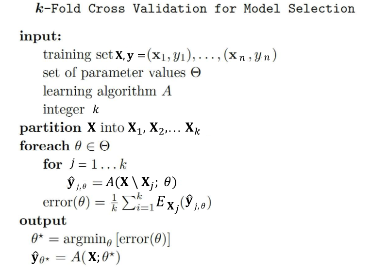
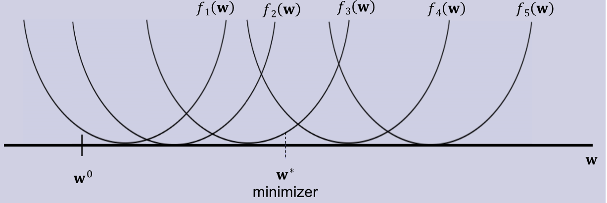
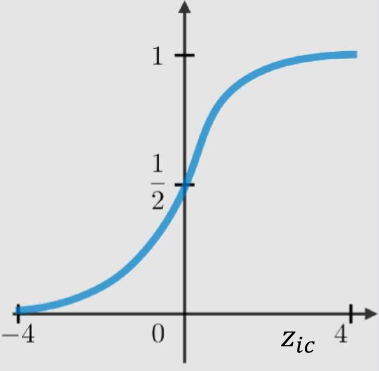
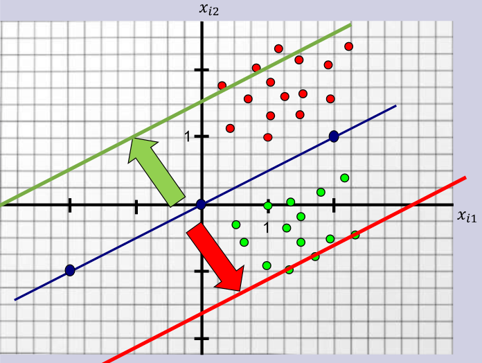

---
header-includes:
    - \newcommand{\argmin}{\mathop{\mathrm{argmin}}}
    - \newcommand{\argmax}{\mathop{\mathrm{argmax}}}
    - \usepackage{float}
    - \let\origfigure\figure
    - \let\endorigfigure\endfigure
    - \renewenvironment{figure}[1][2] {\expandafter\origfigure\expandafter[H]} {\endorigfigure}
geometry: margin=1.5cm
---

# CS342 Machine Learning

# Introduction and Basics
### Probabilities:
* Probability Density Function (PDF) calculates probability of observing a given value
    * PDF of a normal distribution is $p(x|\mu,\sigma^2 )=\frac{1}{\sqrt{2\pi\sigma^2}}\exp(-\frac{(x-\mu)^2}{2\sigma^2})$
    * Cumulative Density Function (CDF) calculates probability of an observation being equal or less than a value

### Unsupervised vs. Supervised Learning:
* Unsupervised learning finds hidden patterns or intrinsic structures in the data
    * Used to draw inferences from input data without labelled responses
* Supervised learning takes input data and known responses to data
    * Model trained to generate reasonable predictions for the response to new data
    * Classification - predicts discrete responses (e.g. is this an apple or a pear)
    * Regression - predicts continuous responses (e.g. what is the volume of this apple)

# Decision Trees
* Simple program consisting of:
    * A nested sequence of if-else decisions based on the features 
    * A class label as a return value at the end of each sequence
* There are many possible decision trees - we want a tree that performs well for the problem
* The input is the data and the output is the program

### Learning a decision stump:
* Simplest decision tree with 1 splitting rule based on 1 splitting feature
* We find the best rule by defining a score for the rule and searching for the rule with the best score
* Feature matrix $\textbf{X}$ has $n$ rows as examples, $d$ columns as features
    * $x_{ij}$ is feature $j$ for example $i$
    * $\textbf{x}_i$ is the vector of all features for example i
    * $\textbf{x}_j$ is the vector of all examples for feature $j$
* Label vector $\textbf{y}$ contains the labels of the $n$ examples
* Training phase: use $\textbf{X}$ and $\textbf{y}$ to find a decision stump
* Prediction phase: given an example $x_i$, use a model to predict a label $\hat{y}_i$
* Training error: fraction of times our prediction $\hat{y}_i$ does not equal the true $y_i$ label
    * The true label is called the ground truth

### Greedy Recursive Splitting:
* Decision stumps usually not very accurate for most tasks
* Decision trees allow sequences of splits based on multiple features
    * Can get very high accuracy
    * Usually computationally expensive to find the best tree
* Most common decision tree learning algorithm is greedy recursive splitting
    * Take the decision that yields the best result one layer lower in the tree, and then recursively split on each new node
* Continue splitting until either leaves only have one label or a user-defined maximum depth is reached
* Accuracy not a good measure for internal nodes - can't always improve by splitting by a horizontal or vertical line (i.e. testing $x_{i1} > th$ or $x_{i2} > th$)

{ width=80% }

### Information Gain:
* Most common score in practice
    * Split so that entropy of labels decreases the most
* Entropy measures randomness of a set of variables 
    * For a categorical variable that can take a total of $C$ values, entropy defined as $entropy= -\sum_{c=1}^{C}p_c \log_2 p_c$ where $p_c$ is the proportion of times we have value $c$
    * Low entropy means very predictable
    * High entropy means very random
    * Minimum value is $0$ ($0\log_2 0 =0$ by convention)
    * Maximum value is $\log_2 C$ 
    * For categorical features, uniform distribution has highest entropy
* We define information gain as $IG(S,A) = entropy(S) - \sum_{i} \frac{|S_{u_i}|}{|S|} entropy(S_{u_i})$ where $S$ is a set of examples, $A$ is a feature from these examples, and $S_{u_i}$ is the subset of examples from $S$ whose feature $A$ is equal to the $i^{th}$ possible value that $A$ can take.
* Information gain for baseline rule (do nothing) is 0
* Even if a split does not increase accuracy at one depth, we hope the metric will make classification easier at the next depth

{ width=80% }

# Learning Theory
* Overfitting - lower accuracy on new data, high accuracy on training data
    * Model too specific to training dataset
* Underfitting - lower accuracy on training data
    * Model does not fit training data well
* Apart from the training error, we should also consider the test error:
    * Are predictions $\hat{\textbf{y}}$ similar to the true unseen labels $\tilde{\textbf{y}}$?
    * This is the main goal of ML 
* The test data cannot influence the training phase in any way

### IID Assumption:
* Training/test data is independent and identically distributed if:
    * All examples come from the same distribution (identically distributed)
    * The examples are sampled independently (where the order doesn't matter)
* Rarely true, but often a good approximation
* Learning theory explores how training error is related to test error

$E_{test} = E_{test}$

$E_{test} = (E_{test} - E_{train}) + E_{train}$

$E_{test} = E_{approx} + E_{train}$

* If $E_{approx}$ is small, then $E_{train}$ is a good approximation to $E_{test}$
* $E_{approx}$ depends on:
    * As $n$ gets larger, it gets smaller - more training examples
    * As the model gets more complicated, it gets larger

### Fundamental trade-off:
* How small we can make the training error versus how well the training error approximates the test error
* Simple models:
    * $E_{approx}$ can be low (not very sensitive to the training set)
    * $E_{train}$ may be high
* Complex models:
    * $E_{approx}$ may be high (very sensitive to the training set)
    * $E_{train}$ can be low

### Validation error:
* Use part of the training data to approximate the test error
* Split training examples into the training set and the validation set
    * Train model based on training data
    * Validate model based on the validation data to understand how well it would do on the test data
1. Training: $model = train(\textbf{X}_{train}, \textbf{y}_{train})$
2. Predict: $\hat{\textbf{y}} = predict(model, \textbf{X}_{validate})$
3. Validate: $error = sum(\hat{\textbf{y}} \neq \textbf{y}_{validate})$
* IID data: validation error provides an unbiased approximation of the test error:
    * $\mathbb{E}(E_{validation}) = \mathbb{E}(E_{test})$
* Validation error often used to select hyperparameters of the model

### Parameters and Hyperparameters:
* Rule values are called parameters
    * We train a model by finding the best parameters on the training data
* Hyperparameters control how complex our model is
    * Cannot train a hyperparameter
* To choose a good value of depth (hyperparameter), we could try a 1-depth tree, 2-depth tree, ... , 20-depth tree and return the tree with the lowest validation error
    * After choosing the hyperparameter, retrain on the full training set

### Optimisation Bias:
* Another name for overfitting is optimisation bias
    * How biased is an error that we optimised over many possibilites?
* Optimisation bias of parameter learning:
    * During learning, we can search over several different decision trees
    * A tree with very low training error means overfitting (rules too specific for the data)
* Optimisation bias of hyperparameter tuning:
    * Optimise the validation error over 1000 values of depth
    * A tree with very low validation error means overfitting (depth too specific for the data)
* In general, optimisation bias grows with the number of models we evaluate
    * More models to search over means we find one that is too specific for the training data
* Validation error tends to have a lower optimisation bias than training error
    * Optimising over 20 values of depth versus trying thousands of trees
* Validation error can still suffer from overfitting
    * Unbiased approximation of test error if computed once
    * Computing it several times - i.e. optimising it - overfits it
* Optimisation bias decreases as the number of validation examples increases
    * Solutions: 1. Increase validation set, 2. Not overuse validation set

### Cross Validation:
* Validation data assumes data is plentiful
    * Data may be scarce - we may not want to waste data on validation
    * We may not have the ability to sample a fresh validation set
* $k$-fold validation gives an accurate estimate of the test error without wasting too much data
* 5-fold cross-validation:
    * Train on 80% of data, validate on other 20%
    * Repeat this 5 more times with different splits, and average the score
* Leave-one-out (LOO) cross-validation: train on all but one training example
    * Repeat $n$ times and average
* $E_{test}$ more accurately approximated with more folds, but more expensive to compute
    * If we have 20 depths with 5 folds for example, then there are 100 models to fit

{ width=50% }

# Probabilistic Classification
* Based on Bayes' rule: $p(A|B) = \frac{p(B|A)p(A)}{p(B)}$
    * Works well with 'bag-of-words' features, e.g. classifying spam emails
* Probabilistic classifiers model conditional probability $p(y_i|\textbf{x}_i)$
    * If an email has words $\textbf{x}_i$, what is the probability that the message is spam?
    * Email is classified as spam if the probability of spam is greater than that of not spam
    * $p(y_i = spam|\textbf{x}_i) = \frac{p(\textbf{x}_i|y_i = spam)p(y_i = spam)}{p(\textbf{x}_i)}$
    * We have access to labelled training data, which means it is easier to compute $p(\textbf{x}_i|y_i = spam)$ than $p(y_i = spam|\textbf{x}_i)$

Computing probabilities:

* $p(y_i = spam) = \frac{\# \; spam \; emails}{\# \; total \; emails}$
* $p(\textbf{x}_i)$ is the probability that an email has feature vector $\textbf{x}_i$
    * Hard to compute - with $d$ words (features), we need $2^d$ samples just to see each word combination once
    * We can ignore this term:
    * In $\frac{p(\textbf{x}_i|y_i = spam)p(y_i = spam)}{p(\textbf{x}_i)} > \frac{p(\textbf{x}_i|y_i \neq spam)p(y_i \neq spam)}{p(\textbf{x}_i)}$, the denominator cancels out
* $p(\textbf{x}_i|y_i = spam)$ is the probability that a spam email has feature $\textbf{x}_i$
    * Not easy to compute (since we need to check every possible feature vector $\textbf{x}_i$), but can approximate easily
    * $p(\textbf{x}_i|y_i = spam) = \frac{\# \; spam \; emails \; with \; \textbf{x}_i}{\# \; spam \; emails}$ 
    * Our assumption: each feature $x_{ij}$ is conditionally independent given label $y_i$
        * Not true, but gives a good approximation
    * E.g. feature 'claim' does not depend on feature 'prize'
    * Can do, for example: $p(\$=1, Hi=1, claim=1, lottery=1|y_i = spam) \approx p(\$=1|y_i = spam)p(Hi=1|y_i = spam)p(claim=1|y_i = spam)p(lottery=1|y_i = spam)$
    * $p(claim=1|y_i = spam) = \frac{\# \; spam \; emails \; with \; claim}{\# \; spam \; emails}$

### Naive Bayes prediction phase:
* Given a test example $\tilde{\textbf{x}}_i$, the prediction $\hat{y}_i$ is set to the class $c$ that maximises $p(\hat{y}_i=c|\tilde{\textbf{x}}_i)$

### Laplace Smoothing:
* Let us take the word $millionaire$ as another feature 
* Assuming we have no emails with the word $millionaire$ in our training set, $p(millionaire=1|spam) = 0$, meaning that spam emails with the word $millionaire$ will be filtered out
* Laplace smoothing:
    * Use a real number $\beta \geq 1$
    * Add $\beta$ to the numerator, $\beta k$ to the denominator where $k$ is the number of possible values of the feature
    * Equivalent to adding $\beta$ times one example that has the feature, and $\beta$ times $k-1$ examples that do not have the feature
* Helps against overfitting - similar occurrence of individual features in the training data

# K-NN Classification
### Parametric vs. Non-parametric models:
* Naive Bayes classifiers and decision trees are parametric models
* Parametric models:
    * Fixed number of parameters
    * Once trained, the model is $O(1)$ in terms of $n$ = number of examples in the dataset
        * A fixed-depth tree just stores the rules, no matter the $n$
        * A Naive Bayes classifier just stores the counts, no matter the $n$
    * Parameters are estimated more accurately with larger $n$
* Non-parametric models:
    * Number of parameters grows with $n$
    * Model gets more complicated with more data
    * Example: K-NN (K-Nearest Neighbours)

### K-Nearest Neighbours:
* To classify a sample $\tilde{\textbf{x}}_i$:
   1. Find the $K$ training examples that are 'nearest' to $\tilde{\textbf{x}}_i$
   2. Classify $\tilde{\textbf{x}}_i$ using the most common label of these $K$ 'nearest' examples
* Based on the Lipschitzness assumption - if two features are close together, then their labels are likely to be the same
* Most common similarity metric is Euclidean distance:
    * $||\textbf{x}_i - \tilde{\textbf{x}}_i|| = \sqrt{\sum_{j=1}^d (x_{ij}-\tilde{x}_{ij})^2}$
    * Model gets more complicated as $n$ increases

### Training a K-NN model:
* No traditional training phase (lazy learning)
    * Simply store the training data
* Size of the model is $O(nd)$
* Predictions are costly: $O(ndt)$ for $t$ test examples

### Norms:
* Euclidean distance - L2-norm of the difference between two feature vectors $||\textbf{r}||_2 = ||\textbf{x}_i - \tilde{\textbf{x}}_i||_2$
    * Norms measure the length of vectors
    * 2 often left out for the the L2-norm: $||\textbf{x}_i - \tilde{\textbf{x}}_i||_2 = ||\textbf{x}_i - \tilde{\textbf{x}}_i||$
* Other norms:
    * L1-norm or Manhattan norm: $||\textbf{r}||_1 = |r_1| + |r_2|$
    * L $\infty$-norm: $||\textbf{r}||_\infty = \max\{|r_1|, |r_2|\}$
* These are all special cases of the L $p$-norm, $p \geq 1$:
    * $||\textbf{x}|| = (\sum_{j=1}^d x_j^p)^\frac{1}{p}$
    * L $\infty$-norm is the limit as $p$ goes to $\infty$

### Test error in parametric models:
* Let us use an optimal Bayes classifier as a reference with two classes:
* Classifier predicts $\hat{y}_i = \underset{i} \argmax \; p(y_i|\textbf{x}_i)$
* Can still make mistakes - it is wrong if a sample does not have the most probable label as its ground truth
* Probability of error is then $\epsilon_{bayes} = 1 - p(\hat{y}_i|\textbf{x}_i)$
* Optimal Bayes classifier provides an informative lower bound on the error
    * With the same feature representation, no other classifier can obtain a lower error
* If $N$ goes to infinity, the error of a 1-NN classifier converges to twice the error of the optimal Bayes classifier:
    * Assume a two-class 1-NN classifier
    * The classifier returns the the distance between $\tilde{\textbf{x}}_i$ and its closest neighbour - what is the probability that this is not the true label of $\tilde{\textbf{x}}_i$?

    { width=90% }

    * $\epsilon_{1-NN} = p(\hat{y}_i|\textbf{x}_i)(1-p(\hat{y}_i|\tilde{\textbf{x}}_i)) + (1-p(\hat{y}_i|\textbf{x}_i)p(\hat{y}_i|\tilde{\textbf{x}}_i)) \leq (1-p(\hat{y}_i|\tilde{\textbf{x}}_i)) + (1-p(\hat{y}_i|\textbf{x}_i)) \leq 2(1-p(\hat{y}_i|\textbf{x}_i))$
    * As $n \rightarrow \infty$, the 1-NN classifier is only two times worse than the best possible classifier
* As $n \rightarrow \infty$, the error of a $K$-NN classiifer converges to $1+\sqrt{\frac{2}{K}}$ times the error of the optimal Bayes classifier - consistency property
    * As $K \rightarrow \infty$, it converges to the best possible error
    * Stone's Theorem: $K$-NN classifier is universally consistent

    { width=80% }

### Curse of dimensionality:
* How many points do we need to fill the neighbourhood of a point so we can find the $K$ closest neighbours?
* We need exponentially more points to fill a high-dimensional volume for $K$-NN to work
    * $n \approx c^d$ where $c$ is a constant

# Linear Regression
* Statistical tool for modelling the relationship between some explanatory variables and some real-valued outcome
* We want a functional relationship between our training data $\textbf{X}$ and the ground truth $\textbf{y}$

### Hypothesis:
* The relationship between $\textbf{X}$ and $\textbf{y}$ is linear
* $h: \textbf{X} \rightarrow \textbf{y}$
* $h(x_i, w) = y_i = wx_i$
    * Predictions are then $\hat{y}_i = w\hat{x}_i$
* We need to find the right parameter by measuring how well our hypothesis fits the training data
    * Need a way to evaluate the numerical error of our predictions 

### Squared Loss Function:
* $\mathcal{L(h)} = \frac{1}{n}\sum_{i=1}^n(h(x_i, w) - y_i)^2$
* Goal is to find a $w$ that minimises this function - optimisation problem

$f(w) = \frac{1}{2}\sum_{i=1}^n(h(x_i, w) - y_i)^2 = \frac{1}{2}\sum_{i=1}^n(wx_i - y_i)^2$ (multiplying $\mathcal{L}(h)$ by a positive constant will not change where the gradient is 0)

$=\frac{1}{2}\sum_{i=1}^n(w^2x_i^2 - 2wx_iy_i + y_i^2)$

$=\frac{w^2}{2}\sum_{i=1}^n x_i^2 - w\sum_{i=1}^n x_i y_i + \frac{1}{2}\sum_{i=1}^n y_i^2$

$=\frac{w^2}{2}a-wb+c$

$f'(w) = wa-b+0$

Solving for $f'(w)=0$ gives $w=\frac{b}{a}=\frac{\sum_{i=1}^n x_i y_i}{\sum_{i=1}^n x_i^2}$

$f''(w)=\sum_{i=1}^n x_i^2$

Since $f''(w) \geq 0$, our $w$ is indeed a minimiser.

### $y$-intercept - bias:
* $\hat{y}_i = h(x_i,w) = w_0 + w_1x_i$
* We can add bias to our model by making a new matrix $\textbf{Z}$ with an extra feature that is always 1
* $\hat{y}_i = v_1z_{i1} + v_2z_{i2} = w_0 + w_1x_{i1}$
* This trick allows us to ignore bias in calculations

### Going beyond 1D vectors:
* For two features, we get a 2D linear function: $\hat{y}_i = w_1x_{i1} + w_2x_{i2}$
* We now fit a 2D hyperplane - 2 dimensions for features, 1 dimension for target associated with each feature vector
* For $d > 1$ features, we have a $d$-dimensional model: $\hat{y}_i = w_1x_{i1} + w_2x_{i2} + ... + w_dx_{id} = \sum_{i=1}^d w_j x_{ij}$
* Or, alternatively in vector notation: $\hat{y}_i = \textbf{w}^T\textbf{x}_i$
* Loss function is: $\mathcal{L(\textbf{w})} = f(\textbf{w}) = \frac{1}{2}\sum_{i=1}^n(\textbf{w}^T\textbf{x}_i - y_i)^2$

### Matrices for least squares:
* Our ground truth, $\textbf{y}_i$, is a $n \times 1$ vector containing ground truth $y_i$ in position $i$
* Our training example, $\textbf{x}_i$, is a $d \times 1$ vector containing $d$ features
* Our training dataset, $\textbf{X}$, is a $n \times d$ matrix with $\textbf{x}_i^T$ in row $i$

$\textbf{y} = \begin{bmatrix} 
    y_1 \\
    y_2 \\ 
    \vdots \\
    y_n 
\end{bmatrix}$
$\textbf{x}_i = \begin{bmatrix} 
    x_{i1} \\
    x_{i2} \\ 
    \vdots \\
    x_{id} 
\end{bmatrix}$
$\textbf{X} = \begin{bmatrix} 
    x_{11} & \dots & x_{1d} \\
    x_{21} & \dots & x_{2d} \\ 
    \vdots & \ddots & \vdots \\
    x_{n1} & \dots & x_{nd}
\end{bmatrix} = \begin{bmatrix} 
    \textbf{x}_1^T \\
    \textbf{x}_2^T \\ 
    \vdots \\
    \textbf{x}_n^T 
\end{bmatrix}$

* The prediction for example $i$ is given by the scalar $\hat{y}_i = \textbf{w}^T\textbf{x}_i$
* The predictions for all $n$ examples is the $n \times 1$ vector $\hat{\textbf{y}} = \textbf{Xw}$

$\hat{\textbf{y}}_i = \begin{bmatrix} 
    \textbf{x}_1^T \\
    \textbf{x}_2^T \\ 
    \vdots \\
    \textbf{x}_n^T 
\end{bmatrix} \textbf{w} = \begin{bmatrix} 
    \textbf{x}_1^T \textbf{w} \\
    \textbf{x}_2^T \textbf{w} \\ 
    \vdots \\
    \textbf{x}_n^T \textbf{w} 
\end{bmatrix}$

* Residual vector $\textbf{r}$ is a $n \times 1$ vector containing the difference between the prediction and the ground truth: $\textbf{r} = \hat{\textbf{y}} - \textbf{y} = \textbf{Xw} - \textbf{y}$
* Least squares can be written as the squared L2-norm of the residual:

$f(\textbf{w}) = \frac{1}{2}\sum_{i=1}^n(\textbf{w}^T\textbf{x}_i - y_i)^2 = \frac{1}{2}\sum_{i=1}^n(r_i)^2 = \frac{1}{2}\sum_{i=1}^n r_i r_i$

$=\frac{1}{2}\textbf{r}^T\textbf{r} = \frac{1}{2}||\textbf{r}||^2 = \frac{1}{2}||\textbf{Xw}-\textbf{y}||^2$

$=\frac{1}{2}\textbf{w}^T\textbf{X}^T\textbf{Xw} - \textbf{w}^T\textbf{X}^T\textbf{y} + \frac{1}{2}\textbf{y}^T\textbf{y}$

$=\frac{1}{2}\textbf{w}^T\textbf{Aw} - \textbf{w}^T\textbf{b} + \frac{1}{2}c$

Gradients for matrices:

$\nabla[c]=0$

$\nabla[\textbf{w}^T\textbf{b}] = \textbf{b}$

$\nabla[\frac{1}{2}\textbf{w}^T\textbf{Aw}] = \textbf{Aw}$ if $\textbf{A}$ is symmetric

Hence, $\nabla f(\textbf{w}) = \textbf{Aw} - \textbf{b} + 0$

Solving for $\nabla f(\textbf{w}) = 0$ and rearranging gives: $\textbf{w} = (\textbf{X}^T\textbf{X})^{-1}(\textbf{X}^T\textbf{y})$, if $\textbf{X}^T\textbf{X}$ is invertible

### Matrix least squares - issues:
* Sensitivity to outliers 
* A lot of data to store - $\textbf{X}^T\textbf{X}$
* Takes $O(nd^2+d^3)$ time to compute the solution
    * Creating matrix $\textbf{X}^T\textbf{X}$ takes time $O(nd^2)$
    * Solving $\textbf{X}^T\textbf{Xw} = \textbf{X}^T\textbf{y}$ is solving a set of $d$ linear equations called the normal equations - this takes time $O(d^3)$
* It might predict values out of the range of $\textbf{y}$
* It assumes a linear relationship between $\textbf{X}$ and $\textbf{y}$
* Solution might not be unique:
    * Consider two features being identical for all examples - collinearity
    * We can increase the weight for one feature and decrease it for the other without changing the prediction - e.g. $(w_1, w_2)$ and $(w_1 + w_2, 0)$
    * Since our objective function $f(\textbf{w})$ is convex (any line segment we draw between two points lies above the curve), any solution where $\nabla f(\textbf{w}) = 0$ is an optimum

### Linear Regression for polynomial regression:
* We can change the features (change of basis):

$\textbf{X} = \begin{bmatrix} 
    x_1 \\
    x_2 \\ 
    \vdots \\
    x_n 
\end{bmatrix}$
$\textbf{Z} = \begin{bmatrix} 
    1 & x_1 & x_1^2 & \dots & x_1^p \\
    1 & x_2 & x_2^2 & \dots & x_2^p \\ 
    \vdots & \vdots & \vdots & \ddots & \vdots \\
    1 & x_n & x_n^2 & \dots & x_n^p
\end{bmatrix}$
   
* Fit new parameters $\textbf{v}$ under change of basis: solve for $\textbf{Z}^T\textbf{Zv} = \textbf{Z}^T\textbf{y}$
    * Non-linear feature transform
    * The $\textbf{z}_i$ are the coordinates in the new basis, or feature space, for the training example $i$
* To predict new data $\tilde{\textbf{X}}$, we compute $\tilde{\textbf{Z}}$ from $\tilde{\textbf{X}}$ and then $\hat{\textbf{y}} = \tilde{\textbf{Z}}\textbf{v}$
* Fundamental trade-off: as the polynomial degree increases, the training error decreases 
    * Approximation error tends to increase - overfitting with large $p$
    * Validation or cross-validation commonly used to select degree $p$

### L2-Regularisation:
* Standard regularisation strategy
* Objective function for $d$-dimensions:

$f(\textbf{w}) = \frac{1}{2} \sum_{i=1}^n(\textbf{w}^T\textbf{x}_i - y_i)^2 + \frac{\lambda}{2}\sum_{j=1}^d w_j^2$

$= \frac{1}{2}||\textbf{Xw}-\textbf{y}||^2 + \frac{\lambda}{2}||\textbf{w}||^2$

* Large slopes $w_j$ tend to lead to overfitting
    * Smaller means less sensitivity to the data
* We want smaller weights and we do this by increasing the penalty for loss with larger weights
* Need to balance getting a low training error versus having small weights
* How to choose $\lambda$:
    * Use validation or cross-validation
    * Larger $\lambda$ means more penalty added

### L2-Regularisation and our normal equations:
* Our new objective: $f(\textbf{w}) = \frac{1}{2}||\textbf{Xw} - \textbf{y}||^2 + \frac{\lambda}{2}||\textbf{w}||^2$
* Gradient with L2-regularisation: $\nabla f(\textbf{w}) = \textbf{X}^T\textbf{Xw} - \textbf{X}^T\textbf{y} + \lambda \textbf{w}$
* Solution: $\textbf{w} = (\textbf{X}^T\textbf{X} + \lambda \textbf{I})^{-1}(\textbf{X}^T\textbf{y})$
    * $(\textbf{X}^T\textbf{X} + \lambda \textbf{I})$ is always invertible
    * Solution $\textbf{w}$ is also unique

# Robust Regression and Regularisation for Feature Selection
### Outliers:
* Squaring errors - $f(\textbf{w}) = \frac{1}{2} \sum_{i=1}^n(\textbf{w}^T\textbf{x}_i - y_i)^2$
    * Shrinks small errors, increases large errors
    * Outliers may influence $\textbf{w}$ much more than other data points - priority is decreasing large errors
* Absolute errors - $f(\textbf{w}) = \frac{1}{2} \sum_{i=1}^n|\textbf{w}^T\textbf{x}_i - y_i|$
    * Decreasing small and large errors is equally important
    * Instead of minimising the square of the L2-norm, we minimise the L1-norm

### Regression with the L1-norm:
* Minimising the absolute error is harder:
    * No normal equations for minimising the L1-norm
    * Absolute value is non-differentiable at 0
    * Non-smooth function: gradient may not become small near a minimiser

    { width=80% }

* Huber loss is a differentiable approximation to the L1-norm
    * $f(\textbf{w}) = \frac{1}{2} \sum_{i=1}^n h(\textbf{w}^T\textbf{x}_i - y_i) = \sum_{i=1}^n h(r_i)$
    * $h(r_i) = \begin{cases} \frac{1}{2}r_i^2 & \text{for } |r_i| \leq \epsilon
   \\ \epsilon(|r_i| - \frac{1}{2}\epsilon) & \text{otherwise} \end{cases}$
    * This loss function is convex
    * Function $h$ is differentiable
    * $h'(r_i) = \begin{cases} r_i & \text{for } |r_i \leq \epsilon|\\ \epsilon \; \mathrm{sgn}(r_i) & \text{otherwise} \end{cases}$

### Standardising features:
* Not important for decision trees or naive Bayes classifier - they only look at one feature at a time
* Not important for least squares - $w_j$(100ml) gives the same model as $w_j$(0.1L) with a different $w_j$
* Important for K-NN - value of distance is affected by large features
* Important for regularised least squares - penalising $w_j^2$ differs if features $w_j$ are on different scales
* Continuous features are usually standardised:
    * $x_{ij} = \frac{x_{ij}-\mu_j}{\sigma_j}$
* Do not use mean and sd of test data
    * Model is trained with standardised training data
    * Training and test means and sds might be different
    * Always use mean and sd of training data
* In regression, it is common practice to standardise the targets in ground truth vector $\textbf{y}$
    * Replace $y_i$ with $\frac{y_i-\mu_y}{\sigma_y}$
* If targets are standardised, setting $\textbf{w}=0$ predicts average of $\textbf{y}$

### Feature Selection:
* Given our training data $\textbf{X}$, find the features that are important for predicting $\textbf{y}$
    * Not all features may be useful and we can work with new feature vectors of a lower dimension
* One of the most important problems in ML/statistics
* Pearson's correlation coefficient:
    * Compute correlation between feature values in each $\textbf{x}_j$ and $\textbf{y}$
    * Turns feature selection into hypothesis testing for each feature
    * Usually gives unsatisfactory results as it ignores feature interactions
        * May include irrelevant features, e.g. 'Fish and Chips, Friday' and Fish and Chips gives us an upset stomach then it may also include that Fridays are relevant
        * May exclude combinations of features, e.g. 'Diet Coke, Mentos' where Diet Coke and Mentos do not give an upset stomach but together they do
* Regression-weight approach:
    * Fit regression weights $\textbf{w}$ based on all features - e.g., by using least squares
    * Take all features $j$ where $|w_j|$ is greater than a threshold
    * Does not work well with collinearity, e.g. if the 'Friday' feature always equals the 'Fish and Chips' feature it may tell us that Fridays are relevant but Fish and Chips are not: $\hat{y}_i = w_1(FC) + w_2(FR) = 0(FC) + (w_1+w_2)(FR)$

### Search and score approach:
* Define a score function $f(s)$ that measures the quality of $s$, a subset of features
* Search for the $s$ with the best score

### Which score function?
* Should not be training error
    * May overfit on training data, so the subset $s$ we find may only work on the training data
* More appropriate score is the validation error
    * Find the subset of features that gives the lowest validation error
    * Helps also the minimise test error by reducing overfitting
* What happens with high-dimensional feature vectors?
    * If we have $d$ features, there are $2^d$ subsets of features
    * Optimisation bias is high - we optimise over $2^d$ models
    * Prone to false positives - irrelevant features may help by chance
* To reduce false positives, we can define a complexity penalty
    * $\mathrm{score}(s) = \frac{1}{2}\sum_{i=1}^n(\textbf{w}_s^T\textbf{x}_{is}-y_i)^2 +\mathrm{size}(s)$
    * $\textbf{x}_{is}$ is a feature vector defined by the subset of features $s$
    * If two subsets have the same prediction error, the smaller subset is preferred
    * If for a subset some of the weights are very small, the optimisation would prefer not using these very small weights
        * E.g. if feature 3 has weight $w_3=0.0000001$, then the feature's contribution is negligible and it would be better off avoiding the size penalty by not using it

### L0-norm as a feature selector:
* In linear models, setting $w_j=0$ is the same as removing feature $j$
* L0-norm gives the number of non-zero values in a vector
    * $||\textbf{w}||_0 = \mathrm{size}(s)$
    * Not actually a true norm
* L0-norm penalty: $f(\textbf{w})=\frac{1}{2}||\textbf{Xw}-\textbf{y}|| + \lambda||\textbf{w}||_0$
* Balance between training error and no. features used:
    * With $\lambda = 0$, we have least squares with all features
    * With $\lambda = \infty$, $\textbf{w}=0$ and no features are used
    * With large $\lambda$, more emphasis on having more zeroes in $\textbf{w}$
* Disadvantage: hard to find the minimiser for this objective function - non-convex objective function
    * Also not differentiable

### L2-regularisation:
* $f(\textbf{w})=\frac{1}{2}||\textbf{Xw}-\textbf{y}||+\frac{\lambda}{2}||\textbf{w}||^2$
* Balances getting low training error vs. having small slopes $w_j$
* Helps to reduce overfitting
    * Increasing training error vs. decreasing approximation error
* Convex objective function - gives unique solution, reduces sensitivity to outliers

### L1-regularisation:
* $f(\textbf{w})=\frac{1}{2}||\textbf{Xw}-\textbf{y}||+\lambda||\textbf{w}||_1$
* Like using L2-norm, objective function is convex and improves our test error
* Like using L0-norm, it encourages elements of $\textbf{w}$ to be exactly zero
* Simultaneously regularises and selects features
    * Sometimes called LASSO regularisation

### Sparsity and regularisation in least squares:
* A sparse $\textbf{w}$ means that many of its values are zero
* L0-regularisation: prefers vectors with more zeroes
* L1-regularisation: focuses on decreasing $w_j$ until they are zero
* L2-regularisation: focuses on decreasing largest values in $\textbf{w}$, i.e. aims to make all values in $\textbf{w}$ similarly small
* L0 and L1 give sparsity
* L2 does not (RIDGE regularisation)
* L0 involves solving a non-convex objective function
* L1 and L2 involve solving a convex objective function
    * Both:
        * Decrease sensitivity of model to changes in data
        * Help to reduce overfitting 
        * Help to reduce test error

### Sparsity and no regularisation:
* Consider least squares with 1D features: $f(w) = \frac{1}{2}\sum_{i=1}^n(wx_i-y_i)^2$
* Objective function is a convex quadratic function of $w$
* It has a minimum value close to $w=0$
* For finite $n$, it is unlikely that the minimum will occur at $w=0$
    * $w = \frac{\sum_{i=1}^n(x_iy_i)}{\sum_{i=1}^n(x_i)^2}$
    * $w$ not zero so long as we have a non-zero feature with a non-zero target

### Sparsity and L0-regularisation:
* 1D features: $f(w) = \frac{1}{2}\sum_{i=1}^n(wx_i-y_i)^2+\lambda ||w||_0$
* Non-convex objective function
* Minimum value at discontinuity, i.e. $w=0$
* Can enforce sparsity

### Sparsity and L1-regularisation:
* 1D features: $f(w) = \frac{1}{2}\sum_{i=1}^n(wx_i-y_i)^2+\lambda |w|$
* Convex piecewise quadratic function of $w$ with kink at $0$
* L1-regularisation tends to set variables to exactly $0$, $w=0$
    * Does feature selection
    * Can enforce sparsity

### Sparsity and L2-regularisation:
* 1D features: $f(w) = \frac{1}{2}\sum_{i=1}^n(wx_i-y_i)^2+\lambda w^2$
* Also a convex quadratic function of $w$
* Moves minimum value closer to $w=0$, but not all the way to $0$
    * Doesn't do feature selection

# Clustering
* Data may form clusters
* Points within a cluster are similar to each other
* Such a distribution is multimodal, since it has multiple modes, or regions of high probability mass
* Grouping data into clusters, with no labels, is called clustering
    * Input: set of feature vectors $\{\textbf{x}_i\}$
    * Output: an assignment of feature vectors to clusters
* Assumptions: 
    * $\textbf{X} = \{\textbf{x}_1,...,\textbf{x}_n\}$ lives in a Euclidean space
    * $\textbf{X}$ can be grouped into $K$ clusters
    * Points within the same group are close in Euclidean distance

### K-means clustering:
* Assumes there are $K$ clusters and each point is close to its cluster centre
* Very simple (and useful) heuristic: start randomly and alternate between cluster assignment and computing means
* Inputs: 
    * The number of clusters $K$ (hyperparameter)
    * Initial guess of the mean of each cluster
* Algorithm:
    * Assign each $\textbf{x}_i$ to its closest mean
    * Update the means based on the assignment
    * Repeat until convergence

### K-means objective:
* Find cluster centres $\textbf{m}$ and assignments $\textbf{r}$ to minimise the sum of squared distances of data points $\{\textbf{x}_1,...,\textbf{x}_n\}$ to their assigned cluster centres
* Minimise:
    * $f(\{\textbf{m}\}, \{\textbf{r}\}) = \sum_{i=1}^n \sum_{j=1}^K r_j^i||\textbf{m}_j-\textbf{x}_i||^2$ s.t. $\sum_{j=1}^K r_j^i = 1$ where $r_j^i \in \{0,1\}$ for all data points and clusters
    * $r_k^i=1$ means that $\textbf{x}_i$ is assigned to cluster $k$ with centre $\textbf{m}_k$ (i.e. a feature can only be assigned to one mean)
* Two step optimisation process:
    * Fix means, optimise assignments (each point assigned to cluster whose mean is closest to it)
    * Fix assignments, optimise means (average of assigned data points)

### K-means algorithm:
* Initialisation: set $K$ cluster means $\{\textbf{m}_1,...,\textbf{m}_k\}$ to random values
* Repeat until convergence:
    * For each data point $\textbf{x}_i$, $k_i = \underset{k} \argmin ||\textbf{m}_k-\textbf{x}_i||^2$
    * $r_k^i = 1 \leftrightarrow k_i = k$ (1-hot encoding) - if $\textbf{x}_i$ is assigned to cluster $k=2$ and there are $4$ clusters, the 1-hot encoding for $\textbf{x}_i$ is $\textbf{r}^i= [0 \; 1 \; 0 \; 0] = [r_1^i \; r_2^i \; r_3^i \; r_4^i]$
    * Update model parameters: for all $k$, $\textbf{m}_k=\frac{\sum_i r_k^i\textbf{x}_i}{\sum_i r_k^i}$

### Convergence in K-means:
* How do we know if the algorithm has converged?
    * If the assignment does not change in the assignments step or the change is negligible, we say convergence to at least a local minimum has been achieved
    * Guaranteed to converge to a global or local minimum when using Euclidean distance

### K-means issues:
* Assumes the number of clusters $K$ is known
* Each example is assigned to one and only one cluster
    * Can't have an example be assigned to more than one cluster or left unassigned
* May converge to a suboptimal solution
    * Objective function is non-convex means optimisation is not guaranteed to converge to a global minimum
    * Try many random starting points
    * Try non-local split-and-merge moves:
        * Simultaneously merge two nearby clusters and split a big cluster in two (keeps number of clusters equal to $K$)

### Soft K-means:
* Can make soft instead of hard assignments:
    * One cluster may have a responsibility of $0.7$ for a data point and the other $0.3$ for the same data point
    * Resulting clusters are fuzzy
* Define the membership of $\textbf{x}_i$ w.r.t. cluster $k$ as:
    * $r_k^i = \frac{\exp(-\beta||\textbf{m}_k-\textbf{x}_i||^2)}{\sum_{j=1}^K\exp(-\beta||\textbf{m}_j-\textbf{x}_i||^2)}$
    * Hyperparameter $\beta > 0$ is the stiffness parameter
    * This is a softmax function 
    * Summing $k$ over $r_k^i$ for a given $i$ adds up to 1 - they can be interpreted as probabilities
* How can we adapt the updating of cluster centres $\textbf{m}_k$ within the context of soft K-means clustering?
    * We want $r_j^i \in [0, 1]$ with cluster $l$ contributing a term: $\sum_{i=1}^n r_l^i||\textbf{m}_l-\textbf{x}_i||^2$
    * We want to find a $\textbf{m}_l$ such that this contribution is as small as possible
    * $\textbf{m}_l = \underset{\textbf{m}} \argmin \sum_{i=1}^n r_l^i ||\textbf{m}_l-\textbf{x}_i||^2$
    * This sum is a convex function in $\textbf{m}$: it has a unique minimiser
    * $f(\textbf{m}) = \sum_{i=1}^n r_l^i(\textbf{m}^T\textbf{m}-2\textbf{m}^T\textbf{x}_i+\textbf{x}_i^T\textbf{x})$
    * $\nabla f(\textbf{m}) = \sum_{i=1}^n r_l^i (2\textbf{m}-2\textbf{x}_i)=0$
    * $\textbf{m}_l = \frac{\sum_{i=1}^n r_l^i \textbf{x}_i}{\sum_{i=1}^n r_l^i}$

### Soft K-means algorithm:
* Set cluster means $\{\textbf{m}_1,...,\textbf{m}_k\}$ to random values 
* Repeat until convergence:
    * Each $\textbf{x}_i$ is given a soft degree of assignment to each cluster $k$, $r_k^i = \frac{\exp(-\beta||\textbf{m}_k-\textbf{x}_i||^2)}{\sum_{j=1}^K\exp(-\beta||\textbf{m}_j-\textbf{x}_i||^2)}$
    * To reflect actual means of data points for each cluster, update each mean $k$ as: $\textbf{m}_k = \frac{\sum_{i=1}^n r_k^i \textbf{x}_i}{\sum_{i=1}^n r_k^i}$

### Vector Quantisation:
* $K$-means originally comes from the area of signal processing
* Designed for vector quantisation:
    * Replace examples with the mean of their cluster (aka their prototype)

# Principal Component Analysis
### Latent-factor Models:
* Learn a new basis from the data
    * Change of basis from $\textbf{x}_i$ to $\textbf{z}_i$
* Advantages:
    * Outlier detection: an outlier in our data cannot be represented by combination of the usual parts
    * Dimensionality reduction: compress data into a limited number of parts
    * Visualisation: easier to visualise data in a 2D or 3D space
    * Interpretation: figure out what the parts represent and which ones are the most important

### Principal Component Analysis (PCA):
* Takes a matrix $\textbf{X}$ (dimensions $n \times d$) and outputs two matrices $\textbf{Z}$ (dimensions $n \times k$) and $\textbf{W}$ (dimensions $k \times d$)
* $\textbf{X} \approx \textbf{ZW}$
* Each row $c$ of $\textbf{W}$ is a part ($\textbf{w}_c$), aka a factor or principal component (PC)
    * 1st row - most important, 2nd row - 2nd most important, ..., $k$-th row - least important
* Each row $i$ of $\textbf{Z}$ is a set of part weights ($\textbf{z}_i$), aka factor loading or features
* Column $j$ of $\textbf{W}$ ($\textbf{w}^j$) represents the values of the $j$-th dimension across all PCs
* We approximate $x_{ij}$ as $\hat{x}_{ij}=z_{i1}w_{1j}+z_{i2}w_{2j}+...+z_{ik}w_{kj} = \sum_{c=1}^k z_{ic}w_{cj} = (\textbf{w}^j)^T\textbf{z}_i = \langle \textbf{w}^j, \textbf{z}_i \rangle$
* PCA approxmates feature vector $\textbf{x}_i$ as $\hat{\textbf{x}}_i = \textbf{W}^T \textbf{z}_i$
* PCA is a linear model with a closed-form solution that maps the data to a lower dimensional space if $k \ll d$
* Change of basis from $\textbf{X}$ to $\textbf{Z}$
    * The basis vectors are the $\textbf{w}_c$ s
    * The coordinates in the new basis of each $\textbf{x}_i$ are the $\textbf{z}_i$ s

### Projection onto a subspace:
* Given a dataset $\{\textbf{x}_1,...,\textbf{x}_n\}$
* Compute mean $\mu$
* Goal: find a $k$-dimensional subspace $\mathcal{S}$ such that $\textbf{x}_i-\mu$ is well-represented by its projection onto $\mathcal{S}$
    * The projection of a point $\textbf{x}_i-\mu$ onto $\mathcal{S}$ is the point in $\mathcal{S}$ closest to $\textbf{x}_i-\mu$
* PCA is a data projection technique, where our $k$-dimensional subspace $\mathcal{S}$ has $k \ll d$ dimensions

### PCA for 2D data with $k=1$:
* PCA finds a line minimising the squared distance to each $\textbf{x}_i$
* This line is the first row of $\textbf{W}$
* The $\textbf{z}_i$ s with $k=1$ are the coordinates of the $\textbf{x}_i$ s projected onto the line
* The line represents the main trend of the data

### PCA for 3D data with $k=2$:
* PCA finds a plane minimising the squared distance to each $\textbf{x}_i$
* This plane is represented by the first two rows of $\textbf{W}$
* The $\textbf{z}_i$ s with $k=2$ are the coordinates of the $\textbf{x}_i$ s projected onto the plane

### Maths behind PCA:
* We want to minimise the summation of squared errors $f(\textbf{W}, \textbf{Z}) = \sum_{i=1}^n ||\textbf{W}^T\textbf{z}_i-\textbf{x}_i||^2 = \sum_{i=1}^n \sum_{j=1}^d (\langle \textbf{w}^j, \textbf{z}_i \rangle - x_{ij})^2 = ||\textbf{ZW-X}||^2_F$
    * The Frobenius norm for an $n \times m$ matrix $A$ is $||A||_F=\sqrt{\sum_{i=1}^m \sum_{j=1}^n A^2_{ij}}$
* Each column $\textbf{w}^j$ is trying to predict column $j$ of $\textbf{X}$ from the basis $\textbf{z}_i$
* We have $d$ sums over $n$ samples
    * Equivalent to solving $n$ regression problems
* Each feature $\textbf{z}_i$ indicates how to combine the $\textbf{w}_c$ s
* We want to centre the data:
    * Compute the mean of each column $\mu_j$
    * Replace each $x_{ij}$ with $x_{ij}-\mu_j$

### PCA non-uniqueness:
* PCA objective function may not have a unique global minimum
* The components we find may also provide redundant information about the data
* We can make the solution unique and non-redundant by adding three constraints:
    1. Normalisation: enforce $||\textbf{w}_c||=1$
    2. Orthogonality: enforce $\textbf{w}_c^T\textbf{w}_{c'}=0$ for all $c \neq c'$
    3. Sequential fitting: sequentially fit the PCs
        * Start with the top PC, then the 2nd top PC, and so on...

### PCA - what does it really do?
* For 2D feature vectors, it gives us the two most important components
    * These components describe the main trend of the data (aka variance)
    * The two components can be used as a new set of axes to represent the data in a new feature space
    * To know where the axes are with respect to the current axes, the data must be centred
    * If the data is not centred, the location of the new axes is not easy to determine based on the current axes
    * Once the new axes are found, the $\textbf{z}_i$ s are the coordinates to locate the points with respect to these new axes

{ width=80% }

### PCA computation:
* SVD - singular value decomposition
* $\textbf{X} = \textbf{U} \Sigma \textbf{V}^T$
* SVD uses square matrices to compute eigenvalues and eigenvectors so we need $\textbf{X}^T\textbf{X}$ or $\textbf{XX}^T$
* $\Sigma \in \mathbb{R}^{n \times d}$ is a diagonal matrix with positive entries 
    * The non-zero singular values are the positive square roots of the non-zero eigenvalues of $\textbf{X}^T\textbf{X}$
* $\textbf{U} \in \mathbb{R}^{n \times n}$ is a matrix with orthonormal columns (both orthogonal and normalised)
    * The eigenvectors of $\textbf{XX}^T$ make up the columns of $\textbf{U}$
* $\textbf{V} \in \mathbb{R}^{d \times d}$ is a matrix with orthonormal columns and rows
    * $\textbf{V}$ is an orthogonal matrix, so $\textbf{V}^{-1} = \textbf{V}^T$
    * $\textbf{V}$ is our $\textbf{W}$ containing the PCs of our data $\textbf{X}$ as the columns of the matrix, hence $\textbf{W}=\textbf{V}^T$
    * The eigenvectors of $\textbf{X}^T\textbf{X}$ make up the columns of $\textbf{V}$

### PCA - approxmation of data:
* Given new data $\tilde{\textbf{X}}$, use $\mu_j$ and $\textbf{W}$ to compute the new basis $\tilde{\textbf{Z}}$
    1. Centre data: replace $x_{ij}$ with $x_{ij}-\mu_j$
    2. Find $\tilde{\textbf{Z}} = \tilde{\textbf{X}}\textbf{W}^T(\textbf{WW}^T)^{-1}=\tilde{\textbf{X}}\textbf{W}^T$

# Linear Classifiers
### Binary Linear Classifiers:
* Can we use regression for a binary classification problem? (e.g detecting spam emails)
* Predict $y_i \in \{-1, 1\}$
* Train a regression model to fit a linear model for $d$-dimensional feature vectors:
    * $\hat{y}_i = w_1x_{i1}+w_2x_{i2}+...+w_dx_{id} = \textbf{w}^T\textbf{x}_i$
* Our regression model can predict any real number - how do we make sure it predicts either $-1$ or $1$?
    * $\hat{z}_i = \textbf{w}^T\textbf{x}_i$
    * $\hat{y}_i = \begin{cases} 1 & \text{if } \hat{z}_i > th\\ -1 & \text{if } \hat{z}_i < th \end{cases}$ with $th=0$
    * Or alternatively, $\hat{y}_i = \mathrm{sgn}(\textbf{w}^T\textbf{x}_i)$
* We can interpret $\textbf{w}$ as a line separating all $\textbf{x}_i$ into two sets
    * The set where $\textbf{w}^T\textbf{x}_i > 0$ and the set where $\textbf{w}^T\textbf{x}_i < 0$ 

{ width=80% }

### Example decision boundary: boolean NOT function:
* $\hat{y}_i = w_1x_{i1}+w_2x_{i2}$
* Ignore $x_{i1}$, output is NOT $x_{i2}$
* When $x_{i2}=0$, $w_1x_{i1}+w_2x_{i2}>0 \iff w_1>0$
* When $x_{i2}=1$, $w_1x_{i1}+w_2<0 \iff w_1+w_2<0$
* One possible solution: $w_1=1$, $w_2=-2$
* $w_1x_{i1}+w_2x_{i2} = 0 \implies x_{i1}=2x_{i2}$
* Predictions given by $\textbf{w}$ can be represented as two half-spaces:
* $H_+=\{\textbf{x}_i: \textbf{w}^T\textbf{x}_i > 0\}$, $H_-=\{\textbf{w}^T\textbf{x}_i < 0\}$
    * The boundary of these half-spaces passes through the origin
* If the training examples can be separated by a linear decision rule, they are linearly separable

{ width=80% }

* Model $\textbf{w}$ can be plotted in a model space
* Each training rule $\textbf{x}_i$ is associated with a half-space, in which it must lie to be correctly classified
* Region satisfying all the constraints is the feasible region
    * If the region is non-empty, the problem is feasible

{ width=80% }

### Least squares classification:
* Recall: $f(\textbf{w})=\frac{1}{2}||\textbf{Xw}-\textbf{y}||^2$
* If we predict $0.9$ and $y_i=1$, error in $f(\textbf{w})$ is small
* If we predict $100$ and $y_i=1$, error in $f(\textbf{w})$ is huge
* Least squares penalises some cases that give the correct sign too harshly

{ width=80% }

* Squared error of the model we want is huge
* Model actually given by least squares has a smaller squared error, but is less accurate

### 0-1 loss function:
* We need a loss function that tries to minimise the number of classification errors
* Expressed using the L0-norm as $||\mathrm{sgn}(\textbf{Xw})-\textbf{y}||_0$
    * $\mathcal{L}_{0-1}(\hat{y}_i, y_i)=\begin{cases} 0 & \text{if } \hat{y}_i = y_i\\ 1 & \text{if } \hat{y}_i \neq y_i \end{cases}$

{ width=80% }

* Finding $\textbf{w}$ by minimising the 0-1 loss function is a hard problem
* The 0-1 loss function is non-convex in $\textbf{w}$ 
    * Gradient is 0 everywhere
    * Cannot tell how $f(\textbf{w})$ changes to find a global minimum
* Solution: convex approximation to 0-1 loss function
    * If $y_i = 1$, we get the label right if $\textbf{w}^T\textbf{x}_i > 0$
    * If $y_i = -1$, we get the label right if $\textbf{w}^T\textbf{x}_i < 0$ or equivalently if $-\textbf{w}^T\textbf{x}_i > 0$
    * Classifiying example correctly is equivalent to having $y_i\textbf{w}^T\textbf{x}_i > 0$
    * Therefore, our error is given as $\max\{0, -y_i\textbf{w}^T\textbf{x}_i\}$
    * $f(\textbf{w}) = \sum_{i=1}^n \max\{0, -y_i\textbf{w}^T\textbf{x}_i\}$
* What happens if $\textbf{w}=0$? 
    * Gives lowest possible value of $f(\textbf{w})$
    * Minimises convex approximation, but if $\textbf{w}=0$ the loss would be $0$ but we are not learning a model
    * Known as a degenerate solution

### Hinge loss:
* Replace $y_i\textbf{w}^Tx_i > 0$ with $y_i\textbf{w}^Tx_i \geq 1$
* $f(\textbf{w})=\sum_{i=1}^n\max\{0,1-y_i\textbf{w}^T\textbf{x}_i\}$
* Properties for true label $-1$:
    * Convex and not degenerate - for $\textbf{w}=0$, the error is $1$ and not $0$ (not the lowest possible value)
    * Error is $0$ if $\textbf{w}^T\textbf{x}_i \leq -1$
    * Error is $1$ if $\textbf{w}^T\textbf{x}_i = 0$, i.e. matches 0-1 loss

{ width=80% }

### Other non-convex approximations to 0-1 loss:
* Sigmoid function: robust to having many outliers and extreme outliers
    * $f(\textbf{w}) = \frac{1}{1+\exp(-y_i\textbf{w}^T\textbf{x}_i)}$
    * NP-hard to minimise
* Logistic loss: smooth degenerate approximation to 0-1 loss with a log-sum-exp
    * $\max\{0,-y_i\textbf{w}^T\textbf{x}_i\} \approx \log(\exp(0)+\exp(-y_i\textbf{w}^T\textbf{x}_i))$
    * Which gives $f(\textbf{w})=\sum_{i=1}^n \log(1+\exp(-y_i\textbf{w}^T\textbf{x}_i))$
    * Not degenerate: if $\textbf{w}=0$, error is $\log(2)$ instead of $0$
    * Convex function, so differentiable

{ width=80% }

### The Perceptron Algorithm:
* One of the first learning algorithms, for linearly separable data
* $\hat{y}_i = \begin{cases} 1 \text{ if } \sum_{j=1}^n w_jx_{ij}> \theta \\ -1 \text{ if } \sum_{j=1}^n w_jx_{ij} < \theta\end{cases}$
* Algorithm searches for a $\textbf{w}$ such that $\mathrm{sgn}(\textbf{w}^T\textbf{x}_i)=y_i$ for all $i$
* Algorithm:
    * $\textbf{w}^0=0$ at iteration $t=0$
    * Predict $y_i$ for all $i$ in any order until $\hat{y}_i \neq y_i$
    * If $\hat{y}_i \neq y_i$: $\textbf{w}^{t+1}=\textbf{w}^t+y_i\textbf{x}_i$
        * If $y_i=1$ and the prediction is $\mathrm{sgn}(\textbf{w}^T\textbf{x}_i)=-1$, need to add more of $\textbf{x}_i$ to $\textbf{w}$ so that $\textbf{w}^T\textbf{x}_i$ is larger
    * Continue predicting $y_i$ for all $i$ in any order until there are no errors
* Algorithm can find a perfect classifier in a finite number of steps for linearly separable data

### Multi-class linear classifiers:
* 'One-vs-all' - a simple way to turn linear models for binary classifiers into multi-class classifiers
* Training:
    * For each class $c$, train a binary classifier to predict whether example $\textbf{x}_i$ is of class $c$ or not
    * For a total of $k$ classes, this would require $k$ binary classifiers
* Prediction:
    * Apply the $k$ classifiers to each example $\textbf{x}_i$ to get a numerical value for each class $c$
    * Return the class $c$ with the highest numerical value
* Training will produce a vector $\textbf{w}_c$ for each class $c$
    * These vectors can be put together as rows of a matrix $\textbf{W}$
    * $\textbf{W} = \begin{bmatrix} 
    \textbf{w}_1^T \\
    \textbf{w}_2^T \\ 
    \vdots \\
    \textbf{w}_k^T
    \end{bmatrix}$
* Training does not guarantee that the largest $\hat{y}_i$ comes from the classifier that should correctly assign the label to the image - each classifier is just attempting to get 1 or -1
    * Can we define a loss that encourages the highest $\textbf{w}^T_c\textbf{x}_i$ to be the correct prediction $\textbf{w}^T_{y_i}\textbf{x}_i$
* In essence, we want:
    * $\textbf{w}^T_{y_i}\textbf{x}_i \geq \underset{c} \max\{\textbf{w}_c^T\textbf{x}_i\}$
    * $0 \geq -\textbf{w}^T_{y_i}\textbf{x}_i + \underset{c} \max\{\textbf{w}_c^T\textbf{x}_i\}$
    * It is degenerate - if $\textbf{w}_c=0$ then we get a loss of $0$
    * We can apply log-sum-exp to smooth it: $-\textbf{w}^T_{y_i}\textbf{x}_i + \log(\sum_{c=1}^k \exp(\textbf{w}_c^T\textbf{x}_i))$
        * If $\textbf{w}_c=0$, this now gives a loss of $\log(k)$
        * Tries to make first term large (correct label)
        * Second term approximates $\underset{c} \max\{\textbf{w}_c^T\textbf{x}_i\}$ - tries to make the classification for every other label small
    * Aka softmax loss - the loss for multi-class logistic regression
        * Softmax loss maximises the predicted value for the correct class, $y_i^{correct} = \textbf{w}^T_{y_i}\textbf{x}_i$, after mapping all predicted values for all classes to probability values $\in [0,1]$
        * $-\textbf{w}^T_{y_i}\textbf{x}_i + \log(\sum_{c=1}^k \exp(\textbf{w}_c^T\textbf{x}_i)) = -\log(\frac{\exp(y_i^{correct})}{\sum_{c=1}^k \exp(\textbf{w}_c^T\textbf{x}_i)})$
* We sum the loss over all examples and optionally add L2-regularisation:
    * $f(\textbf{W})=\sum_{i=1}^n(-\textbf{w}^T_{y_i}\textbf{x}_i + \log(\sum_{c=1}^k \exp(\textbf{w}_c^T\textbf{x}_i))) + \frac{\lambda}{2}||\textbf{W}||_F^2$
    * Aka categorical cross-entropy loss
    * Convex and differentiable in $\textbf{W}$ - we can then find a solution
* Multi-class linear classifier divides $\textbf{x}_i$ space into convex regions 

# The Kernel Trick
* Data may be separable under a change of basis
* How can we do this when we have lots of features - i.e. high dimensional feature vectors in $\textbf{X}$
* If we have 4 dimensions and a polynomial of degree 3, the new basis includes:
    * Bias variable and the $x_{ij}$
    * The $x_{ij}$ squared and cubed
    * Two-term interactions
    * Cubic interactions
* For large dimensionality $d$ and polynomial degree $p$, storing a polynomial basis is intractable:
    * The number of columns in $\textbf{Z}$ depends on $d$ and $p$ with complexity $O(d^p)$
* Solution: kernel trick

### Kernel Trick:
* Recall L2-regularised least squares objective function with basis $\textbf{Z}$: $f(\textbf{v}) = \frac{1}{2}||\textbf{Zv}-\textbf{y}||^2+\frac{\lambda}{2}||\textbf{v}||^2$
    * Gradient with L2-regularisation: $\nabla f(\textbf{v}) = \textbf{Z}^T\textbf{Zv}-\textbf{Z}^T\textbf{y}+\lambda\textbf{v}$
    * Solution: $(\textbf{Z}^T\textbf{Z}+\lambda\textbf{I})\textbf{v} = \textbf{Z}^T\textbf{y}$
    * $\textbf{v} = (\textbf{Z}^T\textbf{Z}+\lambda\textbf{I})^{-1}(\textbf{Z}^T\textbf{y})$
    * Which can alternatively be written as: $\textbf{v} = \textbf{Z}^T(\textbf{ZZ}^T+\lambda\textbf{I})^{-1}\textbf{y}$
* Given test data $\tilde{\textbf{X}}$ with $t$ datapoints, we form $\tilde{\textbf{y}}$ by forming $\tilde{\textbf{Z}}$ and then using:
    * $\tilde{\textbf{y}} = \tilde{\textbf{Z}}\textbf{v}$
    * $\tilde{\textbf{y}} = \tilde{\textbf{Z}}\textbf{Z}^T(\textbf{ZZ}^T+\lambda\textbf{I})^{-1}\textbf{y}$
    * $\tilde{\textbf{y}} = \tilde{\textbf{K}}(\textbf{K}+\lambda\textbf{I})^{-1}\textbf{y}$
* If we have $\tilde{\textbf{K}}$ and $\textbf{K}$ then we do not need to compute $\textbf{Z}$ and $\tilde{\textbf{Z}}$ 
* Key idea behind kernel trick: efficiently compute $\tilde{\textbf{K}}$ and $\textbf{K}$ even though computing $\textbf{Z}$ and $\tilde{\textbf{Z}}$ is intractable

### Gram matrix:
* Matrix $\textbf{K}=\textbf{ZZ}^T$ is called the gram matrix $\textbf{K}$
* $\textbf{K}$ contains the dot products between all training examples
    * $\textbf{K} = \begin{bmatrix} 
    \textbf{z}_1^T \\
    \textbf{z}_2^T \\ 
    \vdots \\
    \textbf{z}_n^T
    \end{bmatrix}
    \begin{bmatrix} 
    \textbf{z}_1 \; \textbf{z}_2 \; \dots \; \textbf{z}_n
    \end{bmatrix} = \begin{bmatrix} 
    \textbf{z}_1^T\textbf{z}_1 \; \textbf{z}_1^T\textbf{z}_2 \; \dots \; \textbf{z}_1^T\textbf{z}_n \\
    \textbf{z}_2^T\textbf{z}_1 \; \; \; \; \; \; \; \; \; \; \dots \; \textbf{z}_2^T\textbf{z}_n \\
    \vdots \; \; \; \; \; \ddots \; \; \; \; \; \; \; \; \vdots \\
    \textbf{z}_n^T\textbf{z}_1 \; \; \; \; \; \; \; \; \; \dots \; \textbf{z}_n^T\textbf{z}_n
    \end{bmatrix}$
* Matrix $\tilde{\textbf{K}}=\textbf{ZZ}^T$ is called the gram matrix $\tilde{\textbf{K}}$
* $\tilde{\textbf{K}}$ contains the dot products between test and training examples
    * $\tilde{\textbf{K}} = \begin{bmatrix} 
    \ \tilde{\textbf{z}}_1^T \\
    \ \tilde{\textbf{z}}_2^T \\ 
    \vdots \\
    \ \tilde{\textbf{z}}_n^T
    \end{bmatrix}
    \begin{bmatrix} 
    \textbf{z}_1 \; \textbf{z}_2 \; \dots \; \textbf{z}_n
    \end{bmatrix} = \begin{bmatrix} 
    \tilde{\textbf{z}}_1^T\textbf{z}_1 \; \tilde{\textbf{z}}_1^T\textbf{z}_2 \; \dots \; \tilde{\textbf{z}}_1^T\textbf{z}_n \\
    \tilde{\textbf{z}}_2^T\textbf{z}_1 \; \; \; \; \; \; \; \; \; \; \dots \; \tilde{\textbf{z}}_2^T\textbf{z}_n \\
    \vdots \; \; \; \; \; \ddots \; \; \; \; \; \; \; \; \vdots \\
    \tilde{\textbf{z}}_n^T\textbf{z}_1 \; \; \; \; \; \; \; \; \; \dots \; \tilde{\textbf{z}}_n^T\textbf{z}_n
    \end{bmatrix}$
* Instead of using $\textbf{x}_i$ to form $\textbf{z}_i$, using $\textbf{x}_j$ to form $\textbf{x}_j$ and computing $\textbf{z}_i^T\textbf{z}_j$, can directly compute $k_{ij}$ from $\textbf{x}_i$ and $\textbf{x}_j$
    * Let us use two 2D feature vectors $\textbf{x}_i^T = \begin{bmatrix} a \; b \end{bmatrix}$ and $\textbf{x}_j^T = \begin{bmatrix} c \; d \end{bmatrix}$
    * Want to compute a new 2-degree basis of the form: $\textbf{z}_i^T = \begin{bmatrix} a^2 \; \sqrt{2}ab \; b^2\end{bmatrix}$ and $\textbf{z}_j^T = \begin{bmatrix} c^2 \; \sqrt{2}cd \; d^2\end{bmatrix}$
    * $\langle \textbf{z}_i, \textbf{z}_j \rangle = a^2c^2 + (\sqrt{2}ab)(\sqrt{2}cd)+b^2d^2 = a^2c^2 + 2abcd + b^2d^2 = (ac+bd)^2 = (\textbf{x}_i^T\textbf{x}_j)^2$
    * $\langle \textbf{z}_i, \textbf{z}_j \rangle = \langle \phi(\textbf{x}_i), \phi(\textbf{x}_j) \rangle$ where $\phi(\cdot)$ is a mapping function for the basis
    * $\langle \textbf{z}_i, \textbf{z}_j \rangle = k(\textbf{x}_i, \textbf{x}_j) = (\textbf{x}_i^T\textbf{x}_j)^2$
* Adding a bias and linear terms to the 2-degree basis: $\textbf{z}_i^T = \begin{bmatrix} 1 \; \sqrt{2}a \; \sqrt{2}b \; a^2 \; \sqrt{2}ab \; b^2 \end{bmatrix}$ and $\textbf{z}_j^T =\begin{bmatrix} 1 \; \sqrt{2}c \; \sqrt{2}d \; c^2 \; \sqrt{2}cd \; d^2 \end{bmatrix}$
    * $(1+\textbf{x}_i^T\textbf{x}_j)^2 = 1+2\textbf{x}_i^T\textbf{x}_j+(\textbf{x}_i^T\textbf{x}_j)^2 = 1+2ac+2bd+a^2c^2+2abcd+b^2d^2 = \textbf{z}_i^T\textbf{z}_j$
* Mercer's Theorem: instead of mapping data via $\phi(\cdot)$ and computing the inner product, can do it all in one operation
    * All we need to know is how to compute the modified inner product $k(\textbf{x}_i, \textbf{x}_j)$
    * E.g. $k(\textbf{x}_i, \textbf{x}_j) = (1+\textbf{x}_i^T\textbf{x}_j)^2$
    * Works for any  number of features $d$ 
        * Cost of computing one $k(\textbf{x}_i, \textbf{x}_j)$ is $O(d)$ instead of $O(d^p)$

### Kernel Regression:
* Training:
    * Form inner products $\textbf{K}$ from $\textbf{X}$
    * Compute $\textbf{u} = (\textbf{K}+\lambda\textbf{I})^{-1}\textbf{y}$
* Testing:
    * Form basis $\tilde{\textbf{K}}$ from $\textbf{X}$ and $\tilde{\textbf{X}}$
    * Compute $\hat{\textbf{y}} = \tilde{\textbf{K}}\textbf{u}$

### Kernel Trick for non-vector data:
* Allows fitting of regression models without explicit new features:
    * $k(\textbf{x}_i, \textbf{x}_j)$ can be considered a similarity metric betwee $\textbf{x}_i$ and $\textbf{x}_j$ 
        * Popular kernel for vector data: Gaussian kernel
    * No need for new features $\textbf{z}_i$ and $\textbf{z}_j$ if we can compute similarity between $\textbf{x}_i$ and $\textbf{x}_j$

# Support Vector Machines
* May be more than one perfect classifier for a dataset
* Maximum margin classifier: a hyperplane that separates two classes and maximises the distance to the closest point from either class, i.e. maximises the margin of the classifier
* Ensuring that a decision boundary is not too close to any datapoint leads to a better generalisation on the test data
    * If the test data are close to the training data, then max-margin classifier is expected to perform well
    * If the test data are not close to the training data, the margin leaves more room for error

### Finding the maximum margin:
* Look at datapoints close to decision boundary
    * They determine where the boundary is
    * Only need these datapoints to find the boundary
    * Aka support vectors
* Numerical predictions along the boundary are $0$
* Numerical predictions away from the boundary increase linearly towards $\infty$ and $-\infty$
* Support vectors should be assigned a prediction of exactly $1$ or $-1$

### Maximising the margin:
* Decision hyperplane is orthogonal to $\textbf{w}$
* $\textbf{w}^* = \frac{\textbf{w}}{||\textbf{w}||}$ is a unit vector pointing in the same direction as $\textbf{w}$ and $d$ is the perpendicular distance from $\textbf{x}_i$ to $\textbf{x}_j$
    * Let $\textbf{x}_i$ be the vector with prediction $1$ and $\textbf{x}_j$ be the vector with prediction $-1$
    * $\textbf{w}^T\textbf{x}_i=1$
    * $\textbf{w}^T(\textbf{x}_j+d\frac{\textbf{w}}{||\textbf{w}||})=1$
    * $\textbf{w}^T\textbf{x}_j+d\frac{\textbf{w}^T\textbf{w}}{||\textbf{w}||}=1$
    * $-1 + d\frac{||\textbf{w}||^2}{||\textbf{w}||} = 1$
    * $d = \frac{2}{||\textbf{w}||}$

{ width=80% }

* SVM maximises the margin $\frac{2}{||\textbf{w}||}$, or equivalently minimises $\frac{1}{2}||\textbf{w}||^2$
    * Optimisation is subject to constraints:
        * $\textbf{w}^T\textbf{x}_i \geq 1$ for $y_i = 1$
        * $\textbf{w}^T\textbf{x}_i \leq 1$ for $y_i = -1$
    * Minimising violations of these constraints is hinge loss
    * Recall: classifying example $i$ correctly is equivalent to $y_i\textbf{w}^Tx_i > 0$
        * Replace $y_i\textbf{w}^Tx_i > 0$ with $y_i\textbf{w}^Tx_i \geq 1$ for hinge loss
* Minimise following objective function for all examples: 
    * $f(\textbf{w}) = \sum_{i=1}^n\max\{0,1-y_i\textbf{w}^Tx_i\} + \frac{\lambda}{2}||\textbf{w}||^2$
    * Margin/violation trade-off controlled with parameter $\lambda$

### Multi-class SVM:
* Recall: define a loss that encourages largest $\textbf{w}_c^T\textbf{x}_i$ to be correct prediction $\textbf{w}_{y_i}^T\textbf{x}_i$
* Defined as $\textbf{w}_{y_i}^T\textbf{x}_i > \textbf{w}_c^T\textbf{x}_i$ $\forall c \neq y_i$
* Penalising violations of this constraint is degenerate
* Instead, let us use: $\textbf{w}_{y_i}^T\textbf{x}_i \geq \textbf{w}_c^T\textbf{x}_i + 1$ $\forall c \neq y_i$
    * $0 \geq 1-\textbf{w}_{y_i}^T\textbf{x}_i+\textbf{w}_c^T\textbf{x}_i$ $\forall c \neq y_i$
* Two ways to measure violation of constraint:
    * Sum: $\sum_{c \neq y_i} \max\{0,1-\textbf{w}_{y_i}^T\textbf{x}_i+\textbf{w}_c^T\textbf{x}_i\}$
        * Penalises each $c$ that violates the constraint
        * Gives a penalty of $k-1$ for $\textbf{w}_c=0$
        * $f(\textbf{W})=\sum_{i=1}^n\sum_{c \neq y_i} \max\{0,1-\textbf{w}_{y_i}^T\textbf{x}_i+\textbf{w}_c^T\textbf{x}_i\}+\frac{\lambda}{2}||\textbf{W}||_F^2$
    * Max: $\underset{c \neq y_i} \max\{\max\{0,1-\textbf{w}_{y_i}^T\textbf{x}_i+\textbf{w}_c^T\textbf{x}_i\}\}$
        * Penalises $c$ that violates the constraint the most
        * Gives a penalty of $1$ for $\textbf{w}_c=0$
        * $f(\textbf{W})=\sum_{i=1}^n\underset{c \neq y_i} \max\{\max\{0,1-\textbf{w}_{y_i}^T\textbf{x}_i+\textbf{w}_c^T\textbf{x}_i\}\}+\frac{\lambda}{2}||\textbf{W}||_F^2$
* Logistic regression with L2-regularisation can be viewed as a smooth approximation to SVMs

# MLE and MAP
### MLE: Maximum Likelihood Estimation:
* Let us assume a dataset $\mathcal{D}$ with parameter $w$, for example:
    * We flip a coin 3 times and obtain $\mathcal{D}=\{$"heads", "heads", "tails"$\}$
    * The parameter $w$ is the probability that the coin lands "heads"
* We can define the likelihood $\mathcal{D}$ as a probability mass function: $p(\mathcal{D}|w)$
    * Probability of observing $\mathcal{D}$ given $w$
    * If $\mathcal{D}$ is continuous, then we have a probability density function
* With a fair coin ($w=0.5$)
    * $p(\mathcal{D}=\{H,H,T\}|w=0.5)=0.125$
    * If $w=0$, $p(\mathcal{D}=\{H,H,T\}|w=0)=0$
    * If $w=0.75$, $p(\mathcal{D}=\{H,H,T\}|w=0.75)=(0.75)(0.75)(0.25) \approx 0.14$
* We can plot the likelihood $p(\mathcal{D}=\{H,H,T\}|w)$ as a function of $w$

    { width=80% }

    * Probability distribution over $\mathcal{D}$, not $w$
* Maximum likelihood estimation (MLE): choose parameters that maximise the likelihood $\hat{\textbf{w}} \in \underset{\textbf{w}} \argmax\{p(\mathcal{D}|\textbf{w})\}$
* To compute MLE, we usually minimise the negative log-likelihood (NLL):
    * $\hat{\textbf{w}} \in \underset{\textbf{w}} \argmax\{p(\mathcal{D}|\textbf{w})\} \equiv \underset{\textbf{w}} \argmin\{-\log(p(\mathcal{D}|\textbf{w}))\}$
    * These expressions are equivalent since the logarithm is strictly monotonic, and the location of the maximum does not change if we take the logarithm
        * Changing sign flips max to min
    * If our dataset $\mathcal{D}$ has $n$ IID samples, then:
        * $p(\mathcal{D}|\textbf{w}) = \prod_{i=1}^n p(x_i|\textbf{w})$
    * The MLE is then:
        * $\hat{\textbf{w}} \in \underset{\textbf{w}} \argmax\{\prod_{i=1}^n p(x_i|\textbf{w})\} \equiv \underset{\textbf{w}} \argmin\{-\sum_{i=1}^n\log(p(x_i|\textbf{w}))\}$

### Least Squares is Gaussian MLE:
* Recall problem of minimising the square error: 
    * $\hat{y}_i = wx_i$
    * $\epsilon_i = \hat{y}_i-y_i=wx_i-y_i$
* If we take errors $\{\epsilon_i\}$ and plot a histogram, they form a Gaussian (normal) distribution

* More generally, we have $y_i=\textbf{w}^T\textbf{x}_i+\epsilon_i$ where $\{\epsilon_i\}$ follows a normal distribution:
    * $p(\epsilon_i)=\frac{1}{\sqrt{2\pi}}\exp(-\frac{\epsilon_i^2}{2})$
* This leads to a Gaussian likelihood for $y_i$:
    * $p(y_i|\textbf{x}_i, \textbf{w}) = \frac{1}{\sqrt{2\pi}}\exp(-\frac{(\textbf{w}^T\textbf{x}_i-y_i)^2}{2})$
* Let us find the MLE for all $y_i$ by minimising the NLL:
    * $\underset{\textbf{w}} \argmin\{-\sum_{i=1}^n\log(p(y_i|\textbf{x}_i, \textbf{w}))\}$
    * $= \underset{\textbf{w}} \argmin\{-\sum_{i=1}^n\log(\frac{1}{\sqrt{2\pi}}\exp(-\frac{(\textbf{w}^T\textbf{x}_i-y_i)^2}{2}))\}$
    * $= \underset{\textbf{w}} \argmin\{-\sum_{i=1}^n(\log(\frac{1}{\sqrt{2\pi}}) + \log(\exp(-\frac{(\textbf{w}^T\textbf{x}_i-y_i)^2}{2})))\}$
    * $= \underset{\textbf{w}} \argmin\{-\sum_{i=1}^n(constant - \frac{1}{2}(\textbf{w}^T\textbf{x}_i-y_i)^2)\}$
    * $= \underset{\textbf{w}} \argmin\{\sum_{i=1}^n(constant + \frac{1}{2}(\textbf{w}^T\textbf{x}_i-y_i)^2)\}$
    * $= \underset{\textbf{w}} \argmin\{\sum_{i=1}^n(constant + f(\textbf{w})\}$
    * The MLE is the minimum of $f(\textbf{w})$

### Example: MLE for normal distribution:
* Assume that the samples $\textbf{X} = \{\textbf{x}_1, \textbf{x}_2, \textbf{x}_3, ..., \textbf{x}_n\}$ are IID and their conditional probability is normal:
    * $p(\textbf{X}|\mu, \sigma^2) = (\frac{1}{\sigma\sqrt{2\pi}})^n\exp(-\frac{1}{2\sigma^2}\sum_{i=1}^n(\textbf{x}_i-\mu)^2)$
* Let us find the MLE for the mean and standard deviation:
    * $\hat{\mu}, \hat{\sigma} \in \underset{\mu, \sigma} \argmax\{p(\textbf{X}|\mu, \sigma)\}$
* We can equivalently minimise the NLL $-\log(p(\textbf{X}|\mu, \sigma))$: 
    * $-\log((\frac{1}{\sigma\sqrt{2\pi}})^n\exp(-\frac{1}{2\sigma^2}\sum_{i=1}^n(\textbf{x}_i-\mu)^2))$ 
    * $= -n\log(\frac{1}{\sigma\sqrt{2\pi}}) - \log(\exp(-\frac{1}{2\sigma^2}\sum_{i=1}^n(\textbf{x}_i-\mu)^2))$
    * After setting to 0 the partial derivatives w.r.t. $\mu$ and $\sigma$ we have:
        * $\frac{1}{\sigma^2}\sum_{i=1}^n(\textbf{x}_i-\mu)=0$
        * $\frac{n}{\sigma}-\frac{1}{\sigma^3}\sum_{i=1}^n(\textbf{x}_i-\mu)^2=0$
    * Solving for $\mu$ and $\sigma$ we get:
        * $\hat{\mu} = \frac{1}{n}\sum_{i=1}^n\textbf{x}_i$ - the sample mean
        * $\hat{\sigma^2} = \frac{1}{n}\sum_{i=1}^n(\textbf{x}_i-\hat{\mu})^2$ - the sample variance with the sample mean plugged in

### MLE and overfitting:
* Conceptually, aiming to find the $\textbf{w}$ that makes $\mathcal{D}$ have the highest probability given $\textbf{w}$
* MLE often leads to overfitting
    * Dataset $\mathcal{D}$ could be very likely for some very unlikely $\textbf{w}$
    * For example, a complex model that overfits by memorising the dataset
* With a low number of observations, MLE can be counterintuitive
    * Coin tossing - $\mathcal{D}=\{H,H,H\}$, MLE is $p_{head}=1$ which is a completely unfair coin
* Intuitively, we want to find the $w$ that has the highest probability given the dataset $\mathcal{D}$

### MAP: Maximum a Posteriori:
* We need the conditional probability $p(\textbf{w}|\mathcal{D})$
    * $\hat{\textbf{w}} \in \underset{\textbf{w}} \argmax\{p(\textbf{w}|\mathcal{D})\}$
* MLE and MAP estimation are connected by Bayes' rule:
    * $p(\textbf{w}|\mathcal{D})=\frac{p(\mathcal{D}|\textbf{w})p(\textbf{w})}{p(\mathcal{D})} \propto p(\mathcal{D}|\textbf{w})p(\textbf{w})$
* MAP estimation maximises the likelihood times the prior:
    * Prior is the belief that $w$ is correct before seeting the dataset
* From Bayes' rule and using the conditional independence assumption, the MAP estimate for IID examples $\textbf{x}_i$ is:
    * $\hat{\textbf{w}} \in \underset{\textbf{w}} \argmax\{p(\textbf{w}|\textbf{X})\} \equiv \underset{\textbf{w}} \argmax\{\prod_{i=1}^n(p(\textbf{x}_i|\textbf{w}))p(\textbf{w})\}$
* We can also take the negative of the logarithm:
    * $\hat{\textbf{w}} \in \underset{\textbf{w}} \argmin\{-\sum_{i=1}^n(\log(p(\textbf{x}_i|\textbf{w})))-\log(p(\textbf{w}))\}$
    * The negative log of the prior can be considered a regulariser

### L2-regularisation and MAP estimation:
* We can obtain L2-regularisation under an independent Gaussian assumption:
    * Assume each dimension of $\textbf{w}$ ($w_j$) comes from a Gaussian distribution with mean $\mu=0$ and variance $\sigma^2=\frac{1}{\lambda}$, and is independent of other dimensions
    * $p(\textbf{w}) = \prod_{j=1}^d p(w_j) \propto \prod_{j=1}^d \exp(-\frac{\lambda}{2}w_j^2) = \exp(-\frac{\lambda}{2}\sum_{j=1}^d w_j^2) = \exp(-\frac{\lambda}{2}||\textbf{w}||^2)$
* By using the negative log:
    * $-\log(p(\textbf{w})) = -\log(\exp(-\frac{\lambda}{2}||\textbf{w}||^2)) = \frac{\lambda}{2}||\textbf{w}||^2$
* With this prior, the MAP estimate for all $y_i$ of IID training examples is:
    * $\hat{\textbf{w}} \in \underset{\textbf{w}} \argmin\{-\log(p(\textbf{y}|\textbf{X},\textbf{w}))-\log(p(\textbf{w}))\} \equiv \underset{\textbf{w}} \argmin\{-\sum_{i=1}^n(\log(p(\textbf{y}|\textbf{x}_i,\textbf{w}))) + \frac{\lambda}{2}||\textbf{w}||^2\}$
* Gaussian likelihood with standard deviation $\sigma=1$ for all $y_i$ plus Gaussian prior gives L2-regularised least squares:
    * If $p(y_i|\textbf{x}_i,\textbf{w}) \propto \exp(-\frac{\textbf(\textbf{w}^T\textbf{x}_i-y_i)^2}{2})$ and $p(w_j) \propto \exp(-\frac{\lambda}{2}w_j^2)$ then MAP estimation is equivalent to minimising:
        * $f(\textbf{w}) = \frac{1}{2}||\textbf{Xw}-\textbf{y}||+\frac{\lambda}{2}||\textbf{w}||^2$
    * As $n \rightarrow \infty$, the regulariser becomes negligible so regularising weights doesn't make much sense - we have a good model already

# Recommender Systems
* Predict users' interests to recommend products that have a high probability to be of interest to them
* Two main approaches:
    1. Content-based filtering
        * Supervised learning
        * Uses features $\textbf{x}_i$ of users and items to build a model to predict rating $y_i$ given $\textbf{x}_i$
    2. Collaborative filtering
        * Unsupervised learning
        * We have a label matrix $\textbf{Y}$ but no features
        * Entries of $\textbf{Y}$ are 'labels' $y_{ij}$ - i.e. rating of user $i$ for item $j$

### Collaborative Filtering:
* Suppose we have a user-item matrix $\textbf{Y}$ of $n$ rows and $d$ items
* Some ratings have a value and we want to predict unknown ratings
* LFM for entries in matrix $\textbf{Y}$:
    * $\textbf{Y} \approx \textbf{ZW}$
    * $y_{ij} \approx (\textbf{w}^j)^T\textbf{z}_i$
    * User $i$ has latent features $\textbf{z}_i$
    * Item $j$ has latent features $\textbf{w}^j$
* Define a loss function that accounts for all available ratings $R$:
    * $f(\textbf{W}, \textbf{Z}) = \sum_{(i,j) \in R}((\textbf{w}^j)^T\textbf{z}_i-y_{ij})^2+\frac{\lambda_1}{2}||\textbf{Z}||_F^2+\frac{\lambda_2}{2}||\textbf{W}||_F^2$
    * This is an L2-regularised PCA on the available entries of $\textbf{Y}$
* The model learns to factorise a sparse matrix $\textbf{Y}$ by computing the loss for only the ratings that are actually present in $\textbf{Y}$
    * Can't predict anything for a user with no ratings (not taken into account in factorisation)
* $\textbf{Y} \approx \textbf{ZW}$ will fill in the missing entries

### Using biases for numerical ratings:
* Some users rate items higher, on average, than other users
* Some items are rated higher, on average, than others
* Adding biases can help to balance users and ratings:
    * $\hat{y}_{ij} = (\textbf{w}^j)^T\textbf{z}_i+\beta+\beta_i+\beta_j$
    * $\beta$ is a global bias
    * $\beta_i$ is the bias for user $i$
    * $\beta_j$ is the bias for item $j$
* Biases are learnt during training

### Content-based Filtering:
* Based on a simple linear model:
    * $\hat{y}_{ij} = \textbf{w}^T\textbf{x}_{ij}$
    * $\textbf{x}_{ij}$ is a vector of features for user $i$ and item $j$
    * Vector $\textbf{y}$ contains all the $y_{ij}$'s
    * Matrix $\textbf{X}$ contains all the $\textbf{x}_{ij}$'s as rows
* Need to define feature vectors
* Can predict on new users/items but cannot learn about each user/item

### Hybrid Approach:
* Combine content-based and collaborative filtering:
    * $\hat{y}_{ij} = (\textbf{w}^j)^T\textbf{z}_i+\beta+\beta_i+\beta_j+\textbf{w}^T\textbf{x}_{ij}$
    * $\textbf{w}^j$ is the latent features of item $j$ and $\textbf{w}$ is the standard parameters for linear regression
* How do we fill in the user-item matrix $\textbf{Y}$ with our matrices $\textbf{Z}$ and $\textbf{W}$?
    * Key is to use only available ratings
    * Common approach is to use stochastic gradient descent
        * Choose a random user $i$ and random item $j$
        * Update $\beta$, $\beta_i$, $\beta_j$, $\textbf{w}$, $\textbf{z}_i$ and $\textbf{w}^j$ based on their gradient for this user-item

# Gradient Descent and Stochastic Gradient Descent
* Take the case of least squares
* Want to optimise the objective function:
    * $f(\textbf{w}) = \frac{1}{2}\sum_{i=1}^n(\textbf{w}^T\textbf{x}_i-y_i)^2$
* We are interested in finding a minimiser $\textbf{w}^*$
    * A set of parameters $\textbf{w}$ that achieves the minimum value of $f(\textbf{w})$
    * Set over which we search for an optimum is called the domain
    * $\underset{\textbf{w} \in \mathbb{R}^d} \argmin \frac{1}{2}\sum_{i=1}^n(\textbf{w}^T\textbf{x}_i-y_i)^2$
* A set of parameters $\textbf{w}$ with $\nabla f(\textbf{w})=0$ is a critical or stationary point
    * Points are either a local maximum/minimum
    * If minimisation is our goal, find a global minimum
    * In some challenging cases, i.e. non-convex functions, any stationary point suffices

### Gradient Descent for minimisation:
* Iterative optimisation algorithm:
    * Start with a random solution $\textbf{w}^0$
    * Use gradient $\nabla f(\textbf{w}^0)$ to refine the solution into $\textbf{w}^1$
    * Use gradient $\nabla f(\textbf{w}^1)$ to refine the solution into $\textbf{w}^2$
    * ...
    * As $t \rightarrow \infty$, $\nabla f(\textbf{w}^t) \rightarrow 0$
* Can converge to the global minimum if $f(\textbf{w})$ is convex
* For non-convex $f(\textbf{w})$, it can help us find a stationary point
* Given parameters $\textbf{w}^t$, $\nabla f(\textbf{w}^t)$ provides information about how to get closer to the minimum value of $f(\textbf{w})$ by using:
    * $\textbf{w}^{t+1} = \textbf{w}^t-\alpha^t\nabla f(\textbf{w}^t)$
    * Where $\alpha^t$ is the learning rate at time $t$

{ width=80% }

* Stop if no progress is made, i.e. if $\textbf{w}^{t+1}=\textbf{w}^t$ or if $||\nabla f(\textbf{w}^t)|| \leq \epsilon$ where $\epsilon$ is a small constant

### Least Squares example:
* Objective function is $f(\textbf{w})=\frac{1}{2}||\textbf{Xw}-\textbf{y}||^2$ 
    * Can be solved by finding the minimisers of $\textbf{X}^T\textbf{Xw}=\textbf{X}^T\textbf{y}$ with a cost of $O(nd^2+d^3)$
* Using the gradient of $f(\textbf{w})$:
    * $\nabla f(\textbf{w}) = \textbf{X}^T(\textbf{Xw}-\textbf{y})$
    * Iterations of gradient descent: $\textbf{w}^{t+1}=\textbf{w}^t-\alpha^t\textbf{X}^T(\textbf{Xw}^t-\textbf{y})$
    * Computing $\textbf{Xw}^t$ - cost $O(nd)$
    * Computing $\textbf{Xw}^t-\textbf{y}$ - cost $O(n)$
    * Computing $\textbf{X}^T(\textbf{Xw}^t-\textbf{y})$ - cost $O(nd)$
    * Maximum cost of an iteration is $O(nd)$

### Stochastic Gradient Descent:
* For least squares example - cost of computing gradient is linear in $n$
    * For a large training dataset, can be very expensive
* SGD similar to gradient descent but uses the gradient of a randomly-selected training example $i$
    * $\textbf{w}^{t+1}=\textbf{w}^t-\alpha^t\nabla f_i(\textbf{w}^t)$
    * For least squares: $\nabla f_i(\textbf{w})=(\textbf{w}^T\textbf{x}_i-y_i)\textbf{x}_i$
* Iterations are $n$ times faster than those of gradient descent
* Well-suited for minimising loss functions that involve summing over all training examples, i.e. least squares, logistic regression
* Important drawback is that the gradient of a random sample may point in the wrong direction - may not lead us to the minimiser $\textbf{w}^*$
* SGD is expected to change $\textbf{w}$ in the right direction, on average, if used over a large set of samples
* Example: assume 5 training examples with $f_i(\textbf{w})=(\textbf{w}^T\textbf{x}_i-y_i)^2$

{ width=80% }

### The Challenging Region:
{ width=80% }

* Can be detected by using the variance of the random gradients:
    * $Var = \frac{1}{n}\sum_{i=1}^n||\nabla f_i(\textbf{w})-\nabla f(\textbf{w}^t)||^2$
    * Where $\nabla f(\textbf{w}^t) \approx \frac{1}{n}\sum_{i=1}^n\nabla f_i(\textbf{w})$
    * $Var = 0$ - going in the right direction, in a safe region
    * $Var \approx 0$ - most random gradients in the right direction, just entered the challenging region
    * $Var \gg 0$ - most random gradients in the wrong direction, well inside the challenging region

### Step size vs. variance:
* Fixed $\alpha$:
    * Fix $\alpha$ to a very large value:
        * Fast progress towards $\textbf{w}^*$ when we are in a safe region
        * Very random, erratic behaviour when we are close to $\textbf{w}^*$
    * Smaller $\alpha$:
        * Slow convergence to $\textbf{w}^*$
        * Smaller region in which behaviour is erratic

{ width=80% }

* To converge to $\textbf{w}^*$, a decreasing learning rate is helpful
    * This would shrink size of ball to zero
* If we decrease learning rate too quickly, SGD will take too long to reach the ball
* SGD converges to a stationary point if:
    * $\frac{\sum_{t=1}^\infty(\alpha^t)^2}{\sum_{t=1}^\infty \alpha^t} \approx 0$
    * $\sum_{t=1}^\infty(\alpha^t)^2$ is the effect of variance
    * $\sum_{t=1}^\infty \alpha^t$ is how far we can move

### Decreasing step size - trial and error:
* To satisfy the above constraint, a common practice is to use a sequence of values, $\alpha^t = O(\frac{1}{t})$ for $t > 0$
    * $\sum_{t=1}^\infty(\alpha^t)^2 = \sum_{t=1}^\infty\frac{1}{t^2}$ (small value)
    * $\sum_{t=1}^\infty \alpha^t = \sum_{t=1}^\infty\frac{1}{t}$ (large value)
* For example: $\alpha^t = \frac{0.001}{t}$
    * Not a strong strategy in practice since step sizes become very small very fast
* Stronger strategy is to set $\alpha^t=\frac{a}{\sqrt{t}}$ where $a \ll 1$
    * For example $\alpha^t=\frac{0.001}{\sqrt{t}}$ 

### SGD for Recommender Systems:
* Objective: $\frac{1}{2}\sum_{(i,j) \in R}(\hat{y}_{ij}-y_{ij})^2$ with $\hat{y}_{ij} = (\textbf{w}^j)^T\textbf{z}_i+\beta+\beta_i+\beta_j+\textbf{w}^T\textbf{x}_{ij}$
* Letting $r_{ij} = \hat{y}_{ij}-y_{ij}$ be the residual error
* Gradient is a linear function. Update based on random $(i,j)$ and $\alpha$:
    * $\beta = \beta - \alpha r_{ij}$
    * $\beta_i = \beta_i - \alpha r_{ij}$
    * $\beta_j = \beta_j - \alpha r_{ij}$
    * $\textbf{w} = \textbf{w} - \alpha r_{ij}\textbf{x}_{ij}$
    * $\textbf{z}_i = \textbf{z}_i - \alpha r_{ij}\textbf{w}^j$
    * $\textbf{w}^j = \textbf{w}^j - \alpha r_{ij}\textbf{z}_i$
    * Note that $\beta_i$ and $\beta_j$, $\textbf{z}_i$ and $\textbf{w}^j$ are only updated for the specific user/item chosen

# Neural Networks
* Learning features and a model at the same time

    { width=80% }

* We need features $\textbf{Z}=\textbf{XW}^T$ to find a model $\hat{y}_i=\textbf{v}^T\textbf{z}_i$ with $\textbf{z}_i=\textbf{Wx}_i$
    * Parameters $\textbf{W}$ give us $\textbf{z}_i$
    * Parameters $\textbf{v}$ give us $\hat{y}_i$
* How to do this simultaneously?
    * Use a linear latent-factor model (e.g. PCA) with linear regression to obtain the features and the predictions
    * Train for $\textbf{W}$ and $\textbf{v}$ jointly, with $n$ training examples:
        * $f(\textbf{W}, \textbf{v}) = \frac{1}{2}\sum_{i=1}^n(\textbf{v}^T\textbf{z}_i-y_i)^2 = \frac{1}{2}\sum_{i=1}^n(\textbf{v}^T(\textbf{Wx}_i)-y_i)^2$
    * Are we really optimising the two sets of parameters jointly?
        * $\hat{y}_i = \textbf{v}^T\textbf{z}_i = \textbf{v}^T(\textbf{Wx}_i) = (\textbf{v}^T\textbf{W})\textbf{x}_i = \textbf{w}^T\textbf{x}_i$
        * We may end up with a simple linear model - not actually learning $\textbf{W}$ or $\textbf{v}$!

### Introducing non-linearity:
* Transform $\textbf{z}_i$ by a non-linear function $h$:
    * $\textbf{z}_i = \textbf{Wx}_i$
    * $\hat{y}_i = \textbf{v}^T h(\textbf{z}_i)$
    * Where $h$ transforms each dimension of $\textbf{z}_i$
* For example, sigmoid function applied element-wise:
    * $h(z_{ic})=\frac{1}{1+\exp(-z_{ic})}$
    * Which maps $z_{ic}$ to $[0,1]$

### Artificial Neurons:
* Artificial Neural Network (ANN) aka NN or multi-layer perceptron (MLP)

    { width=50% }

* A perceptron is an artificial neuron using a step function as the non-linear function for classes 1 and 0

    { width=50% }

* No normalisation and orthogonality has been explicitly enforced in NNs
    * For PCA we compute features as $\textbf{Z}=\textbf{XW}^T(\textbf{WW}^T)^{-1}$
    * $\textbf{Z}=\textbf{XW}^T$ because $\textbf{WW}^T=1$ due to orthogonaliy and normalisation
* NNs are expected to learn the best features for each task
    * We can also expect that the learned features will have orthogonality and normalisation if needed
    * $\textbf{W}(\textbf{WW}^T)^{-1}$ can be considered as a single matrix $\textbf{W}$
    * Our NN can then learn that $\textbf{W}$ matrix

### Deep Learning:
* NNs with multiple (hidden) layers
* Why do we want more layers? Consider the case of digit classification using 28x28 grey-level images
    * Input data are feature vectors of 784 dimensions
    * Neurons in the 1st hidden layer might recognise the basic 'parts' of a digit
    * Neurons in deeper hidden layers might recognise combinations of parts - better chance to correctly classify each image
    * Deep NNs facilitate finding a hierarchical combination of several 'parts'

### Regression and Classification:
* NNs can be used for regression and classification
* For regression, the objective is to predict the target value of a feature vector $\textbf{x}_i$
    * Common objective function is the mean squared error
* For classification, the objective is to predict the correct class for $\textbf{x}_i$. An NN for classification has an output for each class
    * Outputs are commonly converted to probability values by applying a softmax function
    * This requires true labels to be converted to one-hot encoded vectors:
        * E.g. for 3 classes, true label $\textbf{y}_i = [1 \; 0 \; 0]$ and predicted label $\hat{\textbf{y}}_i = [0.8186 \; 0.0907 \; 0.0907]$
    * Want to maximise the predicted value for the correct class $y_i^{correct}$ while keeping a smooth function
    * For other classes, we want to minimise their value
    * For $C$ classes use the categorical cross-entropy loss:     
        * $\mathcal{L} = -\frac{1}{n}\sum_{i=1}^n\sum_{c=1}^C y_{ic}\log(\hat{y}_{ic})$
        * Exploits the fact that $\hat{\textbf{y}}_i \in [0,1]$ and its elements should add up to $1$
        * Uses the ground truth values in $\textbf{y}_i$ as switches to eliminate terms we do not need in the loss

# Training NNs
* For an NN with 3 hidden layers:
    * $\hat{y}_i = \textbf{v}^T h(\textbf{W}^{(3)}h(\textbf{W}^{(2)}h(\textbf{W}^{(1)}\textbf{x}_i)))$

### Bias in NNs:
* Recall linear regression with a bias: $\hat{y}_i = \sum_{j=1}^d w_j x_{ij}+w_0$
    * In NNs, bias is usually explicitly used in the output:
        * $\hat{y}_i = \sum_{c=1}^k v_c h(\textbf{w}_c^T\textbf{x}_i)+\beta$
    * Plus a bias in each feature $z_{ic}$ can also be added:
        * $\hat{y}_i = \sum_{c=1}^k v_c h(\textbf{w}_c^T\textbf{x}_i+\beta_c)+\beta$

{ width=80% }

### Training:
* Let us use a 1-layer NN for a regression task. If we use mean square error, our objective function is:
    * $f(\textbf{W}, \textbf{v}) = \frac{1}{n}\sum_{i=1}^n(\textbf{v}^T h(\textbf{Wx}_i)-y_i)^2$
* Stochastic gradient descent is commonly used for training
    * Use the gradient of a random sample $i$ to update $\textbf{W}$ and $\textbf{v}$
* Tuning the algorithm is difficult because the objective function is not a convex function due to non-linear activation function
* Computing gradients in NNs with SGD is called backpropagation

### Mini-batches and Epochs:
* More than one random example can be used to refine a solution $\textbf{w}^t$
    * $\textbf{w}^{t+1} = \textbf{w}^t - \alpha^t\frac{1}{|B^t|}\sum_{i \in B^t}\nabla f_i(\textbf{w}^t)$
* Radius of ball (challenging region) is inversely propotional to the mini-batch size
    * Doubling mini-batch size $\approx$ halving radius of ball
    * Large mini-batch size and large learning rate means we get to the ball faster
* If we use mini-batches, we have the following iterative process:
    * Epoch - a full pass through the training set
    * Iteration - number of times we need to run SGD to complete an epoch
        * Example: 2000 training examples divided into mini-batches of 500 means we need 4 iterations to complete 1 epoch
    * It is common to use more than 1 epoch since NNs have highly non-convex functions

### Backpropagation:
* Based on the chain rule:
    * $\frac{\partial f}{\partial \textbf{W}^{(3)}} = \frac{\partial \textbf{z}_i^{(3)}}{\partial \textbf{W}^{(3)}} \frac{\partial h(\textbf{z}_i^{(3)})}{\partial \textbf{z}_i^{(3)}} \frac{\partial f}{\partial h(\textbf{z}_i^{(3)})}$
* Backpropagation is the chain rule and some book-keeping for speed
* Useful well known results:
    * $\frac{\partial h(\textbf{z}_i^{(j)})}{\partial \textbf{z}_i^{(j)}} = h'(\textbf{z}_i^{(j)})$
    * $\frac{\partial \textbf{z}_i^{(j)}}{\partial \textbf{W}^{(j)}} = h(\textbf{z}_i^{(j-1)})$
    * $\frac{\partial \textbf{z}_i^{(j)}}{\partial h(\textbf{z}_i^{(j-1)})} = \textbf{W}^{(j)}$
    * $\frac{\partial \textbf{z}_i^{(1)}}{\partial \textbf{W}^{(1)}} = \textbf{x}_i$
* Let us use a very simple setting: 1 training example, 3 hidden layers, 1 neuron in each layer
    * $f(\textbf{W}^{(1)}, \textbf{W}^{(2)}, \textbf{W}^{(3)}, \textbf{v}) = \frac{1}{2}(\hat{y}_i-y_i)^2$
    * Where $\hat{y}_i = \textbf{v}h(\textbf{W}^{(3)}h(\textbf{W}^{(2)}h(\textbf{W}^{(1)}\textbf{x}_i)))$
* $\nabla f = \begin{bmatrix} 
    \frac{\partial f}{\partial \textbf{v}} \\
    \frac{\partial f}{\partial \textbf{W}^{(3)}}\\ 
    \frac{\partial f}{\partial \textbf{W}^{(2)}}\\
    \frac{\partial f}{\partial \textbf{W}^{(1)}} 
\end{bmatrix}$
* Backpropagation example:

$f(\textbf{W}^{(1)}, \textbf{W}^{(2)}, \textbf{W}^{(3)}, \textbf{v}) = \frac{1}{2}(\textbf{v}h(\textbf{W}^{(3)}h(\textbf{W}^{(2)}h(\textbf{W}^{(1)}\textbf{x}_i)))-y_i)^2$

$=\frac{1}{2}(\textbf{v}h(\textbf{z}_i^{(3)})-y_i)^2$

$=\frac{1}{2}(\textbf{v}^2h^2(\textbf{z}_i^{(3)})-2\textbf{v}h(\textbf{z}_i^{(3)})y_i+y_i^2)$

First find $\frac{\partial f}{\partial \textbf{v}}$:

$\frac{\partial f}{\partial \textbf{v}} = \textbf{v}h^2(\textbf{z}_i^{(3)})-h(z_i^{(3)})y_i = (\textbf{v}h(\textbf{z}_i^{(3)})-y_i)h(\textbf{z}_i^{(3)})$

$\textbf{r} = \textbf{v}h(\textbf{z}_i^{(3)}-y_i)$ is the error

$\frac{\partial f}{\partial \textbf{v}} = \textbf{r}h(\textbf{z}_i^{(3)})$

Now find $\frac{\partial f}{\partial \textbf{W}^{(3)}}$:

$\frac{\partial f}{\partial \textbf{W}^{(3)}} = \frac{\partial \textbf{z}_i^{(3)}}{\partial \textbf{W}^{(3)}} \frac{\partial h(\textbf{z}_i^{(3)})}{\partial \textbf{z}_i^{(3)}} \frac{\partial f}{\partial h(\textbf{z}_i^{(3)})}$

$=h(\textbf{z}_i^{(2)})h'(\textbf{z}_i^{(3)})(\textbf{v}^2h(\textbf{z}_i^{(3)})-\textbf{v}y_i)$

$=\textbf{v}(\textbf{v}h(\textbf{z}_i^{(3)})-y_i)h'(\textbf{z}_i^{(3)})h(\textbf{z}_i^{(2)})$

$=\textbf{rv}h'(\textbf{z}_i^{(3)})h(\textbf{z}_i^{(2)})$

Now find $\frac{\partial f}{\partial \textbf{W}^{(2)}}$:

$\frac{\partial f}{\partial \textbf{W}^{(2)}} = \frac{\partial \textbf{z}_i^{(2)}}{\partial \textbf{W}^{(2)}} \frac{\partial h(\textbf{z}_i^{(2)})}{\partial \textbf{z}_i^{(2)}} \frac{\partial \textbf{z}_i^{(3)}}{\partial h(\textbf{z}_i^{(2)})} \frac{\partial h(\textbf{z}_i^{(3)})}{\partial \textbf{z}_i^{(3)}} \frac{\partial f}{\partial h(\textbf{z}_i^{(3)})}$

$=h(\textbf{z}_i^{(1)})h'(\textbf{z}_i^{(2)})\textbf{W}^{(3)}h'(\textbf{z}_i^{(3)})(\textbf{v}^2h(\textbf{z}_i^{(3)})-\textbf{v}y_i)$

$=\textbf{v}(\textbf{v}h(\textbf{z}_i^{(3)})-y_i)h(\textbf{z}_i^{(1)})h'(\textbf{z}_i^{(2)})\textbf{W}^{(3)}h'(\textbf{z}_i^{(3)})$

$=\textbf{rv}h'(\textbf{z}_i^{(3)})\textbf{W}^{(3)}h'(\textbf{z}_i^{(2)})h(\textbf{z}_i^{(1)})$

$\textbf{r}^{(3)}=\textbf{rv}h(\textbf{z}_i^{(3)})$ is the error at layer 3

$=\textbf{r}^{(3)}\textbf{W}^{(3)}h'(\textbf{z}_i^{(2)})h(\textbf{z}_i^{(1)})$

Finally find $\frac{\partial f}{\partial \textbf{W}^{(1)}}$:

$\frac{\partial f}{\partial \textbf{W}^{(1)}} = \frac{\partial \textbf{z}_i^{(1)}}{\partial \textbf{W}^{(1)}} \frac{\partial h(\textbf{z}_i^{(1)})}{\partial \textbf{z}_i^{(1)}} \frac{\partial \textbf{z}_i^{(2)}}{\partial h(\textbf{z}_i^{(1)})} \frac{\partial h(\textbf{z}_i^{(2)})}{\partial \textbf{z}_i^{(2)}} \frac{\partial \textbf{z}_i^{(3)}}{\partial h(\textbf{z}_i^{(2)})} \frac{\partial h(\textbf{z}_i^{(3)})}{\partial \textbf{z}_i^{(3)}} \frac{\partial f}{\partial h(\textbf{z}_i^{(3)})}$

$=\textbf{x}_i h'(\textbf{z}_i^{(1)}) \textbf{W}^{(2)} h'(\textbf{z}_i^{(2)}) \textbf{W}^{(3)} h'(\textbf{z}_i^{(3)}) \textbf{rv}$

$=\textbf{rv} h'(\textbf{z}_i^{(3)}) \textbf{W}^{(3)} h'(\textbf{z}_i^{(2)}) \textbf{W}^{(2)} h'(\textbf{z}_i^{(1)}) \textbf{x}_i$

$=\textbf{r}^{(3)} \textbf{W}^{(3)} h'(\textbf{z}_i^{(2)}) \textbf{W}^{(2)} h'(\textbf{z}_i^{(1)}) \textbf{x}_i$

$\textbf{r}^{(2)}=\textbf{r}^{(3)}\textbf{W}^{(3)}h'(\textbf{z}_i^{(2)})$ is the error at layer 2

$=\textbf{r}^{(2)} \textbf{W}^{(2)} h'(\textbf{z}_i^{(1)}) \textbf{x}_i$

### Training with SGD:
* Select a mini-batch - randomly created
* Use backpropagation to compute gradient of objective function with respect to all parameters
* Take a small step in the negative gradient direction to update both $\textbf{v}$ and all $\textbf{W}$'s
* In practice, parameter initialisation is important:
    * Weights cannot be initialised to large values or learning will take too long
    * Weights are commonly initialised to random values
    * If implementation has an explicit bias, initialise weight associated with bias to 0

### Step size in SGD for NNs:
* SGD very sensitive to step size
* Common practice is to manually fine-tune the step size:
    * Fix step-size and run training
    * Monitor the loss function to see if it decreases
    * If error does not decrease, decrease step size

### Momentum:
* SGD can be improved by adding momentum
* Solution is usually found relatively slowly with a small step size
* Momentum is equivalent to adding a 'heavy ball' to the search
    * Added 'inertia' acts as a smother and accelerator, ignoring local minima and bumps
* Achieved by adding a term that moves in the previous direction:
    * $\textbf{w}^{t+1} = \textbf{w}^t - \alpha^t\nabla f_i(\textbf{w}^t) + \beta^t(\textbf{w}^t-\textbf{w}^{t-1})$ with $\beta \in [0,1]$

{ width=80% }

### Vanishing Gradient Problem:
* As we move away from origin for sigmoid function, the function tends to have a flat shape
    * The gradient will be very close to 0

* As the network gets deeper, we effectively start to use the sigmoid of another sigmoid 
* This means that in a DNN, many gradients can be very close to 0
    * Nothing to backpropagate

### Rectified Linear Units (ReLU):
* Replace sigmoid function with ReLU function to fix vanishing gradient problem
    * $h(z_{ic}) = \max\{0,z_{ic}\}$
* ReLU gives sparser activations as negative $z_{ic}$ values are mapped to $0$
* ReLU simulates a coding rate, i.e. how much a neuron is to be activated
* ReLU is differentiable
    * $h'(z_{ic}) = \begin{cases} 1 & \text{if } z_{ic} > 0 \\ 0 & \text{if } z_{ic} \leq 0 \end{cases}$

* Alternative activation function: $\tanh$
    * $\tanh(z_{ic}) = \frac{\exp(z_{ic})-\exp(z_{ic})}{\exp(z_{ic})+\exp(z_{ic})}$
    * $\tanh'(z_{ic}) = \frac{1}{\cosh^2(z_{ic})}$

### Fundamental trade-off and deep learning:
* NNs subject to fundamental trade-off:
    * As depth increases, training error decreases
    * As depth increases, training error no longer approximates test error
* Deeper NNs can approximate complex functions
    * Depth also leads to overfitting
* Standard regularisation is commonly applied. Consider a regression task based on the square of the errors:
    * $f(\textbf{W}^{(1)}, \textbf{W}^{(2)}, \textbf{W}^{(3)}, \textbf{v}) = \frac{1}{2}\sum_{i=1}^n(\textbf{v}^Th(\textbf{W}^{(3)}h(\textbf{W}^{(2)}h(\textbf{W}^{(1)}\textbf{x}_i)))-y_i)^2 + \lambda_4||\textbf{v}||^2 + \lambda_3 ||\textbf{W}^{(3)}||_F^2 + \lambda_2 ||\textbf{W}^{(2)}||_F^2 + \lambda_1 ||\textbf{W}^{(1)}||_F^2$
* Hyperparameter selection: optimise validation error in terms of $\lambda_1$, $\lambda_2$, $\lambda_3$ and $\lambda_4$

# Autoencoders
### PCA vs. NNs:
* NNs are known to be efficient in approximating any function
* Learned features $\textbf{z}_i$ for $\textbf{x}_i$ have dimensions $k$, which may be different from the original value of $d$
* $\textbf{z}_i$'s are related to what PCA does

### Autoencoders (AEs):
* An autoencoder is an NN whose job it is to take an input $\textbf{x}_i$ and predict the same input $\textbf{x}_i$ 
* The encoding process takes $\textbf{x}_i$ and encodes it into a latent representation $\textbf{z}_i$, usually with fewer dimensions than $\textbf{x}_i$

### Linear AE - 1 hidden layer:
* The simplest kind of AE has one hidden layer, linear activations, and uses the squared error loss:
    * $\mathcal{L}(\textbf{x}_i, \hat{\textbf{x}_i}) = ||\textbf{x}_i-\hat{\textbf{x}}_i||^2$
* This network uses a linear function with:
    * $\hat{\textbf{x}}_i = \textbf{W}_{dec}^{(1)}\textbf{z}_i=\textbf{W}_{dec}^{(1)}(\textbf{W}_{enc}^{(1)}\textbf{x}_i)$

* If $k=d$, we can choose $\textbf{W}_{dec}^{(1)}$ and $\textbf{W}_{enc}^{(1)}$ such that $\textbf{W}_{dec}^{(1)}\textbf{W}_{enc}^{(1)} = \textbf{I}$
    * This gives the identity matrix - not very useful for dimensionality reduction
* But if $k \ll d$, $\textbf{W}_{enc}^{(1)}$ maps to a $k$-dimensional space - a dimensionality reduction
* The output of the AE must lie in a $k$-dimensional feature space spanned by the columns of $\textbf{W}_{dec}^{(1)}$
* Let us use the PCA feature space as the baseline space:
    * Let us assume the PCs are the columns of a $d \times k$ matrix $\textbf{U}$ starting from column 1, i.e. the top PC
    * The linear AE is equivalent to PCA by setting $\textbf{W}_{dec}^{(1)}=\textbf{U}$ and $\textbf{W}_{enc}^{(1)}=\textbf{U}^T$
* If orthogonality and normalisation are imposed on $\textbf{W}_{dec}^{(1)}$, it is possible to implement PCA using this linear AE with $k=d$
* If orthogonality and normalisation are not imposed on $\textbf{W}_{dec}^{(1)}$, this linear AE with $k=d$ finds equivalent components to those found by PCA in terms of their capacity to explain the data variance

### Non-linear AEs:
* Non-linear AEs learn to project the data onto a non-linear manifold
    * Non-linear dimensionality reduction, aka non-linear PCA (components aren't strictly lines/planes)

* Let us assume a 1-layer AE with binary inputs, i.e. each $x_{ij} \in \{0,1\}$
    * Non-linear activation function for the encoder usually sigmoid or ReLU
    * Function used for decoder:
        * Sigmoid function: restricts all outputs to be between $0$ and $1$
        * $\hat{\textbf{x}}_i = \sigma(\textbf{W}_{dec}^{(1)}\textbf{z}_i)$
    * Non-linear activation function for the encoder usually sigmoid or ReLU
        * $\textbf{z}_i = \sigma(\textbf{W}_{enc}^{(1)}\textbf{x}_i)$
* Let us assume a 1-layer AE with real-valued inputs, i.e. each $x_{ij} \in \mathbb{R}$
    * Function used for decoder:
        * Linear function will make sure outputs are real
        * $\hat{\textbf{x}}_i = \textbf{W}_{dec}^{(1)}\textbf{z}_i$
    * Non-linear function for encoder same as with binary inputs

### Loss Functions:
* Consider case where inputs are real-valued
    * Squared error often used as loss function
* Consider case where inputs are binary
    * We use a sigmoid function for the decoder
    * For $\textbf{x}_i$ with $d$ dimensions, we can then use the binary cross-entropy loss:
        * $\mathcal{L}(\textbf{x}_i, \hat{\textbf{x}}_i) = -\sum_{j=1}^d(x_{ij}\log(\hat{x}_{ij})+(1-x_{ij})\log(1-\hat{x}_{ij}))$
        * Considers each $x_{ij}$ as a sample that has to be classified into two classes, $0$ or $1$
    * What value of $x_{ij}$ will minimise this function?
        * If $x_{ij}=1$:
            * If $\hat{x}_{ij}=1$, $-x_{ij}\log(\hat{x}_{ij})=0$ and $-(1-x_{ij})\log(1-\hat{x}_{ij})=0$ - no loss
            * If $\hat{x}_{ij}=0$, $-x_{ij}\log(\hat{x}_{ij})=\infty$ and $-(1-x_{ij})\log(1-\hat{x}_{ij})=0$ - high loss
        * If $x_{ij}=0$:
            * If $\hat{x}_{ij}=0$, $-x_{ij}\log(\hat{x}_{ij})=0$ and $-(1-x_{ij})\log(1-\hat{x}_{ij})=0$ - no loss
            * If $\hat{x}_{ij}=0$, $-x_{ij}\log(\hat{x}_{ij})=0$ and $-(1-x_{ij})\log(1-\hat{x}_{ij})=\infty$ - high loss

### Denoising Autoencoders (DAEs):
* Corrupts the input by using a probabilistic process before feeding it to the network:
    * $p(\check{x}_{ij}=0|x_{ij})=q$
    * $p(\check{x}_{ij}=x_{ij}|x_{ij})=1-q$
* Objective is still to construct the original uncorrupted $\textbf{x}_i$ as accurately as possible
* Another way of corrupting the inputs is to add Gaussian noise to the input:
    * $\check{x}_{ij} = x_{ij}+\mathcal{N}(0,1)$
    * Where $\mathcal{N}(\mu, \sigma^2)$ denotes a Normal distribution with mean $\mu$ and variance $\sigma^2$
    * Each $x_{ij}$ is modified by adding values that follow this distribution

# Ensemble Methods
* Set of weak models whose individual decisions are combined in some way to classify new examples or predict targets for new examples
* Simplest approach (e.g. for classification):
    * Generate multiple classifiers
    * Each classifier classifies the same test example
    * Take majority as classification result
* Ensemble methods often have a higher accuracy than their constituent members
    * Take simple poor performing models (e.g. decision stumps, low-depth decision trees) and transform them into a 'super model' without requiring a fancy new algorithm
* An ensemble model is more accurate than any of its individual members if members are:
    * Relatively accurate
        * Better than guessing
    * Similar relatively low accuracy
        * Otherwise, it might be better to use the most accurate member
    * Diverse
        * Different errors on same test examples (independent errors)
* Independent errors: probability that $k$ out of $N$ classifiers (with independent error rate $\epsilon$) are wrong:
    * $p(no. \; wrong \; classifiers = k) = \begin{pmatrix}N \\ k\end{pmatrix}\epsilon^k(1-\epsilon)^{n-k}$
* Probability that majority is wrong: cumulative error for at least $\frac{N}{2}$ wrong classifiers 
    * Should be less than the probability that any of the classifiers is wrong

### Averaging:
* Ensemble model averages results of a set of weak models
* Average probabilities or predicted numerical values
* Take the majority vote if the models output classes
* Consider weak classifiers that overfit
    * If all overfit in exactly the same way, averaging does nothing - not diverse
    * If they make independent errors, probability of error of the average can be lower than that of individual classifiers
        * The ensemble model pays less attention to the specific overfitting of each weak classifier

### Stacking:
* Use another classifier that uses the results computed by a set of weak classifiers as features to compute new results
{ width=80% }

### Bagging:
* Training the same type of classifier several times on random subsets of the training data, i.e. train them independently
* Get the average of all predictions computed by the trained classifiers
* Used to reduce the variance in the expected error

### Bias-Variance Decomposition:
* Consider training a 2D training set with points $\{(\textbf{x}_i, y_i)\}$ that are IID-sampled from a single data generating distribution $p_{data}$
* Let us pick a test feature vector $\tilde{\textbf{x}}_i$
* Run each model to predict the class $\hat{y}_i$ for $\tilde{\textbf{x}}_i$
    * Results will vary - can consider $\hat{y}_i$ to be a random variable
    * The randomness comes from the choice of training set

{ width=80% }

* $\hat{y}_i$ is independent of $\tilde{y}_i$ 
    * This gives us a distribution over the loss for $\tilde{\textbf{x}}_i$ with $\mathbb{E}[\mathcal{L}(\hat{y}_i,\tilde{y}_i)|\tilde{\textbf{x}}_i]$
* For each $\tilde{\textbf{x}}_i$ the expected loss is different
    * We are interested in minimising the variability in the expectation of this with respect to $\tilde{\textbf{x}}_i \sim p_{data}$
* Recall useful properties of expectation and variance:
    * $\mathbb{E}[X_1+X_2+...+X_n]=\mathbb{E}[X_1]+\mathbb{E}[X_2]+...+\mathbb{E}[X_n]$
    * $\mathbb{E}[\alpha X_1+\beta X_2|Y] = \alpha \mathbb{E}[X_1|Y]+\beta \mathbb{E}[X_2|Y]$
    * $\mathbb{E}[X^2]=\mathbb{E}[X]^2+Var[X]$
    * $Var[\bar{\{{X}\}}] = Var[\frac{1}{n}\sum_{i=1}^n X_i] = \frac{1}{n^2}\sum_{i=1}^n Var[X_i]$ where $\mathbb{E}[X_i]=\mu$ and $Var[X_i]=\sigma^2$
* Let us use the squared error loss for regression for the test sample $\tilde{\textbf{x}}_i$:
    * $\mathcal{L}(\hat{y}_i, \tilde{y}_i)=\frac{1}{2}(\hat{y}_i-\tilde{y}_i)^2$
* Assume we know the conditional probability $p(\tilde{y}_i|\tilde{\textbf{x}}_i)$. Let us treat $\tilde{y}_i$ as a random variable and choose $\hat{y}_i$
* The best possible prediction under these circumstances is:
    * $\hat{y}_i^* = \mathbb{E}[\tilde{y}_i|\tilde{\textbf{x}}_i]$, i.e. the expectation of $\tilde{y}_i$ conditioned on $\tilde{\textbf{x}}_i$
* Expected loss conditioned on $\tilde{\textbf{x}}_i$:
    * $\mathbb{E}[(\hat{y}_i-\tilde{y}_i)^2|\tilde{\textbf{x}}_i]=\mathbb{E}[\hat{y}_i^2-2\hat{y}_i\tilde{y}_i+\tilde{y}_i^2|\tilde{\textbf{x}}_i]$
    * $=\hat{y}_i^2-2\hat{y}_i\mathbb{E}[\tilde{y}_i|\tilde{\textbf{x}}_i]+\mathbb{E}[\tilde{y}_i^2|\tilde{\textbf{x}}_i]$
    * $=\hat{y}_i^2-2\hat{y}_i\mathbb{E}[\tilde{y}_i|\tilde{\textbf{x}}_i]+\mathbb{E}[\tilde{y}_i|\tilde{\textbf{x}}_i]^2+Var[\tilde{y}_i|\tilde{\textbf{x}}_i]$
    * $=\hat{y}_i^2-2\hat{y}_i\hat{y}_i^*+(\hat{y}_i^*)^2+Var[\tilde{y}_i|\tilde{\textbf{x}}_i]$
    * $=(\hat{y}_i-\hat{y}_i^*)^2+Var[\tilde{y}_i|\tilde{\textbf{x}}_i]$
    * First term is positive and can be made 0 by setting $\hat{y}_i=\hat{y}_i^*$
    * Second term describes inherent unpredictability, or noise, of the predictions, known as the Bayes error
        * If the first term is 0 we still have the Bayes error, which does not depend on $\hat{y}_i$
        * Recall the optimal Bayes classifier as our optimal baseline classifier - if the first term is 0, we have the expected error of that baseline classifier
* Let us go back to treating $\hat{y}_i$ as a random variable - randomness comes from the choice of the training set
* We can decompose the expected loss (suppressing the conditioning on $\tilde{\textbf{x}}_i$ for clarity):
    * $\mathbb{E}[(\hat{y}_i-\tilde{y}_i)^2]=\mathbb{E}[(\hat{y}_i-\hat{y}_i^*)^2]+Var[\tilde{y}_i]$
    * $=\mathbb{E}[(\hat{y}_i^*)^2-2\hat{y}_i^*\hat{y}_i+\hat{y}_i^2]+Var[\tilde{y}_i]$
    * $=(\hat{y}_i^*)^2-2\hat{y}_i^*\mathbb{E}[\hat{y}_i]+\mathbb{E}[\hat{y}_i^2]+Var[\tilde{y}_i]$
    * $=(\hat{y}_i^*)^2-2\hat{y}_i^*\mathbb{E}[\hat{y}_i]+\mathbb{E}[\hat{y}_i]^2+Var[\hat{y}_i]+Var[\tilde{y}_i]$
    * $=(\hat{y}_i^*-\mathbb{E}[\hat{y}_i])^2+Var[\hat{y}_i]+Var[\tilde{y}_i]$
    * First term is bias, second term is variance and third term is Bayes error 
* Bias: how wrong expected prediction is - corresponds to underfitting
* Variance: amount of variability in predictions - corresponds to overfitting
* Bayes error: inherent unpredictability of the correct predictions

### Bagging:
* Assume it is possible to sample $M$ independent training sets from a data generating distribution $p_{data}$
* Compute the prediction $\hat{y}_i^{(m)}$ for each model trained on the $m$-th training set and compute the average: $\hat{y}_i = \frac{1}{M}\sum_{m=1}^M \hat{y}_i^{(m)}$
* Does this help to reduce the variance?
    * $Var[\hat{y}_i] = Var[\frac{1}{M}\sum_{i=1}^M \hat{y}_i^{(m)}]$
    * $=\frac{1}{M^2}\sum_{m=1}^M Var[\hat{y}_i^{(m)}]$
    * $=\frac{1}{M^2}(Var[\hat{y}_i^{(1)}]+Var[\hat{y}_i^{(2)}]+...+Var[\hat{y}_i^{(M)}])$
    * $=\frac{1}{M^2}(M\sigma^2)$ (based on $M$ independent training sets from the same $p_{data}$)
    * $=\frac{\sigma^2}{M}$
* In practice, access to the underlying data generating distribution $p_{data}$ may not be possible
    * Each set needs to be independently generated - may not have resources or be computationally expensive
* Solution: bootstrap aggregation
    * Take a single dataset $\textbf{X}$ with $n$ examples
    * Generate $M$ new datasets, each by sampling $n$ training examples from $\textbf{X}$ with replacement
    * Average the predictions of models trained on each of these datasets
* Bootstrapping selects approximately 63% of the original samples for large $n$:
    * $p(\textbf{x}_i \; selected \; in \; at \; least \; one \; of \; n \; trials) = 1 - p(\textbf{x}_i \; not \; selected \; in \; any \; of \; n \; trials)$
    * $=1-p(\textbf{x}_i \; not \; selected \; in \; a \; trial)^n$ (since trials are independent)
    * $=1-(1-\frac{1}{n})^n$
    * $=1-\frac{1}{e}$
    * $\approx 0.63$

### Random Forests:
* Bagged decision trees with one extra trick to further decorrelate predictions (diversify errors)
* When defining a node, randomly sample a small number of the $d$ features (usually $\sqrt{d}$) and only consider this subset of features to find the best splitting rule
* Trees may still overfit, but test errors will be more independent
    * Average of predictions tends to result in a lower test error
* Probably the best black-box ML algorithm - works well with no tuning whatsoever

# AdaBoost
* Recall our linear classifier for a two-class problem: $\{-1, 1\}$
    * Assume a weak linear classifier that can get the correct prediction with probability $0.5+\epsilon$, where $\epsilon$ is a small positive constant
* We can apply this weak classifier several times to get a strong classifier with a small training error rate
* AdaBoost: works by manipulating the training set and an initial weak classifier to create several stronger classifiers
* Stronger classifiers are created sequentially
    * Each is trained based on the performance of previous classifiers and focuses on hard-to-classify examples
* Final classifier is the weighted sum of the created classifiers
* Steps:
    1. Train the base classifier on the training data with equal weights for all samples
    2. Re-weight the training data to emphasise the hard cases and train a second classifier
    3. Keep training new classifiers on re-weighted data
    4. Use a weighted combination of all the trained classifiers as the final model

### Training the classifiers:
* Input: $\textbf{X}$
* Ground truth: $\textbf{y} \in \{-1, 1\}$
* Define a weight for example $i$ in weak classifier $m$: $w_i^{(m)}$
* Define a cost function for the $m$-th weak classifier:
    * $J_m = \sum_{i=1}^n w_i^{(m)}[\hat{y}_i^{(m)} \neq y_i]$
* Fit a classifier that has the lowest cost for the weighted samples

### Re-weighting the data:
* Compute the weighted error rate of the $m$-th weak classifier:
    * $\epsilon_m = \frac{J_m}{\sum_{i=1}^n w_i^{(m)}}$
* Compute the quality of the $m$-th weak classifier:
    * $\alpha_m = \log(\frac{1-\epsilon_m}{\epsilon_m})$
    * $\alpha_m = 0$ if classifier has $\epsilon_m = 0.5$ (no better than guessing) and $\alpha_m = \infty$ if classifier is perfect
    * If $\epsilon_m > 0.5$, then it is worse than guessing. But we can always just flip the sign of the prediction!
* New weight for sample $i$ in next classifier $m+1$:
    * $w_i^{(m+1)}=w_i^{(m)}\exp(-\frac{1}{2}y_i\alpha_m\hat{y}_i^{(m)})$
    * Weight gets exponentially larger if classifier is wrong (more difficult to classify so need to try and classify it next time), and exponentially smaller if it is right
    * Assuming $w_i^{(1)}=1$ for all samples, we have $w_i^{(m+1)} = w_i^{(m)}\exp(-\frac{1}{2}y_i\alpha_m\hat{y}_i^{(m)}) = \exp(-\frac{1}{2}y_i\sum_{j=1}^m\alpha_m\hat{y}_i^{(j)})$

### Weighting models:
* Given test data and weight predictions of the classifiers, each classifier is weighted by its quality:
    * $\frac{1}{2}\alpha_m\hat{\textbf{y}}^{(m)}$
* Final prediction using a weighted combination of $M$ classifiers:
    * $\hat{\textbf{y}}^{(M)} = \mathrm{sgn}(\sum_{m=1}^M \frac{1}{2}\alpha_m\hat{\textbf{y}}^{(m)})$

### Bias in a linear classifier:
* Recall our linear classifier for two samples used to explain decision boundaries:
    * $\hat{y}_i = w_1x_{i1}+w_2x_{i2}$ with $\textbf{w} = [1 \; -2]$ and no bias
    * Boundary is at $\hat{y}_i=0$, i.e. $w_1x_{i1}+w_2x_{i2}=0$ so $x_{i1}=2x_{i2}$
* Let us now add a bias denoted by $\beta$ while keeping the same $\textbf{w}$, i.e. $\hat{y}_i = w_1x_{i1}+w_2x_{i2}+\beta = \textbf{w}^T\textbf{x}+\beta$
* What happens with the decision boundary if we make $\beta$ positive?
    * We no longer predict $0$ at the current boundary - we predict $\beta$
    * The true boundary has been shifted towards the negative samples
    * More negative samples are classed as positive - high FP, low TN
    * All positive samples are classified correctly - same TP, same FN
* What happens with the decision boundary if we make $\beta$ negative?
    * We no longer predict $0$ at the current boundary - we predict $-\beta$
    * The true boundary has been shifted towards the positive samples
    * More positive samples are classified as negative - high FN, low TP
    * All negative samples are classified correctly - same TN, same FP 
* Changing $\beta$ changes the ratio of true positive detections to false detections

    { width=50% }

* The Receiver Operating Characteristic (ROC) curve represents how changing $\beta$ changes the ratio of TP to FP - useful to understand robustness of classifier
    * The more the curve approaches the upper left corner the better the classifier

    { width=50% }

* Adding a final boosted classifier to an ensemble model always improves the final model's ROC curve
    * We can continue adding classifiers until we obtain a desired rate of FPs and TPs

    { width=50% }

### Cascading:
* How can a phone camera locate a face so fast?
    * Before the era of deep learning, this was done using ensemble methods
* Viola-Jones algorithm:

    { width=80% }
   
    * Features extracted from each potential rectangular region using templates
        * For example: eye region is darker than upper-cheeks or the nose bridge region is brighter than the eyes
    * Local feature extraction:
        * Haar-like local features - regions of the image where one part is darker than the other
        * Hypothesis: if the summation of pixel values in $r_1$ is larger than the summation of pixel values in $r_2$, a face is found
        * Very weak classification - a box with two contrasting colours may be viewed as a face
        * AdaBoost is used to combine weak classifiers each using a number of local features - this results in several boosted classifiers
        * Boosted classifiers are cascaded to give the final result
    * Cascading:
        * Each classifier progressively more complex, but fewer regions to test

        { width=80% }

        * 2-feature classifier: very high detection rate (TP rate $\approx$ 100%), but FP rate $\approx$ 50%
        * 5-feature classifier with TP rate $\approx$ 100% but with FP rate $\approx$ 40% ($\approx$ 20% cumulative)
        * 20-feature classifier with TP rate $\approx$ 100% but FP rate $\approx$ 10% ($\approx$ 2% cumulative)

# XGBoost
* Deep learning widely preferred to AdaBoost thanks to its great performance
* However, boosting has recently seen a resurgence, partially due to XGBoost:
    * A boosting-based method that allows working with huge datasets
    * It uses regularised regression trees as the base model

### Regression Trees:
* Each split is based on 1 feature and each leaf node gives a real-valued prediction instead of a class
* At each node, predict the mean of the training $\{\hat{y}_i\}$ assigned to that leaf
    * Let $w_l$ denote the mean at leaf $l$ with a total of $L$ leaf nodes
    * Let $w_l^i$ denote the leaf node to be used as $\hat{y}_i$ for example $i$
* Training finds the tree structure and the $\{w_l\}$ values that minimise the square error:
    * $f(w_1, w_2, ..., w_L) = \sum_{i=1}^n(w_l^i-y_i)^2 = \sum_{i=1}^n(\hat{y}_i-y_i)^2$
* Similar complexity to fitting decision trees for classification
    * Use the mean instead of the mode and the squared error instead of information gain
    * A greedy strategy can also be used to grow the tree using stumps

### Boosted Regression Trees:
* Ensemble of $M$ regression trees 
* Each tree provides a real-valued prediction
* Final prediction is the sum of all $M$ predictions:
    * $\hat{y}_i = \hat{y}_i^{(1)}+\hat{y}_i^{(2)}+...+\hat{y}_i^{(M)}$
* XGBoost does not use the mean like random forests nor a weighted sum of predictions like AdaBoost
    * Each tree does not attempt to individually predict $y_i$
    * Each new tree tries to 'fix' the prediction made by previously fitted trees so that all predictions add to $y_i$

### Training:
* Let us denote the process of fitting the $m$-th tree as:
    * $[\hat{\textbf{y}}^{(m)}, tree_m] = fit(\textbf{X}, \textbf{y})$
    * Returns the fitted tree $tree_m$, plus the corresponding predictions $\hat{\textbf{y}}^{(m)}$ for data $\textbf{X}$ with target values $\textbf{y}$
* Each tree tries to predict residuals: for sample $i$, this is $r_i = y_i - \hat{y}_i$
* For $M$ regression trees with overall prediction denoted by $\hat{\textbf{y}}$, we have:
    * $[\hat{\textbf{y}}^{(1)}, tree_1] = fit(\textbf{X}, \textbf{y})$
    * $\hat{\textbf{y}} = \hat{\textbf{y}}^{(1)}$
    * $[\hat{\textbf{y}}^{(2)}, tree_2] = fit(\textbf{X}, \textbf{y} - \hat{\textbf{y}})$
    * $\hat{\textbf{y}} = \hat{\textbf{y}}^{(1)} + \hat{\textbf{y}}^{(2)}$
    * ...
    * $[\hat{\textbf{y}}^{(m)}, tree_m] = fit(\textbf{X}, \textbf{y} - \hat{\textbf{y}})$
    * $\hat{\textbf{y}} = \hat{\textbf{y}}^{(1)} + \hat{\textbf{y}}^{(2)} + ... + \hat{\textbf{y}}^{(m)}$

{ width=80% }

* The loss function used to fit each tree is then:
    * $f(w_1, w_2, ..., w_L) = \sum_{i=1}^n (w_l^i-r_i)^2$
    * Where the actual ground truth is used instead of $r_i$ for the first tree, $m=1$
* Training process monotonically decreases the training error
* Ensemble can overfit if trees are too deep or there are too many trees
    * To restrict the depth of each tree, XGBoost adds a penalty $f(w_1, w_2, ..., w_L) = \sum_{i=1}^n (w_l^i-r_i)^2 + \lambda ||\textbf{w}||_0$ where $\textbf{w} = [w_1 \; w_2 \; ... \; w_L]$
    * L0-norm used to enforce all $w_l=0$
        * If all $w_l=0$, the current prediction can no longer be improved so splitting should be stopped
    * To avoid working with the L0-norm, the L1-norm is commonly used instead: 
        * $f(\textbf{w}) = \sum_{i=1}^n (w_l^i-r_i)^2 + \lambda ||\textbf{w}||_1$
* Residuals act like like the quality values used by AdaBoost
    * Focus is on decreasing error for those examples with large residuals