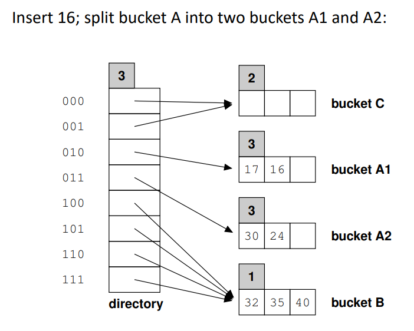
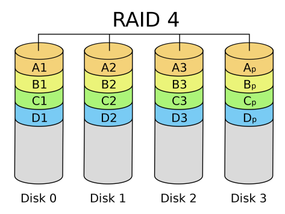
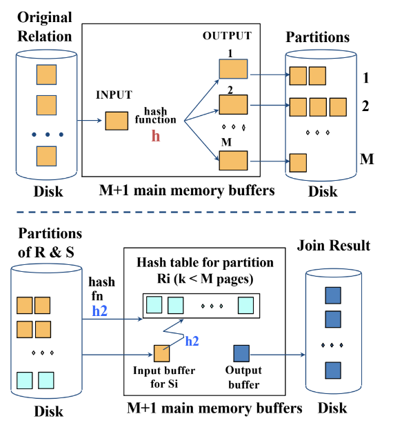

---
header-includes:
    - \newcommand{\argmin}{\mathop{\mathrm{argmin}}}
    - \newcommand{\argmax}{\mathop{\mathrm{argmax}}}
    - \usepackage{float}
    - \let\origfigure\figure
    - \let\endorigfigure\endfigure
    - \renewenvironment{figure}[1][2] {\expandafter\origfigure\expandafter[H]} {\endorigfigure}
geometry: margin=1.5cm
---

# CS346 Advanced Databases
# Storage and File Structures
* Databases ultimately rely on non-volatile disk storage
* DB accesses take anywhere from ~5-10ms, depending on data size
    * Big bottleneck for data access as data needs to be loaded from the disk into memory and then fetched from memory - CPU cannot access data on disk directly
    * In comparison, RAM accesses take nanoseconds - 5-6 orders of magnitude difference
* There are main-memory databases, but these are much more costly as they require a large amount of RAM

### Disk Anatomy:

* HDD composed of a stack of disks 
* Each disk can store data on either side
    * Read/write (R/W) head can operate on the disk above (underside) or the disk below (overside)
* Disks constantly rotate around spindle
* Disks divided into concentric tracks on each surface
    * Track capacities typically vary from 4 to 50kB or more
* A track is divided into smaller sectors (an arc of the track)

    

    * Sectors are hard-coded on the disk surface
    * Each sector is 512 bytes to a few kB
    * Uniform recording density maintained - sectors on outer tracks are narrower
* Actuator is a mechanical component that moves the R/W head across the disks
    * R/W head for all disks in the same location on each disk at the same time
    * Cylinder of tracks formed across disks
* DB data is organised in files of records, i.e. each table stored in one file
* File data blocks store these records
    * Each file data block is ~1-10kB and is stored on a disk block
* Each disk block is stored on a multiple of disk sectors

### Block Access:
* A physical disk block address consists of:
    * A cylinder number
    * A track number or surface number (within the cylinder)
    * A block num (within the track)
* R/W head moves to the track that contains the block to be transferred
    * Then wait for disk to rotate so that correct block is under R/W head
* Seek time: move R/W head to position - ~3-6ms
* Rotational delay: wait for sector to come under R/W head - ~3-5ms
* Then transfer data from disk block to memory buffer, over disk and system buses
    * Very fast - ~200MB/s

### Organising DB Data on Disks:
* Each table is stored in a file
    * Files store records of the same type (same set of fields)
    * Can be regarded as a tuple in a RDBMS table
* Records can be:
    * Fixed-length
    * Variable-length, e.g. when variable size types exist or where optional values exist for fields
* Fixed-length fields:

    

    * Wastes space, but easier to update as we never have to shift anything along
* Variable-length fields using separator characters:

    

    * Separator character marks end of variable-length field
    * Still wastes space on optional fields
* Variable-length fields using field names:

    

    * Specify field to avoid wasting space on optional fields
    * In either variable-length example, we may need to shift everything along when updating a variable-length field
* Records are stored in disk blocks, so they cannot be individually accessed
* Let records have a size of $R$ bytes and blocks have a size of $B$ bytes
    * If $R < B$, then each block stores $\lfloor \frac{B}{R} \rfloor$ records
        * With some unused space (internal fragmentation)
    * If $R > B$, or when we want to avoid wasting space at the end of a block
        * Records span blocks - spanned organisation
        * At the end of a block there is a pointer to the block storing the next part of the spanned record
* The number of records stored in blocks is called the blocking factor
    * If the blocking factor is $b$, then the $i$-th file block contains records $(i-1)b$ to $ib-1$
    * A disk block $j$ will be allocated to contain the contents of the $i$-th file block

### Allocating disk blocks to file blocks:
* Contiguous:
    * Contiguous blocks on disk are assigned to consecutive file blocks
        * If disk block $d_i$ stores 1st file block, disk block $d_{i+1}$ stores 2nd file block etc.
* Linked:
    * Each disk block $d_j$ (storing file block $f_i$) stores a pointer at its end to a disk block (anywhere on the disk) storing file block $f_{i+1}$
    * Have to go through the entire linked chain to get to the final file block - very inefficient
* Indexed:
    * An index exists
    * The index is a separate disk block, which lists for each file block $f_i$ a pointer to the disk block $d_j$ containing it (can be anywhere on the disk)
    * Updates require changing the index as well as the actual data

### Allocating records to file blocks:
* Heap Files:
    * Aka unordered files
    * New records are just added at the end of the file, i.e. at the end of the last block
* Ordered Files:
    * Aka sequential files
    * Records within the file are kept sorted based on an ordering field
        * If it is a key, the field is called the ordering key
* Hash Files:
    * A hashing function is applied to a record field (hash field or hash key if the field is a key)
    * The result of the hash function leads to the disk block containing the record
* Regardless of structure, always ask what is the cost (in terms of how many disk block accesses are needed) for:
    * Retrieving a record (according to a specific field or any field)
    * Inserting/deleting/updating a record

### Heap Files:
* Inserting a new record is efficient (as long as we know the disk allocation strategy):
    * Retrieve the last disk block (address kept at file header), put the new record at the end and write the block back to disk
* Retrieving a record is slow:
    * Linear search through all $b$ of the file's blocks
* Deleting a record is also slow:
    * Find and load the block storing the record (through linear search)
    * Remove it from the block and write it back to disk
        * Leaves unused space within blocks - wastes storage
    * Can use deletion markers instead (set a bit to 1)
        * Indicates records that have been deleted from blocks
        * Periodically, the storage space for the file is reorganised, reclaiming unused space of marked records

### Sequential Files:
* Records in a file are ordered, and then:
    * Split into blocks
    * Consecutive file blocks are typically placed into consecutive disk blocks
    * The addresses of file blocks corresponding to disk blocks is stored in the file header
* Retrieving a record, using the ordering field, first retrieves its disk block
    * Disk block can be found using binary search - complexity $O(\log_2 b)$
* Range queries are also efficient
    * 1st record in the range is retrieved using binary search
    * Contiguous blocks are then fetched until the range is exhausted
* However, retrieving records where the search field is not the ordering field is very slow
* Insertions and deletions are also expensive
    * For insertion, on average, half of the records of the file must be moved to make room for the new record
    * Same with deletion, although less of a problem if deletion markers are used
* One technique to reconcile the trade-off between read/write access is to combine sequential and unordered files
    * For each file, an ordered master file is kept, along with an overflow unordered file used for new insertions
    * Periodically the unordered overflow file is sorted and then merged with the ordered master file
    * This makes insertion much faster, as the new record is just added at the end of the overflow file
    * Retrievals are more expensive however as they may require access to the unordered overflow file as well (when the record is not found in the master file)
* Updates to the ordering field value of a record can be costly as the record must be deleted from its old position and inserted into its new position
* Not very common in DBMSs, except when the ordering field is
    * A key and
    * An index has been built on that key - primary index
        * Index is a data structure which would allow binary search to be performed during retrieval
    * Such an access strategy is called an indexed sequential file

### Hash Files:
* Hash files expedite searches which use equality predicates
* Searching within a program's space is called internal hashing
* External hashing concerns records stored on disk
    * Records stored within disk blocks
* The output of the hash function refers to:
    * A bucket number - each bucket stores a number of records
    * Each bucket corresponds to one disk block (or several contiguous disk blocks)
    * This bucket is a relative number (i.e. the $i$-th bucket of the file)
    * The file header holds a mapping between these relative bucket numbers and the disk blocks storing them
* Retrieving a record using value $v$ for its search field:
    * Hash $v$ and get the bucket number $n$ storing the record
    * Use file header to map $n$-th bucket to its disk block address
    * Fetch block from disk in memory and search within it for $v$
* Collisions still occur at the bucket level, when the bucket is full
* Typically, overflow buckets are maintained to store records inserted into full buckets
* With each bucket store a pointer to an overflow bucket (not necessary unique to that bucket) - initially NULL
    * When bucket overflows set this pointer to the address of the relevant overflow bucket and the offset within that bucket where the new record is placed
    * Overflow bucket may have a pointer to another overflow bucket and so on
    * Overflowing records are found by following pointers in their main bucket first and then the pointers of records in overflow buckets

    

* Retrieving a record is efficient only if the hash key is the search key
* Deleting a record:
    * If the record is in the main bucket:
        * Delete it from there
        * If an overflow bucket exists for the main bucket, may move a record from the overflow bucket and into the main one
    * If the record is in an overflow bucket:
        * Find it by following the links
        * Simply delete it from the linked list of overflow records
* Updating a record:
    * If we are updating a non-hash field: locate the record, load it to memory, update it and write it back to disk
    * Otherwise, it must be deleted and reinserted to a new bucket
* Issues:
    * Hash function should spread records evenly across bucket
        * Or some records in certain buckets may take a long time to find
    * Fixed number of buckets $M$ is a problem if the number of records in the file grows or shrinks
        * Hard to adjust if the number of records change
        * May end up wasting a lot of space or having excessive collisions
        * Need dynamic hashing that allows the hash table to grow and shrink

### Extendible Hashing:

* Directory of bucket addresses
    * Directory entries point to disk blocks storing records with hash values that have the same first/last $d$ bits
    * Directory size is a power of 2, $2^d$
    * Can double or halve this as needed
* Insertions into a block may cause it to overflow and split into two
    * Directory is then updated accordingly
    * Extendible hashing can grow exponentially
* If a bucket overflows, then double size of directory and split overflowing bucket into two for records with the same next most significant/least significant bit
    * For example, here the bucket storing records with hash values beginning with `01` overflowed so we have two new buckets: one for storing records with hash values beginning with `010` and the other for records with hash values beginning with `011`
    * Global depth increases by 1, and local depth for those new buckets also increases by 1

    

# 1-level Indexing
* Index structures are additional files on disk
    * Providing secondary access paths to DB data
        * Do not affect how file records are placed on the disk
    * Based on indexing fields (one of the attributes)
* Indexes expedite searching for records
    * Avoiding linear scans of the data file
* `CREATE INDEX index_name ON table_name(column_list)`
* Given a search key - a value of the index field:
    * The index is searched to identify the disk blocks storing data records with the given value for that attribute
* Indexes are typically ordered files themselves, built over ordered, unordered and hashed data files

### Ordered Indexes:
* Idea: same as an index in the back of a book
* An ordered DB index lists pairs of `<index_field_value, disk_block_pointer>`
    * Stored in order of `index_field_value` in an ordered disk file
    * Permits a binary search
* 3 types:
    * Primary index: index field is an ordering and key field of an ordered data file
    * Clustered index: index field is an ordering non-key field of an ordered data file - called a cluster file
    * Secondary index: index field can be any non-ordering field over an ordered or non-ordered data file
* There can be only one primary or clustered index - not both
* There can be several secondary indexes in addition

### Primary Index:
* Index file consists of fixed length index entries $<K_i, P_i>$
    * $K_i$ is a unique value of the index field
    * $P_i$ is a pointer to a disk block
        * Or a relative block pointer
        * Or a combination of a block pointer and a record offset within the block
* There exists one index entry per block of the data file
    * The $i$-th data block stores many different index field values
    * The index will contain an entry only for the smallest value - the anchor record of the block
    * Known as a sparse index - fewer index entries than data records

    

* The index is also an ordered file
    * Need to access index file from disk, load it to memory and then search each block
* The index file is small
    * Typically much smaller than the data file
    * Each entry only has two fields
    * Not every record is indexed
    * Accessing the index file is much more efficient than accessing a data file
* As it is an ordered file, problems with expensive record insertion and deletion exist here as well
    * Exacerbated as the index may need updating, and anchors may need to be changed

### Clustering Index:
* Used when the data file is ordered but the ordering field is a non-key, i.e. non-unique values
    * Called the clustering field
* A clustering index is an ordered file
    * Index entries are fixed length and have two fields: `<clustering_field_value, disk_block_pointer>`
* There exists one index entry per distinct value of the clustering field
    * Its pointer points to the first disk block containing data records with that value for the attribute corresponding to the clustering field
    * Therefore also a sparse index

    

* Note that the index and data file are ordered - cost for insertions and deletions
    * Could be alleviated with overflow blocks
        * Each block has a pointer to overflow blocks for that value

### Secondary Index:
* Again, an ordered file for the index
* The data file can be ordered, unordered or hashed
    * If ordered, the indexing field is not the ordering field
* The index again is an ordered list of pairs `<index_field_value, disk_block_pointer>`
* A secondary index can be built on a candidate key field - i.e. with unique values
* There exists an index entry per data record
    * A dense index

    

    * Cannot use anchor records as records for a particular value are scattered across the disk
    * Secondary index file is larger than any primary index file
        * Accessing secondary indexes takes more time than accessing primary indexes
* Can also be built on non-key attributes
    * Many data records can have the same indexing field value
    * 3 options for this case:
        1. Have duplicate index entries, one per index field value
            * Would give a dense index
        2. Have variable length index entries:
            * E.g. `<index_field_value, list_of_block_pointers>`
        3. Use an extra level of indirection
            * Index entries are of fixed length
            * Each entry is for a unique value of the indexing field
            * Each entry points to a block which stores pointers to all blocks with records of that value

            

            * Some values may be too frequent - their pointers in 2nd level cannot fit into one block. Can use overflow blocks for this
            * Retrievals - binary search - easy but may be expensive
            * Insertions and deletions - easy

# Multi-level Indexing
* Build a primary index over the index file
* The original index is referred to as the base or 1st-level index
* The additional index is referred to as the 2nd-level index
* E.g. with 2 levels:
    * Accessing the 1st level may be expensive
    * Note that the index:
        * Is ordered
        * Contains unique values
        * Is of fixed length
    * Because of these characteristics we can use anchors
    * Before, with retrieval we had to apply a binary search on the 1st-level index
    * Now, we go to the 2nd-level index
    * After this, we have as many options as the blocking factor $f$
    * The search space is divided faster than halving
    * Retrieval is $O(\log_f n)$
* If the 2nd-level index requires many disk blocks to be stored:
    * We can repeat the process, building a 3rd-level index
    * We can continue building higher-level indexes until the highest level index requires just 1 block
    * If there are $b$ blocks of the data file, blocks have size $B$ bytes and index entries have size $s$ bytes:
        * The blocking factor at any level is $f = B/s$
        * The 1st-level index will have $b$ entries (1 per block) and thus will need $b_1 = \lceil b/f \rceil$ blocks
        * So the 2nd-level index will have $b_1$ entries (1 per block of the 1st-level index) and thus will need $b_2 = \lceil b_1/f \rceil \approx b/f^2$ blocks
        * So the 3nd-level index will have $b_2$ entries (1 per block of the 2nd-level index) and thus will need $b_3 = \lceil b_2/f \rceil \approx b/f^3$ blocks
        * And so on

### Performance Speed-up:
* Formally:
    * The number of entries at level $\lambda$ will be $\approx b/f^{\lambda-1}$
    * In other words, there will be $\lambda$ levels where $\lambda = \lceil \log_f b \rceil$
* Retrievals now require visiting one block per level, i.e. $\lambda$ accesses
* Compare this to $\lceil \log_2 b \rceil$ accesses required for binary search before
    * Typically $f \gg 2$
* Insertions and deletions are still costly, since all index levels are physically ordered files
    * Hence dynamic multi-level indexes were introducd
    * B-trees and B+ trees are popular such indexes

### General notes on indexes:
* With index structures, first we pay to access the index itself and then the actual data file records
* Indexes may take up considerable space (which, if the index does not fit in memory exacerbates the above problem)
* Indexes must be updated whenever data records are updated, adding to the cost of maintaining them
* Tables typically have lots of attributes
    * Must carefully decide on which attributes to create indexes
* For many query types, only access to the index is required
    * E.g. `MIN`, `MAX`
* Ensuring some properties (e.g. uniqueness) can be done very fast if an index exists - without any data record accesses 

# Parallel I/O and Multiple Disks
### RAID:
* So far, we have assumed that the entire DB fits onto one disk
    * These days, DBs are very large and this assumption does not hold
* Even if DBs are relatively small and fit into 1 disk, DB performance hits a wall
    * Namely that of disk bandwidth
* Also, what about disk failure?
    * Guaranteed - it is just a matter of time
    * Need to increase reliability
* Employing multiple disks for a DB can thus improve:
    * Performance (access time), by harnessing the collective bandwidth of all disks
    * Reliability, by duplicating DB data across more than 1 disk
* RAID - 'Redundant Array of Inexpensive Disks'
    * Allows different levels of parallelism and data replication across disks
    * Several RAID levels - 0 to 6
        * And combinations of them
        * Difference lies in how data is placed on them and how reliability is ensured
    * Three key concepts: striping, mirroring and parity

### RAID 0:
* Striping - place consecutive blocks or bits across the disks in the RAID pack
* Bit-level striping:

    

* Block-level striping:

    

* Disks are numbered from $0$ to $M-1$
    * Bit/block $i$ goes to disk $i \mod M$
* Data accesses can proceed in parallel
    * A query accessing $M$ consecutive blocks of a table can have up to $M$ accesses in parallel, versus needing $M$ sequential disk accesses if the table was on one disk
* With just striping, there is no data replication
    * No extra reliability - if a disk goes down, all of the data stored is gone
* With any RAID configuration, it is imperative for performance reasons that the access load is as evenly spread across the disks as possible (load balancing)
    * Else the most overloaded disk would limit parallelism 

### RAID 1:

* Data is mirrored, i.e. copied
    * Each file is simply replicated
* The use of multiple disks is for reliability
    * If each disk fails with probability $p$, because disks are independent both disks will fail at the same time with probability $p^2$
    * Typically, the mean time between failures of disks is 1 in tens of years
* Performance cannot really be improved
    * Write accesses may actually be slowed down - need to write to every copy of the data
    * Read performance can maybe improve
        * Each read access may be served by any of the disks holding a copy
        * This may improve read access, as a least overloaded disk can be chosen

### RAID 4:
* Block-level striping + dedicated parity disk
* Parity is usually used to detect failures
    * Here it is used to recover from failures
    * Depends on XOR function
    * Parity block value is calculated by XORing all of the other disk block values together
    * If one block fails, XORing the parity block value with the other disk block values yields the value in the missing block
* A dedicated separate disk (Disk 3 in below figure) is employed for storing parity blocks

    

* Can tolerate the failure of any single disk
    * Reconstruct with the parity disk and the other disks
* If the parity disk fails, then no disk failures can be tolerated
* Some read accesses may be parallelised
* Write accesses cannot be parallelised as all writes need to write to the parity disk

### RAID 5:
* Most popular RAID
* Block-level striping
* Parity coding is spread across disks

    

* Tolerates the failure of only 1 disk
* In RAID 5 unlike RAID 4, there is no single point of failure and no write-disk bottleneck
* Higher than RAID 5 configs allow for more than 1 disk failure

### Intra- and Inter-Query Parallelism:
* Parallelism typically focuses on parallelising the service of one query (that accesses blocks on different disks)
* Typically, in any system there are many concurrently-executing queries
* If we try to max out parallelism for each query, then all disks will/may be used by any single query
    * All other queries will be blocked/waiting
    * The more we increase parallelism per query, the more we restrict parallelism across queries

### Parallelism across Data Servers:
* Everything can be applied to servers in a networked DB system
    * I.e. a system of data servers, each having 1 disk
    * Apply similar data placement and recovery strategies as in RAID across servers
* Can even have parallelism at 2 levels:
    * I.e. having multiple servers, each with many disks
    * Parallelism is across servers and within each server
* Big (cloud) data management rests upon these parallelism fundamentals

# Search, B and B+ Trees
### Search Trees:
* Can view multilevel index structure as a tree
    * Leaves are the data blocks
* In a search tree of order $p$, each node has the form $<P_1, K_1, P_2, K_2, ..., P_{q-1}, K_{q-1}, P_q>$ where $q \leq p$

    

    * Each $P_i$ points to another tree node (or null)
    * Each $K_i$ stores a search key value (from an ordered set)
    * Within each node $K_1 < K_2 < ... < K_{q-1}$
* For all values $X$ in a subtree pointed to by $P_i$:
    * $K_{i-1} < X \leq K_i$ for $1 < i < q$
    * If $i=1$, $X < K_1$ and if $i=q$, $K_{q-1} < X$
* Searching for a value $V$ in a search tree follows the right pointers to and within a tree node
* Search tree nodes hold pointers to data records having a key value in the node, for each key value
* Each node can be stored in a disk block
    * Tree pointers become disk block pointers
* One problem with search trees is that they can become unbalanced

### B-Trees:
* Designed to ensure balance, minimising tree depth
* Also deal with problems of insertions and deletions:
    * Values being inserted into a full tree node
    * A tree node becoming empty
* In a B-tree of order $p$, each node has the form $<P_1, (K_1, Pr_1), P_2, (K_2, Pr_2), ..., P_{q-1}, (K_{q-1}, Pr_{q-1}), P_q>$ where $q \leq p$

    

    * $Pr_i$ is a data record pointer (to disk block(s) or records holding value $K_i$)
    * Values in subtrees are the same as with search trees
* Each node has at least $\lceil \frac{p}{2} \rceil$ tree pointers
    * Root has at least $2$ pointers, unless it's the only node
* Each node with $q$ tree pointers has at most $q-1$ values (and thus data pointers)
* Leaf nodes are at the same level
    * Each leaf node has its tree pointers set to null
* Searching proceeds as with search trees
* Starting with a single node (the root), insertions cause the root to be split when it becomes full
    * Root keeps the median search value and adds 2 pointers to 2 new child nodes
        * Each child node gets half of the values that used to be in the root
    * When internal node $N$ is full and needs to be split:
        * Two new nodes are created - at the same level
        * Each will have half of $N$'s values
        * The parent of $N$ will be updated to hold now the median of $N$'s values and to point to the two new nodes
        * Splits may need to be propagated all the way up to the root
* Deletions may cause a node to have fewer than $\lceil \frac{p}{2} \rceil$ values
    * Such a node is then merged with neighbouring nodes
    * This may propagate all the way to the root

### B+ Trees:
* Internal nodes of a B+ tree hold no data record pointers
    * Only leaf nodes hold pointers to data records
* We want as a big of a fan-out as possible to achieve better performance, as the leaves are reached faster
* Internal node structure is as with search trees, but with the restrictions of B-trees
* Each leaf node as the form $<(K_1, Pr_1), (K_2, Pr_2), ..., (K_{q-1} Pr_{q-1}), P_{next}>$

    

    * $P_{next}$ is a tree pointer to the next leaf node
    * Allows for an ordered retrieval according to search field values (e.g. range queries)
* Leaf nodes are all at the same level - the tree is balanced
* Typically a different $p$ is used for leaves, $p_{leaf}$
* How to calculate the best value for $p$ and $p_{leaf}$? 
    * With every jump, we want to access one block
    * How many key+pointer pairs can we fit in one block?

### B+ Tree Search Algorithm:

### B+ Tree Insertion Algorithm:
* To insert a new search field value $K$:
    1. Call the search algorithm to find $K$
        * If $K$ is found, output an error message
    2. Call $r$ the parent of the leaf node $n$, where $K$ will be inserted
        * If $n$ is not full, insert a pair $(K, Pr_i)$ into $n$ where $Pr_i$ is a pointer to the block where the new data record was inserted
        * If $n$ is full, then it has to be split into two nodes
            * A new node $n_1$ will be created, storing the last half of search field values and record pointers from $n$
            * Update the linked list of leaf nodes to include $n_1$
            * The old node $n$ will store the first half of its previous contents. Let the maximum search field value in $n$ be $K'$
            * Parent $r$ needs to be updated to point to $n_1$, so insert the pair $(K', n_1)$ to $r$
            * If $r$ has overflowed, then repeat the above steps on $r$

### B+ Tree Deletion Algorithm:
* When a search field value $K$ is to be deleted:
    1. The leaf tree node $L$ is found and the pair $(K, Pr_i)$ is deleted from it
        * If $K$ exists in some internal node $N$, replace $K$ there with the now last value in $L$
    2. If $L$ is now less than half full (underflow):
        * Check if the left sibling of $L$ has enough entries and if so redistribute all entries among $L$ and its left sibling
        * Check if the right sibling of $L$ has enough entries and if so redistribute all entries among $L$ and its right sibling
        * Else, merge $L$ and its left and right siblings into two nodes
            * This causes a reduction in the number of leaves in the tree, and therefore an entry in the parent node will need to be deleted
            * This may cause underflow in the parent, and if this is the case repeat the above steps at the parent

### B+ Tree Variations:
* There are different variations of B+ trees using variations of insertion and deletion algorithms, w.r.t:
    * Which values from leaves are propagated up internal nodes
    * How to merge or redistribute data among sibling nodes
* Fill factors: generalising when nodes can cause an underflow
    * E.g. with a fill factor of 70%, nodes must be at least 70% full
    * Some specify different fill factors for internal and leaf nodes
* B+ trees can be constructed as both sparse and dense indexes:
    * Sparse B+ tree indexes:
        * Built on an ordered key
        * Can use anchor pointers
        * Leaf level data pointers are anchors to the 1st record of a disk block
    * Dense B+ tree indexes:
        * File is not physically sorted on that key
        * Each search key value appears in a leaf and its pointer points to a block holding record(s) with that value
* Actual physical file organisation can be based on the B+ tree
    * Leaves now store the data records
    * Allows for a physical sequential scan of data records in the file

### B+ Tree Analysis:
* Maximum number of indexed data records:
    * Assume order of the tree is $p$ and that it has $d$ levels
    * At level 2 (below the root), $p$ pointers are coming in
    * At level 3, $p^2$ pointers are coming in
    * At level 4, $p^3$ pointers are coming in
    * At the leaf level $d$, $p^{d-1}$ pointers are coming in
    * Each leaf stores up to $p-1$ pointers
    * In total: $p^{d-1}(p-1) = p^d-p^{d-1}$ pointers to data records
* Minimum number of indexed data records:
    * Say $d>1$, so the root has 2 pointers
    * Internal nodes can each store up to $\lceil \frac{p}{2} \rceil$ pointers
    * At level 2, there exist 2 nodes (and $2 \lceil \frac{p}{2} \rceil$ pointers at least are going to the next level)
    * At level 3, there exist $2 \lceil \frac{p}{2} \rceil$ nodes (and $2 \lceil \frac{p}{2} \rceil^2$ pointers at least are going to the next level)
    * At level 4, there exist $2 \lceil \frac{p}{2} \rceil^2$ nodes (and $2 \lceil \frac{p}{2} \rceil^3$ pointers at least are going to the next level)
    * At level $d-1$, there are $2 \lceil \frac{p}{2} \rceil^{d-3}$ nodes
    * At the leaf level $d$, there are $2 \lceil \frac{p}{2} \rceil^{d-2}$ pointers coming in
    * Each leaf stores at least $\lceil \frac{p}{2} \rceil - 1$ pointers to data records
    * In total: $2 \lceil \frac{p}{2} \rceil^{d-2} (\lceil \frac{p}{2} \rceil - 1)$ data records

### Bitmap Indexes:
* Suppose we are indexing attribute $A$ in table $T$
* $A$ has $m$ distinct values $V = \{A_1, ..., A_m\}$
* Table $T$ has $n$ rows $<1, ..., n>$
* For each distinct value $A_i$:
    * If row $j$ contains $A = A_i$, then the $j$-th bit is 1
    * Else it is 0
* For example, a bitmap for $A_i$ 0010100 tells us that rows 3 and 5 contain $A_i$ as the value for $A$
* One bitmap per distinct value of the attribute being  indexed is required
    * Some attributes have a great number of distinct values (NDVs)
    * Bitmap indexes are typically used for attributes with low NDVs
* Bitmap indexes facilitate easy/fast indexing appropriate for multiple attributes
    * Say we have bitmap indexes for attributes $A$ and $B$
    * Given a query for $A = A_i$ and $B = B_j$:
        * We find the bitmaps for $A_i$ and $B_j$ and bitwise AND these bitmaps to find the rows satisfying both predicates on $A$ and $B$
    * Similarly, for a query for $A = A_i$ or $B = B_j$, we bitwise OR these bitmaps
* Space analysis:
    * Bitmaps are of size $n$
        * 1 bit per row
    * We need NDV bitmaps
    * For indexing Sex, if $T$ has 1bn rows:
        * We need 1bn rows * 2 bits - very small extra overhead
* Bitmaps can be used for the leaf nodes of B+ trees
    * Typically store a pointer to a disk block for each record in a leaf along with the value of the indexed attribute
    * Some values occur much more frequently (at the leaves)
        * Instead of storing pointers to all the blocks they reside, we could maintain a bitmap
        * 1 bit instead of a pointer (typically 4 bytes)
    * Example:
        * Table has 1mn rows and 20% of them have $A = A_i$
        * The bitmap for $A_i$ needs 1mn bits = 125kB
        * Storing pointers instead would require 200k pointers (200k * 4 = 800kB)

### Goals of Physical DB Design:
* Appropriate structuring of data in storage devices
* Ensuring high performance
* Fundamentally:
    * Need to know expected workload:
        * Queries (retrievals) and transactions (updates)
        * Typical query patterns: frequent queries/updates on certain attributes, which operators are used
        * Single attribute queries vs joins
        * Which files are accessed
    * These guide the choice of access structures, field ordering, index types, etc.
        * If updates are too frequent on certain attributes then indexes become less appealing

# Big Data and Hadoop
* Always stressed with data volumes, relative to current tech capacities
    * This is not new
* We're now being inundated with terabytes being produced per day from all facets of life
* We need a paradigm shift: big data characteristics can overwhelm
    * Incremental advances of 'mature' technologies will not do

### The 5 Vs and 1 C of Big Data:
* Volume (not just vertically)
* Variety: structured, semi-structured, unstructured
    * Unstructured: text, video, audio, photo
    * Semi-structured: Wikipedia pages (text + infoboxes)
    * Structured: microformat, microdata, schema.org
* Velocity: near real-time
    * Storage, querying, analytics
* Variability: data flows (peaks and valleys)
* Veracity: is it really the 'true' data? Errors? Alterations?
* Complexity: entities, data, hierachies, links, relationships

### Why MapReduce:
* Data crunching tasks are often parallelisable
* Can use more than 1 process/thread:
    * Each processes a different section of the data
    * How should the workload be divided?
        * Time will depend on the worst performer
        * Can do clever load balancing, but need to post-process - aggregating results etc.
* Improve further by using more computers (and their cores)
    * We then have to deal with:
        * Communication costs
        * Reliability - what if processes or machines fail and don't process their part?
        * Coordination - who tells who what to do and who does pre- and post-processing?
* Hadoop manages a distributed system under the hood
    * MapReduce system framework removes this burden from the programmer
    * Programmer simply codes the processing logic and the framework does the rest

### Hadoop:
* A framework for massively-parallel access to huge volumes of data, including a:
    * Programmatic interface (MapReduce)
    * Baseline (distributed) file system (HDFS)
    * A system of systems bringing everything together
        * File systems nodes, processes of an application, applications, managing resources, scheduling requests
* The backend storage system
    * Scalable
    * Elastic
    * Random and sequential access

### MapReduce:
* A new programming paradigm
* Aims to massively parallelise access and processing of huge data volumes

    

    { width=70% }

* Within a MapReduce system framework:
    * Mapper processes: defined and assigned tasks
    * Mappers read data and emit key-value pairs
    * Emitted pairs are sent to appropriate reducers
    * Reducers aggregate info in emitted pairs and write output
* Users are provided with clients in which they code their MapReduce functions

### Backend Store:
* Alternatives:
    * (Parallel) RDBMSs
    * Distributed file systems (no database at all)
    * NoSQL systems (key-value stores, document stores, graph data stores, semi-relational stores)
        * Hadoop uses a key-value store

### Why NoSQL:
* Hadoop designed to be:
    * A swift data sink (parallel processing to crunch data)
    * Expandable - scale out
    * A batch data processor
* Great for many analytics tasks (based on data scans)
* What about random accesses? Can't really help here - use indexes
* What about real-time analytics? Again, can't really help here. Hadoop does batch jobs - come back in a few hours and see the results
* Problem with RDBMSs is scalability
    * RDBMSs were never designed for distributed systems
    * Backend machines have to cooperate (e.g. with writes have to copy between machines)

### Problems with SQL:
* Normalisation:
    * If a query needs information from more than one table, it must join them
    * Joins are very computationally expensive - scalability issues
    * NoSQL would store data in a de-normalised table
        * Don't care about repeating groups or non-atomic values
        * Sacrifice space - don't care about redundancy
        * Leave it to the application to care about the integrity of redundant information

        

        * Sparse n-d map/flexible schema/key-value store
* Consistency:
    * RDBMS view of consistency:
        * ACID - Atomicity, Consistency, Isolation, Durability
        * 'If I define a transaction with 5 operations, there will be only one outcome'
        * Very constraining
    * NoSQL view of consistency:
        * BASE - Basically Available Scalable Eventually consistent
        * Eventually the database will be consistent

### Brewer's Cap Theorem:
* Pick two of consistency, availability and partition tolerance

# The MapReduce Framework
* Two frameworks:
    * Classic (up to Hadoop 2.0), also known as MapReduce 1
    * YARN (from Hadoop 2.0), also known as MapReduce 2
* For even larger clusters (>4000 nodes)
    * MR1 has scalability issues

        

        * Everything goes through the JobTracker
        * There are many MR jobs, each with many tasks
    * MR2 was built to avoid these issues
        * Based on YARN (Yet Another Resource Negotiatior)
* MR2 in essence:
    * Avoid overburdening a single process (JobTracker) to do both:
        * System schedule: assign and engage processes to run tasks (scheduling, assignment and managing of system resources)
        * Application (tasks) progress monitoring:
            * Restarting failed/slow ones
            * Bookkeeping: maintaining counters to enable the monitoring of the progress of an MR application (e.g. bytes read/written, input/output records of mappers or reducers)
 
### Main Entities in MR2:
* Client: submits MR job
* Resource Manager (RM): a daemon that allocates/schedules cluster's compute resources to apps
    * Containers: represent compute resources with fixed memory
    * All apps run in containers (including managers)
    * Instantiates node managers
* Node Managers (NM): run per cluster node
    * Launch and monitor the node's containers, including a container for the application master
* Application Masters (AM): a per MR job daemon that:
    * Manages the job and coordinates its tasks
    * Negotiates with the RM for resources
* HDFS for MR I/O

### Running an MR Job:
1. Client creates a job object
    * Local daemon that knows who RM is
2. Job object requests application ID
3. Job resources (data and code) are copied to HDFS
    * Client generates splits (but can also be done in the cluster)
4. Application is submitted to RM
5. RM calls its scheduler, which allocates a container at some node. It then talks to the node's NM
6. The node's NM starts the AM 
7. AM gets input splits from the HDFS. It then creates a map task object per split, and creates the reducers specified by the user
    * If the job is small, tasks are ran at this node - we say the job has been uberised
    * Else, AM needs to create more containers
    * AM also creates bookkeeping objects for monitoring
8. Task assignment:
    * AM asks for containers from the RM for its mappers and reducers
    * Request is piggybacked upon heartbeats (RM uses these to confirm that each node hasn't failed)
    * Info on map and data locality (host and rack) is included so that a mapper on the same node as the split can be assigned if possible
    * At the end, the AM knows which containers to use for its map and reduce tasks and where they are located
    * In MR2, an AM can ask for each task to be allocated memory from 1GB to 10GB in increments of 1GB
9. AM asks each NM to start the container
10. A JVM is created, which runs a YarnChild
11. YarnChild gets its job resources from the HDFS
12. YarnChild then runs the task (map or reduce)

### Status Reporting during MR2 jobs:
* MR jobs can run for days
    * So much initial overhead that MR2 should only be used for large jobs
    * Users naturally want to know that progress is being made
* Status: for both the jobs and their tasks
    * Running, completed OK, failed
    * Values of built-in and user-defined counters per task/job etc.
* For tasks: % of map/reduce completed
* No node can ever know for sure if another node has failed - it can only know if it has stopped responding
    * But the node/network may just be overloaded
    * Regular heartbeats sent between nodes
* Status reporting bypasses any central node, unlike MR1
* Periodic (e.g. every 3 seconds) reporting
* AM has a global view of all job's tasks

### Failure Handling with YARN:
* Any job task, NM, AM, RM may all fail
* Could be: user code bugs (hang, crash), JVM bugs, system bugs (in AM, RM, NM), node crashes (OS failures, power outages)
* Task and job failure:
    * The task sends periodic reports to the AM
        * Hanging tasks are noticed
    * Runtime exceptions of JVM are propagated to the AM, which marks the task attempt as failed
        * A task is retried up to 4 times by default
    * A job is marked as failed if a threshold percentage of mappers or reducers have failed
        * These thresholds are also configurable
        * With a % of tasks completed successfully, may be okay/able to extrapolate final result
* AM failure:
    * MR jobs, like tasks, get a number of attempts before failing (default is 1)
    * AM sends heartbeats to the RM
    * RM will schedule another AM on another NM's container upon failure
        * By default, MR job will run from scratch
        * Possible to recover any saved state by completed tasks to avoid rerunning these tasks
        * Client will timeout when polling for status updates, and go to the RM to get the new AM address
* NM failure:
    * NM sends heartbeats to the RM
    * After a (default 10 minutes) time period, the RM marks an NM as unavailable
        * Removes the NM from the list of available nodes
    * The NM's AM and task(s) (as applicable) will be handled through mechanisms for task/job and AM failures
    * AMs can blacklist an NM if many of its tasks in this NM fail
* RM failure:
    * Serious - single point of failure
    * RM must be able to recover from saved state
        * Checkpointing and logs is required for this
    * Saved state: list of available NMs, list of applications running (AMs)
        * Note that this does not include any task state: this is the job of the AM
        * Much more lightweight logging and recovery

### MapReduce Data Flows:

### Speculative Execution:
* Raison d'etre of MR: chop a job into many small tasks and run them in parallel, reducing the job execution time
* Slow running or hanging tasks defeats this
    * Overall response time depends on the slowest runner
* Speculative execution addresses this:
    * Engaged only when a task is detected to be much slower than the others
    * A duplicate task is set running
    * When either one of the original or duplicate tasks completes, the other is killed
    * The user or cluster admin can turn this on or off
* Speculative execution is a sensitive performance optimiser
    * Aims to optimise the completion time of a job
* But, in doing so it wastes cluster resources (i.e. for task duplicates)
* This in turn reduces cluster bandwidth
    * An instance of the fundamental response time vs. throughput trade-off

# MapReduce Programming Principles
* Two key functions:
    * Map(function $f$, values $V$)
        * Applies function $f$ to each value in $V$
    * Reduce(function $f$, values $V$)
        * Aggregates all values in $V$ using a function $f$

### Map:
* Automatically partition the input data into $M$ chunks
* Ingest the next chunk (aka split or shard) from the file
* $f$ is called for each chunk
    * Each line of the chunk is parsed
* Any unnecessary data is filtered out
* Outputs (key, value) pairs:
    * The key is critical in determining which reducer will process this pair
    * The value reflects the task logic that the reducer will carry out when processing this pair
* All intermediate values with the same key are passed to the Reduce function of the reducer responsible for that key

### Reduce:
* Receive output pairs from mappers
    * Different key values lead to different reducers
* Process the values per key
* Reduce function is called for each unique key and operates on all values corresponding to that key
* Reduce work is distributed by partitioning the intermediate key space into $R$ pieces using a partitioning function (e.g. $hash(key \mod R)$)
* Values are merged together to form a smaller set of values
* Write the results to the HDFS

### Putting it together:
* Map:
    * Grab the relevant data from the source and parse into (key, value pairs)
    * Write it to an intermediate file
* Partition:
    * Identify which of $R$ reducers will handle which keys
    * Map partitions data to target each partition to one reducer based on a partitioning function
* Shuffle and sort:
    * Shuffle: fetch the relevant partition of the output from all mappers
    * Sort by keys (different mappers may have sent data with the same key)
* Reduce:
    * Input is the sorted output of mappers
    * Call the Reduce function per key with the list of values for that key to produce the results

### Example:
* Count the number of occurrences of each word in a collection of documents
* Map:
    * Parse input file line
    * Output each word and a count (1)
        * The key is the word itself
        * The value is the count of 1
* Reduce:
    * Sort all keys (words)
    * Sum for each word all its counts

# MapReduce and SQL
### SQL SELECT:
* Essentially, the mappers only emit those attributes in the SELECT clause of the SQL
* E.g. `SELECT classID, studentID, mark FROM Students`
    * Map: emit(&lt;classID, studentID, mark&gt;, &lt;classID, studentID, mark&gt;)
    * Reduce: non-needed, or simply push all the intermediate emitted pairs from mappers to HDFS

### SQL WHERE:
* E.g. `SELECT classID, studentID, mark FROM Students WHERE mark > 70`
    * Map: If mark > 70 emit(&lt;classID, studentID, mark&gt;, &lt;classID, studentID, mark&gt;)
    * Reduce: as above
* Mappers do vertical and horizontal filtering
* Additional overhead of bringing pairs to reducers only to do nothing

### SQL Aggregation Queries:
* E.g. `SELECT AVG(mark) FROM Students GROUP BY classID`
    * Map: emit(&lt;classID&gt;, &lt;mark&gt;)
    * Reduce: (classID, [mark,..., mark]), emit(classID, average([mark,..., mark]))
* For each group, there is a reducer responsible for that group
* If there is no GROUP BY, just give everything the same key

### SQL Joins:
* Reduce-side join:
    * 2-way join on attribute $B$ - n-way joins can be viewed as a series of 2-way joins
    * Feed to mappers tuples from both $R$ and $S$ (e.g. one at a time)
    * When processing an $R$ tuple $t_R$:
        * Emit($b_r,(R,t_R)$) where $b_r$ represents the value of attribute $B$ in $t_R$
    * When processing an $S$ tuple $t_S$:
        * Emit($b_s,(S,t_S)$) where $b_s$ represents the value of attribute $B$ in $t_S$
    * All tuples from $R$ and $S$ with the same value of $B$ will be sent to the same reducer
    * Reducer responsible for value $b$ receives Reduce($b,[(R,t_{R1},t_{R2},...,t_{Rn})],[(S,t_{S1},t_{S2},...,t_{Sn})]$) and outputs $\{t_{R1},t_{R2},...,t_{Rn}\} \times \{t_{S1},t_{S2},...,t_{Sn}\}$
    * Known as parallel merge sort
* Map-side join:
    * The JOIN is done while mappers are consuming data from one file (the bigger one) - say $R$
    * Preconditions:
        * $R$ and $S$ are both partitioned according to the join key in exactly the same way - say across $N$ files
        * Each file of $R$ and $S$ is sorted according to the join key also
        * At each mapper its file from $S$ is loaded into memory from the HDFS
    * Now we only need to merge each file of $S$ with each file of $R$
        * I.e. mapper 1 handles $F_1^R, F_2^R,...$ and $F_1^S, F_2^S,...$
    * All that is needed then is a sort merge from each mapper
        * Each mapper maps over $R$, and reads from memory the corresponding file from $S$ - a parallel scan
    * No need for a reducer
* Memory-backed join:
    * Suppose that $R \gg S$ and $S$ fits into memory
    * At each mapper load $S$ into memory
        * Index it in-memory based on a join key (i.e. use an associative array)
    * Each mapper reads its own file of $R$
        * For each input line, it strips the join key from the $R$ tuple, and finds any $S$ tuples having the same join key value
        * It does the joins for this value
    * This is like the RDBMS hash join algorithm
    * If $S$ does not fit into memory, split it into many files where each can fit into memory
        * Repeat the above for each $S$ split in sequence
* Comparing MR join algorithms:
    * Reduce-side is the most general, with no restricting precondition
    * Memory-backed join is typically the fastest
    * Map-side join is also faster than reduce-side join, as with reduce-side need to transmit the tuples to the reducers (shuffle and sort)

# Hadoop Distributed File System (HDFS)
### The Hadoop Ecosystem:
* Apache project with many software systems, e.g.
    * HDFS - distributed file system
    * MapReduce - distributed computation framework
    * HBase - column-oriented table service
    * Pig - dataflow language and parallel execution framework
    * Hive - data warehouse infrastructure
    * ZooKeeper - distributed coordination service

### HDFS Architectural Principles:
* Built with the UNIX ecosystem in mind:
    * A UNIX-like filesystems interface: open/close, read/write, etc.
    * UNIX-like inodes - blocks distributed across different node and index nodes find what blocks to access given the file (and bytes) that we want to access
    * UNIX-like filenames/namespace
* Separates file content data from metadata (unlike UNIX)
* Metadata is global and local (per file block)
* Two types of HDFS nodes in a cluster:
    * NameNode (NN): to store/manage global metadata
    * DataNodes (DN): to store file blocks
* Per cluster:
    * A single NN
        * Load balancing, fault tolerance, performance bottleneck? So simple that it stays out of most computations
    * Up to 1000s of DNs
    * Nodes are connected using TCP-based protocols
* Central idea:
    * Partition huge file into blocks stored across many DNs
    * Replicate blocks to several DNs (fault tolerance, availability, load balancing)
        * HDFS assumes 1 writer and multiple readers
* HDFS rides on native filesystem of cluster nodes
* HDFS architecture rests upon 3 main entities:
    * NameNode
    * DataNodes
    * HDFS clients
* Operates over a cluster of commodity nodes
    * Inexpensive but unreliable

### NameNode:
* The mastermind of HDFS
* Store global metadata such as:
    * The state of the namespace - the set of directories and their files and their hierarchical organisation
    * Access permissions
    * Modification times
    * Locations of the file blocks and their replicas
        * How many blocks and which DNs store them
        * How many replicas per block and which DNs store them

### DataNodes:
* Each HDFS block is actually two files in the native FS
    * One file for the actual contents of the HDFS file block
    * The other for the local metadata (for this block) - checksums, size,...
* Each block size is big: 128MB by default

### HDFS Clients:
* Runs in your node
* Responsible for interfacing with HDFS - open/close, read/write, delete, create
* Consists of a code library
* Intercepts such calls and interacts with HDFS to carry them out
* To clients, HDFS is a black box
    * Blocks, partitioning, replication, etc. is all hidden away

### HDFS Architecture Overview

* NameNode: maps a file to a file id and list of DataNodes
* DataNode: maps a block id to physical location(s) on disk
* SecondaryNameNode: periodic merge of transaction log 

### HDFS Key Features:
* Due to replication and partitioning:
    * Fault tolerance:
        * Only blocks of a failed node are affected and can use replicas
        * High availability: ops go on even if a fault occurs
    * Efficiency due to:
        * Locality: access replica closer to you
        * Data placement so that computations go where the data resides, avoiding expensive data transfers
        * Load balancing: spreading blocks around helps avoid performance bottlenecks
* Reliability:
    * Durability: acked data writes persist - no data loss
    * Correct behaviour even with faults:
        * No data and metadata corruption
        * Checkpointing: operation log on disk (appends-only) to recover to a correct previous state
* Partitioning and replication introduce consistency issues:
    * This has 2 dimensions:
        * Vertical: address issues from the partitioning and distribution of different blocks to different nodes
            * E.g. what happens when updating 2 blocks at different nodes and one of them is unavailable
        * Horizontal: address issues that result from need to maintain replicas for each block:
            * E.g. what happens when some copies of blocks are stale due to their node being unavailable at the last update
* Checkpointing adds time costs to sync to disks; same for durability
    * Before ops are acked, disk IO is required
        * Grouping of operations and carrying them out as a group is used to reduce the effects of this problem
* Optimised for batch processing
    * Transfers data in 128MB blocks
* Provides for high bandwidth
    * Time to access the whole file compared to the latency for accessing a small part of the file
    * As file block size increases, less time needed to access the whole file but greater latency for accessing a small part of the file
* Offers a high-level FS abstraction
    * Storage can be provided in nodes with heterogeneous OSes, using their default local FS
* Aims to support efficiently the following data access patterns:
    * Write-once-read-many: typical of large analytics tasks (all read accesses for analytics)
    * Writes are append-only - no writing in the middle of a file
        * Multiple writers are assumed away - no consistency support
    * Reads serially access most, if not all, blocks of a file
        * Efficiency for random accesses is sacrificed
        * No indexing - our workload is analytics
* New file data does not go directly to disk
    * First stored in an in-memory write buffer
* Client - NameNode interface
    * Can find the location of blocks
    * Then directly access the DataNodes
    * This is how in part performance bottlenecks are avoided - NN is not directly involved in a heavy data access

### DN-NN Communication
* On startup of DN: handshake with NN
    * Ensure correct version of SW and namespaceID
* Register after successful handshake
    * Obtain unique storageID of DN (independent of IP, port, ...)
* Block reports:
    * List of (blockID, timestamp, length) for every block in DN
* Heartbeats:
    * Periodic (every 3 seconds): tell NN that DN is alive and well
    * Piggyback storage use and capacity, etc.
* Heartbeat replies:
    * Only way for NN to communicate with DNs
    * Sends commands like: send block report, delete blocks, replicate blocks to other DNs, re-register, shutdown, etc.

### Writing to HDFS:
1. Client tells NN it plans to write to a new file
    * By creating or opening the file for append
2. NN will:
    * Create a blockID for the first new block of the file
    * Decide which DNs will host this block's replicas
3. Client receives from NN:
    * A leash (like a lock) - 1 writer many readers
    * The blockID and the DN locations it should go to
4. Client creates a pipeline of DNs, based on proximity to the client minimising total network distance to the last DN
5. Client pushes the data in packets to a local packet buffer (64kB)
    * When the buffer is full, packets are sent to the pipeline
6. Client repeats all of the above steps for each block in the file
7. Packets are sent asynchronously
    * Next packet is sent before the previous is acked
    * Application can ensure that before sending the next packet, the previous one has been received by using hflush
    * All packets written before hflush are certain to be visible to readers

* Visibility to readers:
    * Blocks written will be visible to any concurrent readers only after the file has been closed by a client, unless the client performs a hflush
* Leashes:
    * Meant to lock out other writers, not readers
        * No guarantee for read consistency
    * Comes with a soft and a hard limit
        * Other writers are locked out up to a soft limit
        * Clients can renew the leash or give it up on close (resets both limits)
        * Between soft limit and hard limit, another client can preempt the leash
        * After hard limit, NN will remove the leash and force-close the file

### Reading from HDFS:
1. Client communicates with NN to fetch:
    * List of blocks in the file
    * DN list with replicas of the files' blocks
2. Client selects a DN per block and contacts each DN directly asking for blocks
    * DN selection is based on distance: try closest replica first, then if unsuccessful go to the next closest, and so on
3. Each DN responds to the client with:
    * The local file, storing the requested block contents
    * The metadata file (including checksum)

* Reading a block from a DN may fail if:
    * The DN is down or unreachable
    * The DN block is corrupted (checksum fails)
    * The DN no longer holds a replica of the requested block

### Data Corruption Detection:
* Culprits: faults (in memory, disk, net, node crashes)
* Safeguard mechanism based on checksums
* During write, the client computes a checksum for every block and sends it along with the block to the DN
* During read:
    * The client receives both the block data and its original checksum
    * The client recomputes the checksum and check that it matches the original

### Fault Tolerance for NN:
* The NN state:
    * Image:
        * In RAM for fast reads
        * Contains the entire namespace
    * Checkpoint:
        * Persistent image (stored in local FS/disk)
        * A periodic dump of the image, completely overwriting the previous contents
        * Upon recovery/startup, the image is initialised from the checkpoint and the journal is then replayed
    * Journal:
        * A log with all modifications to the namespace
        * Also in local FS/disk
        * Is a write-ahead logging (WAL) log:
            * Any change is first written to the journal
            * Journal is flushed and synched
            * After this the change is acked to the client
* The checkpoint and the journal can be stored in multiple storage directories
    * In different volumes
    * E.g. on a remote NFS server
* The BackupNode:
    * Always in synch with NN
        * To maintain an up to date FS namespace
        * BackupNode accepts the stream of changes to the namespace from the NN and applies them to its own image in its own RAM
    * Can also create checkpoints of its image
    * Essentially a read-only NN
        * Contains all NN metadata, except file block locations
    * With BackupNode, NN can run only in RAM
        * Leave durability issues and checkpointing to BackupNode

### Cluster Topology:
* DNs are typically placed in separate racks
* Nodes in the same rack are closer than nodes in separate racks
    * Greater bandwidth
* Same-rack nodes share a switch - the rack switch
* Rack switches are connected by one or more core switches
* Node communication may need to go through several switches
    * Distance is defined as a function of this
* NN resolves the rack ID of every DN

### Block Placement Protocol:
* Place a copy in the local writer node
* Place a 2nd and 3rd copy in different nodes in another rack
    * 2 racks used to reduce write costs (i.e. access only 2 racks, not 3) while also providing reliability against rack failures
    * However, read bandwidth is reduced
* Any more copies are placed at random nodes

### Replica Management:
* Default replication factor: 3
    * User-configurable
* NN tries to enforce this:
    * Detects under- and over-replication from DN block reports
        * If all nodes fail, NN instructs DNs to make more replicas
            * A priority list for such blocks, based on number of replicas
            * Uses same strategy as block placement protocol
        * Instructs DNs to remove a replica upon detecting over-replication
            * Chooses DNs so that the number of racks is not reduced
* Strives to:
    * Avoid any single DN having >1 replica
    * Avoid any rack having >2 replicas (if possible)

### NN Balancer:
* For disk space usage
    * Goal: uniform distribution of HDFS size to disks/DNs
* Runs when new DNs are added
    * Cluster works as usual even when balancer is running
    * Avoid running balancer when there's too much traffic in the network
    * Typically run by cluster admin from the command line
    * Has some smarts:
        * When moving block replica from DN1 to DN2 in a different rack, it checks if there is already a replica of the same block in the same rack as DN2
        * If so, it uses intra-rack copying

### What HDFS does not do:
* Transactional data (i.e. consistent concurrent reads/writes)
* Structured data (e.g. record-oriented views, columns)
* Relational table data support (e.g. indexes)
* NoSQL is better suited for these

# Transactions
* A transaction is a logical unit of computation invented to deal with problems caused by two fundamental issues:
    * Failures (disks, nodes in a distributed system)
    * Concurrency (many users reading and/or writing shared data)
* A transaction consists of a series of read or write operations
* Correctness:
    * The concurrency dimension (e.g. don't sell the same item to two different people, do not overdraw from the same account when two people are accessing it)
    * The fault tolerance dimension (e.g. transferring money from one account to another when failure occurs in between withdrawing from one account and depositing in another)
* The database system needs to define and ensure correctness in the presence of concurrency and failures
    * And then come up with mechanisms that will always ensure this
* Database: collection of data items, referring to:
    * A higher level item: a single disk block or whole file
    * A lower level item: individual field of a record
* Each data item has a unique identifier used internally
    * E.g. disk block address
* Interleaved processing - operations within a thread/process CPU
* Parallel processing - operations across CPUs

### Basic Data Operations:
* `Read(X)`: read the item named `X` from the DB into local memory of the transaction
* `Write(X)`: write the item named `X` from local memory to the DB state
* These cover the various substeps of data access:
    * Map `X` to the relevant disk block containing `X`
    * Move data to/from disk via OS calls and buffers, etc.
    * Manage cache memory to speed up operations
* A transaction may have several other local computations
    * E.g. updating values for an item `X`
    * These are seen by other transactions only after a `write(X)` operation is executed by the transaction
* Read/write set: the set of items read/written by a transaction
* All operations of a transaction must complete successfully
    * Part execution is not allowed
* Need concurrency control and recovery

### Concurrency Issues:
* A lot of things can go wrong
* Fundamental issue:
    * Executing transactions serially avoid all problems - desirable for consistency
    * But, serial execution is bad for performance so concurrency is desirable
* Lost update:
    * When two transactions are interleaved

    

    * If $T_1$ and $T_2$ are run as above: the update to $X$ from $T_1$ is lost
* Temporary update (dirty read):

    

    * Suppose a transaction fails after having changed values
        * If transaction $T_1$ fails, it is rolled back to the previous state - $X$ gets back its original value
        * Meanwhile, another transaction may have read the intermediate value of $X$ - dirty data that has not been committed
* Incorrect summary/aggregation:

    

    * Suppose transaction $T_3$ computes an aggregate while $T_1$ updates
    * Possible to generate a result that doesn't correspond to the correct one before or after
* Unrepeatable read:
    * Concurrency can cause problems even for a read-only transaction
        * Suppose a transaction $T_1$ reads item $X$ twice at different times $t_1$ and $t_2$, and does not update $X$ in between
            * So, if executed in isolation, $T_1$ would read the same value for $X$
        * Suppose another transaction $T_2$ updates the value of $X$ between times $t_1$ and $t_2$
            * Transaction $T_1$ sees different values for the same item

### Transaction Recovery:
* Transactions are atomic
    * 'All or nothing' - never partially executed
    * A transaction either completes successfully (and correctly): commit
    * Or has no effect on the database and other transactions: abort
* If a transaction fails after some operations, it must be undone (rolled back)

### Reasons for Transaction Failure:
* Computer failure: disk error, memory read error, crash
* Transaction/system error: divide by zero, negative overflow
    * May also have out-of-bounds parameters, program bug
* Local errors or exceptions during the transaction
    * E.g. can't find the referenced item
* Concurrency control enforcement
    * System may decide to abort a transaction to ensure correctness
    * May need to abort to resolve deadlock between transactions
* Disk failure: data on disk is corrupted
* Physical problems: fire, theft, flood,...

### Transaction States:
* To ensure transaction atomicity, the system needs to track the state
    * The recovery manager needs to keep track of each operation
    * Ensure that there's enough information to recover state
* Transactions can be in one of a number of states:
    * Active state: after starting, now reading and writing
    * Partially committed state: after it has finished all of its read/writes
        * From this point forward, the system must guarantee that a failure would still leave the data in a consistent state, or abort the transaction
    * Committed state: transaction is completed, a commit point is made
    * Failed state: if a check fails or the transaction is aborted
        * May have to rollback any writes
    * Terminated state: the transaction leaves the system

    

### System Recovery Log:
* To recover from transaction failures
    * Track all transaction operations that affect the database
    * Much like the journal from HDFS
* The system log is a sequential, append-only file kept on disk
    * More likely to survive system failure/crash (relative to RAM)
    * Two disks may also be used, each being a copy of the log
* Transaction updates are written in a memory buffer
    * When buffers are full they are written to disk
    * At commit point buffers must be flushed to disk
    * Periodically back up the log to archival storage
* The log consists of a sequence of log records:
    * `[start_transaction, T]`: `T` is a unique transaction ID
    * `[write, T, X, old_value, new_value]`
    * `[read, T, X]`
        * Read entry (not strictly needed for rollback)
        * May be included for other purposes, e.g. auditing
    * `[commit, T]`: `T` has successfully completed and committed
    * `[abort, T]`

### Failure Recovery:
* Need to either undo or redo operations
* Undo: undo each WRITE operation using `old_value`
* Redo: repeat each WRITE operation using `new_value`
    * Ensures that all operations have been applied successfully
* The commit point marks the 'point of no return' for transactions
    * If:
        * All operations in `T` have been executed successfully
        * The effect of all operations is recorded in the log
    * Write a `[commit, T]` record
    * Once this record is acked, this is the commit point
* If a failure occurs, examine the log and:
    * Find all transactions `T` that have started but not committed - i.e. no commit record
        * Rollback their associated operations
    * Find transactions `T` that have committed
        * Their updates may have not made it to disk, so redo some transactions to ensure correctness

### Memory Buffer, Log and Checkpoints:
* For every write operation by a transaction `T` on `X`:
    * Put the new `X` value in the memory buffer
    * Write `[write, T, X, old_value, new_value]` in the log
* Periodically flush the memory buffer to disk (into a 'checkpoint' file)
* At any given point in time, we may have:
    1. Transactions that have committed whose updates are not all in the DB state (in disk)
    2. Transactions that abort (after the last flush of the memory buffer to disk) and some of their updates are in the DB state
* For case 1, need to redo and for case 2, need to undo

### ACID Properties of Transactions:
* Atomicity: a transaction is an atomic unit of processing
    * It is either performed completely, or not at all
    * Controlled by the transaction recovery subsystem of the DBMS
* Consistency: transactions should preserve database consistency
    * If a transaction is done fully, it should keep the DB in a consistent state
    * Each transaction moves the DB from one consistent state to another
* Isolation: effect should be independent of other transactions
    * It should be as if it is the only transaction executing
    * Enforced by the concurrency control subsystem
* Durability: changes made must persist in the database
    * Changes made should not be lost by any failure
    * Enforced by the transaction recovery subsystem

### Schedules:
* An actual order of execution of operations is called the schedule
* Schedule $S$ shows an ordering of the operations of $n$ transactions $T_1,T_2,...,T_n$
    * $S$ is a total order: for any two operations, one is before the other
    * Operations from different transactions can be interleaved
    * Operations from the same transaction must be in order
* Notation: $b,r,w,e,c,a$ for begin, read, write, end, commit, abort
    * When writing schedules, we omit begin and end for clarity
* Use transaction ID (number) as a subscript for each operation
    * $S = r_1(X); r_2(X); w_1(X); r_1(Y); w_2(X); w_1(Y)$
* The main concern is the interleaving of read and write operations:
    * Two operations in a schedule conflict if:
        * They belong to different transactions
        * They access at least one same item $X$
        * At least one operation is a $w(X)$
    * When operations conflict, swapping them results in a different outcome

### Recoverability of Schedules:
* Recoverable schedule: once $T$ is committed, we never have to undo $T$
    * Non-recoverable schedules should not be allowed by a DBMS
    * Helps ensure the durability property
* Some schedules are easy to recover, and some are not
* We say $T_1$ reads-from $T_2$ if there is a schedule $S$ which contains:
    * $...;w_2(X);....;r_1(X)$ and no other transaction writes $X$ before $r_1(X)$
* If $T_1$ reads-from $T_2$ and later $T_2$ aborts then $T_1$ must abort as well
    * Dirty read
    * The system should not let $T_1$ commit until all transactions from which $T_1$ has read-from are committed
* A schedule $S$ that respects the above for all transactions and data items is called recoverable
* The following schedule $r_1(X);w_1(X);r_2(X);r_1(Y);w_2(X);c_2;w_1(Y);a_1$ is not recoverable
    * $T_2$ reads-from $T_1$ but commits before $T_1$ does
    * Postpone the commit $c_2$: $r_1(X);w_1(X);r_2(X);r_1(Y);w_2(X);w_1(Y);c_1;c_2$
    * Abort both: $r_1(X);w_1(X);r_2(X);r_1(Y);w_2(X);a_1;a_2$
        * Aborts are a waste of time and resources
* Cascading aborts:
    * Consider the schedule $w_1(X);r_2(X);c_2;a_1$
        * Delay the completion of $T_2$: $w_1(X);r_2(X);c_1;c_2$
    * But: $T_2$ aborts if $T_1$ aborts
    * If there exists a $T_3$ that reads-from $T_2$ then $T_3$ needs to abort as well
    * There can be a chain of aborts (still recoverable but costly)
        * This phenomenom is called cascading aborts
        * Can be avoided by reading only committed data (cascadeless)

### Strictness of Schedules:
* In strict schedules, write/read only committed data
    * Don't read or write $X$ until the last transaction to write $X$ commits
    * The most restrictive type
* Simple to undo writes - just restore the old value of $X$
    * If not strict, undoing write of aborted transaction is not enough
    * Need to search for others in cascading chain

### Relation between concepts
* Ordering: Strict $\implies$ Cascadeless $\implies$ Recoverable
* Strict: dont read or write `X` after `T` has written `X`, until `T` commits
* Cascadeless: transactions only read from committed transactions
* Recoverable: transactions commit only after transactions they have read from
commit

### Serialisability:
* Serialisability is concerned with isolation
* Consider two transactions $T_1$ and $T_2$ submitted at the same time
    * Either do $T_1$ entirely, before $T_2$, or vice-versa
    * Not great - hurts performance
* A schedule $S$ is serial if for every transaction $T$ in $S$, all operations in $T$ are executed sequentially (with no interleaving from other transactions' operations)
    * Ensures correctness as each transaction is consistent
* If transactions are independent, every serial schedule is correct
    * Accept schedules that are equivalent to serial ones with respect to their effect on the database
* A serialisable schedule is equivalent to a serial one
    * Our definition of correctness
* Conflict equivalent is the most commonly used definition of equivalence
    * The order of any two conflicting operations is the same in both
* $S$ is conflict serialisable if it is equivalent to some serial schedule $S'$
    * The non-conflicting operations can be reordered to make $S'$
* For example, consider the following transactions $T_1$ and $T_2$:

    

    * The schedule $r_1(x);r_2(x);w_1(x);w_2(y)$ is equivalent to the serial execution $T_2T_1$
* To test for conflict serialisability, create a serialisation graph of the read and write operations:
    * A directed graph with nodes $T_1,...,T_n$
    * A directed edge $(T_i,T_j)$ if an operation in $T_i$ precedes a conflicting operation in $T_j$ 
    * $S$ is serialisable iff its serialisation graph has no cycles

    

* Instead of checking serialisability, we want to guarantee it by following some protocols in the design of schedules
    * Interleaving of concurrent operations is controlled by the OS
    * Most common technique is two-phase locking (2PL)

### Locking:
* Associate a lock with each data item
    * The lock will guard access to its item
    * If a transaction $T$ wants to read or write to `X` it will ask for `lock(X)`
    * Only the transaction holding the lock can access the item
    * Locking and unlocking must be indivisible actions
        * Cannot be preempted
        * Implemented with a simple bit per item, plus record of lock holder
    * Rely on a lock manager to moderate access
        * Maintains a lock table showing which items are locked and by which transaction
* A binary lock (mutex) on `X` enforces mutual exclusion on `X`
    * Two states: locked (1) and unlocked (0)
    * `lock(X)` gives the current state of the lock for item `X`
    * If `lock(X)=0`, the item can be accessed on request (`lock_item(X)`)
    * `lock(X)` is then set to 1 to indicate that it is locked
    * If `lock(X)=1` then it cannot be accessed by any other transaction
        * Must wait for the lock to be released, `unlock_item(X)` sets `lock(X)=0`
* For a lock to be effective, the following rules must be enforced by the lock manager:
    * A transaction $T$ must hold `lock(X)` before any read or write to `X`
    * $T$ must `unlock_item(X)` after it is done reading/writing `X`
    * $T$ should not request `lock(X)` if it already holds it (causes a self-deadlock)
    * $T$ cannot `unlock_item(X)` if it doesn't already hold the lock on `X`
* Binary locks can be too restrictive - only one transaction can access the data item at a time. Can instead use shared/exclusive locks:
    * Can allow multiple transactions access to `X` if they only read it
    * Still only one transaction can access to `X` if it will write to it
    * Three states: read-locked, write-locked, unlocked
    * Operations: `read_lock(X)`, `write_lock(X)`, `unlock(X)`
* $rl_i(X)$, $ru_i(X)$, $wl_i(X)$, $wu_i(X)$ denote lock/unlock operations by transaction $T_i$
* Locks alone do not guarantee serialisability - still possible to have a schedule that, once the lock operations are removed, would cause a loop in its serialisation graph

### Two-phase Locking (2PL):
* A transaction follows two-phase locking (2PL) if all lock operations precede the first unlock operation in the transaction
    * Two separate phases: growing phase (lock acquiring) and shrinking phase (lock releasing)
* 2PL Theorem: if all the transactions in a schedule are two-phase locked, then the schedule is serialisable
    * 2PL may limit the level of concurrency achievable
        * A transaction $T$ can't release a lock if it needs a lock later - it must lock an item long before it is needed, locking out other transactions for much longer times
    * It also does not permit all possible serialisable schedules
        * Example: $w_1(x);w_3(x);w_2(y);w_1(y)$ cannot be a 2PL schedule
         1. Lock by $T_1$ for $y$ must occur after $w_2(y)$
         2. The unlock by $T_1$ for $x$ must also occur after $w_2(y)$
         3. $w_3(x)$ cannot occur because $T_1$ holds the lock for $x$ at that point
        * The schedule is serialisable (equivalent to $T_2T_1T_3$)
* 2PL does not guarantee recoverability
    * Example: $wl_1(x);w_1(x);wu_1(x);rl_2(x);r_2(x);ru_2(x);c_2;...c_1$ is 2PL but not recoverable since $T_2$ reads from $T_1$ but commits before it
        * It also allows cascading aborts and is not strict

### Locking and Deadlocks:
* Consider the following schedule: $w_1(X);r_2(X);w_2(Y);r_3(Y);w_3(Z);w_1(Z)$
    * $T_2$ must wait for $T_1$, $T_3$ must wait for $T_2$ and $T_1$ must wait for $T_3$
    * A cycle of wait-form relationships between transactions is a deadlock

        

    * However, this is not a 2PL schedule as $w_1(Z)$ cannot happen after $r_2(X)$
        * Not even serialisable
* Consider the transactions $T_1$: $w_1(X);w_1(Y)$ and $T_2$: $w_2(Y);w_2(X)$ and the following sequence of events

    

    * At this point, $T_1$ and $T_2$ cannot release any locks in 2PL
    * $T_1$ is blocked on $wl_1(Y)$ and $T_2$ is blocked on $wl_2(X)$ - deadlock
* Deadlocks are typically broken by aborting a transaction that is involved in a deadlock chain
    * Typically a system maintains a wait-for graph for its transactions' operations and detects deadlocks by detecting cycles in the graph
    * To choose which transaction to abort:
        * How far along is the transaction (abort younger first)
        * Avoid starvation (don't always abort the same transaction)
        * Number of cycles broken by aborting a transaction (when one transaction is involved in multiple deadlocks)

### Strict 2PL:
* Hold write locks until after commit
    * Prevents other transactions from reading/writing uncommitted data
* Guarantees strictness, avoids cascading aborts and is recoverable
* $T_1$ must commit before its first unlock-write $wu_1$

### Conservative 2PL:
* $T$ locks all of the items it needs before it begins execution
    * Pre-declares its read-set and write-set
* If any of the predeclared items cannot be locked, $T$ does not lock any item and waits until all of the items are available for locking
* No deadlocks
* Too restrictive:
    * Not many transactions know their read- and write-sets when they start
    * Limits concurrency significantly, especially for long-running transactions

# Query Processing and Optimisation
* Typically many different ways to get the desired results of an SQL query
* Example: how to find the maximum value of an attribute:
    * Simple approach: just scan through all records
    * Smart approach: use an index (if it exists) to jump to the end and find the maximum value
* Gets more involved when more factors are in play:
    * Multiple index
    * Nested queries
    * Joins
* A query plan is the sequence of operations to answer a query
    * Want to choose a good query plan
    * Not necessarily the best query plan - may take too long to find

### Query Representation - SQL and Algebra:
* Queries are highly structured - basic structures repeated at multiple levels
    * Break SQL query into query blocks
    * A query block contains a single `SELECT-FROM-WHERE` expression
    * Optionally may include `GROUP BY` and `HAVING` clauses
* Nested queries are parsed into separate query blocks
* Convert into relational algebra

### Query Trees:
* Example query:
    * `SELECT P.Pnumber, P.Dnum, E.Lname, E.Address, E.Bdate FROM PROJECT P, DEPARTMENT D, EMPLOYEE E WHERE P.Dnum = D.Dnumber AND D.Mgr_ssn = E.Ssn AND P.Plocation = 'Stafford';`

    { width=70% }

* Representing a relational algebra expression as a tree structure
    * Input relations are leaf nodes
    * Internal nodes are relational operations
    * Execution proceeds bottom-up - result is the root
* Observation: cross products are expensive, do projection on individual relations and then join on a specific column
    * Doesn't matter in which order projections and joins are done
* Query trees impose a partial ordering on operations
    * A node's children must be evaluated before the node
* One query can correspond to many relational algebra expressions, and so there may be many different query trees for the same query
    * Query optimisation goal: pick a tree that is efficient to execute
    * Start with an initial, often very inefficient tree derived from the SQL query
    * Query optimiser will use equivalence rules to transform trees

### Transformation Rules:
1. Cascade of $\sigma$: conjunction of selections can be broken up
    * $\sigma_{c_1 \mathrm{AND} c_2 \mathrm{AND} ... \mathrm{AND} c_n}(R) \equiv \sigma_{c_1}(\sigma_{c_2}(...\sigma_{c_n}(R))...)$
2. The $\sigma$ operation is commutative (follows from previous)
    * $\sigma_{c_1}(\sigma_{c_2}(R)) \equiv \sigma_{c_2}(\sigma_{c_1}(R))$
3. Cascade of $\pi$: can ignore all but the final projection
    * $\pi_{L_1}(\pi_{L_2}(...\pi_{L_n}(R))) \equiv \pi_{L_1}(R)$
4. Commuting $\sigma$ with $\pi$: if selection only involves attributes in the projection list, can swap
    * $\pi_{A_1, A_2, ..., A_n}(\sigma_c(R)) \equiv \sigma_c(\pi_{A_1, A_2, ..., A_n}(R))$
5. Commutativity of $\bowtie$ (and $\times$)
    * $R \bowtie_c S \equiv S \bowtie_c R$ and $R \times S \equiv S \times R$
6. Commuting $\sigma$ with $\bowtie$ (or $\times$)
    * If all attributes in selection condition $c$ are in only one relation, say $R$, then $\sigma_c(R \bowtie S) \equiv (\sigma_c(R)) \bowtie S$
    * If $c$ can be written as $c_1 \mathrm{AND} c_2$ where $c_1$ is only on $R$ and $c_2$ is only on $S$, then $\sigma_c(R \bowtie S) \equiv (\sigma_{c_1}(R)) \bowtie (\sigma_{c_2}(S))$
7. Commuting $\pi$ with $\bowtie$ ($\times$)
    * Write projection list $L=\{A_1,...,A_n,B_1,...,B_n\}$ where all the $A$'s are attributes of $R$ and all the $B$'s are attributes of $S$
    * If the join condition $c$ involves only attributes in $L$, then $\pi_L(R \bowtie_c S) \equiv (\pi_{A_1,...,A_n}(R)) \bowtie_c (\pi_{B_1,...,B_n}(S))$
    * Can also allow join on attributes not in $L$ with an extra projection
8. Commutativity of set operations
    * $\cup$ and $\cap$ are commutative, $\setminus$ is not
9. Associativity of $\bowtie$, $\times$, $\cup$, $\cap$
    * These operations are individually associative
    * $(R \space \theta \space S) \space \theta \space T \equiv R \space \theta \space (S \space \theta \space T)$
10. Commuting $\sigma$ with set operations
    * $\sigma$ commutes with $\cup$, $\cap$ and $\setminus$: $\sigma_c(R \space \theta \space S) \equiv (\sigma_c(R)) \space \theta \space (\sigma_c(S))$
11. $\pi$ commutes with $\cup$
    * $\pi_L(R \cup S) \equiv (\pi_L(R)) \cup (\pi_L(S))$
12. Converting a $(\sigma, \times)$ sequence into a $\bowtie$
    * If the condition $c$ of selection $\sigma$ following a $\times$ corresponds to a join condition, then $(\sigma_c(R \times S)) \equiv R \bowtie_c S$
13. Other rules from arithmetic and logic can be applied, e.g. De Morgan's Laws
    * $\mathrm{NOT}(c_1 \mathrm{AND} c_2) \equiv (\mathrm{NOT} c_1) \mathrm{OR} (\mathrm{NOT} c_2)$
    * $\mathrm{NOT}(c_1 \mathrm{OR} c_2) \equiv (\mathrm{NOT} c_1) \mathrm{AND} (\mathrm{NOT} c_2)$

### Algebraic Optimisation:
1. Using rule 1, break up selections with ANDs into a cascade
    * Makes it easier to move them around the tree
2. Use rules 2, 6 and 10 to move selections as far down as possible, and minimise projections as much as possible
    * Apply most filtering selection first
    * First do selections, then joins and expensive set operations
3. Use rules 5 and 9:
    * Arrange that leaf operations with the most restrictive selection are first
    * Use selectivity estimates (i.e. the size of the relation that is the result of an operation) to determine this
    * Avoid creating Cartesian products
4. Use rules 3, 4, 7 and 11 to push projections as far down the tree as possible, creating new projection operations if needed
    * Only attributes needed higher up the tree should remain
5. Use rule 12 to turn a Cartesian product and a selection into a join

In summary:

* Apply first the operations that reduce the size of intermediate results
    * Perform selection and projection operations as early as possible to reduce the number of tuples and attributes
    * The selection and join operations that are the most restrictive should be executed before other similar operations

### Query Transformation Example:
* `SELECT E.Lname FROM EMPLOYEE E, WORKS_ON W, PROJECT P WHERE P.Pname = 'Aquarius' AND P.Pnumber = W.Pno AND E.Essn = W.Ssn AND E.Bdate > '1957-12-31';`
* Initial query tree:

    { width=60% }

* Moving selection operations down the tree:

    { width=60% }

* Applying the more restrictive selection operation first

    { width=60% }

* Replacing Cartesian products and selections with join operations

    { width=60% }

* Moving project operations down the query tree

    { width=60% }

### Cost-based Query Optimisation:
* Assigns costs to different strategies (based on number of disk I/Os)
    * Aims to pick the strategy with the lowest estimated cost
    * Sits in place of or in addition to heuristic query optimisation
* Can sometimes be time-consuming to compare costs
    * Better suited to queries that are compiled (to run multiple times)
    * Does not guarantee finding the optimal strategy
        * Not time-effective to consider every possible strategy
    * Poor estimates of costs could pick a suboptimal strategy
    * Need cost functions to assign a high-quality cost approximation to each operation
* Divide-and-conquer: break the problem into standard pieces
    * Define different ways to implement each relational operator: selection, projection, join
    * Choose how to combine these based on estimated costs
    * The set of choices form the query plan
* Start with a more basic primitive: sorting
    * Many operators can be done more efficiently if the input is sorted(order by, group by, join, distinct)

### External Sorting:
* How do we sort data files larger than memory?
* External sorting algorithms:
    * External - data resides outside memory
    * Typically follow a 'sort-merge' strategy
        * Sort pieces of the file, merge these together to get the final result
        * Sort blocks as large as possible in memory
    * External memory model: measure cost as number of disk accesses
        * In-memory operations are treated as effectively free (in contrast to RAM model)
* Sort-merge algorithm:
    * Parameters:
        * $b$: number of blocks in the file to be sorted
        * $n_B$: available buffer (memory) space (measured in blocks)
        * $n_R = \lceil \frac{b}{n_B} \rceil$: number of runs (pieces) of the file produced
    * Sort phase:
        * Repeat for each run:
            * Load run in memory
            * Sort is using an internal sorting algorithm
            * Write sorted run to disk
    * Merge phase:
        * Consists of a number of merge passes, each having one or more merge steps
        * A single merge step merges $d_M$ sorted subfiles together
            * $d_M$ called the degree of merging
        * It needs one block of RAM for each of the subfiles being merged, plus a buffer to hold the result of this merging step
            * $d_M = \min(n_B-1,n_R)$
        * The number of merge passes needed is $\lceil \log_{d_M}(n_R) \rceil$
    * Performance:
        * Total cost = cost of sort phase + cost of merge phase(s)
        * Cost of sort phase:
            * Each record of the file must be read into memory once for the sorting to happen, and written out to disk (When writing out each sorted run)
            * So cost is $2b$
        * Cost of merge phase:
            * Again, each record is read and written once per merge pass
            * So cost is $\lceil \log_{d_M}(n_R) \rceil \cdot 2b$
        * So overall cost: $2b + \lceil \log_{d_M}(n_R) \rceil \cdot 2b$  

# Algorithms for Selection
### Selection Operation (Basic Conditions):
1. Linear search:
    * Retrieve every record in the file
    * Test whether the attribute values satisfy the selection condition
2. Binary search:
    * If the selection condition involves an equality comparison on a key attribute on which the file is ordered, can use binary search
3. Use a primary index or hash key to retrieve one record:
    * If the selection condition has an equality comparison on a key attribute with a primary index (or a hash key), use it to retrieve the record
4. Use a primary index to retrieve multiple records:
    * If the comparison condition is a non-equality relational operator on a field with the primary index, use the index to find record satisfying the corresponding equality condition
    * Then retrieve all subsequent records in the ordered file
5. Use a clustering index to retrieve multiple records:
    * If the selection condition involves an equality comparison on a non-key attribute with a clustering index, use the index to retrieve records satisfying the condition
6. Using a secondary (B+ tree) index:
    * If the indexing field is a candidate key, use the index to retrieve the match
    * Retrieve multiple records if the indexing field is not a key
    * Can also use index to retrieve records on conditions with other relational operators
7. Conjunctive selection:
    * If an attribute in any part of the condition has an access path allowing conditions 1-6, use that condition to retrieve the records and check if each record satisfies the whole condition
8. Conjunctive selection using a composite index:
    * If two or more attributes are involved in equality conditions and a composite index (or hash structure) exists on the combined field, can use it directly
9. Conjunctive selection using intersecting record pointers:
    * If there are secondary indexes on all (or some) fields involved in equality comparison conditions in the conjunctive condition, each index can be used to retrieve the record pointers that satisfy each individual condition
    * Intersecting these pointers gives the pointers that satisfy the conjunctive condition, which can then be retrieved
    * If only some conditions have secondary indexes, test each retrieved record against the full condition
10. Disjunctive selection:
    * If an access path exists for all of the attributes, then use each to retrieve the set of records satisfying one condition and union all sets to obtain the final result
    * If any of the attributes involved do not have an access path, then a linear search of the file is unavoidable
   
### Choosing a method:
* Easy case: single selection condition
    * Either there exists an easy access path - use it
    * Or not - linear scan
* Harder case: conjunctive selection condition
    * If only one attribute has an access path, use it
    * If more than one access path, pick the method yielding the fewest records
        * How do we know which this is without actually trying each of them? DBMS Catalog may help!

### DBMS Catalog:
* The number of records $r$
* The 'width' of the relation (size of each record) $R$
* The number of blocks $b$
* The block capacity (blocking factor) $b_{fr}$
* For each attribute $A$:
    * The number of distinct values $d$
    * The maximum and minimum values
* Selectivity estimation - average attribute selectivity for an equality condition $s_l$
    * Selectivity of a condition is the fraction of records that satisfy it
        * 0 selectivity - none satisfy the condition
        * 1 selectivity - every record satisifies it
    * DBMS estimates selectivity of each part of a condition
        * Equality on a key attribute - at most one record can match
        * Equality on a non-key attribute with $d$ distinct values - assume $\frac{1}{d}$ records match (uniformity assumption)
        * Range query for a fraction $f$ of possible values - assume selectivity $f$
    * Pick method retrieving least records based on estimated selectivity
    * Much work on estimating selectivity based on samples, histograms, machine learning...
* Information stored about each index:
    * Number of levels in each multi-level index $x$
    * Number of index blocks in the first-level index $b_{I1}$
* Information about the tables and types of fields within the tables
* File organisation: unordered, ordered, hashed
* Stored as a database itself, and can be queried

# Algorithms for Join
* A costly operation to perform
* Most examples of joins are equijoins (or natural joins)
* $N$-way joins can be processed two-at-a-time, so need to focus on 2-way joins
* Four well known strategies for join processing, depending on whether:
    * There exists an access path (e.g. indexes) on join attributes
    * Some structure will be constructed (e.g. hash)
    * There exists some physical ordering of associated files

### Naive Algorithm:
* For computing the join $R \bowtie_{A=B} S$:
    1. Compute the Cartesian product of $R$ and $S$
        * Store the result in a file $T$, consisting of tuples $<r,s>$ where $r \in R$ and $s \in S$
    2. Scan a record at a time, $<r,s>$ and check if $r.A=s.B$
        * If so, add $<r,s>$ to the result
* This is very inefficient - typically join result is a small subset of the Cartesian product

### Nested-Loops Join:
* Requires no access paths - works in a brute-force style
    * For each record $r$ from $R$ (outer table):
        * For each record $s$ from $S$ (inner table):
            * Check if $r.A=s.B$ 
            * If so, put $<r,s>$ in the result file
* Individual records are not retrieved - blocks are
    * In reality the nested loop is over disk blocks, which are fetched before their records are accessed
    * Block-nested loops join reduces the number of scans over $S$
* Block Nested-Loops Join:
    * Suppose $|R|<|S|$ (have smaller table as outer table)
    * Use:
        * One input buffer (block) for scanning tuples of the inner table $S$
        * One output buffer
        * All remaining memory pages to hold blocks of the outer table $R$
    * Repeat: 
        * Read the next set of $R$-blocks into memory pages
        * Scan the whole of $S$ by reading into the memory buffer one block at a time
        * For each matching tuple $<r,s>$, add it to the result file
* Implementation of block nested-loops join:
    * $R$-tuples are loaded into pages of memory and hashed using the join-attribute value
    * $S$-tuples are loaded into memory pages 
        * For each $S$-tuple, hash its join-attribute value to find matching $R$-tuples and add them to the output buffer
    * If $R$ fits into memory, then $S$ will be scanned only once
    * If only $M$ blocks of $R$ fit into memory at a time, then $S$ will be scanned $\frac{|R|}{M}$ times
    * Much better than scanning $S$ once for every block of $R$

    

* Indexed Nested-Loops Join:
    * Requires an index or hash key to exist for either $R.A$ or $S.B$
    * Assume an index exists for $B$ on $S$
    * For each record $r$ from $R$:
        * Use the index or hash key on $B$ from $S$ to retrieve all records $s$ in $S$ having $s.B=r.A$
        * For each such record $s$, put tuple $<r,s>$ in the result file
    * This is much faster than standard nested-loops join
    * If an index existed for $A$ on $R$, we could loop over $S$ and within the loop use the index for $A$

### Sort-Merge Join:
* Assume that the files for $R$ and $S$ are physically ordered on $A$ and $B$ respectively (not often the case)
    * For simplicty assume that $A$ and $B$ are keys
* Scan concurrently $R$ and $S$ using index variables $i$ and $j$ respectively
* Suppose that at some instant, $R[i].A < S[j].B$; keep advancing $i$ past records of $R$ until either:
    * $R[i].A = S[j].B$ - add tuple to result file
    * $R[i].A > S[j].B$ - no $R$-tuple matches $S[j]$ tuple
        * Start advancing $j$ past records of $S$ until either:
            * $R[i].A = S[j].B$ - add tuple to result file
            * $R[i].A < S[j].B$ - start advancing $i$ past records of $R$
* Can easily be extended to the case where $A$ and $B$ are not keys
    * Simply have to collect all pairs of records with the same value when $R[i].A=S[j].B$
* Even if the files are not a priori physically ordered on $A$ and $B$, it is sometimes prudent to first sort the files and then perform sort-merge join
* Once sorted, sort-merge join is extremely efficient

### Hash Join (aka partition-hash join):
* Assume for simplicity that $R$ is the smallest file and that all of $R$ fits into main memory
* Algorithm based on hash-partitioning of $R$ and $S$ using the same hash funciton $h$
* Partitioning phase:
    * Scan records $r$ in $R$, for each compute $h(r.A)$
    * Use a hash table in memory and place $r$ into hash bucket $h(r.A)$
* Probing phase:
    * Scan records $s$ in $S$, for each compute $h(s.B)$
    * Probe bucket $h(s.B)$
        * For all $r$ in $h(s.B)$, add $<r,s>$ to the result file 
* The general case (neither $R$ nor $S$ fit in memory):
    * Partitioning phase:
        * Using hash function $h$, partition $R$
            * Read and process each record $r$ of $R$, placing $r$ into bucket $h(r.A)$
        * Using the same hash function $h$, partition $S$
        * Records of $R$ in the $i$-th partition $R_i$ can only be matched with records of $S$ in its $i$-th partition $S_i$
        * If $M$ partitions are created for $R$ and $S$, $M+1$ buffers are required:
            * One for each partition, and one to hold the next block of the file being partitioned
        * Some in-memory buffer for some partition, say of relation $R$, may become full during partitioning
            * Then the buffer is appended to a disk file which holds the partition of the $R$ file
    * Probing phase:
        * The partition files for $R$ and $S$ are processed
        * Loop over the $M$ partitions of $R$ and $S$. In the $i$-th iteration:
         1. See which partition is smaller, $R_i$ or $S_i$ (say it is $R_i$)
         2. Load into memory buffers the blocks of $R_i$
         3. Load, one at a time, each block of $S_i$
         4. For each record in $S_i$, probe all records in buffers holding the $R_i$ records to find matches
    * Typically, the records of partition $R_i$ are stored in memory in a hash table to expedite the probing phase
        * A different hash function $h'$ is used for keeping the records of $R_i$

        

### Join Query Performance:
* Once again, it is blocks of records that are bought in from disk and the cost of these algorithms depend on how many disk blocks are accessed
* There is a limited number of buffers in memory to hold such blocks, and depending on the size of this buffer space the cost of the algorithms can differ substantially
* In general, the algorithms need a smart way to exploit the available buffer space, deciding on how many buffers to use for which blocks and of which relation
* All join algorithms use one or more buffers in memory to hold the join result
    * When buffers are full they are appended to a result file in disk
    * These disk block accesses are also counted in the cost
* Example: suppose the $R$ file is physically ordered on $A$
    * Instead of just one $A$ block, bring in subsequent $A$ blocks to reduce the disk-access cost
* Example: if several ($k$) buffers are available when executing the nested-loop join for holding blocks of $R$
    * Instead of bringing in one block at a time for the outer loop, bring in $k$ blocks at a time
    * Each record from $S$ in the inner loop is then attempted to be matched with the $R$ records in the $k$ buffers
    * If $R$ and $S$ have $b_R$ and $b_S$ blocks respectively and $k=1$ then each block of $S$ will be read in $b_R$ times
        * The total cost for accessing $R$ will be $b_Rb_S$ block accesses
    * In general, the cost to read $S$ will be:
        * $\lceil \frac{b_R}{k} \rceil b_s$ block accesses

### Nested-Loops Join Performance:
* Can be very expensive
* Example:
    * Suppose we are trying to compute $\mathrm{EMPLOYEE} \bowtie_{\mathrm{DNO}=\mathrm{DNUMBER}} \mathrm{DEPARTMENT}$
    * Suppose $n_B=7$ memory buffers are available (7 disk blocks)
    * Suppose $\mathrm{DEPARTMENT}$ has $r_D=50$ records in $b_D=10$ disk blocks
    * Suppose $\mathrm{EMPLOYEE}$ has $r_E=6000$ records in $b_E=2000$ disk blocks
* Read as many blocks from the outer loop file as possible ($n_B-2$)
* Which file is inner and which is outer makes a difference:
    * Using $\mathrm{EMPLOYEE}$ for the outer loop:
        * Read $\mathrm{EMPLOYEE}$ once - $b_E$ blocks
        * Read $\mathrm{DEPARTMENT}$ $\lceil \frac{b_E}{n_B-2} \rceil$ times - $\lceil \frac{b_E}{n_B-2} \rceil b_D$ accesses
        * Total number of accesses is $2000 + 10 \times \frac{2000}{5} = 6000$ block reads
    * Using $\mathrm{DEPARTMENT}$ for the outer loop:
        * Read $\mathrm{DEPARTMENT}$ once - $b_D$ blocks
        * Read $\mathrm{EMPLOYEE}$ $\lceil \frac{b_D}{n_B-2} \rceil$ times - $\lceil \frac{b_D}{n_B-2} \rceil b_E$ accesses
        * Total number of accesses is $10 + 2000 \times \frac{10}{5} = 4010$ block reads
    * Not counting the cost of writing results to disk (the same for both approaches)

### Join Selection Factor:
* What fraction of records are in one file join
    * Particularly relevant for indexed single loop join
* Consider $\mathrm{DEPARTMENT} \bowtie_{\mathrm{MRGSSN}=\mathrm{SSN}} \mathrm{EMPLOYEE}$:
    * Option 1: for each $\mathrm{EMPLOYEE}$ record, look it up in $\mathrm{DEPARTMENT}$
        * Assume a 2-level index on $\mathrm{MGRSSN}$ for $\mathrm{DEPARTMENT}$
        * Approximate cost: $b_E + 3r_E = 2000 + 6000 \times 3 = 20000$ blocks
        * Join selection factor is $\frac{50}{6000} = 0.008$ (50 of the 6000 records joined)
    * Option 2: for each $\mathrm{DEPARTMENT}$ record, look it up in $\mathrm{EMPLOYEE}$
        * Assume a 4-level index on $\mathrm{SSN}$ for $\mathrm{EMPLOYEE}$
        * Approximate cost: $b_D + 4r_D = 10 + 50 \times 5 = 260$ blocks
        * Join selection factor is $1$

### Sort-Merge Join Performance:
* Very efficient if files are already sorted
    * A single pass through each file
    * $b_E + b_D = 2000 + 10 = 2010$ block reads in our above example
* If the files are not sorted on the join attribute, we can sort them
    * Cost is for sorting and join
    * $b_E + b_D + b_E\log_2(b_E) + b_D\log_2(b_D) \approx 2010 + 2200 + 30 = 24040$  

### Partition-Hash Join Performance:
* Cost is low if $M$ is chosen suitably and the hash function works well
* Cost: $3(b_R + b_S)$
    * Read in each record of the file once and write it out once in the partition phase
    * Read in again each record once in probing phase

### Join Selectivity:
* To estimate the cost of join, need to know how many tuples are in the result
* Store as a selectivity ratio: size of join to size of Cartesian product
    * Join selectivity $j_s = \frac{|R \bowtie_c S|}{|R \times S|} = \frac{|R \bowtie_c S|}{|R||S|}$
* $j_s$ takes on values from 0 to 1
    * If no condition, or if join-attribute values in 2 tables are identical, $j_s=1$ and the result is the Cartesian result
    * If no tuples meet the join condition then $j_s=0$ and the result is empty
* Special case: when $c$ is an equality condition, $R.A=S.B$
    * If $A$ is a key of $R$, then $|R \bowtie_c S| \leq |S|$ (each $S$-tuple cannot match more than 1 $R$-tuple)
    * So $j_s=\frac{1}{|R|}$
    * By symmetry, if $B$ is a key of $S$ then $j_s=\frac{1}{|S|}$
    * If $B$ is a foreign key then the size of the join is exactly $|S|$
        * All will match with a primary key from $A$ due to referential integrity

### Join Cost Estimation for Equijoins:
* Suppose we are trying to compute $R \bowtie_{A=B} S$ assuming an estimate for $j_s$
* Nested-loop join:
    * Suppose $R$ is used for the outer loop, and that the blocking factor for the result is $b_{fr_{RS}}$
    * Join cost $C = b_R + b_Rb_S + \frac{j_s|R||S|}{b_{fr_{RS}}}$
        * Cost of reading in from disk and cost of writing result out to disk
    * With $n_B$ buffers, $C = b_R + \lceil \frac{b_R}{n_B-2} \rceil b_S + \frac{j_s|R||S|}{b_{fr_{RS}}}$
* Sort-merge join:
    * If the files are already sorted, $C = b_R + b_S + \frac{j_s|R||S|}{b_{fr_{RS}}}$
    * If not, add the cost of sorting ($b\log_2(b)$) for each file
* Indexed (single) loop join with access path for matching records:
    * Use index on $S.B$ with $x$ levels
    * $s_B$ denotes the average number of tuples matching in $S$
    * Secondary index: $C = b_R + |R|(x + 1 + s_B) + \frac{j_s|R||S|}{b_{fr_{RS}}}$
        * 1 block access per index tree level
        * Each matching tuple is in general in a different block
    * Cluster index: $C = b_R + |R|(x + 1 + \frac{s_B}{b_{fr_{B}}}) + \frac{j_s|R||S|}{b_{fr_{RS}}}$
        * Cluster index means all matching records are sequential, so divided by $b_{fr_{RS}}$
    * Primary index: $C = b_R + |R|(x + 1) + \frac{j_s|R||S|}{b_{fr_{RS}}}$
        * Primary index implies can only be one matching record
        * Hash key on $B$ of $S$: $C = b_R + |R|h + \frac{j_s|R||S|}{b_{fr_{RS}}}$
            * $h$ is average number of reads to find a record in hash - should be 1 or 2
* Partition-hash join (or just hash join): $C = 3(b_R + b_S) + \frac{j_s|R||S|}{b_{fr_{RS}}}$