---
header-includes:
    - \newcommand{\argmin}{\mathop{\mathrm{argmin}}}
    - \newcommand{\argmax}{\mathop{\mathrm{argmax}}}
    - \usepackage{float}
    - \let\origfigure\figure
    - \let\endorigfigure\endfigure
    - \renewenvironment{figure}[1][2] {\expandafter\origfigure\expandafter[H]} {\endorigfigure}
geometry: margin=1.5cm
---

# CS352 Project Management for Computer Scientists

# Project Initiation
### The Balancing Act:
* The iron triangle - quality constrained by cost (budget), time (deadlines) and scope (features)

    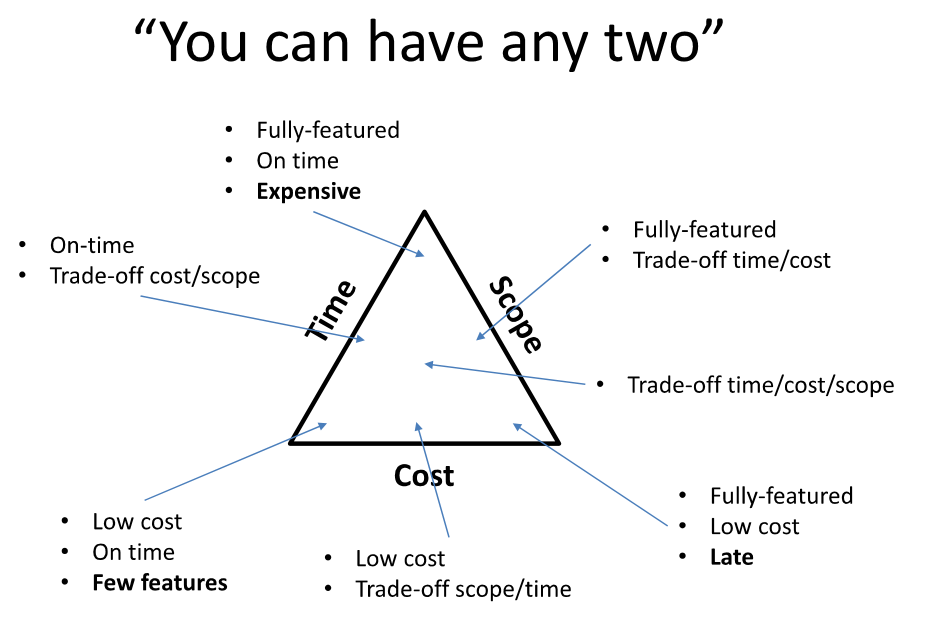

* Management is a balancing act between these competing constraints
* PMBOK:
    * 10 knowledge areas:
        1. Integration
        2. Scope
        3. Time
        4. Cost
        5. Quality 
        6. Resources/HR
        7. Communication
        8. Risk
        9. Procurement 
        10. Stakeholder
    * 5 process groups:
        1. Initiation: business case - why do the project?
        2. Planning: balance time, cost, scope, risk...
        3. Execution: the real work
        4. Monitoring and Controlling: monitor and review progress
        5. Closing: delivery, audits and lessons learned
    * 49 individual processes, for each:
        * Inputs
        * Tools, techniques, best practices
        * Outputs

    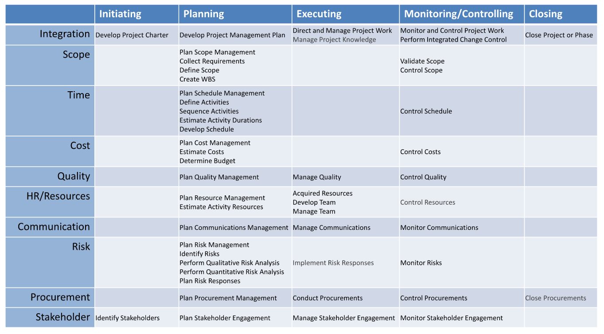

### Project Mandate:
* Also referred to as Statement of Work (SOW)
* What exactly is the project?
* What is included and excluded (scope)?
* Constraints (time, money)
* Assumptions
* Known risks/issues

### Business Case:
* Why do we want to build it?
* Project must deliver real, tangible value to the business
    * Is it worth the effort?
    * Who cares if we make it?
* Other competing projects
    * Overarching strategic plan of organisation
* Start of project - sets out ultimate goals for stakeholders
* During project - guides key project decisions
* End of project - learning linchpin for business

### Project Charter:
* Project mandate + business case -> project charter
* Formally authorises the existence of the project and provides the PM with the authority to apply resources
* Inputs:
    * Project mandate
    * Business case
    * Agreements
    * Enterprise environmental factors such as quality standards
    * Organisational process assets: standard processes, lessons learned (from previous projects)
* Outputs:
    * Project purpose or justification
    * Measurable objectives and success criteria
    * High-level requirements, boundaries, risks, constraints
    * Summary milestone schedule and budget
    * Stakeholder list, authority of sponsor, assigned PM, signing off authority

### Stakeholders:
* Sponsor
* Customers and users, 
* Sellers (of components or services necessary for project)
* Partners (provide expertise or service)
* Internal groups (marketing, manufacturing, sales, customer service)
* Functional managers (HR, finance, accounting, procurement)
* Others (e.g. regulators, the public)

Power/Interest grid:

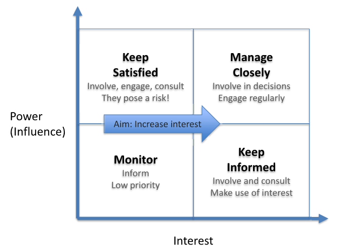

### SMART Objectives:
* Output - the 'what'
* Outcomes - the result of using the output
* Benefits - the positive outcomes (the 'why')
* Objectives - desired benefits, outcomes or improvements
    * 'To [improve/increase/enhance] something by [amount] by [date]'
* SMART - Specific, Measurable, Achievable, Relevant, Time-bound

# Scope and Time Management
### Work Breakdown Structure (WBS):
* Hierarchical decomposition of the work
    * Organises and defines total scope of the project
* Each level represents and increasingly detailed definition of the work to be completed
* Work package - smallest unit of WBS
    * Set of related tasks and deliverables
    * Self-contained, clearly defined interactions with other WPs
    * Clear identification of inputs, outputs, internal activities
    * Clear estimation of cost, duration, resources
* Milestones - points of control that separate WPs

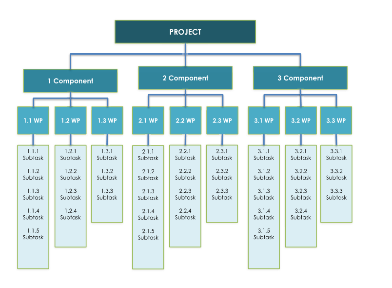

### Deliverable-oriented WBS:
* Objectives - relate to purpose (why are we going to build it?)
* Deliverables - relate to scope (what are we going to build?)
    * Estimable, parallelisable, purchasable
* WBS should be deliverable-oriented (what) not objective-oriented (why) or process-oriented (how)
* Pros:
    * Deliverables easier to estimate than objectives
    * Makes us focus on the essentials
    * Once scope is defined, the 'what' is fixed but the 'how' remains fluid
    * Allows us to manage scope
* Cons:
    * Loses sight of objectives
        * We don't have to - if we break the rules
        * Forget deliverables, break it down logically working backwards
        * Fine as long as we get to the deliverables
    * Restricts further scope changes and creativity from developers
        * Creativity is at the discretion of the PM - WBS is a tool to fix the scope
    * May overlook costly processes that consume time and resources
        * We can still use it to plan the schedule and budget - we will decide how to do the work after we have decided the what

### Estimating Durations:
* Analagous - how long it took last time, adjusted to this project
* Parametric - as above, but with a statistical model
* Team-based - by the people doing the work
* Three point - triangular/beta
* Useful to have a measure of uncertainty

### Sequence Activities:
* Relationships
* Dependencies
    * Try to do as much in parallel as possible
* Resource constraints
* Milestones
    * Key points between work packages

### Gantt Charts:
* Graphical visualisation of project, showing:
    * Temporal schedule of activities
    * Dependencies between activities
    * Progress of activities

### Project Network Diagram (PND) and Critical Path Method (CPM):
* A graphical way to view a project's tasks, dependencies and critical path
* Can be activity on node or activity on arrow
* Critical path - a sequence of activities such that none can be delayed without extending the project duration
* Definitions:
    * Duration $D$
    * Earliest start $ES = \max EF_{predecessors}$
    * Earliest finish $EF=ES+D$
    * Latest finish $LF=\min LS_{successors}$
    * Latest start $LS=LF-D$
    * Total float (amount of time activity can be delayed without delaying project) $TF=LS-ES=LF-EF$
* Forward pass - calculate $ES$ and $EF$, starting from start node
* Backward pass - calculate $LF$ and $LS$, starting from finish node
* Then can calculate $TF$

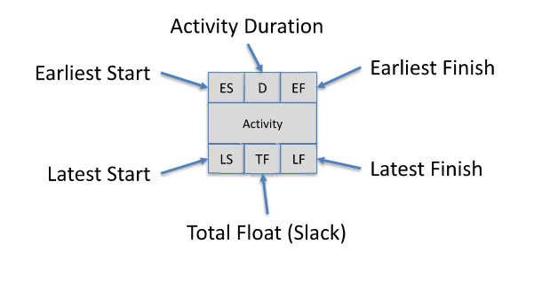

* Drag time - the amount of time a critical task adds to the project duration, i.e. the amount of time it would need to be shortened by to no longer be critical
    * $Drag = \min\{D, \min TF_{parallel}\}$
* Crash duration - shortest possible time for which an activity can be scheduled, to speed up the whole project
    * $Crash = D - Drag$
* Free float - the amount of time that an activity can be delayed without delaying the start of any subsequent activities
    * $FF=ES_{next}-EF$
    * $FF \leq TF$

### Program Evaluation and Review Technique (PERT):
* Variation on CPM using three-point estimation
    * Shortest possible time $a$, most likely length of time $m$, longest expected time $b$
    * Uses a probability distribution, not a fixed estimate
    * Allows us to make statistical inferences, not promises we are likely to break
* But:
    * Makes assumptions of normality
    * Requires uncertainty estimation
    * Gives a false sense of precision
* Beta and triangular distribution (equations given in exam, here for reference only):
    * $t_{beta} = \frac{a+4m+b}{6}$
    * $\sigma_{beta}^2 = (\frac{b-a}{6})^2$
    * $t_{triangular} = \frac{a+b+m}{3}$
    * $\sigma_{triangular}^2 = \frac{a^2+b^2+m^2-ab-am-bm}{18}$

# PRINCE2
### PRINCE2 definition of a project:
1. Change - we use projects to introduce change to the business
2. Uncertainty - a project changes one or more things or develops something new. These are steps into the unknown, and introduce uncertainty
3. Temporary - a project team comes together, does a job and is then disbanded
4. Unique - in some major or minor way every project is unique
5. Cross-functional - a project needs different people with different skills - some to define what is required, others to develop the required products. These people may work for several different line managers or different companies

### When/Why PRINCE2 is useful:
* IT projects
* Generic projects
    * Method highly versatile
    * Suited to all types of project
* Smaller projects
    * Focus on tailoring

### Pros and cons of the PRINCE2 approach in a balanced way:
| Opponents say | Proponents say |
| ----------- | ----------- |
| Only for large projects | Fully scalable, tailored |
| Constrained approach | Step-by-step, by stages |
| Inflexible, not “agile” | Iterative stages, change theme |
| Mountains of paperwork | Needn’t be, audit trail useful |
| Not solution-oriented | Product oriented |
| Bureaucratic | Maintains control, by exception |

### PRINCE2 Principles:
1. Continuous business justification
    * Is there a business benefit?
    * Is it feasible, viable and economical?
2. Learn from experience
    * Don't make the same mistake twice
    * E.g. choice of supplier, expertise of team
3. Defined roles and responsibilities
    * Who's responsible
    * Who's held accountable
4. Manage by stages
    * Break a project into manageable chunks
5. Manage by exception
    * Set limits
    * Let people get on with their job within those limits
6. Focus on products
    * Think about outcomes and outputs
    * The what, not the how or the why
7. Tailor to suit the project environment
    * Customise approach to suit the problem
    * Don't follow PRINCE2 to the letter

### PRINCE2 Processes:
* Starting up (SU)
* Directing a project (DP)
* Initiating a project (IP)
* Managing a stage boundary (SB)
* Controlling a stage (CS)
* Managing product delivery (MP)
* Closing a project (CP)

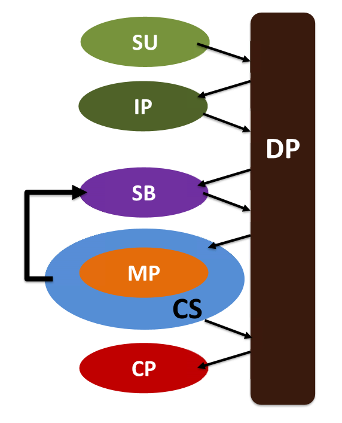

* Project mandate comes from corporate or programme management
* Board agrees to go ahead after SU process
* Project is planned in IP process
* Board needs to approve stages
* Plan stage in SB process, board has to approve stage plan
* When stage is authorised, CS and MP processes take place
* If something goes wrong, consult board
* Plan next stage and get it approved while current one is taking place
* Board authorises the closing of a project (CP process)

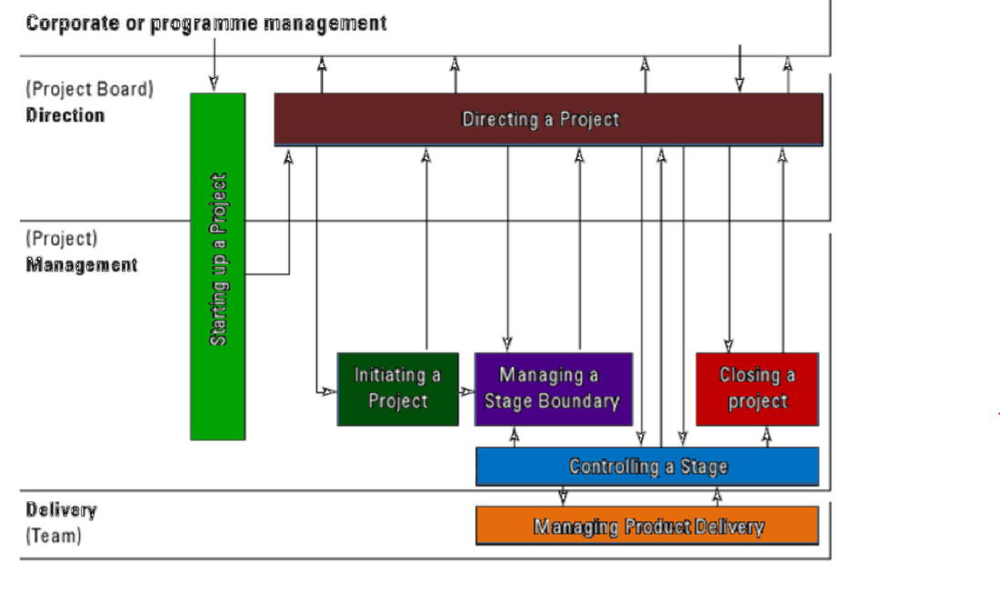

### PRINCE2 Roles:
* Project team comprises, at least:
* Project board:
    * Panel to represent stakeholders, e.g. business, end user and people doing the work
    * Have to care about and be invested in the project
    * Responsible and held accountable for the project's success
    * Executive - ultimately responsible, business-oriented, focuses on objectives and business case
    * Senior user - specifying and monitoring needs of users
    * Senior supplier - implementation, technical integrity
* Project manager
    * Day-to-day management
    * Granted authorisation from the board
    * Needs approval from the board to change the plan beyond agreed limits

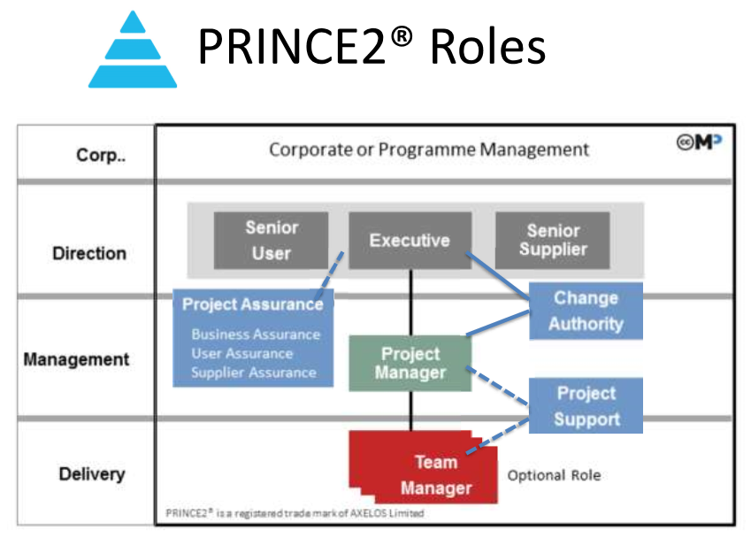

### PRINCE2 Themes:
* Business case - feasible, desirable, achievable? 
* Organisation - responsibilities, accountabilities
* Quality - meeting requirements
* Risks - identify, assess, control risks
* Plan - what, when, who, how
* Change - reacting and adapting
* Progress - is it going to plan?

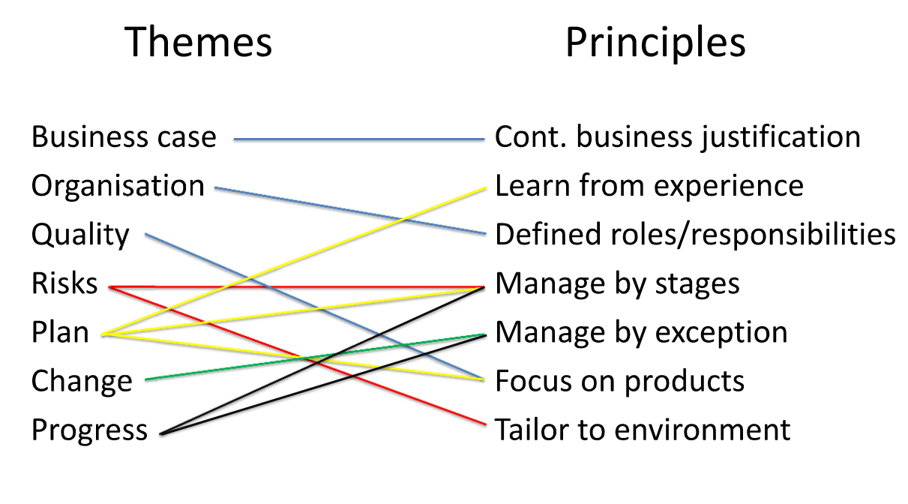

### PMBOK vs PRINCE2:

| | PMBOK      | PRINCE2 |
| ----------- | ----------- | ----------- |
| What is it | Framework | Methodology |
| Focus | Activities | Deliverables |
| Driver | Customer requirements | Business Case |
| Process 'groups' | 5 process groups | 7 processes
| Knowledge areas | 10 knowledge areas | 7 themes |
| Process 'steps' | 49 processes | 40 steps |

### Product-based Planning:
* Why?
    * A project delivers products, not activities
    * We can write a product specification
    * We can measure the quality of a product
* How?
    * Deliverable-oriented WBS
    * Product descriptions - a specification (especially quality criteria)
    * Product flow diagram - a network diagram of product dependencies

### Management Products:
* Records:
    * Lessons Log
    * Risk Register
        * For each risk:
            1. Identify threats and opportunities
            2. Assess probability, impact and proximity
            3. Plan appropriate responses
            4. Implement the planned responses
            5. Communicate to interested parties
    * Quality Register
        * Holds details of all quality events planned and undertaken
* Baselines (versioned):
    * Project Brief
    * Project Initiation Document (PID)
    * Business Case
        * Formally verified by board at each key decision point
        * Centre of impact assessment of risks, benefits, issues and changes
        * If project no longer justified, shut it down
* Reports:
    * Exception Report
        * Exception raised to board if tolerances exceeded for deviations from progress against plan

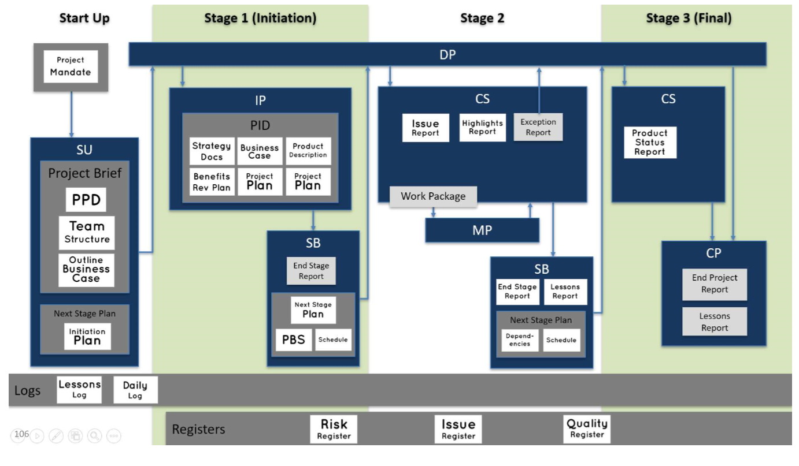

### Managing people/personalities (guest lecture):
Projects mostly fail due to:

* A failure to understand the ‘Why?’
* A failure to understand the ‘What?’
* Ego
* Lack of common sense

# Budgeting and Forecasting
### Cost per X:
* Three types:
    1. Cost per time unit - typically used to budget HR
    2. Cost per use - e.g. use of a venue for a meeting, cost of a cleaning after a party
    3. Cost per material consumption - e.g. food and beverages provided at a conference, bricks to build a house

### Estimating activity costs:
* As with estimating time: analagous, parametric, team-based, three-point (triangular/beta)
* Vendor bids - compare competitive bids from vendors
* Cost of (poor) quality - compare for different quality levels

### Reserves:
* Management reserve:
    * For unidentified risks
    * Not controlled by PM
    * Fixed % (based on risk appetite of business)
* Contingency reserve:
    * For identified risks
    * Controlled by PM
    * Estimated, based on perceived risk

### Cash Flow:
* Cash is not always as liquid as we think
* Important to know not only how much but when:
    * Staggered funds
    * Invoice periods
    * Consideration for slack in schedule
* Cash can be scheduled like any other resource, e.g. Gantt chart
* We can anticipate cash flow issues by summing the daily/weekly/monthly planned acitivity costs
* Either:
    * Ensure resources are in place to cover anticipated expenditure
    * Reschedule activities to smooth out spikes
* Performance Measurement Baseline (PMB) of a work package or project - a time-phased plan of costs (budget) against which actual performance can be measured
* Planned Value ($PV$) - how much of the authorised budget has been assigned to the work at a given point in time?
* Actual Cost ($AC$) - how much of the authorised budget has been spent on the work at a given point in time?
* Earned Value ($EV$) - how much of the planned value has been achieved by doing the work so far
    * A measure that lets us compare the budget to the work done - an indicator of progress
* S-curve reflects phases of project - initiate, plan, execute, close

    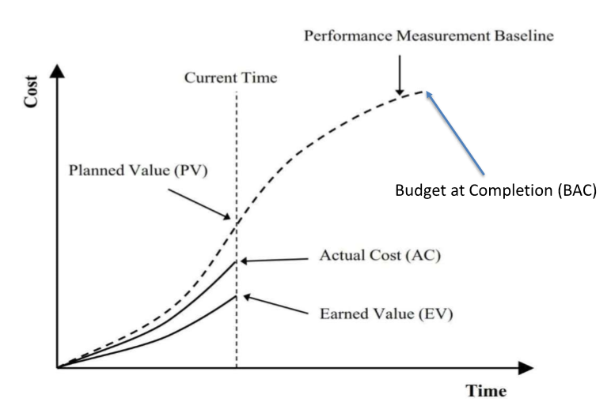

* Budget at Completion ($BAC$) - total planned value

### Earned Value Analysis (EVA):
* Schedule Variance $SV = EV - PV$
* Cost Variance $CV = EV - AC$
* Schedule Performance Index $SPI = EV \div PV$
* Cost Performance Index $CPI = EV \div AC$
* Cost Schedule Index $CSI = CPI \times SPI$
    * Overall measure of efficiency

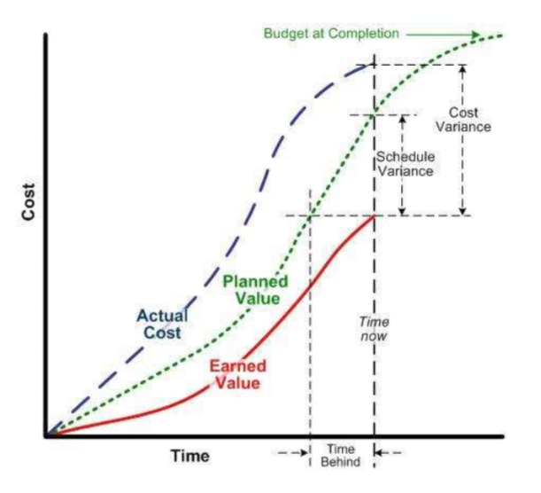

### Forecasting:
* We want to:
    * Estimate end date
    * Estimate project cost
* Estimate at Completion ($EAC$) - estimated final total cost of project
    1. Trust original estimate, i.e. assume remaining work will take as long as originally planned
        * $EAC = AC + (BAC - EV)$
    2. Assume performance (cost-efficiency) to date is a good indication of how the rest of the project will perform
        * $EAC = BAC \div CPI$
    3. Assume both cost and schedule-efficiency are a good indication of how the rest of the project will perform
        * $EAC = AC + (BAC - EV) \div CSI$
* Estimate to Complete ($ETC$) - how much will we need to spend to finish the work?
    1. Difference between estimate at completion and actual spend to date
        * $ETC = EAC - AC$
    2. Bottom-up, when original estimation fundamentally flawed
* Variance at Completion ($VAC$) - expected over or under spending
    1. Difference between what the project was originally expected to cost and what it is currently expected to cost
        * $VAC = BAC - EAC$
* To-Complete Performance Index ($TCPI$) - future cost-efficiency required
    1. To achieve the original budget
        * $TCPI = (BAC - EV) \div (EAC - AC)$
    2. To achieve the estimated budget
        * $TCPI = (BAC - EV) \div (BAC - AC)$

### Measuring Success:
* Common objectives: budget targets, schedule targets, scope targets
    * No point delivering on time/within budget if no actual benefits!
* High quality product
* Product is utilised
* Business objectives are achieved
* Resources used effectively
* Team is able to support solution in the future
* Participants have pride in ownership
* Adhered to standards and best practices
* Methods in place to evaluate benefit realisation

### Key Performance Indicators (KPIs):
* High-level indicators:
    * Simple, measurable metrics
    * Correlated to stakeholder objectives
    * Agreed between PM and stakeholders
* Metrics of success and a measure of progress
* Benefits of metrics management:
    * Metrics tell us if we are hitting targets, getting better or getting worse
    * Early identification of mistakes or issues
    * Informed decision making and proactive management

### Enterprise Resource Planning (ERP):
* Business analytics
* Central database with interfaces to every part of the company
    * E.g. stock control, production line, sales, marketing, finance, HR, customer service
    * Track various metrics, in real time
* Data-driven management
    * Visualise metrics on a dashboard
    * Quickly spot issues
    * Manage the management
    * May spend too much time trying to optimise metrics without doing actual work
    * Takes away the human element

# Lean and Agile
### 7 Lean Manufacturing Principles:
1. Eliminate waste
2. Amplify learning
3. Defer commitment (leave to the last minute)
4. Deliver fast
5. Empower the team
6. Build integrity in
7. See the whole

### 3 Wastes:
* Muri - overburden, excessiveness, unreasonableness
    * People can't work at an unsustainable pace
    * Machines can't work at an unsustainable pace
* Muda - wastefulness, uselessness, no added value
    * An activity that consumes resources without creating value for the customer
* Mura - unevenness, irregularity, inequality
    * Working hard in the runup to a deadline and then doing nothing after
    * Uneven schedule
    * Variability in 'flow'

### Sources of Waste:
1. Transport - in excess of what is required to meet customer demand
2. Inventory - materials, products or resources in excess of customer demand
3. Motion - movements between process steps
4. Waiting - waiting on product, people or machines
5. Over processing - processing in excess of what is required
6. Overproduction - producing in excess of customer demand
7. Defects - passing poor quality down the supply chain
8. Skills - not seeking out the expertise or creativity of your own people

'Eliminate waste' and 'Build integrity in' principles

### Kanban
* Push - make all we can just in case
* Pull - make what's needed when we want it
* Kanban like a fast food restaurant (a pull system)
* As work completed, taken from regulator for testing
* Work done on-demand (JIT) by programmers
* Not made to a requirements document and pushed at the customer

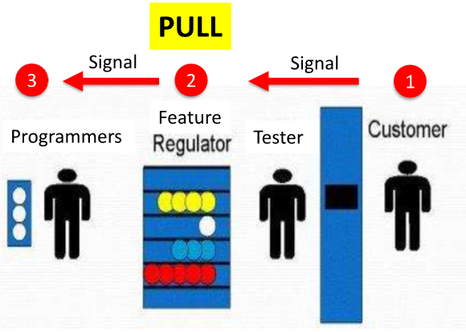

'Defer commitment' and 'Deliver fast' principles

### Minimum Viable Product (MVP):
* No more than necessary, no waste
* Lower cost and faster delivery
* Valuable, useful and beneficial
* A 'deliverable' - focus on the customer
    * Maximise flow of value to the customer

'Amplify learning' and 'Deliver fast' principles

### Waterfall:

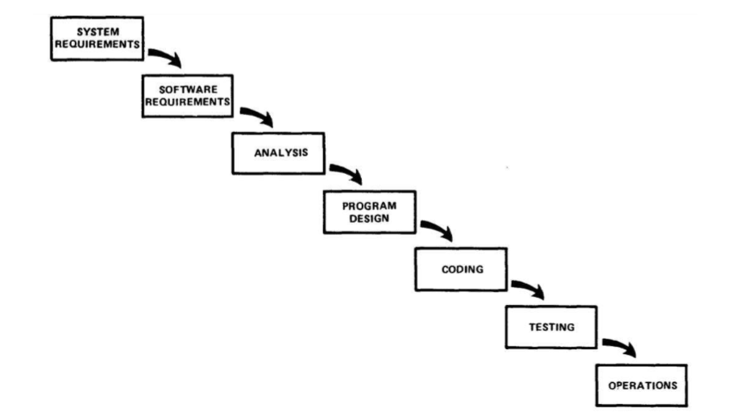

* Pros:
    * Repeatable - low management overhead
    * Clear about expectations - explicitly collected
    * Clear responsibilities and interfaces
* Cons:
    * High risk - late detection of problems leads to major redesign
    * One long critical path
    * Lots of documentation required
        * Analysis done by people who will neither write nor use the software
    * No support for change
* Often popular with CEOs and CTOs, less so with developers
* Nobody ever thought naive waterfall was a good method - not even its creator
* Often called 'traditional', but was invented before computing really had any traditions
* For all its faults, it's simple, logical and easy to communicate

### Agile:
* Traditional:
    * Plan-driven
    * Fix scope, estimate cost and time
    * Solve it all in one go
    * Progress is binary
    * Cost, time and quality are at risk
    * Risky until the end
* Agile:
    * Value-driven (prioritise requirements, focus on what the customer wants)
    * Fix cost and time, estimate scope (no more useless calculations)
    * Solve iteratively
    * Progress is gradual
    * Scope at risk
    * Risk declines with progress

    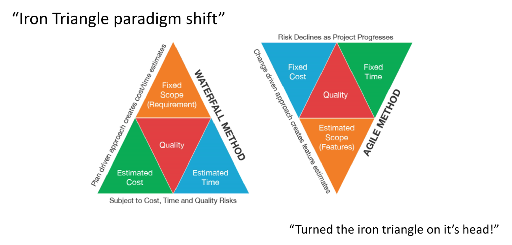

* Agile Manifesto:

    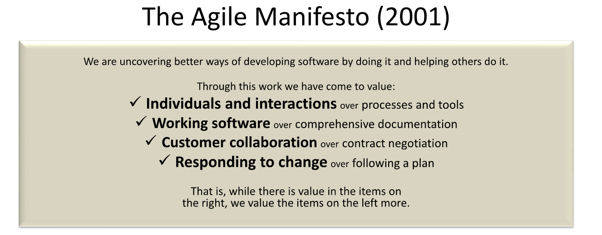

### Scrum:
* User stories:
    * *As a \<type of user\>, I want \<some goal\> so that \<some reason\>.*
    * Epic - a group of related user stories
    * Theme - top-level objective of the project
    * Captures scope/requirements
        * The who, what, why (not how)
* Select user stories from the product backlog (which come from product owner on input from customers, end-users, team and other stakeholders) to complete during a sprint
* During a sprint planning meeting, team selects how much to commit to do by the end of the sprint and tasks added to sprint backlog
* Product backlog may be refined during sprint
* Sprint lasts 1-4 weeks
* Daily scrum meeting
* At the end, should have a potentially shippable product increment
    * Demo increment and present to stakeholders
* Retrospective meeting - review how things are going
* Roles:
    * Product Owner:
        * Represents stakeholders' view
        * Communicates the vision (user stories) to the team
        * Prioritises user stories, and accepts/rejects them at the end of a sprint
        * Secures funding, manages the ROI
    * Development Team:
        * Developers, testers, designers, analysts
        * 3 to 9 members (when more than 9, split into 2)
    * Scrum Master:
        * Not a manager, but a 'servant leader' - removes impediments
        * Works across teams to improve communication
        * Hosts meetings (sprint planning, daily scrum, retrospective)
* Scrum Values:
    * Commitment (to goals in the sprint)
    * Courage (to do what you think is right)
        * E.g. telling a coworker when they've made a mistake, also admitting that you made a mistake
    * Focus (on the work items in the current sprint)
    * Openness (about any challenges faced)
    * Respect (trust that everyone is doing their best)
* Burndown Chart:
    * Displays remaining effort for the sprint
    * Allows estimation of velocity of the team (how quickly working towards goal)
    * Scrum Master must:
        * Get the team to fix estimation
        * Ensure additional stories ready to be added to the sprint

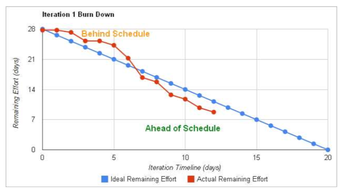

* Daily Stand-Up:
    * If each person says what they did yesterday, what they will do today and what potential blockers there are: next person will be focused on what they want to say rather than what their colleagues are saying, wanting to impress colleagues and avoid embarrassment
        * Leads to stress
        * Doesn't work unless team is a relaxed environment
    * Person who went previously may also be bored and uninterested in what their colleagues have to say
    * Solution: use Kanban boards
        * Tasks not started, in progress and done
        * Each person says what tasks they have in each category, and tasks are moved between categories
   
### Lean 'House' (Toyota):

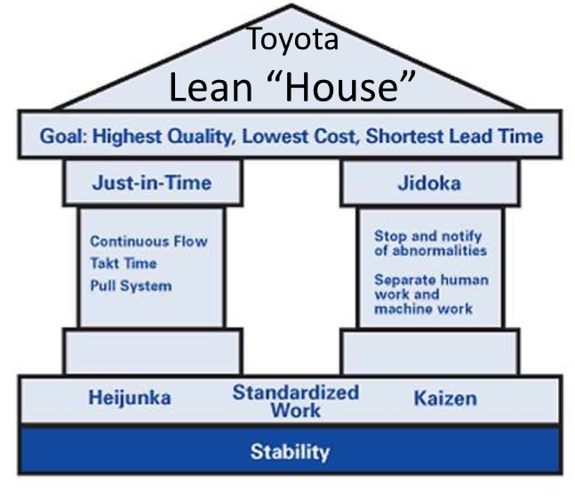

* Just-in-Time (JIT):
    * Keep value flowing
    * Meet rate of demand
    * 'Pull' not 'plan'
* Jidoka (Intelligent Automation):
    * Stop on faults
    * Automate as much as possible
    * Intelligent intervention
        * The ability to self-monitor and stop production in case of a problem
* Heijunka (Production Levelling):
    * Smaller, more regular batches achieves:
        * Steady flow to the next stage
        * Greater predictability
        * Flexibility to changing demand
    * Reduces mura (unevenness)
    * Comes at a price of mass production
    * E.g. one person works on a big work package while another person has finished theirs
* Kaizen (Continuous Improvement):
    * Regular, incremental improvements
        * To all functions/processes (of the business)
        * From employees at all levels
    * Philosophy: a culture where everyone is actively engaged in suggesting and implementing improvements
    * Strategy: trust, respect and empower people. Events focused on improving the company, involving teams of employees at all levels
    * Reduces muri, muda and mura
* Just-in-Case vs Just-in-Time:
    * Just-in-Case (make all we need just in case):
        * Production approximation
        * Anticipated usage
        * Large lots
        * High inventories
        * Waste
        * Management by firefighting
        * Poor communication
    * Just-in-Time (make what's needed when we need it)
        * Production precision
        * Actual consumption
        * Small lots
        * Low inventories
        * Waste reduction
        * Management by sight
        * Better communication

### 5 Pillars of Lean Thinking (maximising flow of value):
1. Identify Value
    * Value is created by the producer
    * Value can only be defined by the ultimate customer
2. Map the value stream
    * The complete life-cycle of a product: from raw materials to customer use
    * Some steps create value unambiguously
    * Some create no value but currently unavoidable (type 1 muda)
    * Others should be eliminated immediately (type 2 muda)
3. Create flow
    * Value stream keeps moving forward, with each step in sync
4. Establish pull
    * Don't make things ahead of time, make them just in time
5. Seek perfection
    * Repeat, making continuous improvement, seeking perfection

### Kanban Software Development:
* 'WIP-limited pull system'
* WIP:
    * Work in Progress
    * Forces team/individual to only work on a limited number of tasks
    * Reduced overburden and reduces overhead of task-switching (reducing productivity, which is therefore wasteful)
    * 'It's leaner to finish all of one thing than get two things to 50%'
* Pull System:
    * Start new work only when there is demand for it
    * No to-do list, no work overload, complete one thing then pull the next
    * Team focuses on prioritising, not estimating/planning
    * 'It's leaner to focus on completing only what is required'
* Kanban Methodology:
    * Kanban board - visualises work
    * Pull system - pull highest priority item from backlog
        * Avoids overburden
    * Flow management:
        * Identify blockers and dependencies
        * Feedback and experimental evolution
    * No fixed length iterations
* Blockers and Idleness:
    * Sometimes, can't finish work because of being blocked waiting on someone else
    * Most people would just start working on something else, but this is against the rules
    * Taking on work to improve **your** output efficiency isn't in the team's best interest
        * Won't maximise value through system
        * Priority is completion of the highest priority work
    * Being 'blocked' forces team to collaborate
        * Forced to ask: how to solve the bottleneck?
        * Work as a team to get the flow going again
        * Improve the process (kaizen) to achieve more even-flow (heijunka)
    * What about idle time? It's a pull system - no requirement to be in sync
    * Each team focuses on getting value through their flow. Yet:
        * Kanban doesn't magically solve resource utilisation
        * Teams need to adapt to improve end-to-end flow efficiency
    * When 'idle', a bottleneck has been created
        * Improve the whole workflow
        * Reorganise the teams
        * Forces the question: 'do we really need separate developers and testers?'
* Software as a production line:
    * Lean methodology designed for manufacturing, but software development is not a production or manufacturing activity
    * Software engineers create different things every time, whereas manufacturing produces the same things over and over again
    * How do we design a Kanban board for software projects?
* Kanban Example 1 (typical of an agile team):

    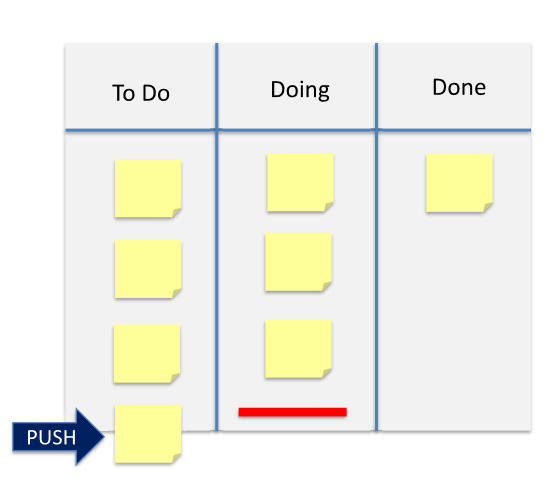

    * Limits WIP
    * Pull from To Do list
    * Helps visualise flow
    * Work pushed onto To Do list (backlog)
    * No mapping of processes (flow of work)
    * Hard to achieve a rhythm
* Kanban Example 2 (for a waterfall-based workflow):

    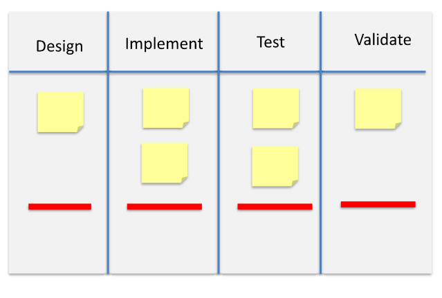

    * Limits WIP
    * Helps visualise flow
    * Maps flow of work (processes)
    * Who moves the cards?
    * Is it push or pull?
    * How do we do signalling?
* Kanban Example 3 (for a waterfall-based workflow):

    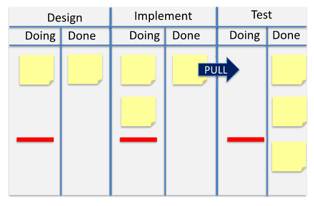

    * Limits WIP
    * Helps visualise flow
    * Maps flow of work (processes)
    * Pull from upstream
    * Work done on demand (no over-production)
    * How do we balance load?
* Kanban Example 4 (swimlanes prioritise work):

    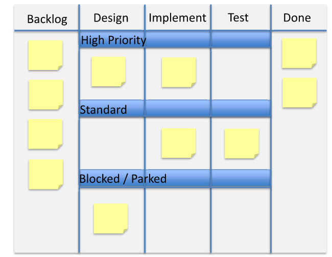

    * Limits WIP
    * Helps visualise flow
    * Maps flow of work (processes)
    * Work can be prioritised and expedited

### Conditions for Agile:

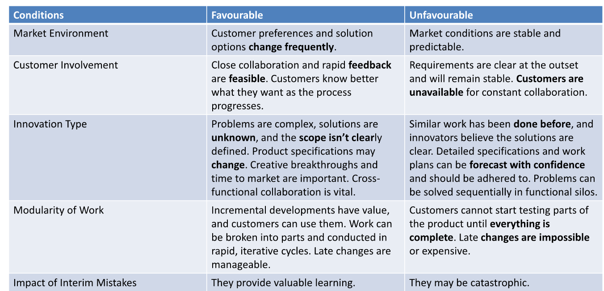

### Scrum vs Kanban:

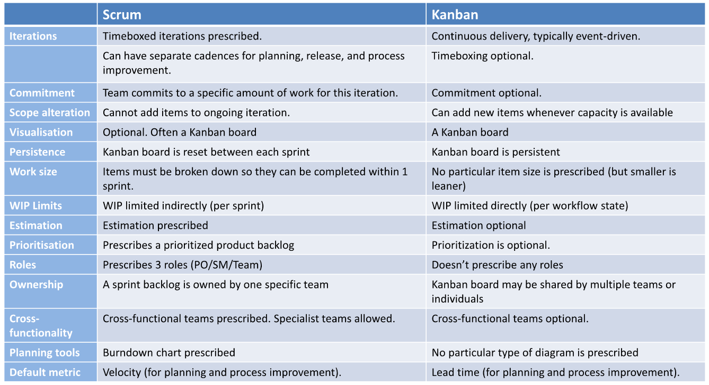

When to use Scrum or Kanban?

* Scrum:
    * The work is in large vague chunks that you can then break down into smaller chunks
    * The work forms part of an even bigger series of long-term goals ('releases' or 'horizons')
    * Regular fixed timeboxes let you measure your rate of progress
    * Fixed timeboxes and a rate of progress mean you can plan towards the big long-term goals
* Kanban:
    * The work pops up in front of the team (i.e. event-based)
    * The work is in small discrete pieces
    * There is no overall long-term objective or goal to reach
    * Planning is unimportant or irrelevant
    * Where new work activities arrive continuously (e.g. a 'support' environment)

### Agile Approaches:
* Different agile approaches exist
* Each will prioritise some part of the agile manifesto more
* Some more geared towards corporate project management

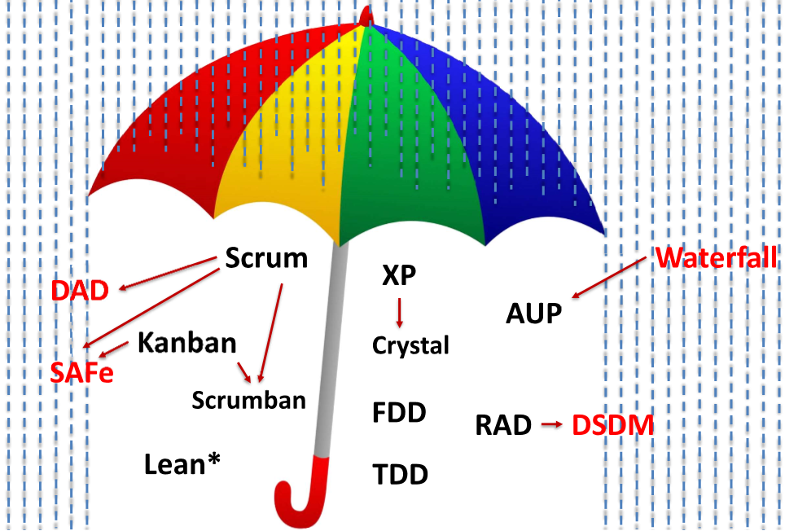

* Extreme Programming (XP):
    * A series of core practices
    * Agile planning
    * Collaboration
    * Pair programming
    * Test-oriented
    * Quality code
    * Continuous feedback

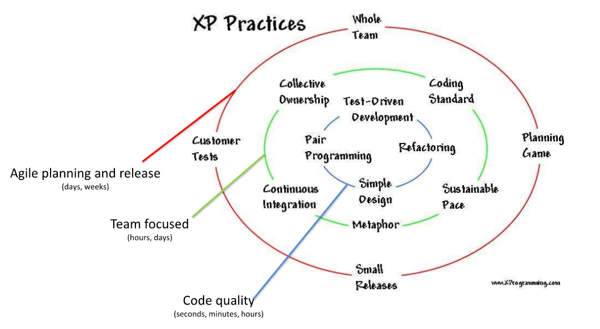

### Scaling Agile:
* Disciplined Agile Delivery (DAD):
    * Moving beyond Scrum, a hybrid-agile framework that not only streamlines agile development, but more importantly, enables scaling
    * Adds a PRINCE2/PMBOK approach

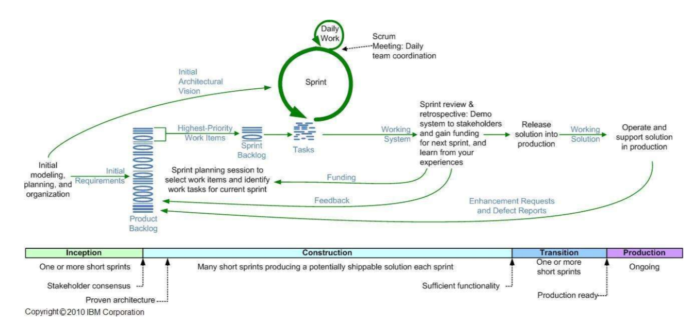

* Scaled Agile Framework (SAFe):
    * Set of organisation and workflow patterns intended to guide enterprises in scaling lean and agile practices

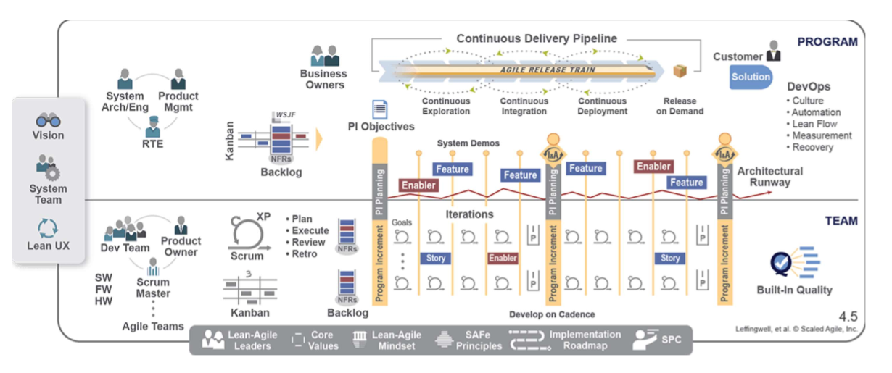

### Agile vs Lean

# Risk Management
### Terminology:
* Uncertainty: something that is not definite, i.e. has a probability of occurrence
    * Types of uncertainty: events that may or may not happen, lack of information...
    * Areas of uncertainty: time, cost, quality, health and safety, legality...
* Risk: effect of uncertainty on objectives
* Tolerance to risk: person/organisation can be risk-averse, risk-neutral or risk-seeking
* Threats vs Opportunities: risk not necessarily negative - may be unexpected benefits
* Known risks: identified ones, under control of PM (paid for from contingency reserve)
* Unknown risks: not anticipated, under control of senior management (paid for out of management reserve)
* Issue: if the event that caused the risk occurs, it becomes an issue

### How to deal with risk?
* Avoid - discontinue activity that gives rise to risk
* Remove the risk source
* Change the likelihood
* Change the consequences
* Share the risk with another party or parties
* Retain the risk by informed decision
* Accept
* Increase the risk in order to pursue an opportunity

### Different approaches to risk management:
* PMBOK:
    * Systematic breakdown into KAs and PGs - avoid the risk of missing something
    * Risk KA: explicitly plan to avoid risk
* PRINCE2:
    * Board of Directors: avoid the risk of losing control of the project
    * Board roles: avoid the risk of failure to meet stakeholder expectations
    * Business case: avoid the risk of failing to meet business needs
* Agile:
    * Iterative: to avoid the risk of delivering the wrong thing
    * Customer collaboration: to benefit from the opportunities of regular customer engagement
* Lean:
    * Mudas: avoid risk of overproduction, overburden, etc.
    * Value: to benefit the customer by taking all opportunities to maximise value

### PRINCE2 Risk Planning Cycle:
1. Identify risks
2. Assess probability and occurrence
    * What is the likelihood of the risk occurring?
    * How severe will the risk impact be?
3. Plan strategies and responses
    * How can we detect risks?
    * What can we do to reduce impact?
    * What actions should we take if risk occurs?
4. Monitor/implement responses
    * When identified risk occurs, execute plan
    * When unidentified risk occurs,
5. Communicate
    * Inform interested parties

### Assigned Responsibilities:
* Need to have clear and unique accountability decided beforehand
    * If people aren't responsible for things, they won't get done
* Responsibility Assignment Matrix (RACI Matrix):
    * Clarifies roles and responsibilities for each item in the WBS
    * Records who is Responsible, Accountable, Consulted and Informed
    * All tasks should have at least one person responsible (who should actually complete the task)
    * All tasks should have one and only one accountable (the individual who is ultimately answerable for the task)

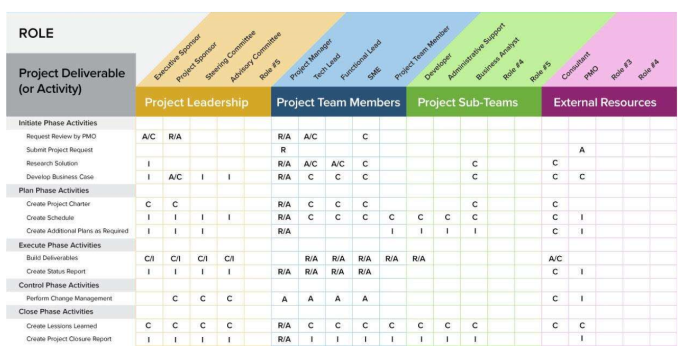

### Identifiying Risks:
* SWOT Analysis:
    * Strengths, Weaknesses, Opportunities, Threats

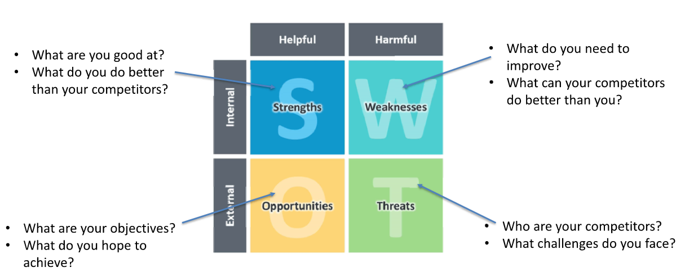

* Risk Breakdown Structure (RBS):
    * Breaking down risks into small units

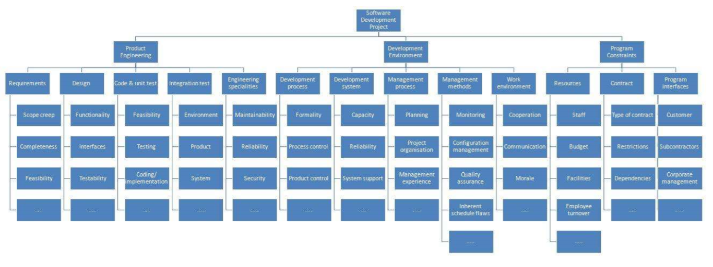

* Delphi Technique:
    * Experts who participate anonymously and iterate until a consensus is reached
* Decision Tree Analysis:
    * Model of decisions, chance and possible outcomes, costs and utility

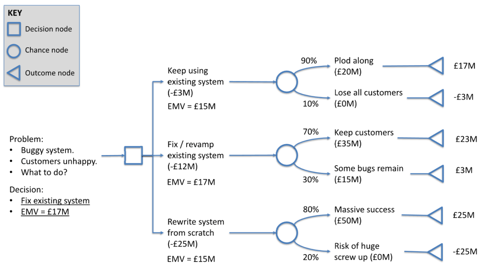

### Identifying Causes:
* Ishikawa (Fishbone) Diagram:
    * Represents cause and effect
    * Work backwards from a risk to think about how it can be mitigated
    * Originally developed for manufacturing
    * Can be used with the 4 Ps:
        * Policies
        * Procedure
        * People
        * Plant (Technology)

    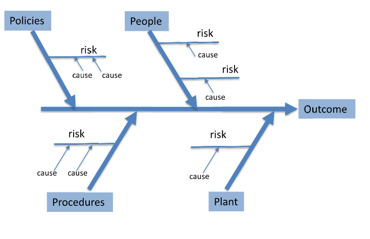

* Sensitivity Analysis:
    * To determine how different values of an independent variable impact a particular dependent variable under a given set of assumptions
        * Simple estimate - estimate a range of values, e.g. low/med/high
        * Simulation - model the system to measure the effects of a variable
        * Empirical data - correlate risk factors with outcome
    * Spider graph: plots the dependent variable against deviations of the independent variable from a baseline

        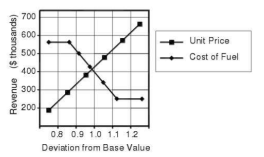

        * Centre is the baseline - what happens if we do nothing
        * Sensitivity curve can be determined using one (or multiple) of the methods described above
    * Tornado diagram: shows how the dependent variable would change if the independent variable changed by + or - 25%

        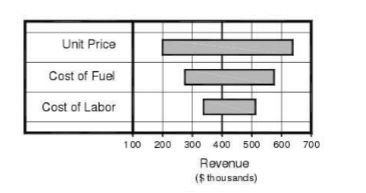

### Planning Risk Responses:
* Risk response depends on probability and impact
* Risk matrix:

    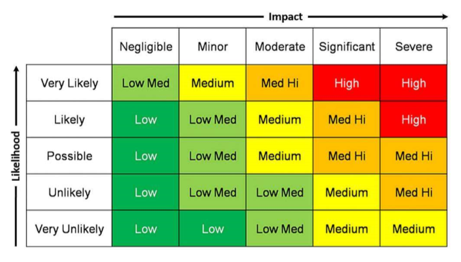

    * Categorise risks according to their probability and impact
        * Simple to use and understand
        * Different risk response for each category
        * Asymmetric matrix reflects attitude to risk
    * Replaces detailed quantification (false sense of precision)
    * Subjective (prone to bias, may underestimate/overestimate true risk)
* Failure Mode Effects Analysis (FMEA):
    * A table of:
        * Failure modes (what might go wrong)
        * Failure effects (damaged caused)
        * Possible causes
        * Detection measures
    * Assign a score from 1-10 to:
        * Severity $S$
        * Occurrence Probability $O$
        * Detection Rate $D$
    * Calculate:
        * Criticality $C = S \times O$
        * Risk Priority Number $RPN = C \times D$
    * Bigger numbers indicate a worse outcome
    * Highest RPN: failure is not detectable by inspection, very severe and the occurrence is almost certain

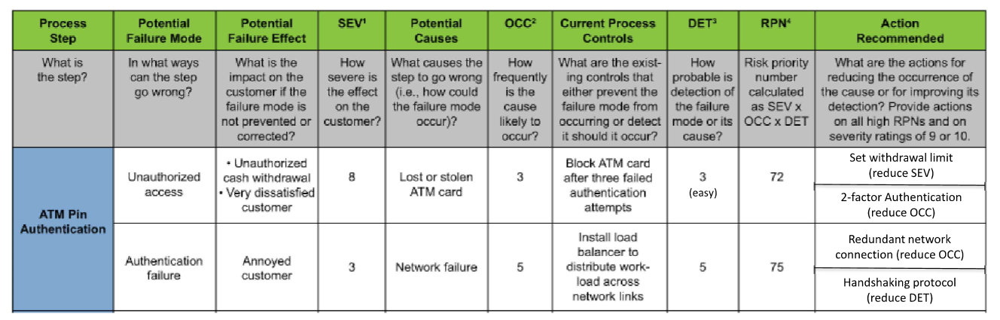

* Extended Failure Mode Effects Analysis (E-FMEA):
    * Extends FMEA by:
        * Adding corrective actions
        * Deciding the feasibility of the action
        * Choosing the corrective action which gives the most feasible reduction in risk
    * For each corrective action:
        * Reevaluate $S$, $O$, $D$ and $RPN$
        * Assign a score from 1-10 for feasibility $F$
        * Compute $\Delta RPN / F$, the reduction in $RPN$ scaled by $F$
            * Highest $\Delta RPN / F$: greatest reduction in risk for least amount of effort. This action should take the highest priority

    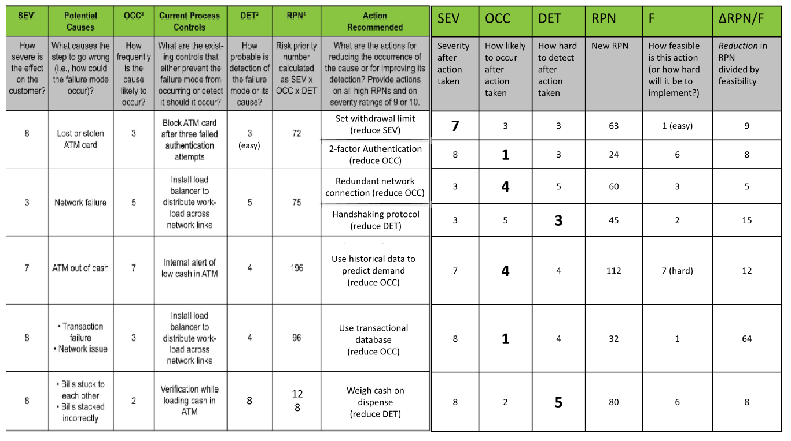

# Leadership and Teamwork

### Decision Making:
* PrOACT Decision Making Model:
    1. Define the **Pr**oblem: What is the problem? How big is the problem? Why does it matter?
    2. Specify **O**bjectives of the solution: Prioritise aims. How can they be measured?
    3. Imagine **A**lternatives: A decision is only as good as the next-best alternative
    4. Tabulate **C**onsequences: Compare the consequences of each alternative
    5. Claify **T**rade-offs: If no obvious winner, weigh up the objectives. Why is one more important than another?
* Important to consider uncertainty, risk tolerance and linked decisions. Also beware of cognitive biases
* Example Cognitive Biases:
    * Availability heuristic: people overestimate the importance of information that is available to them
    * Confirmation bias: we tend to listen to information that confirms our preconceptions
    * Survivorship bias: an error that comes from focusing only on surviving/successful examples
* A good leader is decisive and makes good decisions quickly
    * Not reckless/impulsive ones
    * Measured, reasoned, risk-aware
    * Beware of biases
* We learn more from mistakes than by idling
    * Why waste time planning when we could be learning?
* Self-confidence is infectious
    * Motivates team
    * Fear of failure diminishes team's confidence

### Team Building:
* Most important thing is trust
    * Openness, honesty, sharing
* Without trust we avoid conflict - artificial harmony
    * People don't feel confident enough to express their opinion
* With artificial consensus there is no real agreement
    * Decisions are ambiguous
* No commitment means no ownership and responsibility
    * Standards drop
* Team members become accountable only to themselves, so they become selfish
    * Egos take over
* Conflict is good!

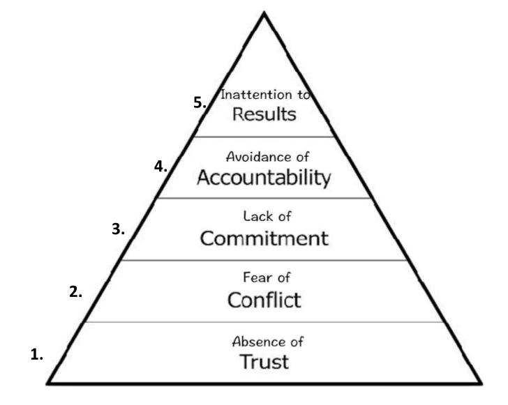

### Example characteristics of productive teams:
* Trust:
    * Can speak openly and freely, can tell the truth even if it's uncomfortable
    * Team members can count on each other and are reliable
* Respect:
    * Team members empowered to contribute their best
* Values diversity:
    * The team is open-minded and benefits from differences in ideas, perspectives, backgrounds, personalities and approaches
* Team leadership:
    * Team members feel confident and empowered to lead
    * The team leader's role is clear and supportive
* Decision making:
    * The team has transparent and efficient decision-making processes, which are proven to be effective
* Proactive:
    * The team takes the initiative
    * The team is flexible in addressing opportunities, responding positively and creatively
* Accountability:
    * There is clarity of roles and responsibilities
    * Team members hold each other accountable for team results and side agreements

### Stages of Group Development:
* Forming:
    * Team acquaints and establishes ground rules
    * Formalities are preserved and members are treated as strangers
    * Someone (often the loudest person) usually takes the lead
* Storming:
    * Members start to communicate their feelings but still view themselves as individuals rather than part of the team
    * They resist control by group leaders and show hostility
* Norming:
    * People feel part of the team and realise that they can achieve work if they accept other viewpoints
    * Can get things done to a decent degree
    * Many teams get this far and no further
* Performing:
    * The team works in an open and trusting atmosphere where flexibility is key and hierarchy is of little importance
* Adjourning:
    * The team conducts an assessment of the work done and implements a plan for transitioning roles and recognising members' contributions
* Graph:

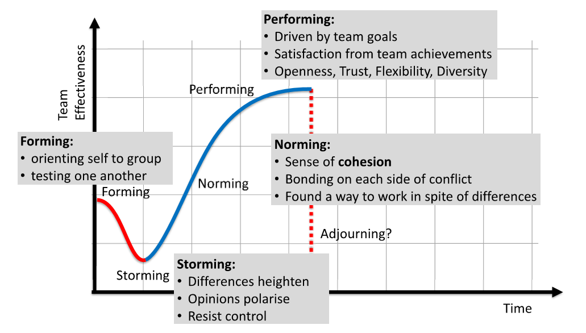

* Can it be sustained?

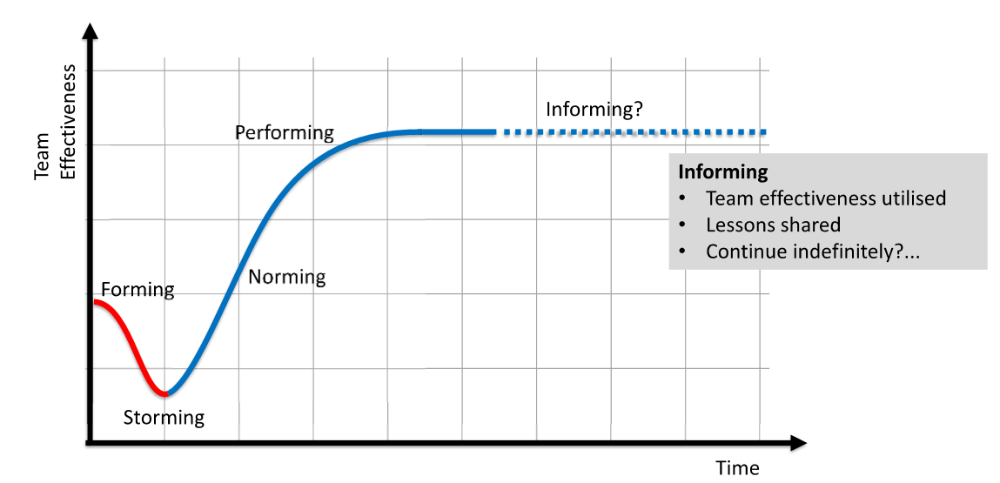

* May eventually lose independent thought, may as well just be a team of one

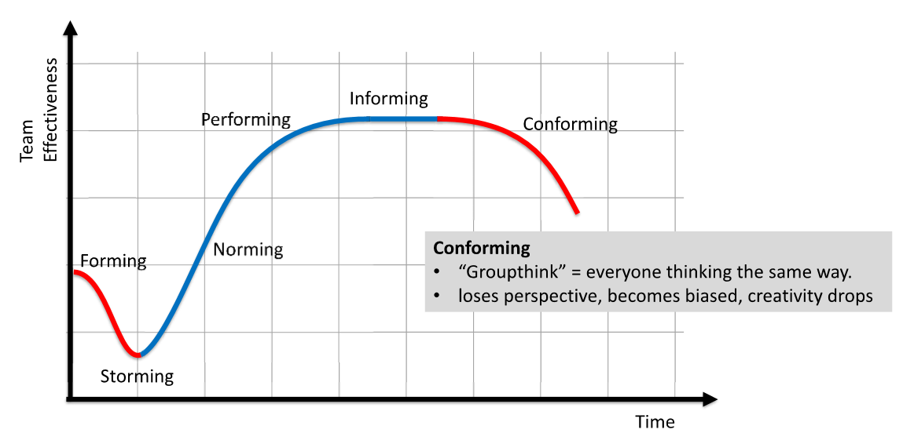

* Which then may lead to the end of the team

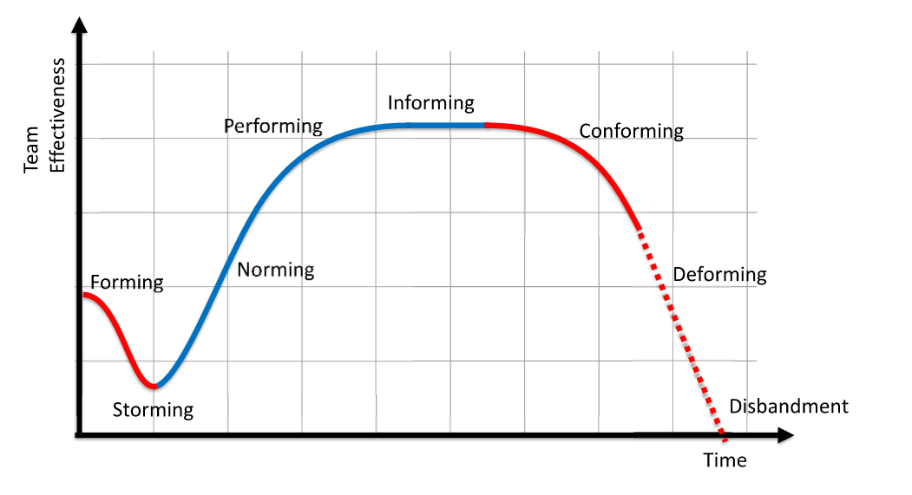

* Sometimes need PM to intervene and shake things up - need to get back to norming stage

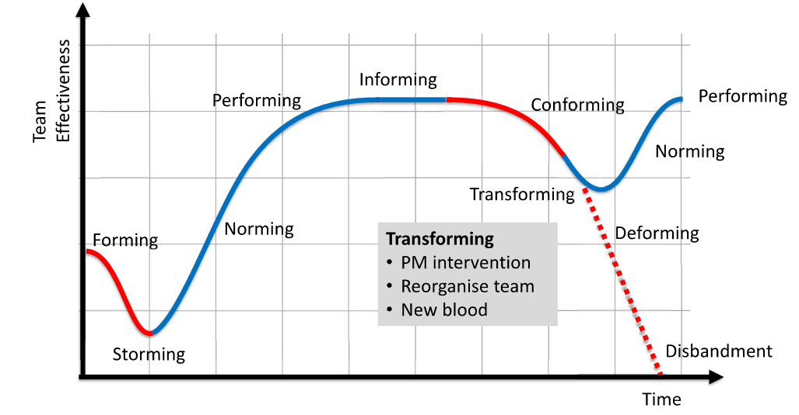

* Leadership interventions:

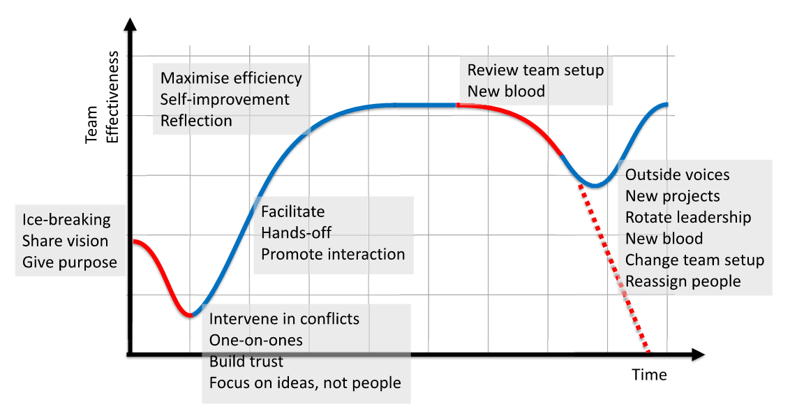

### Motivating People:
* People can often motivate themselves in the right environment
* Remove:
    * Threats to their basic needs
    * Threats to self-esteem/self-motivation
* Understand:
    * What drives them?
    * What is the benefit to them?
* Maslow Hierarchy of Needs:

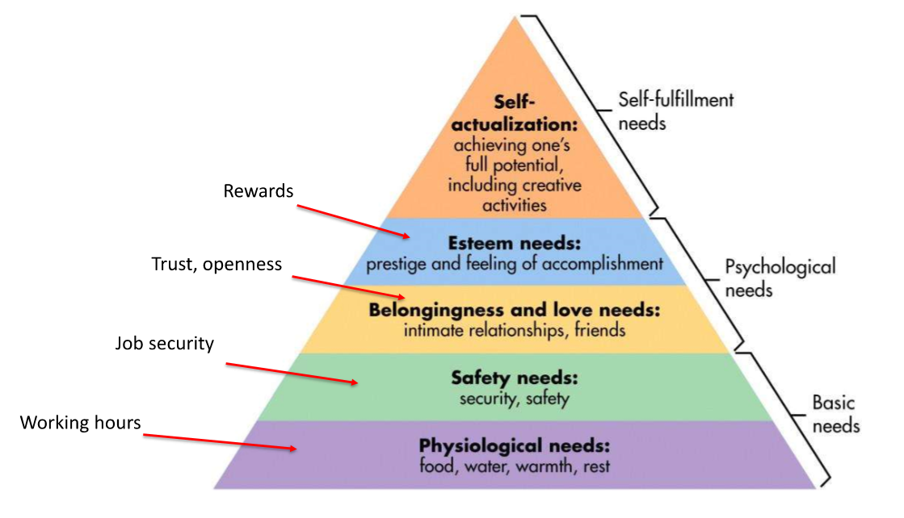

* Common reasons for a decrease in motivation:
    * Lack of management support
        * Lack of trust, resources or encouragement
        * To increase management support:
            * Align project to organisation's strategic goals
            * Keep top management informed of status
            * Divide project into phases and deliver frequently 
    * Personal conflicts (between team members or with managers)
        * To resolve conflicts:
            * Gather information from all sides and come to a mutual agreement on what the problem actually is
            * Involve everyone in brainstorming potential solutions
            * Facilitate a negotiated agreement
    * Overburden
        * Unrealistic or unreasonable expectations
        * To reduce overburden:
            * Define project scope early on and agree with all of the key stakeholders
            * Implement a change management process, evaluating impact to minimise scope creep

### Understanding Personalities:
* We all have different skills, but also:
    * Different needs
    * Different preferences
    * Different ways of seeing the world
    * Different ways of interacting
    * Different ways of making decisions
* Understand, appreciate and utilise these differences to get the most out of the team
* Belbin's Team Roles:

    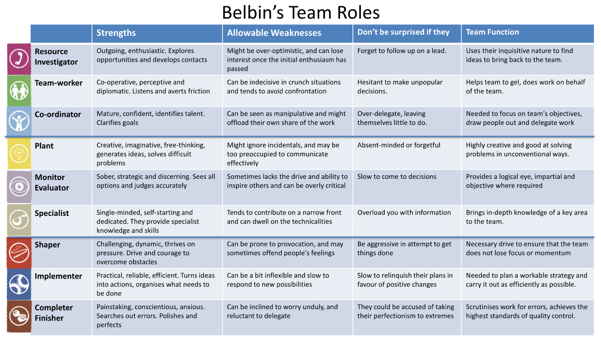

    * Each has strengths and weaknesses, but equal importance
    * A team needs all roles to become a 'high performing team'
    * Most people comfortable in 2 or 3 roles
* Myers-Briggs Personality Preferences:
    * Based on the theory of 'psychological types'
        * How we perceive and judge
    * A way for people to identify their 'type'
    * All types are equal, no 'best type'
    * How do you get your energy? **E**xtroverts/**I**ntroverts
    * How do you see the world and gather information? **S**ensors/i**N**tuitives
    * How do you make decisions? **T**hinkers/**F**eelers
    * How much do you like to plan ahead? **J**udgers/**P**erceivers