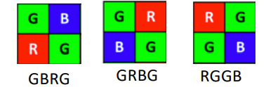
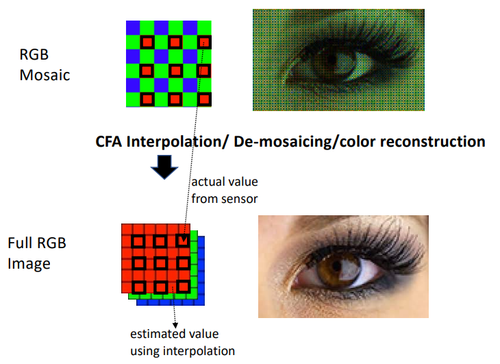
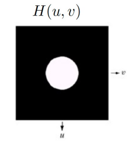
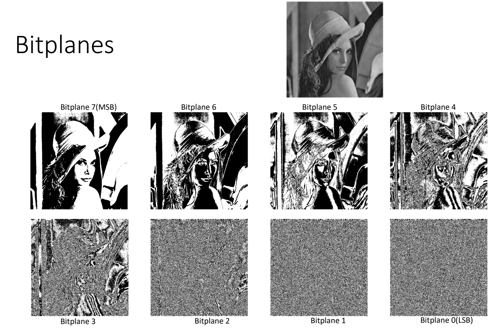
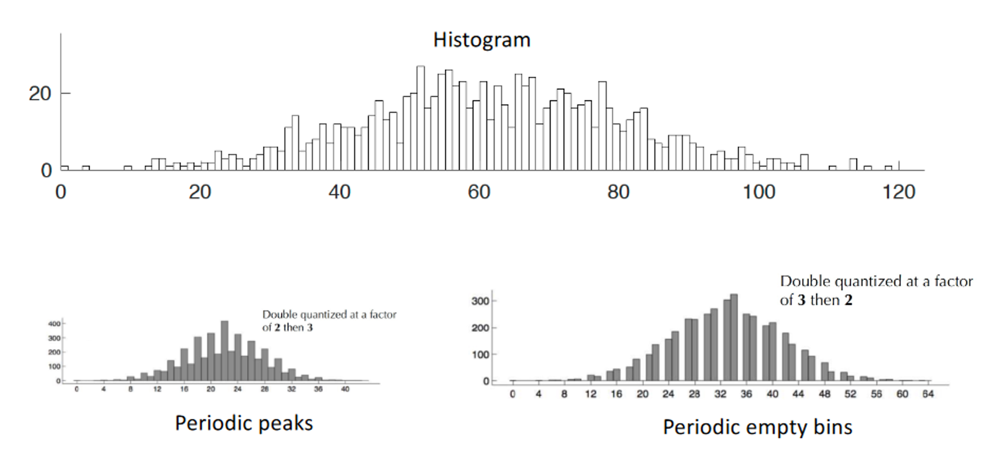

---
header-includes:
    - \newcommand{\argmin}{\mathop{\mathrm{argmin}}}
    - \newcommand{\argmax}{\mathop{\mathrm{argmax}}}
    - \usepackage{float}
    - \let\origfigure\figure
    - \let\endorigfigure\endfigure
    - \renewenvironment{figure}[1][2] {\expandafter\origfigure\expandafter[H]} {\endorigfigure}
geometry: margin=1.5cm
---

# CS355 Digital Forensics
# Image Acquisition
### Image Formation:

* Light goes through a camera lens and is projected onto an image plane

    

* It then goes through a colour filter array (CFA), which allows light of different frequencies (corresponding to colour) to pass through
* It is then focused on an imaging sensor, and is post-processed to produce the final digital image
* Aim is to mimic how humans would view the light

### Imaging Sensor:

* Converts light energy to a proportional electric voltage (corresponds to pixel intensity)
* A sensor array is an array of photo-sensitive devices, with each corresponding to a pixel in the final image
    * Usually Charge Coupled Device (CCD) or Complementary Metal Oxide Semiconductor Sensors (CMOS), which are sensitive to light intensity
* Sampling:
    * The real world is continuous, but a digital image is not
    * Sensor array discretises space - sampling
    * Grid spacing size in the sensor array determines the spatial resolution of an image
    * Sampling in 1D:

        

        * Suppose we have a function $f(t)$
        * Define $\mathrm{comb}(t)$ as $\mathrm{comb}(t) = \begin{cases} 1 & \text{when } t = 0, T, 2T,.., nT\\ 0 & \text{otherwise } \end{cases}$
        * Define the sampled function $f_s(t)$ as $f_s(t) = f(t)\mathrm{comb}(t)$
    * Can extend this to 2D: $f_s(x,y) = f(x,y)\mathrm{comb}(x,y)$
        * Each pixel corresponds to where $\mathrm{comb}(x,y) = 1$
* Quantisation:
    * Discretises intensity values
    * Takes an infinite set and assigns, for each member of the set, a member of a finite set
    * Divide range of set into a fixed number of values, and assign to each member of the continuous set the closest fixed value
    * Each sampled point is quantised

    

### Colour Filter Array:
* A colour filter passes light of a particular wavelength onto the imaging sensor
* Three types of colour filter correspond to the primary colours: red, green and blue
* Bayer patterns
    * Patterns of red, green and blue that form the filter array

        

    * Exact pattern depends on manufacturer, but always two green, one red and one blue
        * Mimics human physiology, which has twice as many green light absorption cells as red or blue
* CFA Interpolation:
    * We have one of R, G or B at each location but we need three colours at each location for further processing
    * Interpolation recovers the complete RGB colour channels from the Bayer pattern array, using nearby cells

    

* Linear Interpolation:
    * Determine $y$ using a linear combination of $y_0$ and $y_1$
    * $y = \frac{y_0(x_1-x)}{x_1-x_0} + \frac{y_1(x-x_0)}{x_1-x_0}$

    
    
* Bilinear Interpolation:
    * Used for 2D
    * Linearly interpolates the two nearest neighbours on each side, and then linearly interpolates the results with the point we are trying to find the $y$ value of 

### Gamma Correction:
* Our eyes do not perceive light the way cameras do
    * Cameras follow a linear relationship between input light and output pixel intensity
    * Our eyes follow a nonlinear relationship between the actual and perceived brightness

    

* Gamma correction accounts for this, translating the actual luminance to the perceived luminance according to our eye's light sensitivity:
    * $v_{out} = v^\gamma$ where $\gamma$ is a constant
* Both input and output should be in range $[0,1]$
    * Normalise input first if it's not
    * For image representation with 8-bits/pixel (pixels range from 0 to 255), we can rewrite gamma correction to $v'_{out} = 255 \times (\frac{v'}{255})^\gamma$
* If $\gamma < 1$, we have gamma compression - image becomes brighter
* If $\gamma > 1$, we have gamma expansion - image becomes darker

### Image Representation:
* RGB images (3D array) can be converted into 2D greyscale images
    * Linear combination of R, G and B components
* Greyscale image $\textbf{I}$ has $M$ rows and $N$ columns
    * $I(m,n) \in [0,L-1]$ - pixel value, e.g. 8-bit image has 256 different intensity levels with $L = 256$
        * $m \in [0,M-1]$
        * $n \in [0,N-1]$

# Image Representation
### RGB Colour Space:
* RGB is one of the most common colour spaces, used for acquisition and display
* When R, G and B are combined in different proportions, they will yield different colours
* RGB is device-dependent
    * Different devices capture or reproduce RGB values slighty differently because the colour filters and their response vary between manufacturers
    * Thus an RGB value does not define exactly the same colour across devices

### Y'UV Colour Space:
* RGB channels can be converted to a luma-chroma colur space (Y'UV)

    

    * Y': the luma component, represents the brightness information
    * UV: the chrominance components, contain the colour differences
* Originally developed for analogue TV transmissions to provide compatibility between black and white and colour TV

### Y'CbCr Colour Space:
* Digital images and videos usually a variant of Y'UV called Y'CbCr (or YCbCr)

    

    * Colour information is placed in the Cb and Cr components
* JPEG supports the Y'CbCr format with the full 8-bit range $[0,255]$ for each component
* Y'CbCr can be obtained by converting RGB pixel-wise:
    * $\begin{bmatrix} 
    Y \\
    C_B \\ 
    C_R \\
    \end{bmatrix} = 
    \begin{bmatrix} 
    0.2990 & 0.5870 & 0.1140 \\
    -0.1687 & -0.3313 & 0.5000 \\ 
    0.5000 & -0.4187 & -0.0813 \\
    \end{bmatrix}
    \begin{bmatrix} 
    R \\
    G \\ 
    B \\
    \end{bmatrix} +
    \begin{bmatrix} 
    0 \\
    128 \\ 
    128 \\
    \end{bmatrix}$
* Likewise, we can convert Y'CbCr back to RGB via the following pixel-wise operation:
    * $\begin{bmatrix} 
    R \\
    G \\ 
    B \\
    \end{bmatrix} = 
    \begin{bmatrix} 
    1.00000 & 0.00000 & 1.40200 \\
    1.00000 & -0.34414 & -0.71414 \\ 
    1.00000 & 1.77220 & 0.00000 \\
    \end{bmatrix}(
    \begin{bmatrix} 
    Y' \\
    C_B \\ 
    C_R \\
    \end{bmatrix} -
    \begin{bmatrix} 
    0 \\
    128 \\ 
    128 \\
    \end{bmatrix})$

### Chroma Subsampling:
* Human eyes are much more sensitive to brightness (greyscale) information compared to colour information
* We have redundancy in the colour channels (CbCr)
* Chrominance information can be reduced without losing significant quality
* General concept of subsampling is to subsample by a factor of $n$
    * Remove every $n$-th element
    * We want to subsample in the colour channels
* Subsampling scheme usually expressed as a three part ration $A:b:c$
    * $A$ - the width of the region in which the subsampling is performed. Usually $A=4$
    * $b$ - the number of Cb and Cr (chroma) samples in each row of $A$ pixels (horizontal factor)
    * $c$ - the number of changes in Cb and Cr samples between the first and second row (vertical factor)
* Always have 2 rows
* Most popular format for digital images and videos: $4:2:0$

    

    * Subsampled using one of four techniques (depends on manufacturer):
        * Average: the subsampled chroma component is the average of the original 2x2 chroma block
        * Left: the subsampled chroma component is the average of the two leftmost chroma pixels of the block
        * Right: the subsampled chroma component is the average of the two rightmost chroma pixels of the block
        * Direct: the subsampled chroma component is the top left chroma pixel

### Comparing Images:
* Often essential to compare two images (or video frames) or two regions of the same image to know how similar or dissimilar they are
* Visual comparisons are not enough for forensic applications
* We need quantitative measures to detect visually imperceptible changes
* MSE:
    * Simplest (dis)similarity measure
    * For images $X$ and $Y$, defined as:
        * $MSE(X,Y) = \frac{1}{N}\sum_{i=1}^N(y_i-x_i)^2$
        * Where $x_i$ and $y_i$ are the image pixels, and $N$ indicates the total pixel number
    * Note that $X$ and $Y$ must be of the same size to compute MSE
    * Simple, parameter-free, memoryless and in quadratic form (convenient for optimisation)
* Correlation:
    * Correlation coefficient (Pearson's $r$) measures statistical relationship between two variables
    * Measures only a linear relationship - both strength and direction
    * Imagine a random process that is generating pixel values as the outcome of a spatially-varying function
        * We can think of an image as a discrete random variable $X$ with integer values between $0$ and $255$ (assuming an 8-bit image)
        * Can calculate expectation, variance and standard deviation of $X$
    * Consider another image $Y$
        * Covariance measures the relationship between $X$ and $Y$
        * $Cov(X, Y) = \frac{1}{N}\sum_{i=1}^N(x_i-\bar{x})(y_i-\bar{y})$
        * If $Y=X$, then $Cov(X, Y=X) = \frac{1}{N}\sum_{i=1}^N(x_i-\bar{x})(x_i-\bar{x}) = Var(X)$
    * For images $X$ and $Y$, the sample correlation coefficient can be computed as:
        * $r(X,Y) = \frac{Cov(X,Y)}{\sqrt{Var(X)Var(Y)}} = \frac{Cov(X,Y)}{\sigma{(X)}\sigma{(Y)}} \in [-1,1]$
        * Letting $Cov(X,Y) = S_{XY}$, we have $r(X,Y) = \frac{S_{XY}}{\sqrt{S_{XX}S_{YY}}}$
        * No correlation when $r=0$. If two images are the same, $r=1$
        * Usually used as $r^2$

### Structural Similarity (SSIM):
* Image distortion may have an impact on MSE and correlation measurements
    * We need a way to make (dis)similarity measurements that are less sensitive to distortion and noise
* Structural distortions:
    * Image structures: spatial patterns, edges, shapes, corners
    * Changes in image structure: loss or addition of structural information
    * Caused by blurring, compression, motion while imaging
* Non-structural distortions:
    * Changes in luminance, contrast, colour translation, rotation
* Structural Similarity (SSIM) is widely used in the imaging industry for benchmarking device performances

    

    * Image distortions have less of an impact on SSIM
    * Separates structural and non-structural information in images, and measures both types of differences between images
* SSIM compares to images at the pixel level
    * A square patch $x$ centred at a pixel in $X$ is compared with the corresponding square patch $y$ in $Y$
* Luminance comparison:
    * Modelled by mean intensity of the local region
    * $l(x,y) = \frac{2\mu_x\mu_y+C_1}{\mu_x^2+\mu_y^2+C_1}$
    * $C_1$ is a user-defined parameter that should not be too large
* Contrast comparison:
    * Modelled by the standard deviation of intensity of the local region
    * $c(x,y) = \frac{2\sigma_x\sigma_y+C_2}{\sigma_x^2+\sigma_y^2+C_2}$
* Structural comparison:
    * Modelled by correlation between normalised patches
    * $\sigma_{xy} = \frac{1}{N-1}\sum_{i=1}^N(x_i-\mu_x)(y_i-\mu_y)$
    * $s(x,y) = \frac{\sigma_{xy}+C_3}{\sigma_x\sigma_y+C_3}$
* Local SSIM score:
    * $SSIM(x,y) = l(x,y)^\alpha \cdot c(x,y)^\beta \cdot s(x,y)^\gamma$ where $\alpha, \beta, \gamma > 0$
    * For $\alpha = \beta = \gamma = 1$, $C_3 = \frac{C_2}{2}$:
        * $SSIM(x,y) = \frac{(2\mu_x\mu_y+C_1)(2\sigma_{xy}+C_2}{(\mu_x^2+\mu_y^2+C_1)(\sigma_x^2+\sigma_y^2+C_2)}$
    * Properties:
        * Symmetry: $SSIM(x,y) = SSIM(y,x)$
        * Boundedness: $SSIM(x,y) \leq 1$
        * Unique maximum: $SSIM(x,y)=1$ only if $x=y$
* Global SSIM score:
    * Mean pooling: $MSSIM(X,Y) = \frac{1}{M}\sum_{j=1}^M SSIM(x_j,y_j)$
    * Minkowski pooling: $MSSIM(X,Y) = \frac{1}{M}\sum_{j=1}^M SSIM(x_j,y_j)^p$

# Image Enhancement - Pixel Domain
* We often need to enhance images for forensic applications
* Enhancements include:
    * Improving illumination
    * Improving contrast
    * Removing unwanted structures (noise) or motion blur
    * Sharpening an image
* Pixel domain (or spatial domain) processing: directly on pixel values, change as needed
    * We use greyscale images (pixel values in range $[0,255]$) for simplicity
    * Most of the techniques can easily be extended to colour images by applying the enhancement techniques to each colour channel separately

### Contrast Enhancement:
* Need a way to do this whilst only being able to change the image pixel-by-pixel
* Given an image with $L$ grey levels, an image histogram $h(k)$ is a discrete function defined as $h(k)=n_k$
    * Where $k$ denotes the grey level $k=0,1,...,L-1$
    * $n_k$ denotes the number of pixels with gray level $k$

    

* A high-contrast image should ideally have a flat histogram spanning the entire range of intensity

    

* Histogram equalisation is a simple yet effective technique for enhancing contrast
    * Convert a given image histogram to a flat one (as close as possible)
* Histogram can be normalised into a probabiliy distribution, referred to as a probability mass function (PMF)
    * Values are between 0 and 1
    * Frequency divided by total
    * Same shape as the original histogram
* For a continuous random variable $X$, the cumulative distribution function (CDF) is defined as:
    * $F_x(X) = P(X \leq x)$
    * If $X$ is discrete, this can be written as $F_x(X) = \sum_{x_i \leq x} P(X=x_i)$

    

* Our goal is to get the CDF to be a straight line:
    * Original CDF: $c_x(k) = \sum_{j=1}^k \frac{n_j}{n}$ where $n_j$ is the frequency of grey level $j$ and $n$ is the total number of pixels
    * Straight line CDF: $c_y(k) = \frac{k}{L-1}$ where $L$ is the total number of grey levels

    

    * We want $c_x(k_x) = c_y(k_y)$:
        * $\sum_{j=1}^{k_x} \frac{n_j}{n} = \frac{k_y}{L-1}$
        * $k_y = \mathrm{round}((L-1)\sum_{j=1}^{k_x} \frac{n_j}{n}$
* For RGB we can perform histogram equalisation on each of the R, G and B channels
* Or, an RGB image can be converted to luma-chroma where the histogram equalisation is performed on the luma channel only

### Noise Removal:
* Noise: unwanted structures in an image that degrade it
    * Occurs due to imperfections in the device, environment, transmission, compression
    * A random quantity, often unknown
* We will make some assumptions about noise for practical purposes:
    * Additive
    * A random variable that can be modelled as a known distribution function (e.g. Gaussian noise)
* $g(x,y)=f(x,y)+\eta(x,y)$
    * $\eta(x,y) \sim \mathcal{N} (0, \sigma^2)$ (may also include negative values)
* Each pixel location follows a zero-mean Gaussian distrbution and is independent of all other locations (independently and identically distributed)
    * $\frac{1}{n}\sum_{(x,y) \in I}\eta(x,y)=0$
* Global averaging:
    * $\frac{1}{n}\sum_{(x,y) \in I}f(x,y)=\frac{1}{n}\sum_{(x,y) \in I}g(x,y)-\frac{1}{n}\sum_{(x,y) \in I}\eta(x,y)$
    * We can remove the noise term, but we also lose the image
* Instead, we should perform local averaging:
    * Replace every pixel by the mean of its neighbouring pixel values (e.g. in a 3x3 square)
    * $\frac{1}{9}\sum_{(x,y) \in I'}f(x,y)=\frac{1}{9}\sum_{(x,y) \in I'}g(x,y)-\frac{1}{9}\sum_{(x,y) \in I'}\eta(x,y)$ where $I'$ is a 3x3 mask
    * The more elements we get, the better noise reduction we get but also the more the information loss 
    * Sharp edges disappear resulting in a blurry image
* Local averaging is a convolution operation (element/entry-wise multiplication followed by a summation)
    * $I'$ is a 3x3 kernel/filter/weights consisting of 1s
    * Can also have weighted averaging kernels
    * Use domain knowledge to see which is the best filter
    * Can also have learnable weights
* Impulse (salt and pepper) noise:
    * Caused by faulty sensors
    Only a few pixels are modified and they are replaced by black or white pixels (dead pixels)
    * The observed pixel $g(x,y)$ can be modelled as:
        * $g(x,y) = \begin{cases} a & \text{with probability } P_a\\ b & \text{with probability } P_b\\ f(x,y) & \text{with probability } 1-P_a-P_b \end{cases}$
        * $a$ and $b$ are normally the min/max pixel values of an image, e.g. 0 and 255 for an 8-bit image
    * Median filter: like the averaging filter, but instead select the median value
        * Less likely to be affected by the extreme values caused by salt and pepper noise

# Image Enhancement - Frequency Domain (DFT)
* Frequency domain methods:

    

* 'Encoder-decoder' structure

### 1D Discrete Function Representation:
* Consider this 1D discrete function of length $N$:
    * $f(x) = (1 \space 2 \space 4 \space ... \space 7)$
* We can represent it as:
    * $f(x) = 1(1 \space 0 \space 0 \space ... \space 0) + 2(0 \space 1 \space 0 \space ... \space 0) + 4(0 \space 0 \space 1 \space ... \space 0) + ... + 7(0 \space 0 \space 0 \space ... \space 1)$
* $b_k(x)$ are the basis vectors
    * This is the trivial case, where the basis vectors are columns of an identity matrix
* $a_k$ are the coefficients: $a_k = \langle f(x), b_k(x) \rangle$
* $f(x) = \sum_{k=0}^{N-1}a_k b_k(x)$
    * Data can be represented as weighted sum of basis vectors
* Can also represent a 1D signal in this way

### Fourier Basis:
* Any function can be expressed in terms of a bunch of harmonic functions with varying frequency

    

* Given a discrete function $f$ with length $M$:
    * Orthogonal basis: $f(x) = \sum_{u=0}^{M-1}F(u)e^{j\frac{2\pi ux}{M}}$
    * Orthonormal basis: $f(x) = \sum_{u=0}^{M-1}F(u)\frac{1}{\sqrt{M}}e^{j\frac{2\pi ux}{M}}$
* $f(x) = \sum_{u=0}^{M-1}F(u)\frac{1}{\sqrt{M}}e^{\frac{j2\pi ux}{M}} = \frac{1}{\sqrt{M}}(F(0) + F(1)e^{j\frac{2\pi x}{M}}+F(2)e^{j\frac{4\pi x}{M}}+...+F(M-1)e^{j\frac{2\pi(M-1)x}{M}})$
    * When $x=0$, $f(x=0) = \frac{1}{\sqrt{M}}(F(0) + F(1)e^0 + F(2)e^0+...+F(M-1)e^0)$
    * When $x=1$, $f(x=1) = \frac{1}{\sqrt{M}}(F(0) + F(1)e^{j\frac{2\pi}{M}}+F(2)e^{j\frac{4\pi}{M}}+...+F(M-1)e^{j\frac{2\pi(M-1)}{M}})$ 
    * When $x=M-1$, $f(x=M-1) = \frac{1}{\sqrt{M}}(F(0) + F(1)e^{j\frac{2\pi (M-1)}{M}}+F(2)e^{j\frac{4\pi (M-1)}{M}}+...+F(M-1)e^{j\frac{2\pi(M-1)^2}{M}})$
* Can be represented in matrix form as:
    * $\begin{bmatrix} 
    f(0) \\
    f(1) \\ 
    f(2) \\
    \vdots \\
    f(M-1)
    \end{bmatrix} = 
    \begin{bmatrix} 
    1 & 1 & 1 & \dots & 1 \\
    1 & e^{j\frac{2\pi}{M}} & e^{j\frac{4\pi}{M}} & \dots & e^{j\frac{2\pi(M-1)}{M}}\\ 
    \vdots & \vdots & \vdots & \ddots & \vdots\\
    1 & e^{j\frac{2\pi(M-1)}{M}} & e^{j\frac{4\pi(M-1)}{M}} & \dots & e^{j\frac{2\pi(M-1)^2}{M}}\\
    \end{bmatrix}
    \begin{bmatrix} 
    F(0) \\
    F(1) \\ 
    F(2) \\
    \vdots \\
    F(M-1)
    \end{bmatrix}$
    * $\textbf{f} = \textbf{Ax}$
        * $\textbf{f}$ is the input ($M \times 1$)
        * $\textbf{A}$ is the fourier basis matrix ($M \times M$)
        * $\textbf{x}$ is the Fourier coefficients ($M \times 1$)
* Fourier transform involves inverting the Fourier matrix
    * $\textbf{x} = \textbf{A}^{-1}\textbf{f}$
    * An orthonormal matrix is a real square matrix whose columns and rows are orthonormal vectors
        * $\textbf{AA}^{-1} = \textbf{I} = \textbf{AA}^T$
    * Since $\textbf{A}$ is a symmetric matrix, $\textbf{A} = \textbf{A}^T$
    * Since $\textbf{A}$ is a complex matrix, we use the conjugate transpose (transpose and replace each complex element with its conjugate)
        * $\textbf{x} = \textbf{A}^*\textbf{f}$
        * $\textbf{A}^* = \frac{1}{\sqrt{M}}
        \begin{bmatrix} 
        1 & 1 & 1 & \dots & 1 \\
        1 & e^{-j\frac{2\pi}{M}} & e^{-j\frac{4\pi}{M}} & \dots & e^{-j\frac{2\pi(M-1)}{M}}\\ 
        \vdots & \vdots & \vdots & \ddots & \vdots\\
        1 & e^{-j\frac{2\pi(M-1)}{M}} & e^{-j\frac{4\pi(M-1)}{M}} & \dots & e^{-j\frac{2\pi(M-1)^2}{M}}\\
        \end{bmatrix}$
* Forward Fourier transform: from time/space to frequency 
    * $\textbf{x} = \textbf{A}^*\textbf{f}$
    * $F(u) = \frac{1}{M}\sum_{x=0}^{M-1}f(x)e^{-j\frac{2\pi ux}{M}}$
    * Want to know which frequency components are present in a given function and at what amount
* Inverse Fourier transform: from frequency to time/space
    * $\textbf{f} = \textbf{Ax}$
    * $f(x) = \sum_{u=0}^{M-1}F(u)e^{j\frac{2\pi ux}{M}}$

### 2D Fourier Basis:
* Frequency can change in both the horizontal and vertical directions

    

* Image is a function of two spatial variables $f(x,y)$
    * With size $M \times N$, can be represented as a weighted superposition of a 2D Fourier basis of varying frequencies: $f(x,y) = \sum_{u=0}^{M-1}\sum_{v=0}^{N-1}F(u,v)e^{j2\pi(\frac{ux}{M}+\frac{vy}{N})}$
    * For the forward Fourier transform, we have $F(u,v) = \frac{1}{M}\frac{1}{N}\sum_{x=0}^{M-1}\sum_{y=0}^{N-1}f(x,y)e^{-j2\pi(\frac{ux}{M}+\frac{vy}{N})}$

    

* The definition of the 2D DFT indicates that the frequency coordinates run from the origin (DC component, $u=0$ and $v=0$) at the top left corner
* It is practical to centre the 2D DFT basis by shifting its origin to the centre of the array, which is much easier for image filtering in the image domain

    

    * The basis should be the same size as the image

### Fourier Spectrum:

* Shows magnitude of complex number coefficients at each point in the basis 

    

* Although the input image and spectrum have the same size, there is no 1-1 location mapping between the spatial and frequency domain

### Noise Removal in the Frequency Domain:
* We modify the spectrum using a mask
* Most noise appears in the high frequency components, so we need to modify or remove the high frequency coefficients to remove noise
* Set the high frequency components to zero, which will remove the noise but also lose some information

* Ideal low pass filter:
    * $H(u,v) = \begin{cases} 1 & \text{if } D(u,v) \leq D_0\\ 0 & \text{if } D(u,v) > D_0 \end{cases}$
    * $D(u,v)$ is the distance from the centre of the frequency rectangle to any point $(u,v)$
    * $D_0$ is the cut-off radius

    

* Gaussian low pass filter:
    * $H(u,v) = e^{-\frac{D^2(u,v)}{2D_0^2}}$

    

* Butterworth low pass filter:
    * $H(u,v) = \frac{1}{1+(\frac{D(u,v)}{D_0})^{2n}}$
    * $n$ is a parameter

    

* High pass filters:
    * $H_{HP} = 1-H_{LP}(u,v)$
    * Can be used to find edges (i.e. parts of the image with high frequency)
    * Ideal high pass filter: $H(u,v) = \begin{cases} 0 & \text{if } D(u,v) \leq D_0\\ 1 & \text{if } D(u,v) > D_0 \end{cases}$
    * Gaussian high pass filter: $H(u,v) = 1-e^{-\frac{D^2(u,v)}{2D_0^2}}$
    * Butterworth high pass filter: $H(u,v) = \frac{1}{1+(\frac{D_0}{D(u,v)})^{2n}}$
* For challenging cases, we can use hybrid methods for enhancement

### Notch Filters:
* Can be used to remove repetitive spectral noise:
    * A narrow mask that notches out particular frequencies
    * Zero out a selected component (and maybe some of its neighbours) and leave other frequencies intact
    * An ad hoc procedure - requires a human expert to determine which frequencies need to be removed to clean up the image

    

### Discrete Cosine Transform (DCT):
* Similar to DFT, but only uses cosines as a basis which makes it a real transform (real transform function and real coefficients)

    

* Given an input $f(x) with size $N$, we have both forward and inverse DCT:
    * $F(u) = \sum_{x=0}^{N-1}f(x)\alpha(u)\cos(\frac{\pi(2x+1)u}{2N})$
    * $f(x) = \sum_{u=0}^{N-1}F(u)\alpha(u)\cos(\frac{\pi(2x+1)u}{2N})$
    * $\alpha(u) = \begin{cases} \sqrt{\frac{1}{N}} & \text{for } u=0\\ \sqrt{\frac{2}{N}} & \text{for } u = 1, 2, ..., N-1\end{cases}$
    * DC component: $F(0) = \frac{1}{\sqrt{N}}\sum_{x=0}^{N-1}f(x)$
* DCT basis matrix is orthnormal, real and symmetric
* DCT is the same length as the input function (as in DFT)
* Can easily be extended to 2D. For an input $f(x,y)$ with size $M \times N$:
    * $F(u,v) = \sum_{x=0}^{M-1}\sum_{y=0}^{N-1}f(x,y)\alpha(u)\alpha(v)\cos(\frac{\pi(2x+1)u}{2M})\cos(\frac{\pi(2y+1)v}{2N})$
    * $f(x,y) = \sum_{u=0}^{M-1}\sum_{v=0}^{N-1}F(u,v)\alpha(u)\alpha(v)\cos(\frac{\pi(2x+1)u}{2M})\cos(\frac{\pi(2y+1)v}{2N})$
    * DC component: $F(0,0) = \frac{1}{\sqrt{MN}}\sum_{x=0}^{M-1}\sum_{y=0}^{N-1}f(x,y)$
* DCT can represent an image in a more compact manner, i.e. only a small number of DCT coefficients are large and others are very small
    * This is useful for compression, where we can disregard coefficients with very small values without introducing visual distortion in the reconstructed image

# Digital Watermarking - Pixel Domain
* Aims to answer the question 'is the data authentic?'
    * We have to actively insert a signature pattern into the data before it is distributed
    * The signature pattern should be available to forensics experts
* A tool to identify the source, creator, owner, distributor or an authorised consumer of an image or video
* In general, a watermarking framework consists of 3 components:
    * Encoder (__E__)
    * Decoder (__D__)
    * Comparator (__C__)

### Types of Digital Watermarks:
* Blind vs. not blind
    * Blind watermarking does not require access to the original unwatermarked data to recover the watermark
* Perceptible vs. imperceptible
* Private vs. public
    * Only authorised users can detect the private watermark
* Robust vs. fragile
    * Robust: designed to survive intentional (malicious) and unintentional (non-malicious modifications)
    * Semi-fragile: designed for detecting any unauthorised modification and at the same time allowing some basic modifications, such as rotation, scaling and cropping
    * Fragile: modifications will destroy watermark - used to detect any unauthorised modification

### Applications:
* Ownership claim:
    * __A__ embeds a visible watermark in the primary object of an image to make an ownership claim and also make it useless for others to use it
* Ownership/copyright identification:
    * __A__ is the owner of an image
    * __A__ adds an invisible, robust watermark to it and makes the watermarked image available to the public
    * __B__ collects __A__'s image from the internet and claims to be the owner (after some modifications)
    * __A__ can prove ownership of the image by showing the presence of __A__'s watermark from the modified image 
* Unauthorised copy detection:
    * __A__ is the owner of a video. __A__ makes 4 copies of it, and embeds a different watermark to each legal copy
    * __A__ shares the copies with 4 paid users
    * Illegal copies are found on the internet. The unique watermark can be used to trace with of the 4 users leaked the copy
* Tampering detection:
    * __A__ embeds a fragile watermark in an image and makes it publicly available
    * __B__ tampers the image
    * __A__ extracts the distorted watermark from the tampered image and compares with the original to prove tampering

### Watermarking by Bitplane Substitution:
* The simplest watermarking technique involves changing pixel values in an image in its less important bitplanes
    * Least significant bits in each pixel
    * Generally these are just noise

    

* The watermark can be smaller than or equal to the size of the image
* We can insert multiple watermarks if needed
* Content-dependent watermark: extract from the host image
* Content-independent watermark: a different image, such as a logo

    

* Watermark becomes more visible the more significant bitplane it is substituted into

### Content-dependent Watermark:
* Select $N$ pixel locations randomly
* Watermark is formed using the 7 most significant bits of each pixel
* $N$ 7-bit segments from the $N$ different pixels are concatenated to form a watermark of length $7N$
* How to select the watermark embedding location:
    * Embed in specific bit planes over te entire image
    * Embed in specific bit planes of selected image regions (e.g. $N \times N$ region centred at location $(x,y)$)
    * Pixel locations are chosen randomly. To decode such a watermark a key is required
        * The key is usually the seed to the random number generator
    * Select those piels which are more tolerant to visual changes
        * Based on local properties of an image and how the human visual system (HVS) works
        * HVS less sensitive to changes in the blue channel and to distortions in the edges of an image

### Properties:
* Extremely simple and fast
* Can create visible or invisible watermarks
* Does not necessarily require the original image to recover the watermark (blind watermark)
    * Only need bitplane location and embedded pixel locations
* The watermarks are fragile/semi-fragile
    * Simple attacks like cropping can destroy it
    * Pixel locations spread over the entire image is more robust to modifications such as cropping
    * The entire watermark can be removed by removing the LSB plane
    * Survives compression to an extent

# Digital Watermarking - Frequency Domain
* A more sophisticated approach to digital watermarking involves changing the frequency components of an image obtained using DCT (or DFT)
* Main idea is to embed the atermark in the perceptually important regions of the image, so that the watermark is hard to remove without degrading the physical quality of the image
    * Invisible watermark
    * Known to be more robust to common watermarking attacks
    * Works well for audio data as well

### Perceptually significant regions:
* DC coefficient $w_{00}$: carries most of the energy of the imae
* Rest of the coefficients (AC coefficients) can be divided into three regions:
    * Low frequency region - very important
    * Mid frequency region - somewhat important
    * High frequency region - least important

    

* We want to embed the watermark in the low and mid-frequency regions
* Standard dimension of an image - 8x8:

    

### LSB Substitution:
* Take the DCT components corresponding to those in the bitstream of the watermark
* Taking the absolute value of the integer part of each coefficient, change the least significant bit to either 0 or 1 depending on the bit in the bitstream for the corresponding component
* Add back sign and fractional part to coefficient

### Spread Spectrum (SS):
* Spread over many frequency bins so that the energy in any one bin can be very small and undetectable
* Consider an $N \times N$ image
* Create a watermark $\textbf{w} = \{w_i\}$, $i=1,...,m$ that is a random, Gaussian-distributed sequence with mean $\mu = 0$ and variance $\sigma = 1$
* Let $\textbf{h} = \{h_i\}$, $i=1,...,m$ represent the perceptually important DCT coefficients of the cover image as a vector
* Let $\textbf{h}^* = \{h_i^*\}$, $i=1,...,m$ represent the new DCT coefficients after watermarking
* Popular embedding methods:
    * $h_i^* = h_i(1+\alpha w_i)$
    * $h_i^* = h_i(e^{\alpha w_i})$
    * $h_i^* = h_i(1+\alpha_i w_i)$ where $\alpha_i = \alpha h_i$
* A large $\alpha$ would produce a higher distortion on the watermarked image
* With the updated $\textbf{h}^*$ coefficients, can compute the inverse 2D DCT to obtain the watermarked image
* Can recover the watermark via, for example:
    * $\hat{w}_i = \frac{h_i^*-h_i}{\alpha h_i}$
    * Note that access to the original, unwatermarked image is needed

### Hybrid Watermarking:
* Block-based approaches help embed watermarks in both the spatial and frequency domains, known as hybrid watermarking
* Simple hybrid watermarking example:
    * Divide a given image into blocks
    * Choose in which blocks we want to embed the watermark
    * Take the 2D DCT of each block and embed the watermark
    * Decoder needs information about which blocks to decode
* Another example of hybrid watermarking:
    * Divide a given image into blocks (watermark usually embedded in all blocks)
    * For each block $A$ take the 2D DCT
    * Choose two locations in the DCT coefficient matrix that are of equal perceptual importance (coefficients roughly equal)
        * Swapping them will not degrade the image's quality
    * Given a watermark bitstream $\textbf{w}$ and letting $i$ and $j$ being the first and second locations in the image respectively, we apply the following rules:
        * $|A(i)| \geq |A(j)|$ implies $0$, otherwise $1$
        * If the implied value does not match our watermark bitstream, flip the values
    * Decoding:
        * Check if the values are flipped
        * Check if $|A(i)| \geq |A(j)|$ - if yes, then the next bit should be $0$ and otherwise $1$ as long as the values are not flipped. Otherwise, it is the opposite way round

### Watermarking Attacks:
* Watermarking in the frequency domain is known to be more robust to common watermarking attacks:
    * Cropping: watermark is embedded in the entire spatial extent of the image
    * Compression: watermark is inserted in the components with low frequency, which survive compression
    * Removal: to destroy the watermark, high values needed to be added to all frequencies. This affects the visual quality severely, and such attacks can be easily detected
    * Filtering: it survives low-pass filtering
* Jitter attack:
    * The basic idea is to change the locations of embeded watermarks so that they cannot be recovered
    * Split the audio/image into a number of small chunks
    * Duplicate or delete data points at random
    * Imperceptible in images

### Comparing Watermarks:
* In simple cases we can use MSE, correlation coefficient or SSIM 
* For SS watermarking we particularly use:
    * $\mathrm{sim}(\hat{\textbf{w}}, \textbf{w}) = \frac{\hat{\textbf{w}}\textbf{w}^T}{\sqrt{\hat{\textbf{w}}\hat{\textbf{w}}^T}}$
* If similarity is higher than a threshold, it is considered a match
    * For a long watermark sequence ($m > 200$), the threshold is normally set to 6
    * If an attacker generates a random Gaussian-distributed watermark, in very rare cases the watermarks will match. Longer watermarks will reduce the possibility further

# Image Compression
* Raw images are ready for viewing in the RGB colour space
* Store the image in a file with no compression - TIFF file
* In practice, this is very uncommon
    * Images from digital cameras are natural photographic images with high amounts of redundancy
    * Lossy or lossless compression is usually applied
* Consider two images $\textbf{A}$ and $\textbf{B}$, using $n_1$ and $n_2$ bits respectively
    * Compression ratio $c_r$ is defined as $c_r = \frac{n_1}{n_2}$
    * Data redundancy is defined as $r_d = 1 - \frac{1}{c_r}$
        * If $n_1=n_2$, $c_r=1$, $r_d=0$
        * If $n_1 \gg n_2$, $c_r \rightarrow \infty$, $r_d \rightarrow 1$

### Role of compression in forensics:
* Attacker obtains the original image saved in compressed format (JPEG)
* Attacker opens (decompresses) the image and alters its content
* Attacker saves the image back into the same format
* This will leave some traces of tampering in the image
* Our objective is to detect those artifacts to prove forgery

### Redundancy in Images:
* Compression algorithms attempt to remove redundancies in images
* Types of redundancy:
    * Spatial redundancy: pixel values are highly correlated with neighbouring redundancies. Correlations also exist on a higher level with repeating patterns and structures
    * Psychovisual redundancy: details in images that our visual system cannot see (e.g. image contents corresponding to high frequency coefficients in 2D DCT)
    * Coding redundancy: using more bits per pixel per needed (e.g. using 8 bits per pixel for an image that can be represented using 4 different grey levels)

### Image Compression Steps:
* Encoder:

    
* Decoder:

    

### JPEG Compression:
* JPEG (Joint Photographics Expert Group) is the most common image compression algorithm
* Uses lossy compression
* JPEG compression steps:

    

* First need to convert RGB to YCbCr, and optionally chroma subsample
* Then divide image into non-overlapping 8x8 or 16x16 blocks, with encoding being done on each block separately
    * Each block is called a macroblock or minimum encoded unit
    * Reason for this is so that changes in pixel values are expected to be minimal, yielding larger values for low-frequency components and smaller values for high-frequency components in the DCT domain
    * Quantisation then ensures better compression without high information loss
* Perform DCT transform
    * Energy is preserved under DCT mapping:
        * $||\textbf{f}||^2 = \textbf{f}^T\textbf{f}$
        * $=\textbf{f}^T\textbf{A}^T\textbf{Af}$
        * $=(\textbf{Af})^T\textbf{Af} = \textbf{x}^T\textbf{x} = ||\textbf{x}||^2$
    * DCT has the ability to capture most of the energy within a small number of coefficients
* Quantisation:
    * The main lossy step in JPEG
    * Each DCT coefficient is quantised by a pre-defined factor:
        * $F_Q(u,v) = \mathrm{round}(\frac{F(u,v)}{Q(u,v)})$
        * $Q$ is a quantisation matrix, where the values are typically larger in the high-frequency components
    * Quantisation matrix is designed to roughly model the sensitivity of the HVS
    * The quantisation factors determine the quality of the compressed image
        * JPEG quality levels vary from 1 to 100, where 100 indicates the best quality level
        * The quantisation factors increase more quickly as the frequencies increase as the quality level falls
    * Note that when dequantising $\hat{F}(u,v) = F_Q(u,v)Q(u,v)$, we get a quantisation error $\epsilon = |F(u,v)-\hat{F}(u,v)|$ due to the fact that values are rounded
    
    

    * We remove the section of the block that becomes just zeroes to save data:

        

### Huffman Coding:
* Suppose we have a 4x5 image $\textbf{I}$

    

    * If we use 8 bits to code all the entries, the size will be 4x5x8 bits
    * Since there are only 4 different symbols, we may use 2 bits instead
        * 00 = 21, 01 = 95, 10 = 169, 11 = 243
        * The codewords have to be communicated to the decoder
* Basic idea of Huffman coding: assign short codewords to symbols with higher probability and longer codewords to the ones with lower probability
    * In our example: 21 has probability 0.5, 95 has probability 0.1, 169 has probability 0.2 and 243 has probability 0.2

        

    * Huffman code is not unique
* Given a code, it is easy to encode the message by replacing the symbols by the codewords
    * A code is only uniquely decodable if no code is a prefix to another code
        * E.g. the code $C_3 = \{a=1, b=110, c=10, d=111\}$. The word `bad` encodes to $1101111$ but can be decoded as `bad`, `bda` `acda` or `acad`
* This is known as variable-length encoding
    * Going back to our example, the number of bits required will be: 10x1 (1 = 21) + 4x2 (01 = 169) + 4x3 (001 = 243) + 2x3 (000 = 95) = 36
    * With 20 symbols total, this comes out to 1.8 bits/symbol
    * Compared with 2 bits/symbol for a fixed-length encoding  
* We want to know what the optimal coding is

### Entropy Coding:
* Entropy coding is a lossless compression technique applicable
* Fundamental concept in information theory 
* A measure of uncertainty in data:
    * Suppose a source $\textbf{z}$ generates two symbols $a_1, a_2$
    * $P(a_1)=p, P(a_2)=1-p$
    * Entropy is defined as $H(\textbf{z}) = p\log\frac{1}{p}+(1-p)\log\frac{1}{1-p}$
    * The higher the entropy, the higher the uncertainty in data
    * More generally, a source $\textbf{z}$ generates $a_1,a_2,...,a_n$
    * $P(a_1)=p_1,P(a_2)=p_2,...$ such that $\sum_{i=1}^n p_j=1$
    * Entropy is defined as $H(\textbf{z})=-\sum_{j=1}^n p_i\log p_i$
* Shannon's source coding theorem: in an uniquely decodable coding scheme, the average codeword length of a source can at best be equal to the source entropy, and not less than it
    * Entropy is the bound on maximum compression that can be achieved using entropy coding
    * In our example: $H(\textbf{z})= -0.5\log0.5-0.1\log0.1-0.2\log0.2-0.2\log0.2=1.76$ bits/symbol

# Compression-based Forensics
* Largely rely on detecting artifacts introduced due to multiple quantisation

### Splicing Forgery:
* Have two JPEG images of quality $q_1$ and $q_2$ respectively
* Splice some of the $q_1$ image onto the $q_1$ image
* Save as a new JPEG image of quality $q_3$
* Spliced region is compressed at $q_1$ and then $q_3$, while the rest of the image is compressed at $q_2$ and then $q_3$

### Copy-move:
* Have a JPEG image at quality $q_1$
* Image is altered using its own parts
* All regions are compressed at $q_1$ and then $q_2$

### Methods of Compression-based Forensics:
* Double Compression:
    * Can only tell us if an image has been compressed multiple times. This can be intentional or accidental, so forgery is a possibility but not confirmed
    * Used as a screening process - if unusual artifacts are found, further forensic analysis is needed to confirm forgery
* JPEG Ghost:
    * Can detect splicing forgery, and even localise the regions that come from a different image

### Double Compression:
* Quantisation changes DCT coefficients
* Double quantisation artifacts will be visible in the distribution of DCT coefficients
* Given a variable $u$, with the entries sampled from a 1D discrete function $f[x]$:
    * Quantisation may be considered as an entry-wise operation described by a one-parameter family of functions
    * $q_a(u) = \lfloor\frac{u}{a}\rfloor$ where $u \in f[x]$ and $a$ is the quantisation factor
    * De-quantisation brings the quantised values back to their original range by multiplying the quantised value by the quantisation factor: $q_a(u)a = \lfloor\frac{u}{a}\rfloor a$
    * Double quantisation, by factor $a$ followed by $b$: $q_{ab}(u) = \lfloor q_a(u)\frac{a}{b}\rfloor = \lfloor\lfloor\frac{u}{a}\rfloor\frac{a}{b}\rfloor$
* Example:
    * Consider $f[x]$ to be normally distributed integer samples in the range $[0,127]$
    * Suppose there are $B_n$ elements with value $n$
    * When quantised by factor 2, there will be $B_0+B_1$ elements with value 0 (both 0 and 1 get rounded down to 0), $B_2+B_3$ elements with value 1 (both 2 and 3 get rounded down to 2), and so on
    * When dequantised, there will be $B_0+B_1$ elements with value 0, $B_2+B_3$ elements with value 2, and so on
    * When quantised again by factor 3, there will be $B_0+B_1+B_2+B_3$ elements with value 0 (both 0 and 2 get rounded down to 0), $B_4+B_5$ elements with value 1, $B_6+B_7+B_8+B_9$ elements with value 2, $B_{10}+B_{11}$ elements with value 3...

    

* Another example:
    * Now quantise with factor of 3 and then 2

    

* Artifacts:
    * Periodic empty bins - quantisation by factor 3 places the original samples into 42 bins, while the second quantisation by factor 2 redistributes them into 64 bins
    * Periodic peaks - quantisation by factor 2 places the original samples into 64 bins, while the second quantisation by factor 3 redistributes them into 42 bins
* Double quantisation artifacts will be visible in the distribution of DCT coefficients

### JPEG Ghost:
* A compression-based technique similar to double compression - relies on double quantisation
* Particularly useful for detecting splicing forgery
* It can even localise the regions that have possibly come from a different image
* Suppose we have a set of coefficients $\textbf{c}_1$ that are quantised by $q_1$ and then de-quantised by $q_1$ to produce $\textbf{c}_1^*$:
    * $Q(\textbf{c}_1) = \mathrm{round}(\frac{\textbf{c}_1}{q_1})$
    * $\textbf{c}_1^* = q_1Q(\textbf{c}_1)$
* Set $\textbf{c}_1$ is subsequently quantised a second time by $q_2$ and subsequently de-quantised by $q_2$ to produce $\textbf{c}_2^*$:
    * $Q(\textbf{c}_2) = \mathrm{round}(\frac{\textbf{c}_1^*}{q_2})$
    * $\textbf{c}_2^* = q_2Q(\textbf{c}_1^*)$
* Define the sum of squared difference $SSD(\textbf{c}_1^*, \textbf{c}_2^*) = \sum_{i \in \{R,G,B\}}\sum_x \sum_y (f(x,y,i)_{\textbf{c}_1^*}-f(x,y,i)_{\textbf{c}_2^*})^2$
    * $SSD(\textbf{c}_1^*, \textbf{c}_2^*)$ increases as $q_2$ increases
    * When $q_2=q_1$, $SSD(\textbf{c}_1^*, \textbf{c}_2^*)=0$

    

* Suppose that an image is compressed at quality $q_1$. An image compressed at quality $q_2$ is inserted into the image and the resulting image is compressed at quality $q_1$
    * We try compressing the image at various quality levels 
    * Instead of using SSD, for each quality level $Q$ at each pixel location we calculate the difference as follows: $d(x,y,Q) = \frac{1}{3}\sum_{i \in \{R,G,B\}}(f(x,y,i)_{\textbf{c}_1^*}-f(x,y,i)_{\textbf{c}_2^*})^2$
    * We expect to see a minimum at $Q=q_2$ where the spliced region was compressed twice

    

* Consider an improved difference measure that is spatially averaged and normalised:
    * $\delta(x,y,q) = \frac{1}{3}\sum_{i=1}^3\frac{1}{b^2}\sum_{b_x=0}^{b-1}\sum_{b_y=0}^{b-1}(f(x+b_x,y+b_y,i)-f_q(x+b_x,y+b_y,i))^2$
    * Normalised to have values within $[0,1]$: $d(x,y,q)=\frac{\delta(x,y,q)-\min_q(\delta(x,y,q))}{\max_q(\delta(x,y,q)-\min_q(\delta(x,y,q)))}$

# Copy-Move Forgery Detection
* Forged segment is usually a connected component copied from the same image
* Search for identical blocks in the image
    * JPEG compression may chaneg the appearance slightly
    * Cloned region may be placed into 4 different DCT blocks and compressed slightly differently from the original copied region
* Search for very similar blocks
    * For each possible block, go over the rest of the block to find matches
    * Computational cost can be high
* Detection will be based on the similarity between the original segment and the pasted ones
* A detection algorithm must:
    * Allow for an approximate match of small image segments
    * Run in a reasonable time while minimising false positives

### Circular Shift and Match:
* An exhaustive search
* Algorithm:
    * Create a binary image $\textbf{A}$ with all 0s
    * For loop ($k$,$l$):
        * Circularly shift the image $\textbf{I}$ by $k$, $l$ - set $x_{i,j}$ to $x_{(i+k)\mod M,(j+1)\mod N}$ - to produce $\textbf{S}$
        * Compare $\textbf{S}$ with $\textbf{I}$:
            * Output binary mask $\textbf{D}$ where $\textbf{D}_{k,l} = 1$ if $|\textbf{I}-\textbf{S}_{k,l}|<t$

            

        * Set $\textbf{A} = \textbf{A} \space OR \space \textbf{D}$
* In a lot of cases, a number of pixel pairs may produce false positives
* We have to process these regions further by applying morphological processing (erosion and dilation)
    * Erosion: the value of the output pixel is set to the minimum value of all the pixels in the input pixel's neighbourhood (set to 0 if any neighbouring pixels are 0)
    * Dilation: the value of the output pixel is set to the maximum value of all the pixels in the input pixel's neighbourhood (set to 1 if any neighbouring pixels are 1)

### Block Matching - Spatial Domain:
* A fast-searching method for similar blocks
* Algorithm:
    * Slide a $b \times b$ block by 1 pixel across the image (top left to bottom right)
    * Convert each block to a vector of length $b^2$ and store the position of each block in an array $P$
    * Sort the feature table $T$ lexicographically 
    * Two consecutive rows in $T$ may correspond to two similar blocks
    * Identify very similar block pairs via thresholding and identify the locations of the similar blocks via $P$

### Block Matching - Frequency Domain:
* DCT coefficients encode the local block information, e.g. DC component encodes all the zero-frequency in the local block
    * Highly overlapped blocks might be very similar
    * Too many false positives - need to do some post-processing
* Check that similar blocks are all between the same two areas of an image
    * Counter of shift vectors needs to be above a threshold

# Feature Matching Techniques
### Image Features:
* A feature vector is a signature of an image that captures its important characteristics
* The features can be used for various pattern recognition tasks
* Features can be global or local, depending on whether they capture properties of the entire image or just a smaller part of it
* Features of an image region can be:
    * Raw pixel values (lots of redundancies, not robust)
    * Features in the frequency domain (gets rid of some redundancies)
    * Statistical features (e.g. SSIM)
    * Features to encode shape, colour, texture, etc.
* Good features should be a compact and robust representation of the image/region
    * Robust against noise, geometric distortions (translation, rotation, scaling) and photometric distortions (illumination, contrast)

### Local Binary Pattern (LBP):
* A popular and important feature than can efficiently encode the texture information of an image region
* Texture can be characterised by complex patterns composed of sub-patterns
* Computing LBP:
    * Consider a $P$-connect neighbourhood
    * Threshold the neighbourhood pixel values using the centre pixel value (1 if greater than it, otherwise 0)
    * Write out the neighbourhood pixel values as a single binary number, starting with the top left and going clockwise around
    * This is the LBP code

    

* LBP has some good properties, e.g. robust and invariant to illumination changes
* Rotation invariant LBP:
    * Write down LBP codes computed by starting from different points in the circle, and take the minimum in the set
* We can now compute an LBP histogram:
    * With an 8-bit neighbourhood, we have 256 bins the histogram
    * We want to use a more compact LBP feature
    * Uniform LBP codes are those that have at most 2 transitions (1 to 0 or 0 to 1) - take only uniform LBP codes
        * With an 8-bit neighbourhood, the number of bins is now only 59 (58 uniform LBP codes plus 1 for non-uniform)

### Histogram of Oriented Gradients (HoG):
* Computing gradients of an image:
    * Discrete approximations (from Taylor series) of first order derivatives are given by:
        * $f'(x) \approx f(x+1)-f(x)$
        * $f'(x) \approx f(x)-f(x-1)$
    * Discete approximation for second order derivatives is given by:
        * $f''(x) \approx f(x+1)-2f(x)+f(x-1)$
    * In matrix form: $f'(x)=\begin{bmatrix}-1 & 1\end{bmatrix} \begin{bmatrix}f(x) & f(x+1)\end{bmatrix}^T$
        * Can be treated as a convolution operation $f'(x)=f(x)*\nabla$ (slide and weighted sum)
        * $f''(x)=\begin{bmatrix}1 & -2 & 1\end{bmatrix} \begin{bmatrix}f(x-1) & f(x) & f(x+1)\end{bmatrix}^T$
    * In 2D:
        * $\nabla f_x=\begin{bmatrix}1 & -1\end{bmatrix}$ or $\begin{bmatrix}-1 & 1\end{bmatrix}$
        * $\nabla^2 f_x=\begin{bmatrix}1 & -2 & 1\end{bmatrix}=\nabla^2 f_y^T$
        * $\nabla f_y = \nabla f_x^T=\begin{bmatrix}1 \\ -1\end{bmatrix}$ or $\begin{bmatrix}-1 \\ 1\end{bmatrix}$ 
        * $G_x=\nabla f_x * f(x,y)$
        * $G_y=\nabla f_y * f(x,y)$
        * Magnitude $G_{mag} = \sqrt{G_x^2+G_y^2}$ or $|G_x|+|G_y|$
        * Direction $G_{ang} = \arctan\frac{G_y}{G_x}$
* Histogram is split into angle bins from 0 to 180 or 0 to 360 degrees (e.g. 1 bin is 0 to 20 degrees)
    * Add together the magnitudes for each angle segment
    * If an angle is on a bin boundary, put in each bin either side
* Divide image into sub-blocks, create a histogram for each sub-block and concatenate them all together

### Feature Matching:
* Given $N$ features extracted from an image, we wish to find the most similar patches
* Nearest neighbour matching: for a given feature vector $\textbf{f}_1$, compute the similarity betwen $\textbf{f}_1$ and the remaining $N-1$ features
* The feature $\textbf{f}^*$ with the highest similarity is considered the match
    * $\textbf{f}^* = \underset{i} \argmin \space d(\textbf{f}_1, \textbf{f}_i)$
* Given a pair of features $(\textbf{f}_1,\textbf{f}_2)$ compute one of the following:
    * L2 distance, L1 distance, sum of square distances (SSD), mean square error (MSE), inner product
* Discarding falase matches:
    * Let $\textbf{f}_2$ be the best SSD match to $\textbf{f}_1$ and $\textbf{f}'_2$ be the 2nd best SSD match to $\textbf{f}_1$
    * Ratio test: compute $\frac{SSD(\textbf{f}_1, \textbf{f}_2)}{SSD(\textbf{f}_1, \textbf{f}'_2)}$
        * An ambiguous or bad match will have a ratio close to 1
        * $\textbf{f}_2$ is a match to $\textbf{f}_1$ only if the fraction is below a threshold

# Source Identification using SPN
* Verification problem: is the image captured by the claimed device
* Recognition problem: which device captured the image
* How to solve these problems?
    * Chrominance subsampling
        * Exploits correlation among downsampled colour components
        * Only useful if subsampling methods are different for different source devices
    * EXIF (Exchangable Image File) header
        * Meta information: camera model, exposure, date/time, resolution, etc.
        * Header data may not be available if the image is resaved in a different file format or recompressed
        * Can also only determine the model, not a specific device

### Sensor Noise:
* Imperfections and noise characteristics of imaging sensors allow an image to be matched to its source device
* These noise components:
    * Are intrinsic to the image acquisition process, and hence cannot be avoided
    * Can survive compression
    * Often considered as 'biometrics' for image sensors
* Consider the acquisition of an evenly lit homogeneous surface:
    * Same amount of light energy should be incident on two pixels
    * The image will still exhibit small changes in intensity between two individual pixels - this is sensor noise

* Shot Noise:
    * Arises due to the varying number of photons arriving at each sensor depending on exposure and pixel location
    * A random phenomena
    * The number of photons collected by a given sensor can be modelled by a Poisson distribution
* Sensor Pattern Noise:
    * A deterministic distortion component, staying approximately the same if multiple images are taken using the same device
    * SPN is present in every image a given sensor takes, and thus can be used as a characteristic of the device

### Sensor Pattern Noise:

* Fixed Pattern Noise (FPN):
    * Refers to the variation in pixel sensitivity when the sensor array is not exposed to light
    * Also called dark current noise
    * Consider as a small offset from the average value across the array at a particular setting but without any external illumination
    * Additive and depends on exposure and temperature
    * Can be easily suppressed by subtracting a dark image (taken by the same sensor) from a given image
        * Many middle to high-end consumer cameras will do this
* Photo-Response Non-Unifomity (PRNU):
    * The dominant part in SPN
    * Multiplicative
    * The primary component of PRNU is the pixel non-uniformity (PNU) pattern:
        * Arises due to the differet sensitivity of pixels to light due to the inhomogeneous nature of silicon wafers and imperfections during the sensor manufacturing process
        * A wafer is a thin slice of semiconductor material used to manufacture integrated circuits
        * Even when the sensors come from the same silicon wafer, their PNU patterns are not correlated
        * PNU is not affected by temperature, humidity or any other external conditions
        * PNU pattern of a source is thus unique, and can be used for source device identification
    * The other component of PRNU is low frequency defects:
        * Arises due to light refraction on dust particles and optical surfaces, and interference with other sensors
        * Seen as slowly varying distortions - appears in the low frequency commponents of an image
        * This component is not exactly a characteristic of a sensor, so it cannot be used for source identification
   
### Modelling the acquisition process:
* $y_{ij} = f_{ij}(x_{ij}+\eta_{ij})+c_{ij}+\epsilon_{ij}$ where
    * $x_{ij}$ is the light incident on $s_{ij}$
    * $\eta_{ij}$ is shot noise
    * $c_{ij}$ is FPN
    * $\epsilon_{ij}$ is random noise
    * $f_{ij}$ is PRNU/PNU
* Final pixel value $p_{ij} = \mathcal{P}(y_{ij},N(y_{ij}),i,j)$
    * $N(y_{ij})$ is the neighbourhood of $y_{ij}$
    * $\mathcal{P}$ is a non-linear function that models all the steps that follow sensor output
* Can an attacker remove PRNU?
    * Ignoring shot noise and random noise, $f_{ij}=\frac{y_{ij}-c_{ij}}{x_{ij}}$
    * Approximating PRNU will require access to the sensor output before processing
    * Makes removing PRNU difficult if not impossible

### SPN for Source Identification:
* It is not possible to directly estimate SPN
* SPN looks just like noise - high frequency components
    * Often mixed with other high frequency signals in the image, e.g. scene details
* However, given a device we can have multiple images taken to approximate SPN
* Approximating SPN:
    * Ignore FPN
    * Consider multiple reference images (ideally a uniformly lit scene), $\textbf{p}^k$, $k=1,2,...,K$
    * Suppress scene content from eac reference by denoising. Let the denoised images be $F(\textbf{p}^k)$
    * Subtract the denoised version from the original image to get the noise residual: $\textbf{n}^k=\textbf{p}^k-F(\textbf{p}^k)$
    * Average the noise residual to approximate the reference SPN: $SPN_{ref}=\frac{1}{K}\sum_k\textbf{n}^k$
* Single image SPN approximation:
    * $\textbf{n}=\textbf{p}-F(\textbf{p})$
    * Because PRNU is multiplicativem it is largely suppressed in dark areas
    * Denoising is difficult in textured regions of an image
    * Approximation: high frequency components mixed with SPN + noise residual
* Can then compare the reference SPN with the test SPN using the correlation coefficient $r(X,Y)$

### Understanding SPN:
* Assuming no camera processing, we have $\textbf{y}=\textbf{p}$
* Then we have $SPN_{ij}=y_{ij}-F(y_{ij})$
* Assume no FPN or random noise
* Then we have:
    * $SPN_{ij}=f_{ij}(x_{ij}+\eta_{ij})-F(f_{ij}(x_{ij}+\eta_{ij}))$
    * $=f_{ij}(x_{ij}+\eta_{ij})-f_{ij}(\hat{x}_{ij}+\hat{\eta}_{ij})$ where $f_{ij}(\hat{x}_{ij}+\hat{\eta}_{ij})$ is the low pass filtered image pixel
    * $=f_{ij}(x_{ij}-\hat{x}_ij)+f_{ij}(\eta_{ij}-\hat{\eta}_{ij})$
    * $=f_{ij}(\Delta x_{ij} + \Delta \eta_{ij})$

# Video Forensics
* Videos can be subject to the same forgeries and forensic techniques as images
* Possible forgeries:
    * Splicing forgery
    * Copy-move forgery
    * Frame deletion
* Image forensics techniques can be applied on a frame-by-frame basis for the first two of these
* Frame deletion - can't directly use these techniques

### Video Frames:
* A video sequence has two spatial and one temporal dimension: $f(x,y,t)$
* The difference between consecutive video frames is small
    * For efficient encoding, we need to remove the redundant temporal information
    * Encoding each frame independently as an image is possible, but not efficient
* I-frames:
    * Choose a small number of frames in a video to be encoded independently
    * These are called the intracoded frames (I-frames), or sometimes keyframes
    * I-frames are encoded just like a single image using a JPEG-like pipeline
    * Based on I-frames, we can predict the other frames
* P-frames and B-frames:
    * Using motion estimation and compensation techniques we can estimate how the frames change in time and predict each frame using other frames
    * The frames encoded in this way are called P-frames and B-frames
        * P-frames - predicted frames (from I-frames)
        * B-frames - bidirectional predicted frames from (I- and P-frames)

### Motion Estimation:
* Let frame 3 (P-frame) be the one we want to encode using frame 1 (reference frame)
* Consider an 8x8 block $I(i,j)$ in frame 3, centred around the pixel location $(i,j)$
    * We will look for the corresponding matching block in frame 1
    * Since the changes between the two frames are very small, it is sufficient to search only within a small region
    * MSE can be used to find the best matching block

    

    * Best match for block $I(i,j)$ in frame 3 is $I_1(i+i',j+j')$ in frame 1
    * Displacement for block is $(i',j')$ (motion vector, MV)
        * Given frame 1 and motion vectors, we can predict frame 3
* Now given frame 1 and frame 3, we want to encode frame 2 (B-frame)
    * Likewise, find the best match for block $I(i,j)$ in frame 2 by searching local regions in frames 1 and 3
    * Displacement of each block is stored in an MV along with information about which of the two frames the best match came from
    * Given frames 1 and 3 and the corresponding MVs, we can predict frame 2
* An error frame is computed as the difference between each real frame and its predicted frame
    * JPEG compression can be applied to the error/residual frame

### Video Encoding and Decoding:
* Each video sequence is divided into group-of-pictures (GOPs)
    * A collection of frames that are encoded and decoded independently as a single unit
    * Frames are typically compressed in a period sequence of GOPs

    

    * A GOP can be parameterised by the number of frames $N$ and the spacing of the P-frames $M$
        * E.g. for $N=12$ and $M=3$, GOP looks like: $I_1, B_2, B_3, P_4, B_5, B_6, P_7, B_8, B_9, P_{10}, B_{11}, B_{12}$
    * I-frame is the first frame of the sequence
        * Encoded first, based on JPEG compression and without reference to any other frames in the sequence
    * P-frames are encoded with respect to previously encoded I- or P-frames
    * B-frames are encoded with respect to past and future I- or P-frames
    * Each GOP is encoded and decoded separately
* Encoding:
    * Encode I-frames as independent images
    * Use motion vectors to determine P- and B-frames, and calculate error frames
    * Encode error frames and motion vectors 

    

* Decoding:
    * I-frames are decoded first as independent images
    * After all I-frames are decoded, P-frames are decoded
    * Next, B-frames are decoded as they depend on I- or P-frames
    * Use motion vectors to predict P- and B-frames, and then add decoded error frame to get final decoded frame

    

* Both the MVs and reference frames should be decoded with no errors
    * If the compressed video sequence is to be transmitted over a noisy channel channel, errors may occur
    * P- and B-frames may be reconstructed incorrectly if errors in MVs are present
    * Due to dependency of frames, errors in one reconstructed frame or set of MVs can be propagated within a GOP until the next I-frame

### Frame Deletion Detection:
* Attacker uncompresses a video, deletes some frames and re-compresses the video
* Frames are reordered, with some being moved into a different GOP
    * Some P- or B-frames become I-frames, and some I-frames become P- or B-frames

    

* Can analyse prediction errors to detect if frames have been deleted:
    * Within a GOP, all the P-frames are correlated to the initial I-frame
        * These P-frames are predicted directly or indirectly from it
    * Because of the motion estimation, and the dependency between frames, any compression artifacts in the I-frame propragate through the P-frames
        * I-frame is used to predict other frames after being encoded and internally reconstructed
        * Each P-frame is then correlated to its neighbouring P- or I-frame
    * We will expect to see periodic peaks in prediction error

    

* Consider a simplified 5 frame sequence $F_1, F_2, F_3, F_4, F_5$ encoded as $I_1, P_2, P_3, P_4, I_5$
    * Each of the compressed frames can be modelled as:
        * $I_1 = F_1 + N_1$
        * $P_2 = F_2 + N_2$
        * $P_3 = F_3 + N_3$
        * $P_4 = F_4 + N_4$
        * $I_5 = F_5 + N_5$
        * Where $N_i$ is the additive noise (i.e. due to compression error)
    * All of the $N_i$, except for $N_5$, have a high correlation between each other
    * We can model the frame-wise error $m_i$ as:
        * $m_i = F_i - M(F_{i-1}) + (N_i - M(N_{i-1}))$ 
        * $M$ is the motion estimation function
    * Consider the deletion of frame $P_4$:
        * $\hat{m}_4 = I_5 - M(P_3) = F_5 - M(F_3) + (N_5 - M(N_3))$
            * $N_5$ and $M(N_3)$ are less correlated, so there will be a larger prediction error
        * Before deletion: $m_4 = F_4 - M(F_3) + (N_4 - M(N_3))$
            * $N_4$ and $M(N_3)$ are more highly correlated
* To detect frame deletion:
    * Extract residual frames (with prediction errors) from the compressed video stream
    * Compute the mean prediction error for the entire frame
    * Periodic spikes in prediction errors indicate frame deletion

    